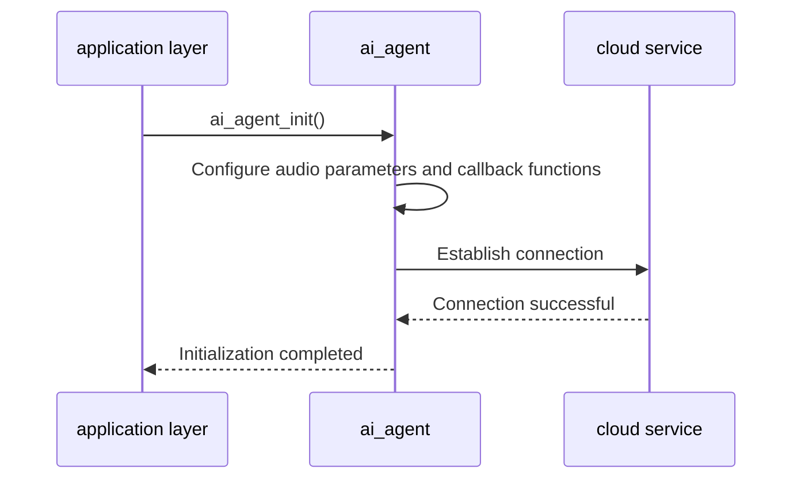
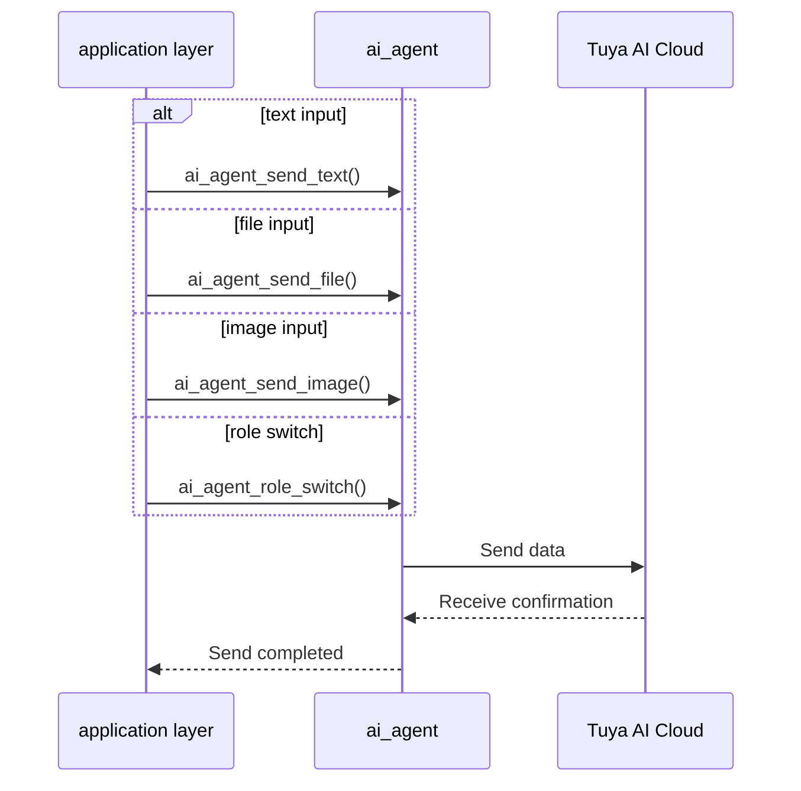
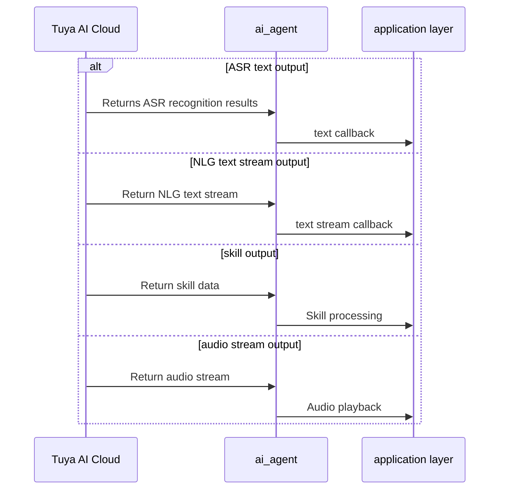
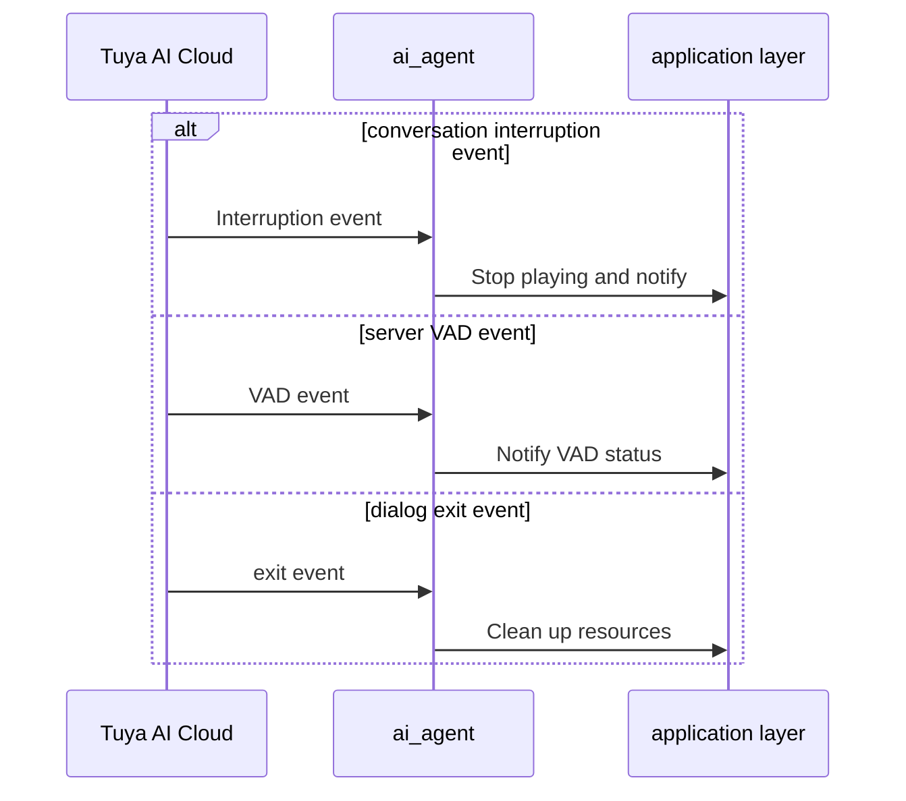
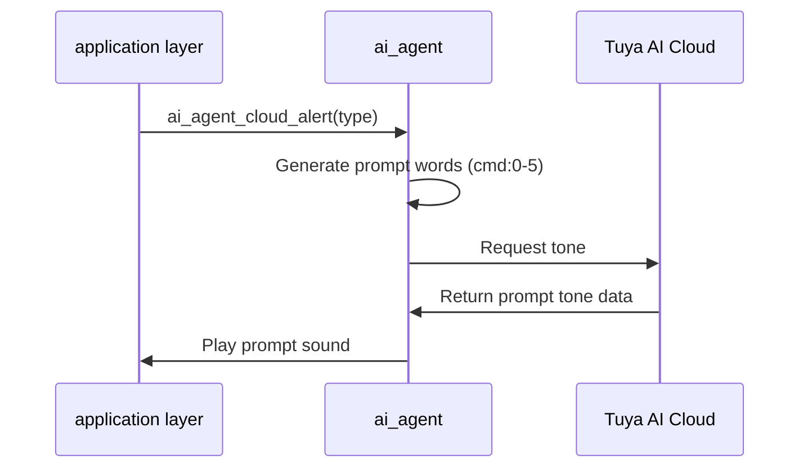
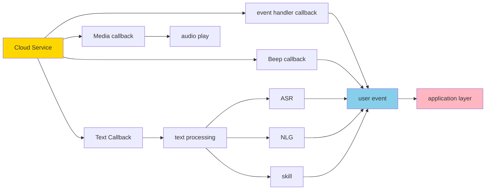
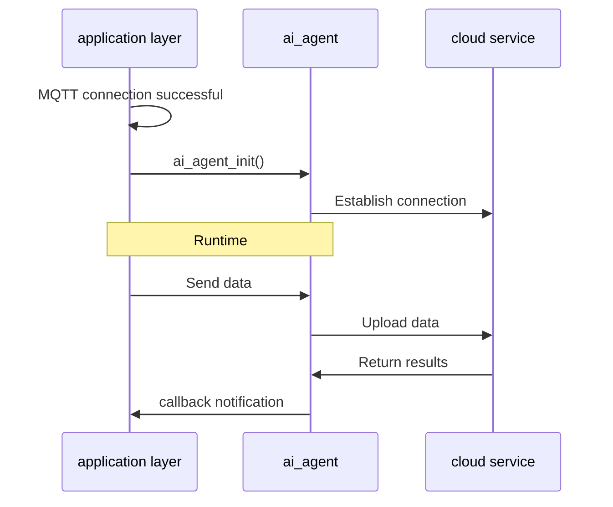

## Glossary

| Term | Description |
| ----- | ------------------------------------------------------------ |
| Agent | An AI entity that can perceive, think, make decisions, and act independently.             |
| ASR | Automatic Speech Recognition (Automatic Speech Recognition) is a technology that converts the user's voice input into text. |
| NLG | Natural Language Generation (Natural Language Generation) is a technology that converts structured data or intentions into natural language text. |
| Skill | Skill/ability module, an independent, pluggable, AI functional unit that specializes in doing something. |

## Overview

`ai_agent` is a core component in the TuyaOpen AI application framework. It communicates with Tuya AI cloud services. As a middleware layer, it connects local applications to cloud AI services for intelligent dialogue, speech recognition, and natural language understanding.

### Multimodal data input

- **Audio input**: Supports a variety of audio codec formats
- PCM: Uncompressed raw audio format, suitable for local processing
- OPUS: efficient audio codec format, suitable for network transmission, supports low latency
- SPEEX: Speech-optimized codec format, suitable for voice communications

- **Text Input**: Supports sending text commands or queries directly to the cloud

- **Image input**: Supports uploading image data to the cloud for image recognition and analysis, suitable for visual question answering, image understanding and other scenarios
- **File Input**: Supports uploading file data to the cloud, suitable for document processing, file analysis and other scenarios

### Output processing

- **Text callback**: Processes text payloads such as ASR, NLG, and skill data.

- **Media data callback**: Processes media streams such as audio, video, image, and file data.

- **Media property callback**: Provides metadata such as audio codec type.

### AI session event management

The module manages the full AI dialogue lifecycle and notifies the application layer through the event callback mechanism:

- **Session Start Event**: Triggered when the cloud starts returning data, usually used to start the TTS player and prepare to receive audio stream data.
- **Session end event**: Triggered when the cloud data transmission is completed, used to stop the TTS player and complete the playback process.
- **Session Interruption Event**: Triggered when the cloud actively interrupts the conversation, and the current playback needs to be stopped immediately and resources cleared. Common scenarios include user interruption, cloud timeout, etc.
- **Session Exit Event**: Triggered when the conversation exits completely, used to clean up all related resources.
- **Server VAD event**: Cloud voice activity detection event, used to notify the application layer of the detected voice activity status in the cloud.

### Cloud prompt tone management

- **Request cloud prompt sound**: Generates the corresponding prompt token (`cmd:0` to `cmd:5`) based on the prompt type. The AI then returns the corresponding prompt audio. ***This requires agent configuration on the platform and explicit Prompt responses for `cmd:0` to `cmd:5`.***

- **Play cloud prompts**: After receiving the audio data returned by the cloud, call the player interface to play.

- **Beep tone mapping table**:

| Alarm type | Prompt word | Description |
  | -------------------- | ------ | ------------ |
| AT_NETWORK_CONNECTED | cmd:0 | Network connection successful |
| AT_WAKEUP | cmd:1 | Wake up response |
| AT_LONG_KEY_TALK | cmd:2 | Long press key to talk |
| AT_KEY_TALK | cmd:3 | Key to talk |
| AT_WAKEUP_TALK | cmd:4 | Wake Up Talk |
| AT_RANDOM_TALK | cmd:5 | Random conversation |

### Agent role switching

The module supports dynamic switching of AI Agent roles. Different roles can have different conversation styles, knowledge bases and skill sets, suitable for multi-scenario applications.

## Workflow

### Initialization



### Input processing



### Output processing



### Session event management



### Cloud notification sound



### Callback function diagram



## Development process

### Interface description

#### Initialization

Initialize the AI Agent module. If `ENABLE_AI_MONITOR` is enabled, the monitoring module is also initialized for debugging with tyutool.

**This initialization must be called after the MQTT connection is successful**

```c
/**
@brief Initialize the AI agent module
@return OPERATE_RET Operation result
*/
OPERATE_RET ai_agent_init(void);
```

#### Deinitialization

Release the resources occupied by the AI ​​Agent module

```c
/**
@brief Deinitialize the AI agent module
@return OPERATE_RET Operation result
*/
OPERATE_RET ai_agent_deinit(void);
```

#### Enter text

Send text data to AI

```c
/**
@brief Send text input to AI agent
@param content Text content to send
@return OPERATE_RET Operation result
*/
OPERATE_RET ai_agent_send_text(char *content);
```

#### Input file

Send file data to AI

```c
/**
@brief Send file data to AI agent
@param data Pointer to file data
@param len File data length
@return OPERATE_RET Operation result
*/
OPERATE_RET ai_agent_send_file(uint8_t *data, uint32_t len);
```

#### Enter image

Send image data to AI

```c
/**
@brief Send image data to AI agent
@param data Pointer to image data
@param len Image data length
@return OPERATE_RET Operation result
*/
OPERATE_RET ai_agent_send_image(uint8_t *data, uint32_t len);
```

#### Play cloud prompt sound

Generate prompt tokens based on prompt sound type, then use those tokens to request AI-generated prompt audio for playback.

```c
/**
@brief Request cloud alert from AI agent
@param type Alert type
@return OPERATE_RET Operation result
*/
OPERATE_RET ai_agent_cloud_alert(AI_ALERT_TYPE_E type);
```

#### Switch agent roles

```c
/**
@brief Switch AI agent role
@param role Role name to switch to
@return OPERATE_RET Operation result
*/
OPERATE_RET ai_agent_role_switch(char *role);
```

### Development steps



### Reference code

```c
// MQTT connection event callback
int __ai_mqtt_connected_evt(void *data)
{
    if (!sg_ai_agent_inited) {
// Step 3: Initialize AI Agent module
        TUYA_CALL_ERR_LOG(ai_agent_init());
        sg_ai_agent_inited = true;
    }
    return OPRT_OK;
}

// initialization function
OPERATE_RET example_init(void)
{
    OPERATE_RET rt = OPRT_OK;

//Initialize the audio input and playback module
#if defined(ENABLE_COMP_AI_AUDIO) && (ENABLE_COMP_AI_AUDIO == 1)
    AI_AUDIO_INPUT_CFG_T input_cfg = {
        .vad_mode      = AI_AUDIO_VAD_MANUAL,
        .vad_off_ms    = 1000,
        .vad_active_ms = 200,
        .slice_ms      = 80,
        .output_cb     = __ai_audio_output,
    };
    TUYA_CALL_ERR_RETURN(ai_audio_input_init(&input_cfg));
    TUYA_CALL_ERR_RETURN(ai_audio_player_init());
#endif

// Subscribe to the MQTT connection event and initialize the AI ​​Agent after the connection is successful.
    TUYA_CALL_ERR_RETURN(tal_event_subscribe(EVENT_MQTT_CONNECTED, "ai_agent_init", 
                                             __ai_mqtt_connected_evt, SUBSCRIBE_TYPE_EMERGENCY));

    return OPRT_OK;
}

// Usage example: send text
void send_text_to_ai(void)
{
ai_agent_send_text("How is the weather today?");
}

// Usage example: Request tone
void request_alert(void)
{
    ai_agent_cloud_alert(AT_WAKEUP);
}

// Usage example: switch roles
void switch_role(void)
{
    ai_agent_role_switch("");
}
```
