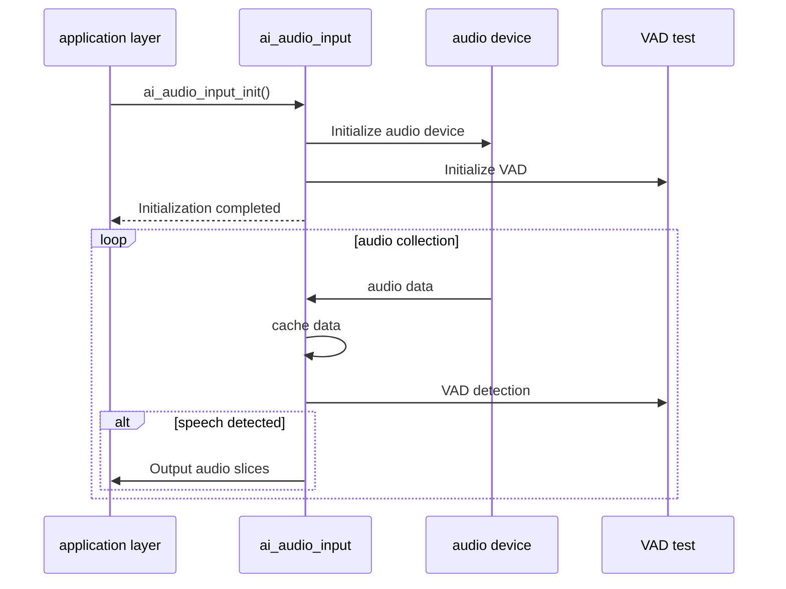
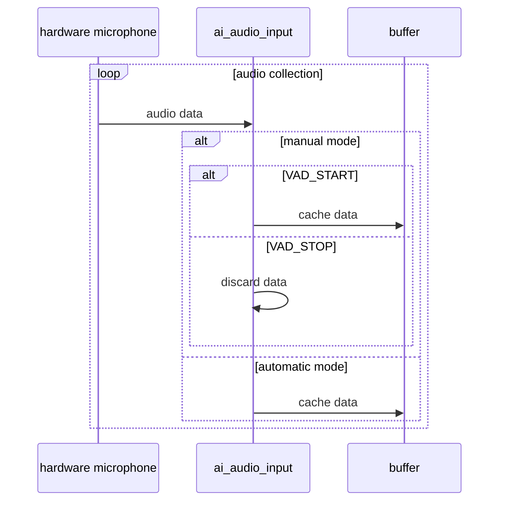
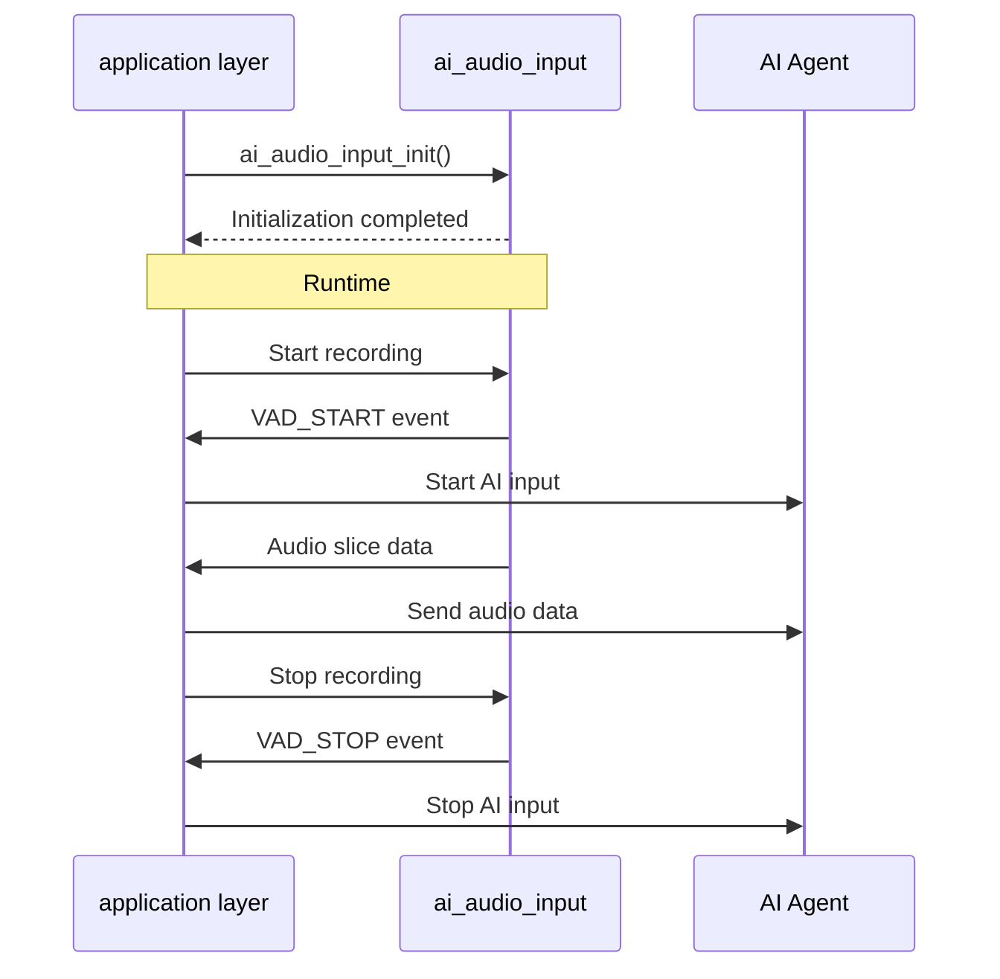

## Glossary

| Term | Description |
| -------- | ------------------------------------------------------------ |
| VAD | Voice Activity Detection (Voice Activity Detection), a technology used to determine whether there is speech in the audio signal. |
| VAD status | VAD_START: Voice activity starts<br />VAD_STOP: Voice activity ends |
| Audio Slice | A continuous audio stream divided into fixed-duration chunks for segmented processing and transmission. |

## Overview

`ai_audio_input` is a submodule of the audio processing component in the TuyaOpen AI application framework. It handles audio capture, VAD processing, and audio-slice output.

### Working mode

- **MANUAL MODE**:
- Does not start the VAD detection module; VAD state is controlled externally through APIs.
- Suitable for scenarios such as button-triggered recording, where the user actively controls the start and end of recording.
- **AUTO MODE**:
- Enables the VAD detection module to detect VAD state periodically.
- Suitable for scenarios where it is necessary to start recording when human voices are detected, without manual operation.

### Audio cache management

- Manage input audio data stream based on ring buffer.
- Data caching strategy:
- Manual mode: Cache incoming audio data only when there is voice activity.
- Automatic mode: always caches input audio data and discards old data when the buffer is full.

### Event notification

- Notifications are posted when VAD status changes.
- Notification is also posted every time audio data is received.

## Workflow

### Complete data flow



### Initialization process

1. **Find Audio Device**: Pass`tdl_audio_find()`Find audio codec device

2. **Get audio parameters**: Get information such as sampling rate, bit depth, number of channels, etc.

3. **Create the recorder**: Allocate memory and initialize the recorder structure

4. **Calculate buffer size**:

- Calculate audio data size per millisecond

     ```
     audio_1ms_size = (sample_rate × sample_bits × sample_ch_num) / 8 / 1000
     ```

illustrate:

     - `sample_rate`: Sampling rate (Hz), such as 16000

     - `sample_bits`: Bit depth (bit), such as 16

     - `sample_ch_num`: Number of channels, such as 1 (mono) or 2 (stereo)

- /8: Byte conversion (bit → byte)

- /1000: millisecond conversion (seconds → milliseconds)

Example (16kHz, 16bit, mono):

     ```
     audio_1ms_size = (16000 × 16 × 1) / 8 / 1000
                     = 256000 / 8 / 1000
                     = 32000 / 1000
= 32 bytes/ms
     ```

- Calculate VAD buffer size

     ```
     vad_size = (vad_active_ms + 300) × audio_1ms_size + 1
     ```

illustrate:

     - `vad_active_ms`: VAD activation threshold (milliseconds), configuration parameter

- \+ 300: Fixed compensation time (300ms), used to cache the audio data before VAD detection (pre-caching), handle the VAD detection delay, and ensure that there is enough data for VAD analysis in the cloud to avoid losing the beginning of the voice.

- \+ 1: avoid boundary issues

Example (vad_active_ms = 200ms, 16kHz/16bit/mono):

     ```
     vad_size = (200 + 300) × 32 + 1
              = 500 × 32 + 1
              = 16000 + 1
= 16001 bytes
     ```

- Calculate audio slice size

     ```
     slice_size = slice_ms × audio_1ms_size
     ```

illustrate:

     - `slice_ms`:Audio slice duration (milliseconds), configuration parameters

- The amount of data to read from the ring buffer each time

Example (slice_ms = 100ms, 16kHz/16bit/mono):

     ```
     slice_size = 100 × 32
= 3200 bytes
     ```

- Calculate ring buffer size

     ```
     rb_size = vad_size;
     ```

illustrate:

     - `rb_size`: Ring buffer size

5. **Create a ring buffer**: used to cache audio data

6. **Open audio device**: Register the callback function for collecting audio data

7. **Initialize VAD**: Configure VAD parameters (sampling rate, number of channels, VAD activation threshold, etc.)

8. **Start task**: Create task thread

### Audio data collection process



### Audio slice output timing

- **Auto Mode**

  ```
Time axis: 0ms 10ms 20ms 30ms 40ms 50ms 60ms
          |------|------|------|------|------|------|
Audio frames: [Frame 1] [Frame 2] [Frame 3] [Frame 4] [Frame 5] [Frame 6]
          ↓      ↓      ↓      ↓      ↓      ↓
Buffer: [cache] [cache] [cache] [cache] [cache] [cache]
          ↓      ↓      ↓      ↓      ↓      ↓
VAD detection: [Detection] [Detection] [Detection] [Detection] [Detection] [Detection]
          ↓      ↓      ↓      ↓      ↓      ↓
VAD status: STOP STOP START START START STOP
          ↓      ↓      ↓      ↓      ↓      ↓
Slice output: [none] [none] [slice1][slice2][slice3][none]
  ```

- **MANUAL MODE**

  ```
Time axis: 0ms 10ms 20ms 30ms 40ms 50ms 60ms
          |------|------|------|------|------|------|
Audio frames: [Frame 1] [Frame 2] [Frame 3] [Frame 4] [Frame 5] [Frame 6]
          ↓      ↓      ↓      ↓      ↓      ↓
VAD status: STOP STOP START START START STOP
          ↓      ↓      ↓      ↓      ↓      ↓
Buffer: [Discard] [Discard] [Cache] [Cache] [Cache] [Discard]
          ↓      ↓      ↓      ↓      ↓      ↓
Slice output: [none] [none] [slice1][slice2][slice3][none]
  ```

- **Audio Output Instructions**:

- **Trigger condition**: VAD status is VAD_START and the buffer data volume reaches the slice size

- **Slice Size**: By configuration parameter`slice_ms`Decision, please see the **Initialization Process** above for detailed calculation methods.

- **Data Reading**: Read data of one slice size at a time

## Configuration instructions

### Configuration file path

```
ai_components/ai_audio/Kconfig
```

### Function enable

```
menuconfig ENABLE_COMP_AI_AUDIO
    select ENABLE_AI_PLAYER
    bool "enable ai audio input/output"
    default y
```

## Development process

### Data structure

#### Audio input configuration

```c
typedef struct {
AI_AUDIO_VAD_MODE_E vad_mode; // VAD mode (manual/automatic)
uint16_t vad_off_ms; // The duration of continuous detection of vad stop. If no active voice is detected during this period, it is considered vad stop.
uint16_t vad_active_ms; // vad start continuous detection duration. If active voice is continuously detected during this time period, it is considered vad start.
uint16_t slice_ms; // Audio slice time (milliseconds)
AI_AUDIO_OUTPUT output_cb; // Audio data output callback function
} AI_AUDIO_INPUT_CFG_T;
```

#### VAD mode

```c
typedef enum {
AI_AUDIO_VAD_MANUAL, // Manual mode: use key events as VAD
AI_AUDIO_VAD_AUTO, //Auto mode: use vocal detection
} AI_AUDIO_VAD_MODE_E;
```

#### VAD status

```c
typedef enum {
AI_AUDIO_VAD_START = 1, // VAD starts
AI_AUDIO_VAD_STOP, // VAD stops
} AI_AUDIO_VAD_STATE_E;
```

### Interface description

#### Initialization

Initialize the audio input module, configure VAD parameters and audio slice output callbacks.

```c
typedef struct  {
    /* VAD cache = vad_active_ms + vad_off_ms */
    AI_AUDIO_VAD_MODE_E     vad_mode;
    uint16_t                vad_off_ms;        /* Voice activity compensation time, unit: ms */
    uint16_t                vad_active_ms;     /* Voice activity detection threshold, unit: ms */
    uint16_t                slice_ms;          /* Reference macro, AUDIO_RECORDER_SLICE_TIME */

    /* Microphone data processing callback */
    AI_AUDIO_OUTPUT         output_cb;
} AI_AUDIO_INPUT_CFG_T;

/**
@brief Initialize the AI audio input module
@param cfg Audio input configuration
@return OPERATE_RET Operation result
*/
OPERATE_RET ai_audio_input_init(AI_AUDIO_INPUT_CFG_T *cfg);
```

#### Start audio input

Start audio collection and VAD detection tasks

```c
/**
@brief Start audio input
@return OPERATE_RET Operation result
*/
OPERATE_RET ai_audio_input_start(void);
```

#### Stop audio input

Stop audio collection and VAD detection tasks

```c
/**
@brief Stop audio input
@return OPERATE_RET Operation result
*/
OPERATE_RET ai_audio_input_stop(void);
```

#### Deinitialization

Release audio input module resources

```c
/**
@brief Deinitialize the AI audio input module
@return OPERATE_RET Operation result
*/
OPERATE_RET ai_audio_input_deinit(void);
```

#### Reset audio input

Reset ring buffer and VAD status

```c
/**
@brief Reset audio input ring buffer and VAD state
@return OPERATE_RET Operation result
*/
OPERATE_RET ai_audio_input_reset(void);
```

#### Set mode

Dynamically switch VAD mode

```c
typedef enum {
    AI_AUDIO_VAD_MANUAL,    // use key event as vad
    AI_AUDIO_VAD_AUTO,      // use human voice detect 
} AI_AUDIO_VAD_MODE_E;

/**
@brief Set wake-up mode (VAD mode)
@param mode VAD mode (manual or auto)
@return OPERATE_RET Operation result
*/
OPERATE_RET ai_audio_input_wakeup_mode_set(AI_AUDIO_VAD_MODE_E mode);
```

#### Set wake-up state

Set whether the module is awake. In manual mode, you can directly set the VAD status through this interface.

- VAD related tasks will only be processed when the module is woken up.
- When the VAD status changes, a notification will only be issued when the module is woken up.

```c
/**
@brief Set wake-up state
@param is_wakeup Wake-up flag
@return OPERATE_RET Operation result
*/
OPERATE_RET ai_audio_input_wakeup_set(bool is_wakeup);
```

### Development steps

1. Define configuration parameters and set the slicing duration and VAD threshold.
2. Implement the audio output callback function to process audio slice data.
3. Implement VAD event processing callbacks to handle VAD status changes.
4. Initialize the audio input module, configure and start audio input.
5. Subscribe to VAD events and receive status change notifications.
6. In manual mode, control audio input and start/stop recording based on application logic.

### Development flow chart



### Reference example

```c
#include "ai_audio_input.h"
#include "ai_agent.h"

// Step 1: Define configuration parameters
#define AI_AUDIO_SLICE_TIME         80
#define AI_AUDIO_VAD_ACTIVE_TIME    200
#define AI_AUDIO_VAD_OFF_TIME       1000

static bool sg_ai_agent_inited = false;

// Step 2: Implement the audio output callback function
static int __ai_audio_output(uint8_t *data, uint16_t datalen)
{
    OPERATE_RET rt = OPRT_OK;
    uint64_t   pts = 0;
    uint64_t   timestamp = 0;

    if(false == sg_ai_agent_inited) {
        return OPRT_OK;
    }

    timestamp = pts = tal_system_get_millisecond();
    TUYA_CALL_ERR_LOG(tuya_ai_audio_input(timestamp, pts, data, datalen, datalen));
    
    return rt;
}

// Step 3: Implement VAD event handling callback
int __ai_vad_change_evt(void *data)
{
    OPERATE_RET rt = OPRT_OK;

    TUYA_CHECK_NULL_RETURN(data, OPRT_INVALID_PARM);

    AI_AUDIO_VAD_STATE_E vad_flag = (AI_AUDIO_VAD_STATE_E)data;

// Handle VAD status changes
    if (AI_AUDIO_VAD_START == vad_flag) {
// VAD starts, starts AI input
        tuya_ai_agent_set_scode(AI_AGENT_SCODE_DEFAULT);
        tuya_ai_input_start(false);
    } else {
// VAD stops, stops AI input
        tuya_ai_input_stop();
    }

    return rt;
}

// initialization function
OPERATE_RET example_init(void)
{
// Step 4: Initialize the audio input module
    AI_AUDIO_INPUT_CFG_T input_cfg = {
        .vad_mode      = AI_AUDIO_VAD_MANUAL,
        .vad_off_ms    = AI_AUDIO_VAD_OFF_TIME,
        .vad_active_ms = AI_AUDIO_VAD_ACTIVE_TIME,
        .slice_ms      = AI_AUDIO_SLICE_TIME,
        .output_cb     = __ai_audio_output,
    };
    TUYA_CALL_ERR_RETURN(ai_audio_input_init(&input_cfg));
    
    //...
    
// Step 5: Subscribe to VAD events
    TUYA_CALL_ERR_RETURN(tal_event_subscribe(EVENT_AUDIO_VAD, "vad_change", 
                                             __ai_vad_change_evt, SUBSCRIBE_TYPE_NORMAL));

    sg_ai_agent_inited = true;

    return OPRT_OK;
}

//Key event processing (Step 6: Control audio input)
void on_button_press(void)
{
// Press the button to start recording
    ai_audio_input_wakeup_set(true);
}

void on_button_release(void)
{
// Release the button to stop recording
    ai_audio_input_wakeup_set(false);
}

```
