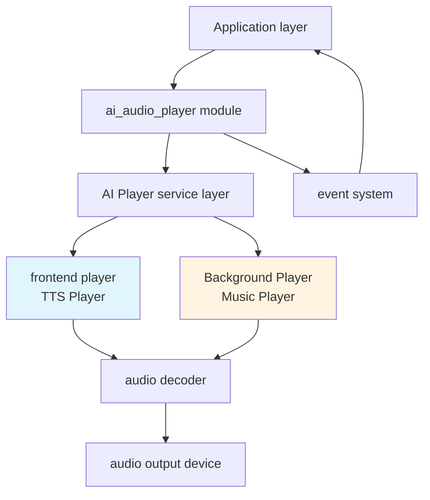
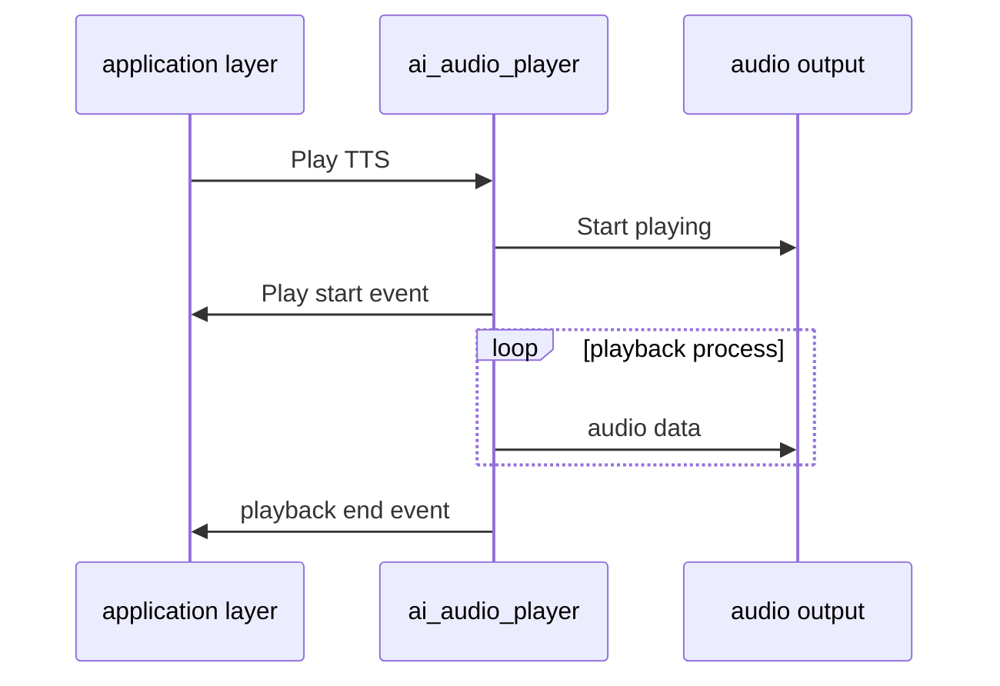
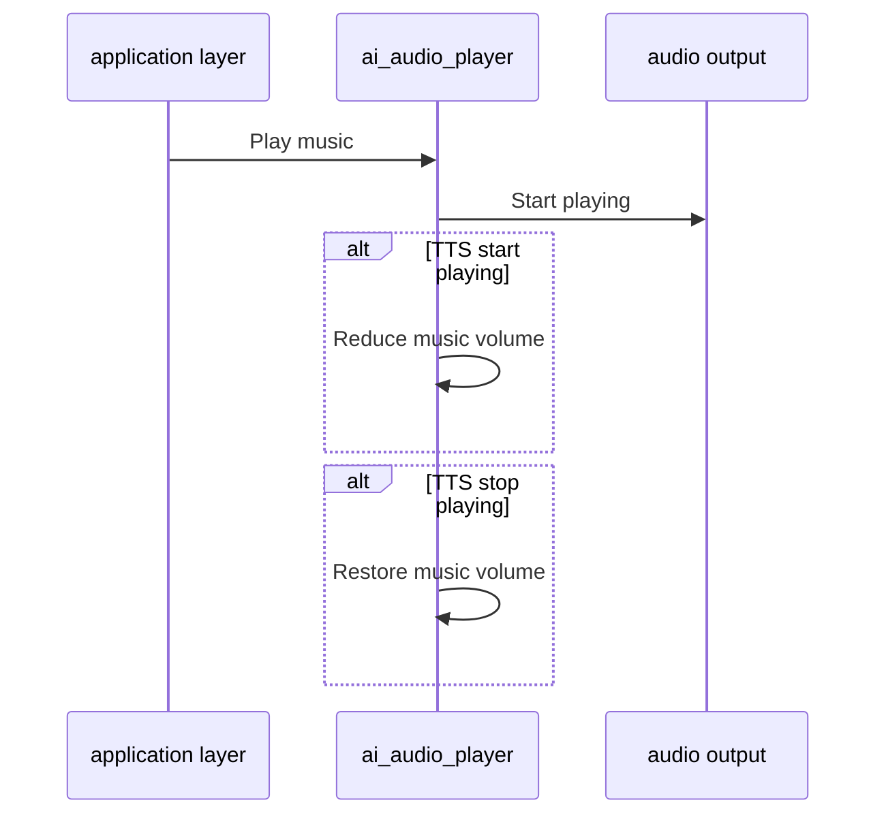
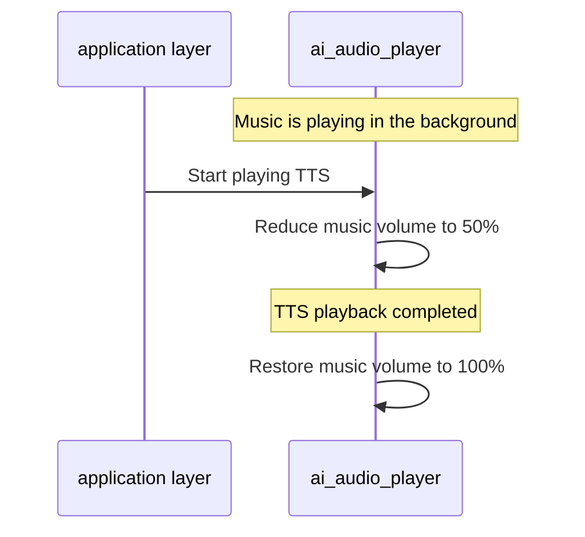

## Glossary

| Term | Description |
| ---- | ------------------------------------------------------------ |
| TTS | The abbreviation of Text-to-Speech is a technology that converts text into speech. In this module, TTS is used to play the voice reply of the AI ​​assistant. |

## Overview

`ai_audio_player` is the audio playback component in the TuyaOpen AI application framework. It provides TTS (text-to-speech), music playback, and alert tone playback.

### Play TTS audio

- **Play method:**
- URL: Download audio content and play it by accessing the URL link
- Streaming: Support streaming TTS data playback

- **Playback status notification:** Provides TTS playback status events
- **Playback priority**: Plays TTS audio at a higher priority than background music

### Play music

- **Playlist Management**: Supports playlists with multiple songs
- **Continuous playback**: Supports configurable continuous music playback
- **Replay function**: Supports playlist replay

### Prompt sound playback

- **Local prompt sound**: Supports playing local preset prompt sound resources
- **Cloud prompt sound**: Supports retrieving prompt sound resources from the cloud
- **Custom prompt tone**: Supports registering a custom prompt-tone callback

### Volume control

- **Volume Setting**: Support volume setting (0-100)
- **Volume Acquisition**: Supports obtaining the current volume value
- **Automatic volume adjustment**:
- When playing TTS audio, the background music volume is automatically reduced to 50%
- After TTS playback is completed, the background music volume is restored

### Event notification

- **TTS playback status notification**: Event notification will be issued when the TTS playback status changes (prepare/start/receive data/normal stop/abort)

## Workflow

### Module architecture diagram



### Initialization process

- **Initialize player service:** Configure sampling rate, bit depth, number of channels, etc.
- **Create TTS player:** Create foreground player, create foreground playlist (capacity: 2)
- **Create music player:** Create background player, create background playlist (capacity: 32)
- **Subscribe to events:** Subscribe to player status events (playing/playing stopped/playing paused)

### TTS playback process



### Music playback process



### Automatic volume adjustment




## Configuration instructions

### Configuration file path

```
ai_components/ai_audio/Kconfig
```

### Function enable

```
menuconfig ENABLE_COMP_AI_AUDIO
    select ENABLE_AI_PLAYER
    bool "enable ai audio input/output"
    default y
```

### Prompt audio source selection

```
choice 
    prompt "select player alert source"
default AI_PLAYER_ALERT_SOURCE_LOCAL //The default is local prompt sound

config AI_PLAYER_ALERT_SOURCE_LOCAL //Local prompt sound, use the prompt sound source embedded in the component framework
    bool "use local alert source"

config AI_PLAYER_ALERT_SOURCE_CLOUD //Cloud prompt sound, obtain prompt sound resources from the cloud server
    bool "use cloud alert source"

config AI_PLAYER_ALERT_SOURCE_CUSTOM //Customize the prompt sound, call the developer's custom prompt sound source through the callback function
    bool "use custom alert source"
endchoice
```

## Development process

### Data structure

#### Prompt sound type

```c
typedef enum {
AI_AUDIO_ALERT_POWER_ON, // Boot prompt
AI_AUDIO_ALERT_NOT_ACTIVE, // Not activated prompt
AI_AUDIO_ALERT_NETWORK_CFG, // Network configuration prompt
AI_AUDIO_ALERT_NETWORK_CONNECTED, // Network connection success prompt
AI_AUDIO_ALERT_NETWORK_FAIL, // Network connection failure prompt
AI_AUDIO_ALERT_NETWORK_DISCONNECT, // Network disconnection prompt
AI_AUDIO_ALERT_BATTERY_LOW, // low battery reminder
AI_AUDIO_ALERT_PLEASE_AGAIN, // Please say the prompt again
AI_AUDIO_ALERT_LONG_KEY_TALK, // Long press to speak prompt
AI_AUDIO_ALERT_KEY_TALK, // key to talk prompt
AI_AUDIO_ALERT_WAKEUP_TALK, // Wake up to talk prompt
AI_AUDIO_ALERT_RANDOM_TALK, // Random speaking prompts
AI_AUDIO_ALERT_WAKEUP, // wake-up prompt
    AI_AUDIO_ALERT_MAX,
} AI_AUDIO_ALERT_TYPE_E;
```

#### Player type

```c
typedef enum {
AI_AUDIO_PLAYER_FG = 0, // Foreground player (TTS)
AI_AUDIO_PLAYER_BG = 1, //Background player (music)
AI_AUDIO_PLAYER_ALL = 2, // all players
} AI_AUDIO_PLAYER_TYPE_E;
```

#### TTS stream status

```c
typedef enum {
AI_AUDIO_PLAYER_TTS_START, // TTS starts playing
AI_AUDIO_PLAYER_TTS_DATA, // TTS receive data
AI_AUDIO_PLAYER_TTS_STOP, // TTS stops normally
AI_AUDIO_PLAYER_TTS_ABORT, // TTS abort playback
} AI_AUDIO_PLAYER_TTS_STATE_E;
```

#### TTS Play

```c
typedef struct {
    char              *url;           // TTS URL
char *req_body; // Request body
AI_HTTP_METHOD_E http_method; // HTTP method
AI_AUDIO_CODEC_E format; // Audio format
AI_TTS_TYPE_E tts_type; // TTS type
int duration; // duration
} AI_AUDIO_TTS_T;
```

#### TTS playback configuration

```
typedef struct {
AI_AUDIO_TTS_T tts; // TTS configuration
AI_AUDIO_TTS_T bg_music; // Background music configuration
} AI_AUDIO_PLAY_TTS_T;
```

#### Music source

```c
typedef struct {
uint32_t id; // Music ID
char *url; // music URL
uint64_t length; // music length
uint64_t duration; // music duration
AI_AUDIO_CODEC_E format; // Audio format
char *artist; // artist
char *song_name; // song name
char *audio_id; // Audio ID
char *img_url; // Image URL
} AI_MUSIC_SRC_T;
```

#### Music playback

```c
typedef struct {
char action[32]; // Play action (play/next/prev/resume)
bool has_tts; // Do you need to wait for TTS playback to complete?
int src_cnt; // Number of music sources
AI_MUSIC_SRC_T *src_array; //Music source array
} AI_AUDIO_MUSIC_T;
```

### Interface description

#### Initialize the player

Initialize the audio playback service and create foreground and background players and their playlists

```c
/**
@brief Initialize the audio player module
@return OPERATE_RET Operation result
*/
OPERATE_RET ai_audio_player_init(void);
```

#### Deinitialize the player

Release the audio playback module resources and destroy the player and playlist

```c
/**
@brief Deinitialize the audio player module
@return OPERATE_RET Operation result
*/
OPERATE_RET ai_audio_player_deinit(void);
```

#### Start the player

```c
/**
@brief Start the audio player with the specified identifier
@param id The identifier for the current playback session (can be NULL)
@return OPERATE_RET Operation result
*/
OPERATE_RET ai_audio_player_start(char *id);
```

#### Stop playing

Stop the specified type of player

```c
typedef enum {
AI_AUDIO_PLAYER_FG = 0, // Foreground player (TTS)
AI_AUDIO_PLAYER_BG = 1, //Background player (music)
AI_AUDIO_PLAYER_ALL = 2, // all players
} AI_AUDIO_PLAYER_TYPE_E;

/**
@brief Stop all audio players
@param type Player type to stop (foreground, background, or all)
@return OPERATE_RET Operation result
*/
OPERATE_RET ai_audio_player_stop(AI_AUDIO_PLAYER_TYPE_E type);
```

#### Play TTS (URL mode)

Download and play TTS audio content by accessing the URL link

```c
typedef enum {
    AI_HTTP_METHOD_GET,
    AI_HTTP_METHOD_POST,
    AI_HTTP_METHOD_PUT,
    AI_HTTP_METHOD_INVALD
}AI_HTTP_METHOD_E;

typedef enum {
    AI_TTS_TYPE_NORMAL,
    AI_TTS_TYPE_ALERT, 
    AI_TTS_TYPE_CALL,  
}AI_TTS_TYPE_E;

typedef struct {
    char                          *url;
    char                          *req_body;
    AI_HTTP_METHOD_E               http_method;
    AI_AUDIO_CODEC_E               format;
    AI_TTS_TYPE_E                  tts_type;
    int                            duration;
} AI_AUDIO_TTS_T;

typedef struct {
    AI_AUDIO_TTS_T      tts;
    AI_AUDIO_TTS_T      bg_music;
}AI_AUDIO_PLAY_TTS_T;

/**
@brief Play TTS from URL
@param playtts Pointer to TTS play structure
@param is_loop Loop flag (unused)
@return OPERATE_RET Operation result
*/
OPERATE_RET ai_audio_play_tts_url(AI_AUDIO_PLAY_TTS_T *playtts, bool is_loop);
```

#### Play TTS streaming data

Streaming TTS data

- Start TTS stream, will publish`AI_USER_EVT_TTS_PRE`and`AI_USER_EVT_TTS_START`event
- Send TTS data chunk, will publish`AI_USER_EVT_TTS_DATA`event
- Stop TTS stream, will publish`AI_USER_EVT_TTS_STOP`event
- Abort TTS stream, will publish`AI_USER_EVT_TTS_ABORT`event

```c
typedef enum {
    AI_AUDIO_PLAYER_TTS_START,
    AI_AUDIO_PLAYER_TTS_DATA,
    AI_AUDIO_PLAYER_TTS_STOP,
    AI_AUDIO_PLAYER_TTS_ABORT,
} AI_AUDIO_PLAYER_TTS_STATE_E;

/**
@brief Play TTS stream data
@param state TTS stream state (START, DATA, STOP, ABORT)
@param codec Audio codec format
@param data Pointer to TTS data
@param len TTS data length
@return OPERATE_RET Operation result
*/
OPERATE_RET ai_audio_play_tts_stream(AI_AUDIO_PLAYER_TTS_STATE_E state, AI_AUDIO_CODEC_E codec, char *data,  int len);
```

#### Play audio data

Usually used to play custom notification sounds

```c
typedef enum {
    AI_AUDIO_CODEC_MP3 = 0,
    AI_AUDIO_CODEC_WAV,
    AI_AUDIO_CODEC_SPEEX,
    AI_AUDIO_CODEC_OPUS,
    AI_AUDIO_CODEC_OGGOPUS,
    AI_AUDIO_CODEC_MAX
} AI_AUDIO_CODEC_E;

/**
@brief Play audio data from memory
@param format Audio codec format
@param data Pointer to audio data
@param len Audio data length
@return OPERATE_RET Operation result
*/
OPERATE_RET ai_audio_play_data(AI_AUDIO_CODEC_E format, uint8_t *data, uint32_t len);
```

#### Play music

Play music playlist

```c
typedef struct {
    uint32_t                      id;
    char                         *url;
    uint64_t                      length;
    uint64_t                      duration;
    AI_AUDIO_CODEC_E              format;
    char                         *artist;
    char                         *song_name;
    char                         *audio_id;
    char                         *img_url;
}AI_MUSIC_SRC_T;

typedef struct {
    char                      action[32];     /* play/next/prev/resume/ */
    bool                      has_tts;        /* Need to wait for TTS playback to finish before playing media */
    int                       src_cnt;
    AI_MUSIC_SRC_T           *src_array;
}AI_AUDIO_MUSIC_T;

/**
@brief Play music from playlist
@param music Pointer to music structure containing playlist
@return OPERATE_RET Operation result
*/
OPERATE_RET ai_audio_play_music(AI_AUDIO_MUSIC_T *music);
```

#### Set the music continuous playback flag

Set whether music plays continuously, that is, continue playing music after TTS playback is completed

```c
/**
@brief Set music continuous play flag
@param is_music_continuous Continuous play flag
@return OPERATE_RET Operation result
*/
OPERATE_RET ai_audio_player_set_resume(bool is_music_continuous);
```

#### Set music replay flag

Set whether the music playlist is replayed

```c
/**
@brief Set music replay flag
@param is_music_replay Replay flag
@return OPERATE_RET Operation result
*/
OPERATE_RET ai_audio_player_set_replay(bool is_music_replay);
```

#### Is it playing?

Check if the audio player is playing (TTS or music)

```c
/**
@brief Check if audio player is currently playing
@return uint8_t Returns TRUE if playing, FALSE otherwise
*/
uint8_t ai_audio_player_is_playing(void);
```

#### Play prompt sound

Play a specified type of tone

```c
/**
@brief Play alert audio
@param type Alert type
@return OPERATE_RET Operation result
*/
OPERATE_RET ai_audio_player_alert(AI_AUDIO_ALERT_TYPE_E type);
```

#### Set volume

Set audio player volume

```c
/**
@brief Set audio player volume
@param vol Volume value (0-100)
@return OPERATE_RET Operation result
*/
OPERATE_RET ai_audio_player_set_vol(int vol);
```

#### Get the volume

Get the volume of the current audio player

```c
/**
@brief Get audio player volume
@param vol Pointer to store volume value
@return OPERATE_RET Operation result
*/
OPERATE_RET ai_audio_player_get_vol(int *vol);
```

#### Register a custom prompt tone callback

when`AI_PLAYER_ALERT_SOURCE_CUSTOM`It is only effective when the control macro is turned on, that is, the prompt sound source needs to be selected as a custom sound source through Kconfig configuration.

```c
/**
 * @brief Register a custom alert callback function.
 *
 * @param cb Pointer to the custom alert callback function. The callback will be
 *           invoked when an alert event occurs, receiving the alert type as parameter.
 * @return OPERATE_RET Operation result code.
 */
OPERATE_RET ai_audio_player_reg_alert_cb(AI_PLAYER_ALERT_CUSTOM_CB cb);
```

### Development steps

1. Initialize the audio player
2. Set player volume
3. Play audio (TTS/Music/Tone)
4. Control playback (stop playback, check status, set continuous playback, and so on)

### Reference example

#### Initialization

```c
#include "ai_audio_player.h"

//Initialize the audio player
OPERATE_RET init_audio_player(void)
{
    OPERATE_RET rt = OPRT_OK;
    
//Initialize the player module
    TUYA_CALL_ERR_RETURN(ai_audio_player_init());
    
//Set the volume
    TUYA_CALL_ERR_RETURN(ai_audio_player_set_vol(80));
    
    return rt;
}
```

#### Play TTS

```c
// Method 1: Play TTS from URL
void play_tts_from_url(void)
{
    AI_AUDIO_PLAY_TTS_T playtts = {
        .tts = {
            .url = "https://example.com/tts.mp3",
            .format = AI_AUDIO_CODEC_MP3,
            .tts_type = AI_TTS_TYPE_NORMAL,
        },
    };
    
    ai_audio_play_tts_url(&playtts, false);
}

// Method 2: Play TTS from memory
void play_tts_from_memory(void)
{
uint8_t tts_data[] = { /* MP3 data */ };
    ai_audio_play_data(AI_AUDIO_CODEC_MP3, tts_data, sizeof(tts_data));
}

// Method 3: Streaming TTS
void play_tts_stream(void)
{
// Start TTS stream
    ai_audio_play_tts_stream(AI_AUDIO_PLAYER_TTS_START, 
                              AI_AUDIO_CODEC_MP3, 
                              NULL, 
                              0);
    
//Send TTS data chunk
    char *tts_chunk = "TTS data chunk";
    ai_audio_play_tts_stream(AI_AUDIO_PLAYER_TTS_DATA, 
                              AI_AUDIO_CODEC_MP3, 
                              tts_chunk, 
                              strlen(tts_chunk));
    
// Stop TTS stream
    ai_audio_play_tts_stream(AI_AUDIO_PLAYER_TTS_STOP, 
                              AI_AUDIO_CODEC_MP3, 
                              NULL, 
                              0);
}
```

#### Play music

```c
void play_music_playlist(void)
{
    AI_MUSIC_SRC_T music_srcs[] = {
        {
            .url = "https://example.com/music1.mp3",
            .format = AI_AUDIO_CODEC_MP3,
            .song_name = "Song 1",
            .artist = "Artist 1",
        },
        {
            .url = "https://example.com/music2.mp3",
            .format = AI_AUDIO_CODEC_MP3,
            .song_name = "Song 2",
            .artist = "Artist 2",
        },
    };
    
    AI_AUDIO_MUSIC_T music = {
        .action = "play",
.has_tts = false, // No need to wait for TTS to complete
        .src_cnt = 2,
        .src_array = music_srcs,
    };
    
    ai_audio_play_music(&music);
}
```

#### Play prompt sound

```c
void play_alert_sounds(void)
{
// Play wake-up tone
    ai_audio_player_alert(AI_AUDIO_ALERT_WAKEUP);
    
// Play the network connection success sound
    ai_audio_player_alert(AI_AUDIO_ALERT_NETWORK_CONNECTED);
    
// Play low battery alert sound
    ai_audio_player_alert(AI_AUDIO_ALERT_BATTERY_LOW);
}
```

#### Playback control

```c
void playback_control_example(void)
{
// Check if it is playing
    if (ai_audio_player_is_playing()) {
PR_NOTICE("Audio playing");
    }
    
// Stop TTS playback
    ai_audio_player_stop(AI_AUDIO_PLAYER_FG);
    
// Stop music playing
    ai_audio_player_stop(AI_AUDIO_PLAYER_BG);
    
// Stop all playback
    ai_audio_player_stop(AI_AUDIO_PLAYER_ALL);
    
//Set music to play continuously
    ai_audio_player_set_resume(true);
    
//Set music replay
    ai_audio_player_set_replay(true);
}
```

#### Custom sound callback

```c
#if defined(AI_PLAYER_ALERT_SOURCE_CUSTOM) && (AI_PLAYER_ALERT_SOURCE_CUSTOM == 1)

// Custom sound processing function
OPERATE_RET custom_alert_handler(AI_AUDIO_ALERT_TYPE_E type)
{
    OPERATE_RET rt = OPRT_OK;
    
    switch(type) {
        case AI_AUDIO_ALERT_WAKEUP:
            // Customize wake-up sound processing
            PR_NOTICE("Play custom wake-up tone");
            // Can play custom audio files or perform other operations
            break;
            
        case AI_AUDIO_ALERT_NETWORK_CONNECTED:
            // Customize network connection prompt sound processing
            PR_NOTICE("Play custom network connection prompt sound");
            break;
            
        default:
            PR_NOTICE("Unprocessed prompt sound type: %d", type);
            break;
    }
    
    return rt;
}

//Register custom sound callback
void register_custom_alert(void)
{
    ai_audio_player_reg_alert_cb(custom_alert_handler);
}

#endif
```

