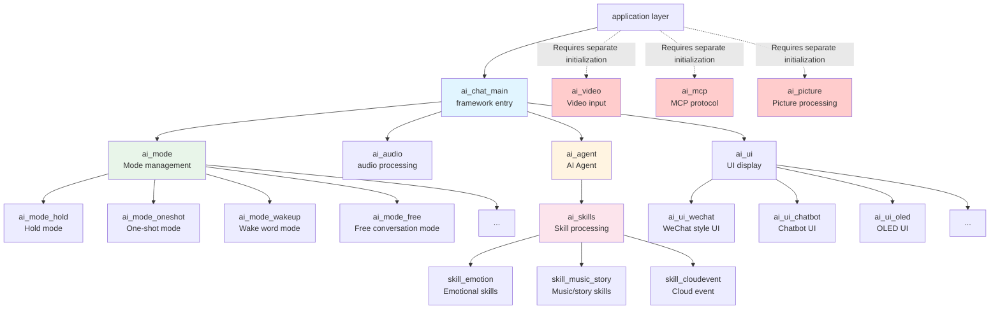
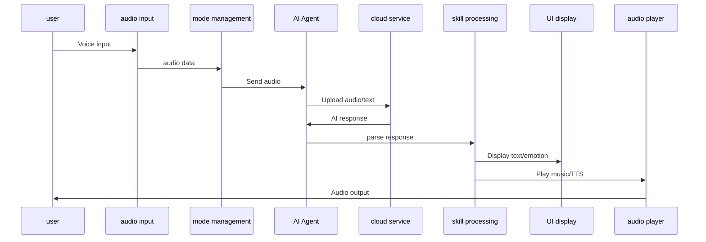
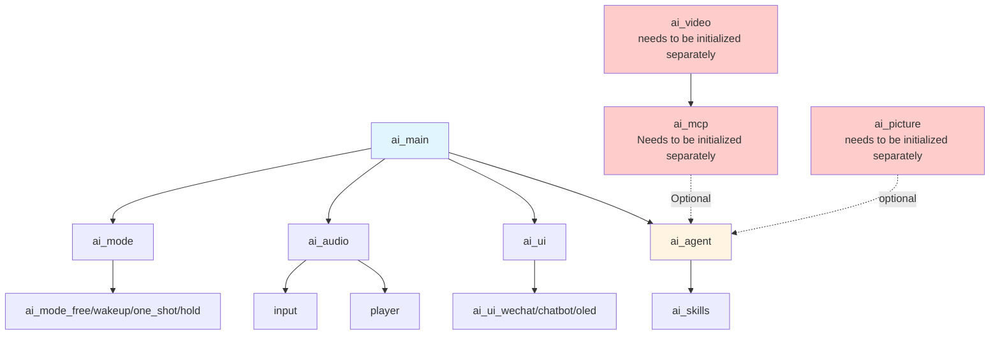

## Overview

`ai_components` is the core library of the TuyaOpen AI application framework and provides a complete implementation of AI chat features. The library uses a modular design and supports multiple chat modes, audio processing, UI display, and video input, helping developers quickly build AI-enabled devices.

## Module architecture



## Core module

### ai_main - framework entry

**Function**: The main entry module of the AI framework, responsible for unified initialization and management of AI components.

**Main Features**:
- Unified initialization of each AI component
- Mode registration and management
- Event handling and distribution
- Configuration management and persistence
- Key event handling

### ai_mode - Mode management

**Function**: Manages different AI chat modes, providing mode registration, switching, and event handling.

**Supported Modes**:

- **Press-and-hold mode** (Hold): Press and hold the button to record, then release to stop
- **One-shot Mode** (Oneshot): Click the button to enter the listening state
- **Wake word mode** (Wakeup): Triggered by a wake word and supports single-round conversation
- **Free conversation mode** (Free): Continues monitoring after wake-up and supports multi-round conversations
- **Custom Mode** (Custom): A mode implemented by developers themselves

### ai_agent - AI Agent

**Function**: Communicate with Tuya AI cloud service, process voice input, text input, file input, etc., and receive AI responses.

**Main Features**:

- Input processing for AI
- AI response processing (NLG, skills, cloud events)
- Obtain cloud notification sound

### ai_skills - Skill processing

**Function**: Processes skill instructions returned by the AI model, including emotion expression, music playback, story playback, and more.

**Supported Skills**:
- **Emotion Skills**: Parse emotional expressions and display emotion icons
- **Music/Story Skills**: Parse music and story data, manage playlists
- **Playback control skills**: Process control instructions such as playback, pause, previous song, next song, etc.
- **Cloud event**: Handles events such as cloud-pushed TTS playback

### ai_audio - audio processing

**Function**: Processes audio input and output, including recording, playback, VAD, and KWS.

**Main Features**:
- Audio input capture and processing
- Audio output playback (TTS, music, prompts, etc.)
- Voice Activity Detection (VAD)
- Keyword Wake (KWS)
- Audio format conversion and encoding

### ai_ui - UI display

**Function**: Unified management and distribution of various UI display messages, supporting multiple UI styles.

**UI Style**:
- **WeChat style UI**: bubble style interface similar to WeChat chat
- **Chatbot UI**: Simple central message display interface
- **OLED UI**: An interface optimized for small OLED screens

- **Custom UI**: Developers implement the interface by themselves

### ai_video - video input

**Function**: Handles camera data capture, JPEG encoding, and video display.

**Main Features**:
- Camera initialization and configuration
- Raw frame capture
- JPEG frame capture (photography function)
- Video display control

### ai_mcp - MCP protocol

**Function**: Implements the Model Context Protocol (MCP) standard protocol and supports the interaction between AI models and external tools.

**Embedded Tools**:

- Query device information
- Select chat mode
- Take a photo for AI analysis
- Adjust device volume

### utility - tool module

**Function**: Provides general tool functions, including event notification, etc.

**Main Features**:
- User event notification system
- Common tool functions

### assets - resource files

**Function**: Store UI-related resource files, such as fonts, icons, etc.

## Data flow direction



## Usage process

### Integrate into target project

#### Add CMakeLists.txt

Add the `ai_components` subdirectory to the target project's `CMakeLists.txt` file:

```cmake
# Add in CMakeLists.txt
add_subdirectory(${APP_PATH}/../ai_components)
```

**Notice**: `${APP_PATH}/../ai_components` is the path to the `ai_components` directory relative to the target project path. Adjust it based on your actual project structure.

#### Add Kconfig

Add the `ai_components` configuration menu to the target project's `Kconfig` file:

```kconfig
#Add in Kconfig
rsource "../ai_components/Kconfig"
```

**Notice**: `../ai_components/Kconfig` is the path to `ai_components/Kconfig` relative to the target project path. Adjust it based on your actual project structure.

### Configure components

Execute the command to enter the configuration page in the target project path:

```
tos.py config menu
```

Enable the required options based on your actual needs.

### Initialization framework

Call the initialization function when the application starts:

```c
#include "ai_chat_main.h"

AI_CHAT_MODE_CFG_T cfg = {
    .default_mode = AI_CHAT_MODE_HOLD,
    .default_vol = 70,
    .evt_cb = user_event_callback,
};

ai_chat_init(&cfg);
```

### Initialize optional components (on demand)

If you need to use video, MCP or picture functions, you need to initialize them separately:

```c
//Initialize the video module (if needed)
#if defined(ENABLE_COMP_AI_VIDEO) && (ENABLE_COMP_AI_VIDEO == 1)
#include "ai_video_input.h"

AI_VIDEO_CFG_T ai_video_cfg = {
.disp_flush_cb = video_display_flush_callback, // Display refresh callback
};

ai_video_init(&ai_video_cfg);
#endif

//Initialize MCP module (if needed)
#if defined(ENABLE_COMP_AI_MCP) && (ENABLE_COMP_AI_MCP == 1)
#include "ai_mcp.h"

ai_mcp_init();
#endif

//Initialize the picture module (if needed)
#if defined(ENABLE_COMP_AI_PICTURE) && (ENABLE_COMP_AI_PICTURE == 1)
#include "ai_picture_output.h"

AI_PICTURE_OUTPUT_CFG_T picture_cfg = {
.notify_cb = picture_notify_callback, // notification callback
.output_cb = picture_output_callback, // Output callback
};

ai_picture_output_init(&picture_cfg);
#endif
```

### Handle events (optional)

Handle user events through the registered event handler callback:

```c
void user_event_callback(AI_NOTIFY_EVENT_T *event)
{
    switch (event->type) {
        case AI_USER_EVT_ASR_OK:
// Process ASR recognition results
            break;
        case AI_USER_EVT_TEXT_STREAM_START:
// Start processing the text stream
            break;
// ...other events
    }
}
```

## Module dependencies



## Configuration instructions

### Language configuration

Supports two languages: Chinese and English:

```kconfig
choice
    prompt "choose ai language"
    default ENABLE_AI_LANGUAGE_CHINESE

    config ENABLE_AI_LANGUAGE_CHINESE
        bool "Chinese"

    config ENABLE_AI_LANGUAGE_ENGLISH
        bool "English"
endchoice
```

### Component configuration

The configuration items of each sub-module are located in the corresponding`Kconfig`In the file:
- `ai_mode/Kconfig`- Mode related configuration
- `ai_audio/Kconfig`- Audio related configuration
- `ai_ui/Kconfig`- UI related configuration
- `ai_video/Kconfig`- Video related configuration
- `ai_mcp/Kconfig`- MCP related configuration
- `ai_picture/Kconfig`- Picture related configuration

## Development Guide

### Quick start

1. **Integrate into the target project**: Integrate the compiled files and Kconfig files into the target project.
2. **Configure components**: Enable required components in `Kconfig`
3. **Initialize the framework**: Call `ai_chat_init()`
4. **Initialize optional components**: Initialize video, MCP, and picture modules on demand
5. **Waiting for connection**: Waiting for MQTT connection, the framework will automatically initialize the AI ​​Agent
6. **Get Started**: Start interacting with the AI ​​via key press or wake word

### Custom development

- **Custom UI**: Implementation`AI_UI_INTFS_T`interface and register to`ai_ui_manage`
- **Custom Mode**: Implementation`AI_MODE_HANDLE_T`interface and register to`ai_manage_mode`
- **Custom Skills**: in`ai_skills`Add new skill processing logic in
- **Customized MCP tool**: Implement the MCP tool interface and register with the MCP server
