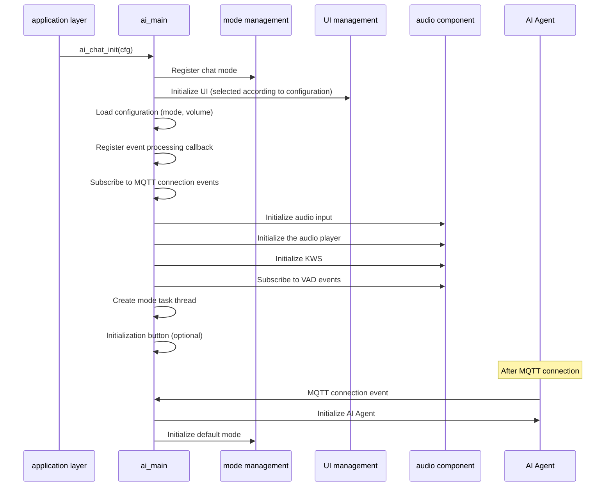
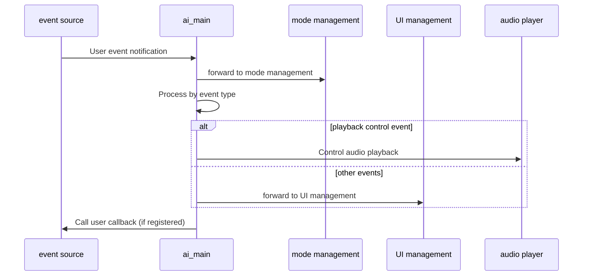
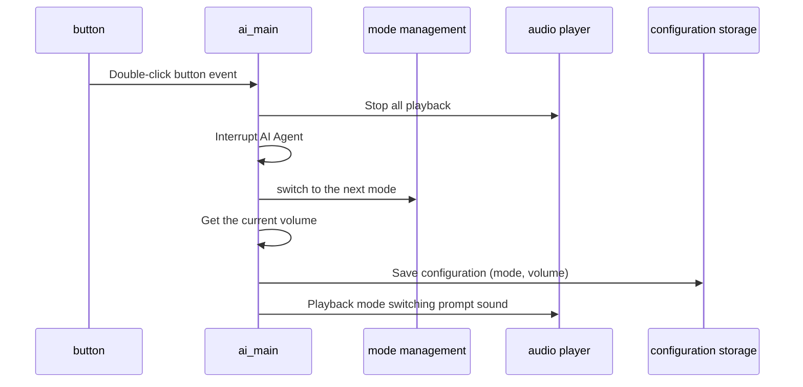

## Glossary

| Term | Description |
| ---- | ------------------------------------------------------------ |
| MQTT | Message Queuing Telemetry Transport protocol (Message Queuing Telemetry Transport), used for communication between devices and the cloud. |

## Overview

`ai_main` is the entry module of the TuyaOpen AI application framework. It provides unified initialization and lifecycle management for AI components. This module includes mode registration, audio input/output, UI display, video input, and key-event handling, and serves as the main interface for the application layer.

- **Unified Initialization**: Unified management of the initialization of various AI components, including mode management, audio, UI, video, etc.
- **Mode Registration**: Automatically registers enabled chat modes according to configuration (press-and-hold, one-shot, wake word, and free conversation)
- **Event processing**: Processes user events uniformly and forwards them to mode management and UI management modules
- **Configuration Management**: Supports saving and loading of chat mode and volume to achieve configuration persistence
- **Key processing**: Supports key event handling; double-click switches chat modes

## Workflow

### Initialization process

When the module is initialized, it sequentially registers the chat mode, initializes the UI, loads the configuration, initializes the audio component, creates the mode task thread, etc.



### Event handling process

After user events are sent through the event system, the module forwards the events to the mode management and UI management modules for processing.



### Mode switching process

When the user double-clicks the button, the module switches to the next chat mode and saves the configuration.



## Dependent components

- **Mode Management Component** (`ai_mode`): required, used for chat mode management
- **Audio Component** (`ai_audio`): optional, used for audio input and output
- **UI components** (`ai_ui`): optional, used for interface display
- **Button Component** (`button`): optional, used for key event processing
- **AI Agent** (`tuya_ai_service`): required, used to communicate with cloud AI services

## Development process

### Data structure

#### Chat mode configuration

```c
typedef struct {
AI_CHAT_MODE_E default_mode; //Default chat mode
int default_vol; //Default volume (0-100)
AI_USER_EVENT_NOTIFY evt_cb; // User event callback function
} AI_CHAT_MODE_CFG_T;
```

### Interface description

#### Initialize AI chat module

Initialize the AI ​​chat module, register mode, initialize UI, load configuration, initialize audio components, etc. Make sure at least one chat mode is enabled in the configuration, otherwise initialization will fail.

```c
/**
 * @brief Initialize AI chat module
 * @param cfg Chat mode configuration
 * @return OPERATE_RET Operation result code
 */
OPERATE_RET ai_chat_init(AI_CHAT_MODE_CFG_T *cfg);
```

#### Set volume

Set chat volume and save to configuration.

```c
/**
 * @brief Set chat volume
 * @param volume Volume value (0-100)
 * @return OPERATE_RET Operation result code
 */
OPERATE_RET ai_chat_set_volume(int volume);
```

#### Get the volume

Get the current chat volume.

```c
/**
 * @brief Get chat volume
 * @return int Volume value (0-100)
 */
int ai_chat_get_volume(void);
```

### Development steps

1. **Prepare configuration**: Create an `AI_CHAT_MODE_CFG_T` structure and set the default mode and volume
2. **Initialize the module**: Call `ai_chat_init()` to initialize the AI chat module
3. **Wait for MQTT connection**: The module automatically initializes the AI Agent after MQTT connects
4. **Handle events**: Optionally process user events through the registered event handler callback

### Reference example

#### Initialization and configuration

```c
#include "ai_chat_main.h"

//User event callback function
void user_event_callback(AI_NOTIFY_EVENT_T *event)
{
    // Handle user events
    switch (event->type) {
        case AI_USER_EVT_ASR_OK:
            PR_NOTICE("ASR recognition successful");
            break;
        case AI_USER_EVT_TEXT_STREAM_START:
            PR_NOTICE("AI text stream starts");
            break;
        // ...Other event handling
        default:
            break;
    }
}

//Initialize AI chat module
OPERATE_RET init_ai_chat(void)
{
    OPERATE_RET rt = OPRT_OK;
    
    AI_CHAT_MODE_CFG_T cfg = {
        .default_mode = AI_CHAT_MODE_HOLD, // Use hold mode by default
        .default_vol = 70, //Default volume 70%
        .evt_cb = user_event_callback, // User event callback
    };
    
    TUYA_CALL_ERR_RETURN(ai_chat_init(&cfg));
    
    PR_NOTICE("AI chat module initialized successfully");
    
    return rt;
}
```

#### Volume control

```c
//Set the volume
void set_chat_volume(int volume)
{
    if (volume < 0 || volume > 100) {
        PR_ERR("Invalid volume value: %d", volume);
        return;
    }
    
    OPERATE_RET rt = ai_chat_set_volume(volume);
    if (OPRT_OK == rt) {
        PR_NOTICE("Set volume successfully: %d%%", volume);
    } else {
        PR_ERR("Failed to set volume: %d", rt);
    }
}

// Get the volume
void get_chat_volume(void)
{
    int volume = ai_chat_get_volume();
    PR_NOTICE("Current volume: %d%%", volume);
}
```

