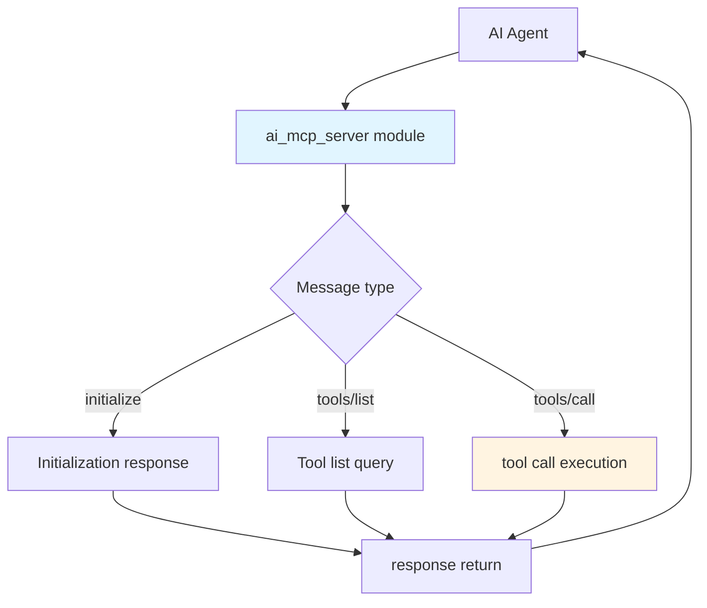
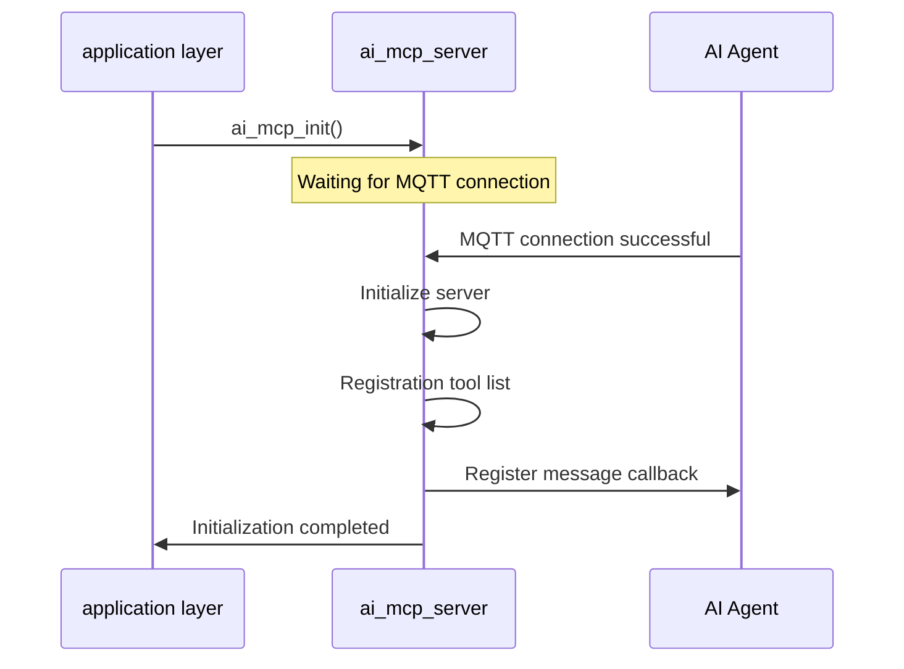
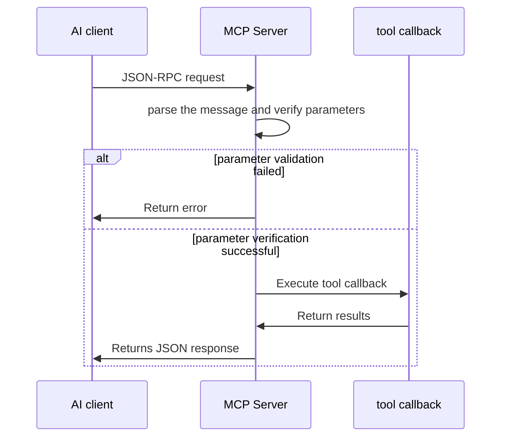
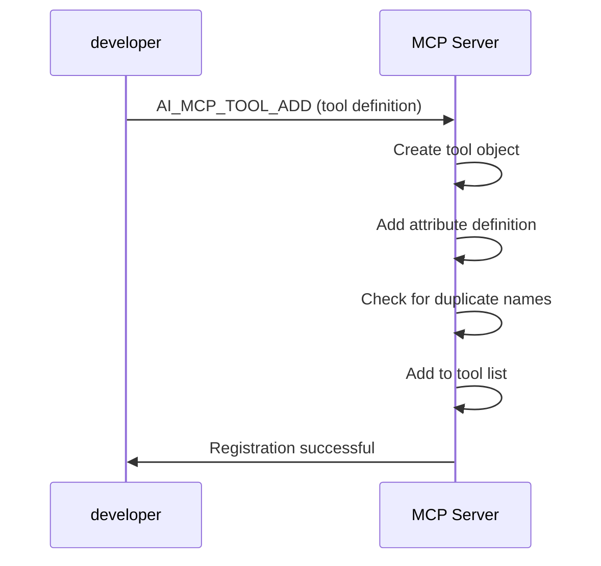

## Glossary

| Term | Description |
| ---- | ------------------------------------------------------------ |
| MCP | Abbreviation for Model Context Protocol, a standardized protocol for AI models to interact with external tools and services. In this module, MCP Server provides tool discovery and execution capabilities. |
| JSON-RPC | The abbreviation of JSON Remote Procedure Call (JSON Remote Procedure Call) is a lightweight remote procedure call protocol based on JSON. MCP uses JSON-RPC 2.0 as the communication protocol. |
| Tool | Tool is the core concept in the MCP protocol. Each tool represents an executable function, including name, description, input parameter definition and execution callback function. |
| Property | Property used to define the input parameters of the tool. Each property contains information such as name, type, description, default value, and scope limits. |

Tuya currently supports 2 ways to access MCP services:

- **Device MCP**: Tools are executed on the device side. When the device is connected as an MCP Server, Tuya Cloud will directly query and call the tool list provided by the device. This article describes the device MCP access method.
- **Custom MCP Service**: Tools are executed in the cloud or on an external server. Developers deploy [customized MCP service](https://developer.tuya.com/cn/docs/iot/custom-mcp?id=Kety4zbdvwdn8) on the cloud or external server, configure and manage it through the Tuya platform, and the AI ​​model can call cloud tools and resources through this service.

## Overview

`ai_mcp_server` is the MCP (Model Context Protocol) server implementation in the TuyaOpen AI application framework. It provides tool discovery and execution capabilities based on JSON-RPC 2.0, enabling AI models to call device functions through a standardized protocol for operations such as device control and information query.

- **Tool management**: Supports tool registration, lookup, and management
- **Protocol processing**: Implements JSON-RPC 2.0 message parsing and response handling
- **Parameter validation**: Supports tool-parameter validation, including type checks, range checks, and default-value handling
- **Return value processing**: Supports multiple return types (Boolean, integer, string, JSON, image)


## Workflow

### Module architecture diagram

The MCP server receives JSON-RPC messages from the AI Agent, processes initialization, tool-list queries, or tool invocations based on message type, and returns results.



### Initialization process

After the application layer calls the initialization interface, it waits for the MQTT connection to be successful, then initializes the server and registers the tool list to complete the startup of the MCP server.



### Tool calling process

After the client sends a JSON-RPC request, the server parses the message and verifies the parameters. If the verification passes, the tool callback is executed and the result is returned. If the verification fails, an error message is returned.



### Tool registration process

After the developer defines the tool through the macro, the server creates the tool object, adds attribute definitions, checks for name duplication, and finally adds the tool to the tool list to complete the registration.



## Configuration instructions

### Configuration file path

```
ai_components/ai_mcp/Kconfig
```

### Function enable

```
menuconfig ENABLE_COMP_AI_MCP
    bool "enable ai mcp module"
    default y
```

## Development process

### Data structure

#### Property type

```c
typedef enum {
MCP_PROPERTY_TYPE_BOOLEAN = 0, // Boolean type
MCP_PROPERTY_TYPE_INTEGER, // Integer type
MCP_PROPERTY_TYPE_STRING, // String type
    MCP_PROPERTY_TYPE_MAX
} MCP_PROPERTY_TYPE_E;
```

#### Return value type

```c
typedef enum {
MCP_RETURN_TYPE_BOOLEAN = 0, // Boolean value
MCP_RETURN_TYPE_INTEGER, // integer
MCP_RETURN_TYPE_STRING, // string
MCP_RETURN_TYPE_JSON, // JSON object
MCP_RETURN_TYPE_IMAGE, // Image (Base64 encoding)
    MCP_RETURN_TYPE_MAX
} MCP_RETURN_TYPE_E;
```

#### Tool properties

```c
typedef struct {
char *name; // attribute name
MCP_PROPERTY_TYPE_E type; //Property type
char *description; //Attribute description
bool has_default; // Whether there is a default value
MCP_PROPERTY_VALUE_T default_val; //Default value
bool has_range; // Whether there is a range limit
int min_val; // minimum value (integer type)
int max_val; // Maximum value (integer type)
} MCP_PROPERTY_T;
```

#### Tool definition

```c
typedef struct ai_mcp_tool_s {
char *name; // Tool name
char *description; // tool description
MCP_PROPERTY_LIST_T properties; //Input property list
MCP_TOOL_CALLBACK callback; // Execute callback function
void *user_data; // user data
struct ai_mcp_tool_s *next; // Next tool (linked list)
} MCP_TOOL_T;
```

#### Return value

```c
typedef struct {
MCP_RETURN_TYPE_E type; //Return value type
    union {
bool bool_val; // Boolean value
int int_val; // integer value
char *str_val; // string value
cJSON *json_val; // JSON object
        struct {
char *mime_type; // MIME type
char *data; // Base64 encoded data
uint32_t data_len; // data length
} image_val; // Image data
    };
} MCP_RETURN_VALUE_T;
```

#### Tool callback function

```c
typedef OPERATE_RET (*MCP_TOOL_CALLBACK)(
const MCP_PROPERTY_LIST_T *properties, // Input properties
MCP_RETURN_VALUE_T *ret_val, // Return value (filled by callback function)
void *user_data // user data
);
```

### Interface description

#### Initialize MCP server

Initialize the MCP server, set the server name and version, and register message processing callbacks.

```c
/**
 * @brief Initialize MCP server
 * @param name Server name (board name)
 * @param version Server version
 * @return OPERATE_RET Operation result
 */
OPERATE_RET ai_mcp_server_init(const char *name, const char *version);
```

#### Destroy MCP server

Release MCP server resources and destroy all registered tools.

```c
/**
 * @brief Destroy MCP server
 */
void ai_mcp_server_destroy(void);
```

#### Create tools

Create a new tool object.

```c
/**
 * @brief Create a new tool
 * @param name Tool name
 * @param description Tool description
 * @param callback Tool execution callback
 * @param user_data User data passed to callback
 * @return Pointer to new tool, NULL on allocation failure
 */
MCP_TOOL_T *ai_mcp_tool_create(const char *name, const char *description,
                                 MCP_TOOL_CALLBACK callback, void *user_data);
```

#### Register tools (macro)

Use macros to quickly create and register tools, and support variable parameter definition properties.

```c
/**
 * @brief Macro to create and register a new tool with properties
 * @param name Tool name
 * @param description Tool description
 * @param callback Tool execution callback
 * @param user_data User data passed to callback
 * @param ... Variable arguments of MCP_PROPERTY_DEF_T* ending with MCP_PROP_END
 * @return OPRT_OK on success, error code on failure
 */
#define AI_MCP_TOOL_ADD(name, description, callback, user_data, ...)
```

#### Add tools to the server

The tool is added to the server and ownership of the tool is transferred to the server.

```c
/**
 * @brief Add tool to server
 * @param tool Tool to add (ownership transferred to server)
 * @return OPERATE_RET Operation result
 */
OPERATE_RET ai_mcp_server_add_tool(MCP_TOOL_T *tool);
```

#### Find tool

Find registered tools by name.

```c
/**
 * @brief Find tool by name
 * @param name Tool name
 * @return Pointer to tool if found, NULL otherwise
 */
MCP_TOOL_T *ai_mcp_server_find_tool(const char *name);
```

#### Parse messages

Parse and process JSON-RPC messages from clients.

```c
/**
 * @brief Parse and handle MCP message
 * @param json JSON-RPC message object
 * @param user_data User data (currently unused)
 * @return OPERATE_RET Operation result
 */
OPERATE_RET ai_mcp_server_parse_message(const cJSON *json, void *user_data);
```

#### Set return value

Set the return value of the tool callback function.

```c
//Set boolean value
void ai_mcp_return_value_set_bool(MCP_RETURN_VALUE_T *ret_val, bool value);

//Set integer value
void ai_mcp_return_value_set_int(MCP_RETURN_VALUE_T *ret_val, int value);

//Set string value
OPERATE_RET ai_mcp_return_value_set_str(MCP_RETURN_VALUE_T *ret_val, const char *value);

//Set JSON value
void ai_mcp_return_value_set_json(MCP_RETURN_VALUE_T *ret_val, cJSON *json);

//Set image value (Base64 encoding)
OPERATE_RET ai_mcp_return_value_set_image(MCP_RETURN_VALUE_T *ret_val,
                                            const char *mime_type,
                                            const void *data, uint32_t data_len);
```

#### Clean return value

Clean up dynamically allocated memory in the return value.

```c
/**
 * @brief Clean up return value
 * @param ret_val Return value to clean up
 */
void ai_mcp_return_value_cleanup(MCP_RETURN_VALUE_T *ret_val);
```

### Attribute definition macro

The module provides a series of macros to simplify the definition of properties:

```c
// Integer properties (no default value, no range)
MCP_PROP_INT(name, desc)

// Integer attribute (with default value)
MCP_PROP_INT_DEF(name, desc, def_val)

// Integer attributes (with range restrictions)
MCP_PROP_INT_RANGE(name, desc, min, max)

// Integer properties (with default values ​​and range restrictions)
MCP_PROP_INT_DEF_RANGE(name, desc, def_val, min, max)

// Boolean properties
MCP_PROP_BOOL(name, desc)

// Boolean attribute (with default value)
MCP_PROP_BOOL_DEF(name, desc, def_val)

// string properties
MCP_PROP_STR(name, desc)

// String attribute (with default value)
MCP_PROP_STR_DEF(name, desc, def_val)
```

### Development steps

1. **Initialize MCP Server**: Called when the application starts`ai_mcp_server_init()`Initialize server
2. **Registration Tool**: Use`AI_MCP_TOOL_ADD`Macro registration customization tool
3. **Implement tool callback**: Implement the execution logic of the tool and set the return value
4. **Processing Message**: Make sure`ai_mcp_server_parse_message()`Registered in the message callback of AI Agent

### Reference example

#### Initialize MCP server

```c
#include "ai_mcp_server.h"

OPERATE_RET init_mcp_server(void)
{
    OPERATE_RET rt = OPRT_OK;
    
//Initialize MCP server
    TUYA_CALL_ERR_RETURN(ai_mcp_server_init("Tuya MCP Server", "1.0"));
    
// Registration tool (see example below)
    // ...
    
    return rt;
}
```

#### Register a simple tool (no parameters)

```c
//Tool callback function
static OPERATE_RET get_device_info_cb(const MCP_PROPERTY_LIST_T *properties, 
                                       MCP_RETURN_VALUE_T *ret_val, 
                                       void *user_data)
{
    cJSON *json = cJSON_CreateObject();
    if (!json) {
        return OPRT_MALLOC_FAILED;
    }
    
    cJSON_AddStringToObject(json, "model", PROJECT_NAME);
    cJSON_AddStringToObject(json, "version", PROJECT_VERSION);
    
    ai_mcp_return_value_set_json(ret_val, json);
    return OPRT_OK;
}

//Registration tool
OPERATE_RET register_tools(void)
{
    TUYA_CALL_ERR_RETURN(AI_MCP_TOOL_ADD(
        "device_info_get",
        "Get device information such as model, serial number, and firmware version.",
        get_device_info_cb,
        NULL
    ));
    
    return OPRT_OK;
}
```

#### Register a tool with parameters

```c
//Set the volume tool callback
static OPERATE_RET set_volume_cb(const MCP_PROPERTY_LIST_T *properties, 
                                  MCP_RETURN_VALUE_T *ret_val, 
                                  void *user_data)
{
int volume = 50; //Default volume
    
// Get the volume value from the attribute list
    for (int i = 0; i < properties->count; i++) {
        MCP_PROPERTY_T *prop = properties->properties[i];
        if (strcmp(prop->name, "volume") == 0 && 
            prop->type == MCP_PROPERTY_TYPE_INTEGER) {
            volume = prop->default_val.int_val;
            break;
        }
    }
    
//Perform the volume setting operation
    ai_audio_player_set_vol(volume);
    
//Set return value
    ai_mcp_return_value_set_bool(ret_val, TRUE);
    
    return OPRT_OK;
}

//Registration tool (with integer parameters and range restrictions)
OPERATE_RET register_volume_tool(void)
{
    TUYA_CALL_ERR_RETURN(AI_MCP_TOOL_ADD(
        "device_audio_volume_set",
        "Sets the device's volume level.\n"
        "Parameters:\n"
        "- volume (int): The volume level to set (0-100).\n"
        "Response:\n"
        "- Returns true if the volume was set successfully.",
        set_volume_cb,
        NULL,
        MCP_PROP_INT_RANGE("volume", "The volume level to set (0-100).", 0, 100)
    ));
    
    return OPRT_OK;
}
```

#### Register a tool with multiple parameters

```c
//Photography tool callback
static OPERATE_RET take_photo_cb(const MCP_PROPERTY_LIST_T *properties, 
                                 MCP_RETURN_VALUE_T *ret_val, 
                                 void *user_data)
{
    OPERATE_RET rt = OPRT_OK;
    uint8_t *image_data = NULL;
    uint32_t image_size = 0;
    int count = 1;
    
// Parse parameters
    for (int i = 0; i < properties->count; i++) {
        MCP_PROPERTY_T *prop = properties->properties[i];
        if (strcmp(prop->name, "count") == 0 && 
            prop->type == MCP_PROPERTY_TYPE_INTEGER) {
            count = prop->default_val.int_val;
        }
    }
    
// Start video display
    TUYA_CALL_ERR_RETURN(ai_video_display_start());
    tal_system_sleep(3000);
    
// Get JPEG frame
    rt = ai_video_get_jpeg_frame(&image_data, &image_size);
    if (OPRT_OK != rt) {
        ai_video_display_stop();
        return rt;
    }
    
//Set return value (picture)
    rt = ai_mcp_return_value_set_image(ret_val, 
                                        MCP_IMAGE_MIME_TYPE_JPEG, 
                                        image_data, 
                                        image_size);
    
    ai_video_jpeg_image_free(&image_data);
    ai_video_display_stop();
    
    return rt;
}

//Registration tool (with multiple parameters)
OPERATE_RET register_photo_tool(void)
{
    TUYA_CALL_ERR_RETURN(AI_MCP_TOOL_ADD(
        "device_camera_take_photo",
        "Activates the device's camera to capture one or more photos.\n"
        "Parameters:\n"
        "- count (int): Number of photos to capture (1-10).\n"
        "Response:\n"
        "- Returns the captured photos encoded in Base64 format.",
        take_photo_cb,
        NULL,
        MCP_PROP_STR("question", "The question prompting the photo capture."),
        MCP_PROP_INT_DEF_RANGE("count", "Number of photos to capture (1-10).", 1, 1, 10)
    ));
    
    return OPRT_OK;
}
```

#### Return values ​​of different types

```c
//return boolean value
static OPERATE_RET tool_return_bool(const MCP_PROPERTY_LIST_T *properties, 
                                     MCP_RETURN_VALUE_T *ret_val, 
                                     void *user_data)
{
    ai_mcp_return_value_set_bool(ret_val, TRUE);
    return OPRT_OK;
}

//return integer value
static OPERATE_RET tool_return_int(const MCP_PROPERTY_LIST_T *properties, 
                                   MCP_RETURN_VALUE_T *ret_val, 
                                   void *user_data)
{
    ai_mcp_return_value_set_int(ret_val, 100);
    return OPRT_OK;
}

//return string value
static OPERATE_RET tool_return_string(const MCP_PROPERTY_LIST_T *properties, 
                                      MCP_RETURN_VALUE_T *ret_val, 
                                      void *user_data)
{
    ai_mcp_return_value_set_str(ret_val, "Success");
    return OPRT_OK;
}

// Return JSON object
static OPERATE_RET tool_return_json(const MCP_PROPERTY_LIST_T *properties, 
                                    MCP_RETURN_VALUE_T *ret_val, 
                                    void *user_data)
{
    cJSON *json = cJSON_CreateObject();
    if (!json) {
        return OPRT_MALLOC_FAILED;
    }
    
    cJSON_AddStringToObject(json, "status", "ok");
    cJSON_AddNumberToObject(json, "code", 200);
    
    ai_mcp_return_value_set_json(ret_val, json);
    return OPRT_OK;
}
```

