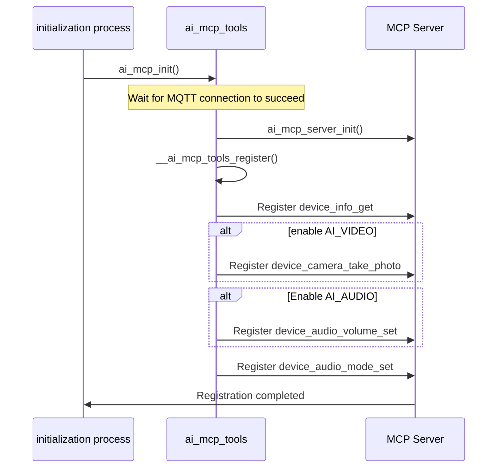
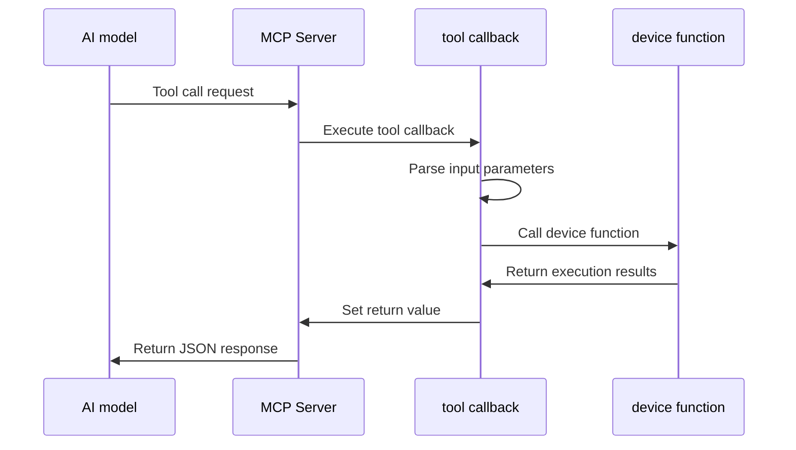

## Glossary

| Term | Description |
| ---- | ------------------------------------------------------------ |
| MCP Tool | An MCP tool is a device-side functional interface exposed to AI models. Each tool represents an executable function, including name, description, input-parameter definition, and execution callback. |

## Overview

`ai_mcp_tools` is a collection of predefined MCP tools in the TuyaOpen AI application framework. It provides basic functions such as device information query and device control. This module automatically registers these tools when the MCP server is initialized, enabling AI models to call device functions through standardized protocols.

### Tool list

- **Query device information**

- Function: Gets basic device information, including model, serial number, and firmware version

- Return: Device information in JSON format

- **Photography** (needs to be enabled`ENABLE_COMP_AI_VIDEO`）

- Function: Activates the device camera, captures a photo, and returns it to AI for analysis.

- Return: Base64-encoded JPEG image data

- **SET VOLUME** (needs to be enabled`ENABLE_COMP_AI_AUDIO`）

- Function: Sets the device volume level (0-100)

- Return: Boolean value, indicating whether the setting is successful

- **Set chat mode**

- Function: Switches the device AI chat mode. Supported modes are press-and-hold, one-shot, wake word, and free conversation.

- Return: Boolean value, indicating whether the setting is successful

## Workflow

### Tool registration process

When the MCP server is initialized, the module automatically registers all available tools. The order of tool registration is: device information query tool → video tool (if enabled) → audio tool (if enabled) → mode setting tool.



### Tool calling process

When an AI model calls a tool through the MCP protocol, the tool callback function parses the parameters, performs the corresponding operation, and returns the result.



## Configuration instructions

### Configuration file path

```
ai_components/ai_mcp/Kconfig
```

### Function enable

The availability of tool modules depends on the enabling status of related components:

```
# MCP module enable
menuconfig ENABLE_COMP_AI_MCP
    bool "enable ai mcp module"
    default y
```

## Development process

### Interface description

#### Initialize MCP tool module

Called when the application starts, it will automatically subscribe to the MQTT connection event, initialize the MCP server and register all tools after the connection is successful.

```c
/**
 * @brief Initialize MCP tools module
 * @return OPERATE_RET Operation result
 */
OPERATE_RET ai_mcp_init(void);
```

#### Deinitialize MCP tool module

Release MCP server resources and destroy all registered tools.

```c
/**
 * @brief Deinitialize MCP tools module
 * @return OPERATE_RET Operation result
 */
OPERATE_RET ai_mcp_deinit(void);
```

### Development steps

1. **Make sure the MCP module is enabled**: Enable in configuration`ENABLE_COMP_AI_MCP`
2. **Enable related components as needed**:
- If you want to use the camera function, enable it`ENABLE_COMP_AI_VIDEO`
- To use volume control, enable`ENABLE_COMP_AI_AUDIO`
3. **Call initialization interface**: called when the application starts`ai_mcp_init()`
5. **AI model calling**: AI will analyze the intent based on your input content, and then call these tools through the MCP protocol


