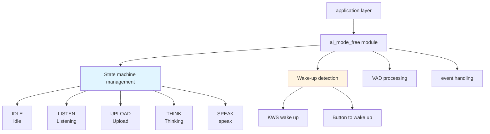
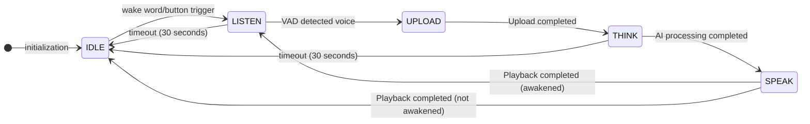
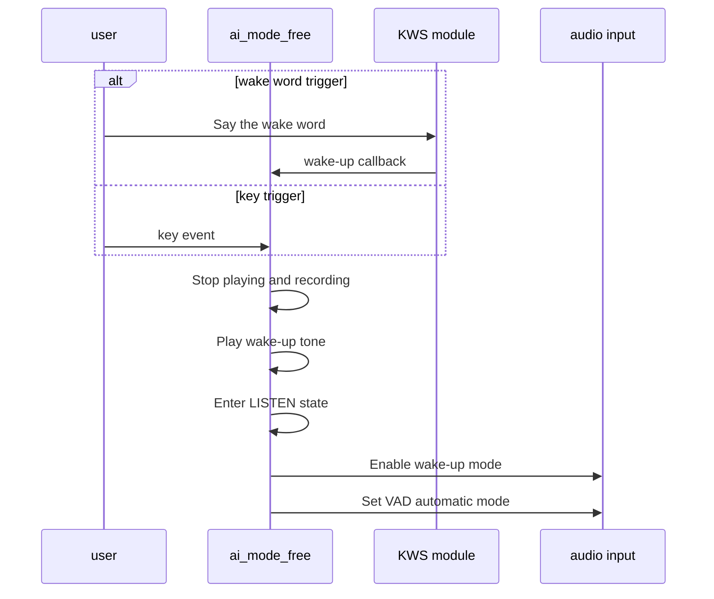
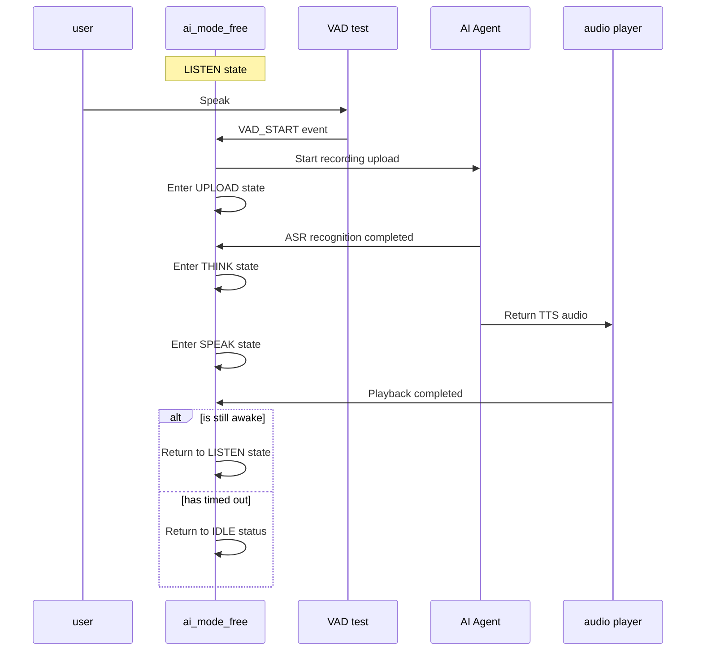

## Glossary

| Term | Description |
| ---- | ------------------------------------------------------------ |
| KWS | Keyword Spotting is used to detect specific wake words and trigger the device to enter the listening state. |
| VAD | Voice Activity Detection (Voice Activity Detection), used to detect whether there is voice input. |

## Overview

`ai_mode_free` implements free conversation mode in the TuyaOpen AI application framework and provides natural voice interaction. After the user triggers it through a wake word or one-shot key action, the device enters a continuous listening state and can support multiple conversation rounds within a period of time (30 seconds by default) without retriggering each interaction.

- **Wake-up mechanism**: Supports two triggers: wake word (KWS) and one-shot key input
- **Continuous Monitoring**: Enter continuous monitoring state after waking up, supporting multiple rounds of dialogue
- **Auto Timeout**: Automatically times out (default 30 seconds) to return to idle state after no voice activity or playback is completed
- **LED Indication**: Different states display different LED effects (LED components need to be enabled)
- Idle: LED off
- Listening: LED flashing (500ms)
- Think: LED flashing (2000ms)
- Talk: LED is always on

## Workflow

### Module architecture diagram



### State machine process

Free conversation mode manages the full interaction flow with a state machine. It starts from idle and enters listening after wake-up. After each voice interaction, it returns to listening or idle based on runtime status.



### Wake-up process

Users can trigger free conversation mode through wake words or key presses.



### Voice interaction process

After wake-up, the device automatically detects voice activity through VAD and completes one full voice interaction round.



## Configuration instructions

### Configuration file path

```
ai_components/ai_mode/Kconfig
```

### Function enable

```
menuconfig ENABLE_COMP_AI_PRESENT_MODE
    bool "enable ai present mode"
    default y

config ENABLE_COMP_AI_MODE_FREE
    bool "enable ai mode free"
    default y
```

### Dependent components

- **Audio Component** (`ENABLE_COMP_AI_AUDIO`): required, used for audio input and output and VAD detection
- **LED Component** (`ENABLE_LED`): optional, used for status indication
- **Button Component** (`ENABLE_BUTTON`): optional, used for key wake-up function

## Development process

### Interface description

#### Register for free conversation mode

Register the free conversation mode with the mode manager.

```c
/**
 * @brief Register free mode
 * @return OPERATE_RET Operation result
 */
OPERATE_RET ai_mode_free_register(void);
```

### Development steps

1. **Registration Mode**: Called when the application starts`ai_mode_free_register()`Register for free chat mode
2. **Initialization Mode**: Pass`ai_mode_init(AI_CHAT_MODE_FREE)`Initialize free conversation mode
3. **Run Mode Task**: Called in the task loop`ai_mode_task_running()`Running state machine
4. **Handling events**: Ensure that user events, VAD status changes, key events, etc. have been correctly forwarded to the mode manager

### Reference example

#### Registration and initialization

```c
#include "ai_mode_free.h"
#include "ai_manage_mode.h"

//Register free conversation mode
OPERATE_RET register_free_mode(void)
{
    OPERATE_RET rt = OPRT_OK;
    
//Register free conversation mode
    TUYA_CALL_ERR_RETURN(ai_mode_free_register());
    
    return rt;
}

//Initialize free conversation mode
OPERATE_RET init_free_mode(void)
{
    OPERATE_RET rt = OPRT_OK;
    
//Initialize free conversation mode
    TUYA_CALL_ERR_RETURN(ai_mode_init(AI_CHAT_MODE_FREE));
    
    return rt;
}
```

#### Mode switching

```c
//Switch to free conversation mode
void switch_to_free_mode(void)
{
    OPERATE_RET rt = ai_mode_switch(AI_CHAT_MODE_FREE);
    if (OPRT_OK == rt) {
        PR_NOTICE("Switch to free conversation mode");
    } else {
        PR_ERR("Failed to switch mode: %d", rt);
    }
}
```

#### Query mode status

```c
void query_free_mode_state(void)
{
    AI_MODE_STATE_E state = ai_mode_get_state();
    PR_NOTICE("Current status of free conversation mode: %s", ai_get_mode_state_str(state));
}
```

