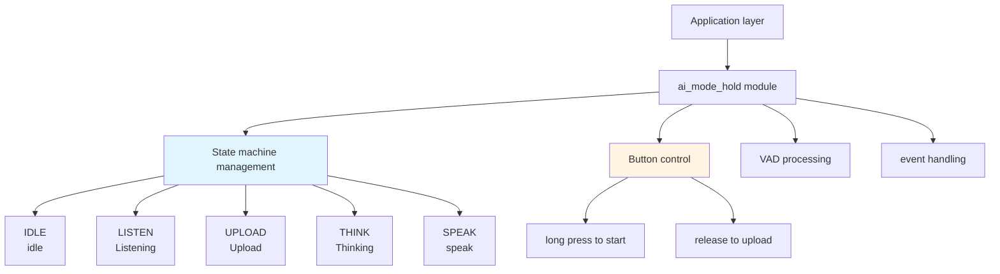
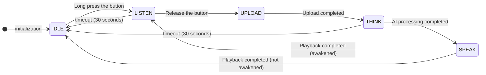
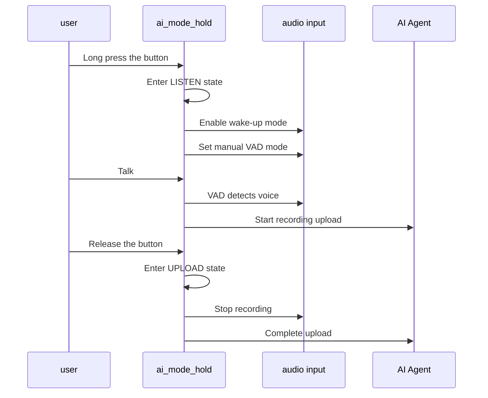
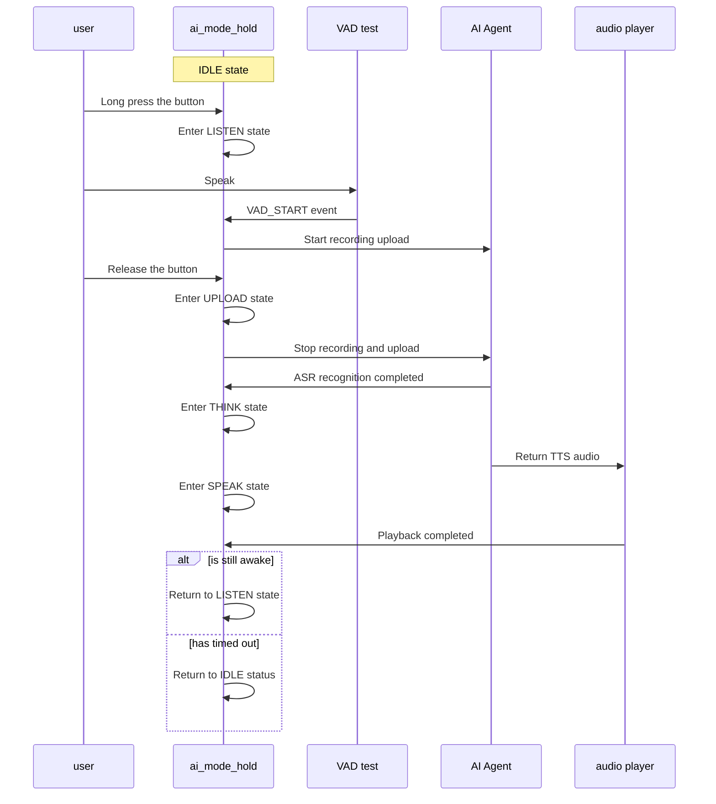

## Glossary

| Term | Description |
| ---- | ------------------------------------------------------------ |
| VAD | Voice Activity Detection (Voice Activity Detection), used to detect whether there is voice input. |

## Overview

`ai_mode_hold` implements press-and-hold mode in the TuyaOpen AI application framework. It provides a voice interaction method that requires active user control: users press and hold the button to record, then release it to stop recording and upload. This mode is suitable for scenarios that require precise control of recording duration.

- **Button Control**: Press and hold the button to start recording, release the button to stop recording and upload. Recording is controlled by user keystrokes and does not rely on automatic voice detection.
- **Auto Timeout**: Automatically times out (default 30 seconds) to return to idle state after no voice activity or playback is completed
- **LED Indication**: Different states display different LED effects (LED components need to be enabled)
- Idle: LED off
- Listening: LED flashing (500ms)
- Think: LED flashing (2000ms)
- Talk: LED is always on

## Workflow

### Module architecture diagram



### State machine process

Press-and-hold mode manages the full interaction flow with a state machine. It starts from idle, enters listening when the button is pressed and held, uploads after release, and then returns to listening or idle based on runtime status.



### Key interaction process

The user triggers recording by long pressing the button, and stops recording and uploads after releasing the button.



### Voice interaction process

After long pressing the button, the device starts recording. After releasing the button, it stops recording and uploads, completing a complete round of voice interaction.



## Configuration instructions

### Configuration file path

```
ai_components/ai_mode/Kconfig
```

### Function enable

```
menuconfig ENABLE_COMP_AI_PRESENT_MODE
    bool "enable ai present mode"
    default y

config ENABLE_COMP_AI_MODE_HOLD
    bool "enable ai mode hold"
    default y
```

### Dependent components

- **Audio Component** (`ENABLE_COMP_AI_AUDIO`): required, used for audio input and output and VAD detection
- **LED Component** (`ENABLE_LED`): optional, used for status indication
- **Button Component** (`ENABLE_BUTTON`): required, used for key control function

## Development process

### Interface description

#### Register long press mode

Register the long press mode into the mode manager.

```c
/**
 * @brief Register hold mode
 * @return OPERATE_RET Operation result
 */
OPERATE_RET ai_mode_hold_register(void);
```

### Development steps

1. **Register mode**: At startup, call `ai_mode_hold_register()` to register press-and-hold mode
2. **Initialize mode**: Call `ai_mode_init(AI_CHAT_MODE_HOLD)` to initialize press-and-hold mode
3. **Run mode task**: In the task loop, call `ai_mode_task_running()` to run the state machine
4. **Handle events**: Ensure user events, VAD state changes, and key events are correctly forwarded to the mode manager

### Reference example

#### Registration and initialization

```c
#include "ai_mode_hold.h"
#include "ai_manage_mode.h"

//Register long press mode
OPERATE_RET register_hold_mode(void)
{
    OPERATE_RET rt = OPRT_OK;
    
//Register long press mode
    TUYA_CALL_ERR_RETURN(ai_mode_hold_register());
    
    return rt;
}

//Initialize long press mode
OPERATE_RET init_hold_mode(void)
{
    OPERATE_RET rt = OPRT_OK;
    
//Initialize long press mode
    TUYA_CALL_ERR_RETURN(ai_mode_init(AI_CHAT_MODE_HOLD));
    
    return rt;
}
```

#### Mode switching

```c
//Switch to long press mode
void switch_to_hold_mode(void)
{
    OPERATE_RET rt = ai_mode_switch(AI_CHAT_MODE_HOLD);
    if (OPRT_OK == rt) {
        PR_NOTICE("Switch to long press mode");
    } else {
        PR_ERR("Failed to switch mode: %d", rt);
    }
}
```

#### Query mode status

```c
void query_hold_mode_state(void)
{
    AI_MODE_STATE_E state = ai_mode_get_state();
    PR_NOTICE("Current state of long press mode: %s", ai_get_mode_state_str(state));
}
```

