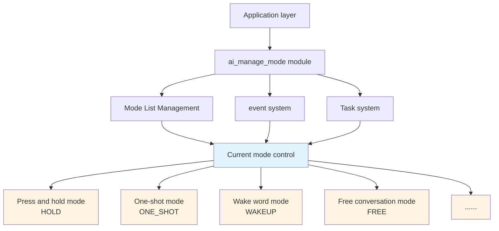
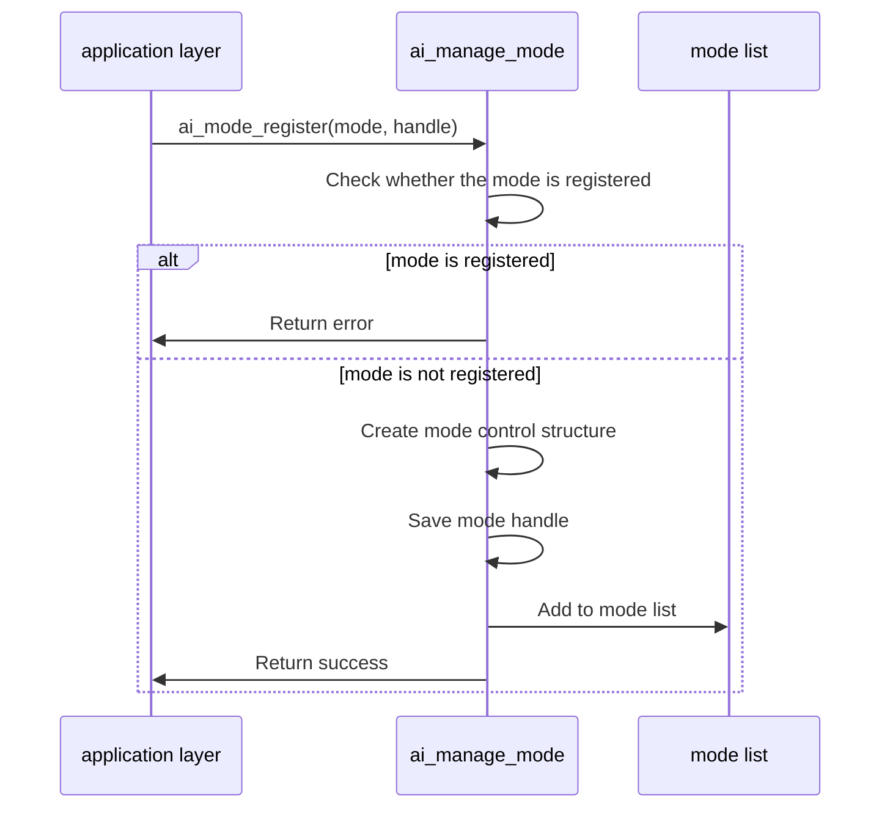
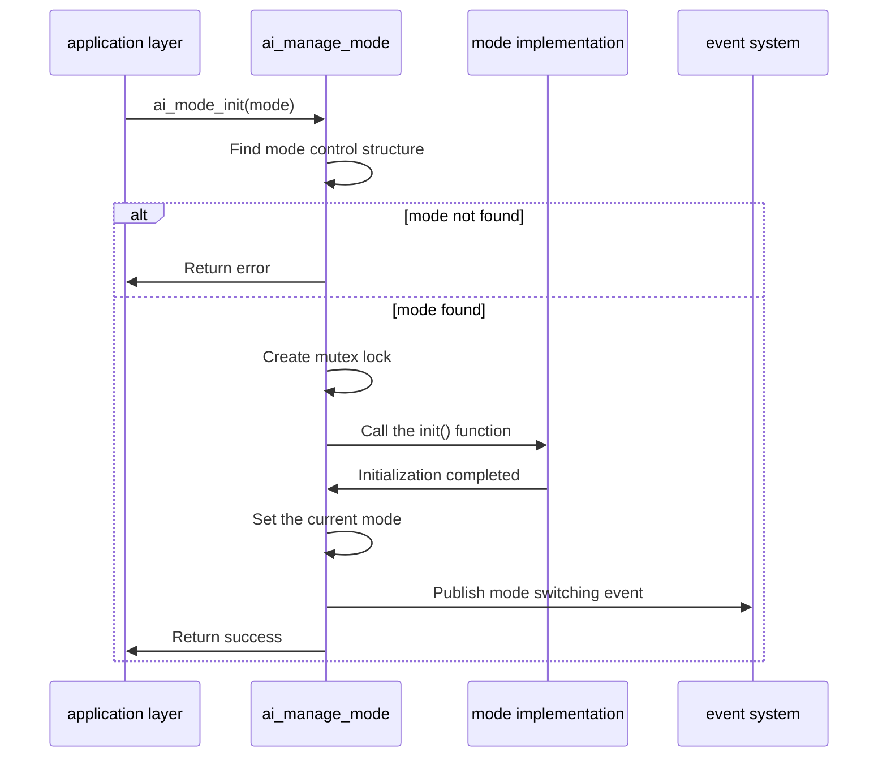
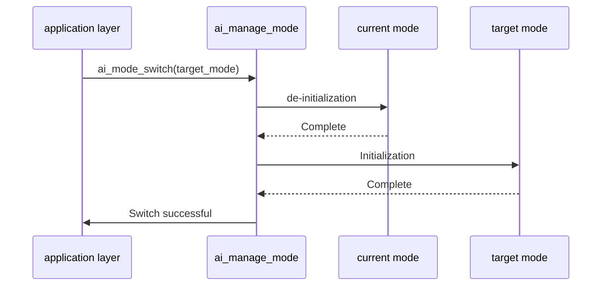
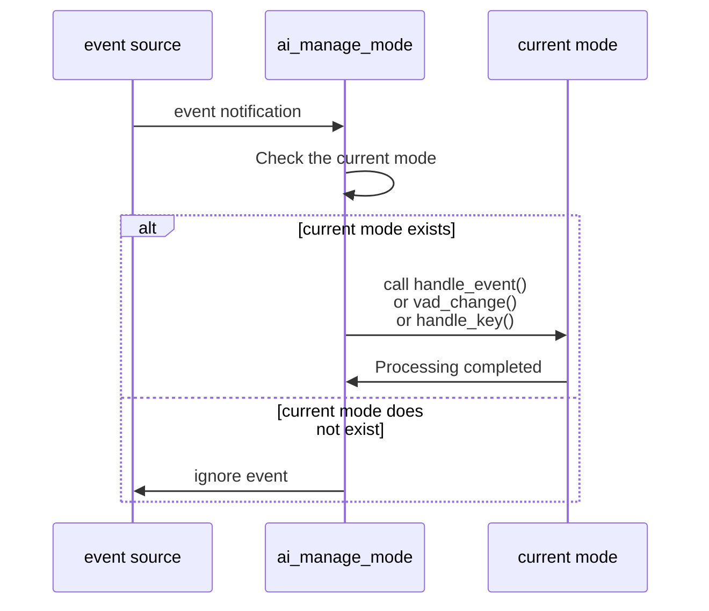
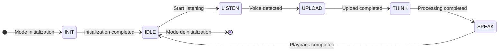

## Glossary

| Term | Description |
| ---- | ------------------------------------------------------------ |
| AI Chat Mode | The interaction mode of an AI device defines how users interact with the device through voice, including press-and-hold mode, one-shot mode, wake word mode, and free conversation mode. |
| VAD | Voice Activity Detection (Voice Activity Detection), used to detect whether there is voice input. |

## Overview

`ai_manage_mode` is the chat mode management component in the TuyaOpen AI application framework. It manages AI chat modes and provides mode registration, initialization, switching, and event handling.

### Mode management

- **Mode Registration**: Supports registration of multiple chat modes, each mode provides independent initialization and event processing logic
- **Mode switching**: Supports switching between modes and automatically deinitializes the current mode before initializing the target mode
- **Mode Query**: Supports querying the current mode, mode status, whether the mode has been registered, etc.

### Event handling

- **User event handling**: Forwards user events to the current mode handler
- **VAD status handling**: Forward voice activity detection status changes to the current mode (audio component needs to be enabled)
- **Key event processing**: Forward key events to the current mode (key components need to be enabled)

## Workflow

### Module architecture diagram



### Mode registration process

When the application layer registers a chat mode, the module checks whether the mode has been registered, creates a mode control structure and adds it to the mode list.



### Mode initialization process

When initializing a specified mode, the module locates the mode, creates a mutex, calls the mode initialization function, and sets it as the current mode.



### Mode switching process

When switching modes, the module deinitializes the current mode, initializes the target mode, and publishes a mode-switch event.



### Event handling process

When there is a user event, VAD state change, or key event, the module will forward the event to the current mode processor.



### Mode state machine process

Each mode has its own state machine, via`task()`The function runs, and the status includes: initialization, idle, listening, uploading, thinking, and talking.



## Development process

### Data structure

#### Chat mode enumeration

```c
typedef enum {
AI_CHAT_MODE_HOLD, //Hold mode
AI_CHAT_MODE_ONE_SHOT, // one-shot mode
AI_CHAT_MODE_WAKEUP, // wake word mode
AI_CHAT_MODE_FREE, // Free conversation mode

AI_CHAT_MODE_CUSTOM_START = 0x100, // Custom mode starting value
} AI_CHAT_MODE_E;
```

#### Mode status enumeration

```c
typedef enum {
AI_MODE_STATE_INIT, // Initialization state
AI_MODE_STATE_IDLE, // idle state
AI_MODE_STATE_LISTEN, // Listening status
AI_MODE_STATE_UPLOAD, // Upload status
AI_MODE_STATE_THINK, // Thinking state
AI_MODE_STATE_SPEAK, // speaking state
AI_MODE_STATE_INVALID, //Invalid state
} AI_MODE_STATE_E;
```

#### Mode abstract interface

```c
typedef struct {
const char *name; // mode name

OPERATE_RET (*init) (void); // Initialization function
OPERATE_RET (*deinit) (void); // Deinitialize function
OPERATE_RET (*task) (void *args); //Task function
OPERATE_RET (*handle_event) (AI_NOTIFY_EVENT_T *event); // event handling function
AI_MODE_STATE_E (*get_state) (void); // Get state function
OPERATE_RET (*client_run) (void *data); // Client callback function

#if defined(ENABLE_COMP_AI_AUDIO) && (ENABLE_COMP_AI_AUDIO == 1)
OPERATE_RET (*vad_change) (AI_AUDIO_VAD_STATE_E vad_state); // VAD state change processing
#endif

#if defined(ENABLE_BUTTON) && (ENABLE_BUTTON == 1)
OPERATE_RET (*handle_key) (TDL_BUTTON_TOUCH_EVENT_E event, void *arg); // Key processing function
#endif
} AI_MODE_HANDLE_T;
```

### Interface description

#### Register chat mode

Register a chat mode into the mode manager.

- The order of mode registration determines the switching order to the next mode.
- Custom mode enum values should start from `AI_CHAT_MODE_CUSTOM_START` to avoid conflicts with built-in modes.

```c
/**
 * @brief Register an AI chat mode
 * @param mode Chat mode to register
 * @param handle Pointer to mode handle structure
 * @return OPERATE_RET Operation result
 */
OPERATE_RET ai_mode_register(AI_CHAT_MODE_E mode, AI_MODE_HANDLE_T *handle);
```

#### Initialize chat mode

Initializes the specified chat mode, making it the currently active mode. Before switching modes, make sure the target mode is registered.

```c
/**
 * @brief Initialize a chat mode
 * @param mode Chat mode to initialize
 * @return OPERATE_RET Operation result
 */
OPERATE_RET ai_mode_init(AI_CHAT_MODE_E mode);
```

#### Deinitialize the current mode

Deinitialize the currently active chat mode.

```c
/**
 * @brief Deinitialize current chat mode
 * @return OPERATE_RET Operation result
 */
OPERATE_RET ai_mode_deinit(void);
```

#### Run mode task

Execute the task function of the current mode, usually used for state machine operation.

```c
/**
 * @brief Run current mode task
 * @param args Task arguments
 * @return OPERATE_RET Operation result
 */
OPERATE_RET ai_mode_task_running(void *args);
```

#### Handle user events

Forward user events to the current mode's handler.

```c
/**
 * @brief Handle AI user event
 * @param event Pointer to event structure
 * @return OPERATE_RET Operation result
 */
OPERATE_RET ai_mode_handle_event(AI_NOTIFY_EVENT_T *event);
```

#### Get mode status

Get the state of the current mode. If the mode is not initialized, `AI_MODE_STATE_INVALID` is returned.

```c
/**
 * @brief Get current mode state
 * @return AI_MODE_STATE_E Current mode state
 */
AI_MODE_STATE_E ai_mode_get_state(void);
```

#### Run client callback

Execute the client callback function of the current mode.

```c
/**
 * @brief Run client callback for current mode
 * @param data Client data pointer
 * @return OPERATE_RET Operation result
 */
OPERATE_RET ai_mode_client_run(void *data);
```

#### Handling VAD status changes

Forward VAD state changes to the current mode (requires audio component to be enabled).

```c
#if defined(ENABLE_COMP_AI_AUDIO) && (ENABLE_COMP_AI_AUDIO == 1)
/**
 * @brief Handle VAD (Voice Activity Detection) state change for current mode
 * @param vad_state VAD state value
 * @return OPERATE_RET Operation result
 */
OPERATE_RET ai_mode_vad_change(AI_AUDIO_VAD_STATE_E vad_state);
#endif
```

#### Handle key events

Forward key events to the current mode (key components need to be enabled).

```c
#if defined(ENABLE_BUTTON) && (ENABLE_BUTTON == 1)
/**
 * @brief Handle button key event
 * @param event Button touch event
 * @param arg Callback argument
 * @return OPERATE_RET Operation result
 */
OPERATE_RET ai_mode_handle_key(TDL_BUTTON_TOUCH_EVENT_E event, void *arg);
#endif
```

#### Get the current mode

Get the currently active chat mode.

```c
/**
 * @brief Get current chat mode
 * @param mode Pointer to store current mode
 * @return OPERATE_RET Operation result
 */
OPERATE_RET ai_mode_get_curr_mode(AI_CHAT_MODE_E *mode);
```

#### Switch mode

Switch to the specified chat mode.

```c
/**
 * @brief Switch to a different chat mode
 * @param mode Target chat mode
 * @return OPERATE_RET Operation result
 */
OPERATE_RET ai_mode_switch(AI_CHAT_MODE_E mode);
```

#### Switch to next mode

Switch to the next mode in the mode list.

```c
/**
 * @brief Switch to next chat mode in the list
 * @return AI_CHAT_MODE_E Next mode value
 */
AI_CHAT_MODE_E ai_mode_switch_next(void);
```

#### Get mode status string

Convert mode status enum to string.

```c
/**
 * @brief Get mode state string
 * @param state Mode state
 * @return char* State string
 */
char *ai_get_mode_state_str(AI_MODE_STATE_E state);
```

#### Get mode name string

Get the name string of the specified mode.

```c
/**
 * @brief Get mode name string
 * @param mode Mode
 * @return char* name string
 */
char *ai_get_mode_name_str(AI_CHAT_MODE_E mode);
```

#### Check whether a mode is registered

Checks whether the specified chat mode is registered.

```c
/**
 * @brief Check if a chat mode is registered
 * @param mode Chat mode to check
 * @return bool Returns TRUE if registered, FALSE otherwise
 */
bool ai_mode_is_in_register_list(AI_CHAT_MODE_E mode);
```

#### Get the first mode

Get the first mode in the mode list.

```c
/**
 * @brief Get the first chat mode in the list
 * @param out_mode Pointer to store the first mode
 * @return OPERATE_RET Operation result
 */
OPERATE_RET ai_get_first_mode(AI_CHAT_MODE_E *out_mode);
```

### Development steps

1. **Register modes**: At startup, call `ai_mode_register()` to register all required chat modes
2. **Initialize mode**: Call `ai_mode_init()` to initialize the default mode
3. **Run mode task**: In the task loop, call `ai_mode_task_running()` to run the current mode state machine
4. **Process events**: Forward user events, VAD state changes, and key events to the mode manager
5. **Switch modes**: Call `ai_mode_switch()` or `ai_mode_switch_next()` as needed

### Reference example

#### Registration and initialization mode

```c
#include "ai_manage_mode.h"

//Register all modes
OPERATE_RET register_all_modes(void)
{
    OPERATE_RET rt = OPRT_OK;

//Register press and hold mode
    TUYA_CALL_ERR_RETURN(ai_mode_hold_register());

//Register key mode
    TUYA_CALL_ERR_RETURN(ai_mode_oneshot_register());

//Register wake word mode
    TUYA_CALL_ERR_RETURN(ai_mode_wakeup_register());

//Register free conversation mode
    TUYA_CALL_ERR_RETURN(ai_mode_free_register());

    return rt;
}

//Initialize default mode
OPERATE_RET init_default_mode(void)
{
    OPERATE_RET rt = OPRT_OK;
    AI_CHAT_MODE_E default_mode = AI_CHAT_MODE_HOLD;

//Initialize default mode
    TUYA_CALL_ERR_RETURN(ai_mode_init(default_mode));

    return rt;
}
```

#### Mode switching

```c
//Switch to the specified mode
void switch_to_mode(AI_CHAT_MODE_E mode)
{
    OPERATE_RET rt = ai_mode_switch(mode);
    if (OPRT_OK == rt) {
        PR_NOTICE("Switch to mode: %s", ai_get_mode_name_str(mode));
    } else {
        PR_ERR("Failed to switch mode: %d", rt);
    }
}

//Switch to next mode
void switch_to_next_mode(void)
{
    AI_CHAT_MODE_E next_mode = ai_mode_switch_next();
    PR_NOTICE("Switch to next mode: %s", ai_get_mode_name_str(next_mode));
}
```

#### Query mode information

```c
void query_mode_info(void)
{
    AI_CHAT_MODE_E current_mode;
    AI_MODE_STATE_E current_state;

// Get the current mode
    if (OPRT_OK == ai_mode_get_curr_mode(&current_mode)) {
        PR_NOTICE("Current mode: %s", ai_get_mode_name_str(current_mode));
    }

// Get the current status
    current_state = ai_mode_get_state();
    PR_NOTICE("Current state: %s", ai_get_mode_state_str(current_state));

// Check whether the mode is registered
    if (ai_mode_is_in_register_list(AI_CHAT_MODE_WAKEUP)) {
        PR_NOTICE("Wake word mode has been registered");
    }
}
```

#### Event handling

```c
// Handle user events
void handle_user_event(AI_NOTIFY_EVENT_T *event)
{
    ai_mode_handle_event(event);
}

#if defined(ENABLE_COMP_AI_AUDIO) && (ENABLE_COMP_AI_AUDIO == 1)
// Handle VAD status changes
void handle_vad_change(AI_AUDIO_VAD_STATE_E vad_state)
{
    ai_mode_vad_change(vad_state);
}
#endif

#if defined(ENABLE_BUTTON) && (ENABLE_BUTTON == 1)
// Handle key events
void handle_key_event(TDL_BUTTON_TOUCH_EVENT_E event, void *arg)
{
    ai_mode_handle_key(event, arg);
}
#endif
```

#### Run mode task

```c
// Run the mode task in the task loop
void mode_task_loop(void *args)
{
    while (1) {
//Run the task of the current mode
        ai_mode_task_running(args);

// Delay
        tal_system_sleep(10);
    }
}
```

#### Custom mode implementation

```c
// Custom mode state variables
static AI_MODE_STATE_E sg_custom_mode_state = AI_MODE_STATE_IDLE;

//Custom mode initialization
static OPERATE_RET custom_mode_init(void)
{
    PR_NOTICE("Custom mode initialization");
    sg_custom_mode_state = AI_MODE_STATE_IDLE;
    return OPRT_OK;
}

// Custom mode to initialize
static OPERATE_RET custom_mode_deinit(void)
{
    PR_NOTICE("Customized mode to initialize");
    return OPRT_OK;
}

// Custom mode task
static OPERATE_RET custom_mode_task(void *args)
{
// Implement the state machine logic of the mode
    switch (sg_custom_mode_state) {
        case AI_MODE_STATE_IDLE:
//Idle state processing
            break;
        case AI_MODE_STATE_LISTEN:
// Listening status processing
            break;
// ... other states
        default:
            break;
    }
    return OPRT_OK;
}

// Custom mode event handling
static OPERATE_RET custom_mode_handle_event(AI_NOTIFY_EVENT_T *event)
{
// Handle user events
    return OPRT_OK;
}

// Get custom mode status
static AI_MODE_STATE_E custom_mode_get_state(void)
{
    return sg_custom_mode_state;
}

//Register custom mode
OPERATE_RET register_custom_mode(void)
{
    AI_MODE_HANDLE_T handle = {
        .name = "Custom Mode",
        .init = custom_mode_init,
        .deinit = custom_mode_deinit,
        .task = custom_mode_task,
        .handle_event = custom_mode_handle_event,
        .get_state = custom_mode_get_state,
    };

    return ai_mode_register(AI_CHAT_MODE_CUSTOM_START, &handle);
}
```

