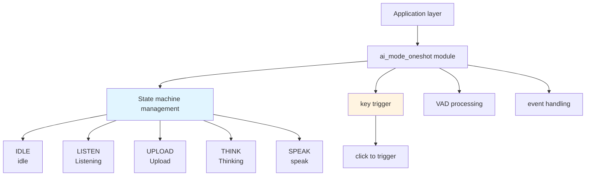
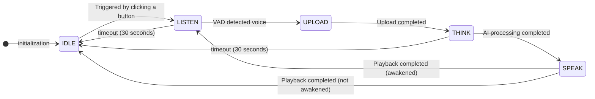
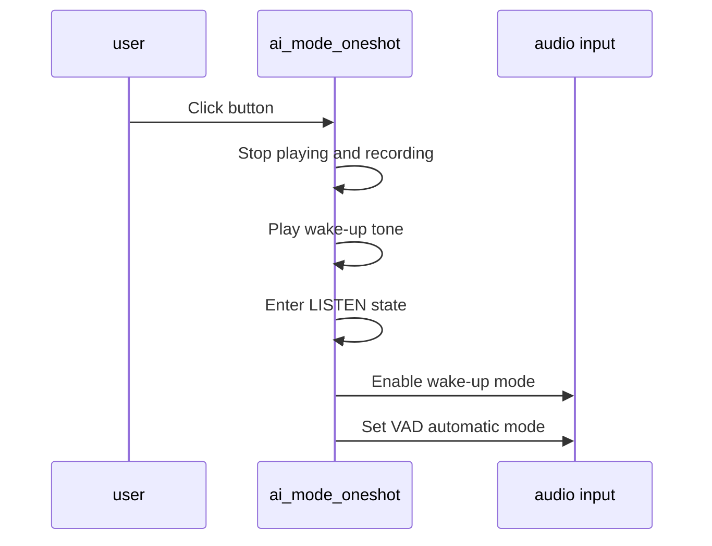
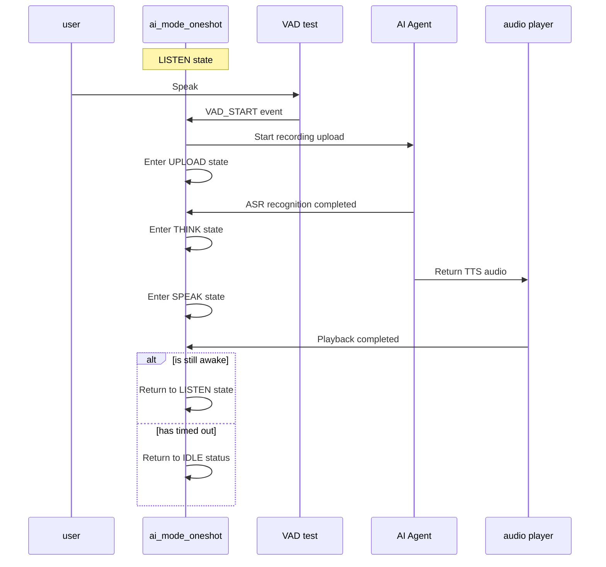

## Glossary

| Term | Description |
| ---- | ------------------------------------------------------------ |
| VAD | Voice Activity Detection (Voice Activity Detection), used to detect whether there is voice input. |

## Overview

`ai_mode_oneshot` implements one-shot mode in the TuyaOpen AI application framework and provides a quickly triggered voice interaction method. After the user taps a button, the device enters the listening state, automatically detects voice activity through VAD, and completes recording upload.

- **One-shot trigger**: Tap the button once to enter the listening state
- **Auto VAD**: Uses automatic VAD mode to detect voice activity after wake-up, without manual recording control
- **Continuous monitoring**: Enters continuous listening after wake-up and supports multi-round dialogue
- **Auto Timeout**: Automatically times out (default 30 seconds) to return to idle state after no voice activity or playback is completed
- **LED Indication**: Different states display different LED effects (LED components need to be enabled)
- Idle: LED off
- Listening: LED flashing (500ms)
- Think: LED flashing (2000ms)
- Talk: LED is always on

## Workflow

### Module architecture diagram



### State machine process

One-shot mode manages the entire interaction flow through a state machine. It starts from idle, enters listening after a button tap, and returns to listening or idle after voice interaction based on runtime status.



### Button trigger process

The user triggers one-shot mode with a button tap, and the device enters the listening state.



### Voice interaction process

After wake-up, the device automatically detects voice activity through VAD and completes one full voice interaction round.



## Configuration instructions

### Configuration file path

```
ai_components/ai_mode/Kconfig
```

### Function enable

```
menuconfig ENABLE_COMP_AI_PRESENT_MODE
    bool "enable ai present mode"
    default y

config ENABLE_COMP_AI_MODE_ONESHOT
    bool "enable ai mode oneshot"
    default y
```

### Dependent components

- **Audio Component** (`ENABLE_COMP_AI_AUDIO`): required, used for audio input and output and VAD detection
- **LED Component** (`ENABLE_LED`): optional, used for status indication
- **Button Component** (`ENABLE_BUTTON`): required, used for key trigger function

## Development process

### Interface description

#### Register one-shot mode

Register one-shot mode in the mode manager.

```c
/**
 * @brief Register oneshot mode
 * @return OPERATE_RET Operation result
 */
OPERATE_RET ai_mode_oneshot_register(void);
```

### Development steps

1. **Mode registration**: Call `ai_mode_oneshot_register()` during application startup to register one-shot mode
2. **Mode initialization**: Call `ai_mode_init(AI_CHAT_MODE_ONE_SHOT)` to initialize one-shot mode
3. **Run Mode Task**: Called in the task loop`ai_mode_task_running()`Running state machine
4. **Handling events**: Ensure that user events, VAD status changes, key events, etc. have been correctly forwarded to the mode manager

### Reference example

#### Registration and initialization

```c
#include "ai_mode_oneshot.h"
#include "ai_manage_mode.h"

// Register one-shot mode
OPERATE_RET register_oneshot_mode(void)
{
    OPERATE_RET rt = OPRT_OK;
    
// Register one-shot mode
    TUYA_CALL_ERR_RETURN(ai_mode_oneshot_register());
    
    return rt;
}

// Initialize one-shot mode
OPERATE_RET init_oneshot_mode(void)
{
    OPERATE_RET rt = OPRT_OK;
    
// Initialize one-shot mode
    TUYA_CALL_ERR_RETURN(ai_mode_init(AI_CHAT_MODE_ONE_SHOT));
    
    return rt;
}
```

#### Mode switching

```c
// Switch to one-shot mode
void switch_to_oneshot_mode(void)
{
    OPERATE_RET rt = ai_mode_switch(AI_CHAT_MODE_ONE_SHOT);
    if (OPRT_OK == rt) {
        PR_NOTICE("Switch to one-shot mode");
    } else {
        PR_ERR("Failed to switch mode: %d", rt);
    }
}
```

#### Query mode status

```c
void query_oneshot_mode_state(void)
{
    AI_MODE_STATE_E state = ai_mode_get_state();
    PR_NOTICE("Current state of one-shot mode: %s", ai_get_mode_state_str(state));
}
```

