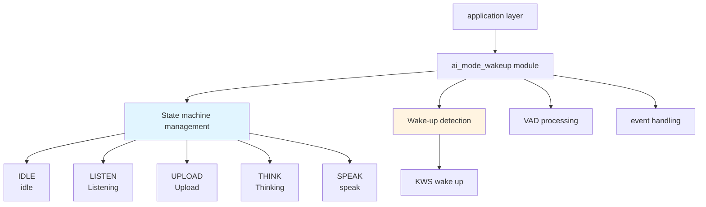
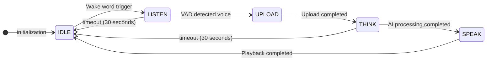
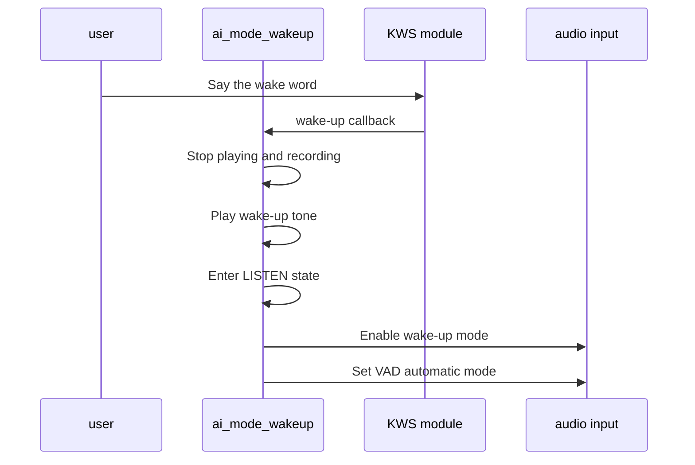
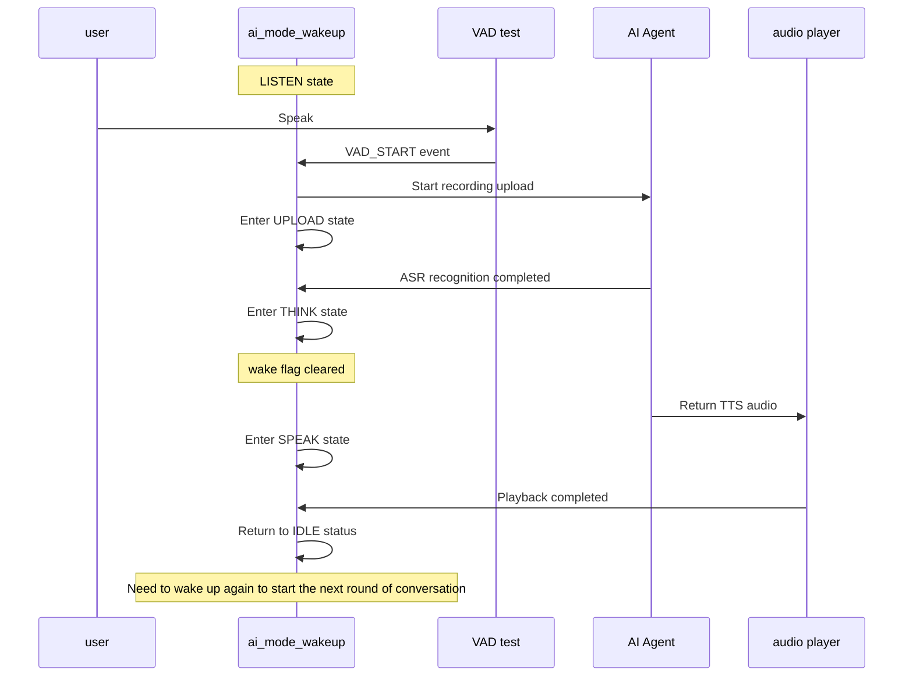

## Glossary

| Term | Description |
| ---- | ------------------------------------------------------------ |
| KWS | Keyword Spotting is used to detect specific wake words and trigger the device to enter the listening state. |
| VAD | Voice Activity Detection (Voice Activity Detection), used to detect whether there is voice input. |

## Overview

`ai_mode_wakeup` implements wake word mode in the TuyaOpen AI application framework. It provides hands-free voice interaction similar to smart speakers. After the user says a wake word, the device enters listening, detects voice activity through VAD, and uploads audio. After one conversation round, it returns to idle and requires a new wake word for the next round.

- **Wake word trigger**: Detect the wake word trigger through KWS and enter the listening state
- **Auto VAD**: Use automatic VAD mode to automatically detect voice activity after waking up, no need to manually control recording
- **Single-round dialogue**: Only supports one round of dialogue after waking up. After completing the dialogue, it will automatically return to the idle state and needs to be awakened again.
- **Auto Timeout**: Automatically times out (default 30 seconds) to return to idle state after no voice activity or playback is completed
- **LED Indication**: Different states display different LED effects (LED components need to be enabled)
- Idle: LED off
- Listening: LED flashing (500ms)
- Think: LED flashing (2000ms)
- Talk: LED is always on

## Workflow

### Module architecture diagram



### State machine process

Wake word mode manages the entire interaction process through a state machine. It starts from idle and enters listening after wake word detection. After one round of voice interaction, it returns to idle and must be triggered again for the next round.



### Wake word process

The user triggers wake word mode by speaking the wake word.



### Voice interaction process

After wake-up, the device automatically detects voice activity through VAD and returns to idle after one complete voice interaction round.



## Configuration instructions

### Configuration file path

```
ai_components/ai_mode/Kconfig
```

### Function enable

```
menuconfig ENABLE_COMP_AI_PRESENT_MODE
    bool "enable ai present mode"
    default y

config ENABLE_COMP_AI_MODE_WAKEUP
    bool "enable ai mode wakeup"
    default y
```

### Dependent components

- **Audio Component** (`ENABLE_COMP_AI_AUDIO`): required, used for audio input and output and VAD detection
- **LED Component** (`ENABLE_LED`): optional, used for status indication
- **Button Component** (`ENABLE_BUTTON`): optional, used for key wake-up function (as backup trigger method)

## Development process

### Interface description

#### Register wake word mode

Register wake word mode with the mode manager.

```c
/**
 * @brief Register wakeup mode
 * @return OPERATE_RET Operation result
 */
OPERATE_RET ai_mode_wakeup_register(void);
```

### Development steps

1. **Registration Mode**: Called when the application starts`ai_mode_wakeup_register()`Register wake word mode
2. **Initialization Mode**: Pass`ai_mode_init(AI_CHAT_MODE_WAKEUP)`Initialize wake word mode
3. **Run Mode Task**: Called in the task loop`ai_mode_task_running()`Running state machine
4. **Handling events**: Ensure that user events, VAD status changes, key events, etc. have been correctly forwarded to the mode manager

### Reference example

#### Registration and initialization

```c
#include "ai_mode_wakeup.h"
#include "ai_manage_mode.h"

//Register wake word mode
OPERATE_RET register_wakeup_mode(void)
{
    OPERATE_RET rt = OPRT_OK;
    
//Register wake word mode
    TUYA_CALL_ERR_RETURN(ai_mode_wakeup_register());
    
    return rt;
}

//Initialize wake word mode
OPERATE_RET init_wakeup_mode(void)
{
    OPERATE_RET rt = OPRT_OK;
    
//Initialize wake word mode
    TUYA_CALL_ERR_RETURN(ai_mode_init(AI_CHAT_MODE_WAKEUP));
    
    return rt;
}
```

#### Mode switching

```c
//Switch to wake word mode
void switch_to_wakeup_mode(void)
{
    OPERATE_RET rt = ai_mode_switch(AI_CHAT_MODE_WAKEUP);
    if (OPRT_OK == rt) {
        PR_NOTICE("Switch to wake word mode");
    } else {
        PR_ERR("Failed to switch mode: %d", rt);
    }
}
```

#### Query mode status

```c
void query_wakeup_mode_state(void)
{
    AI_MODE_STATE_E state = ai_mode_get_state();
    PR_NOTICE("Current state of wake word mode: %s", ai_get_mode_state_str(state));
}
```

