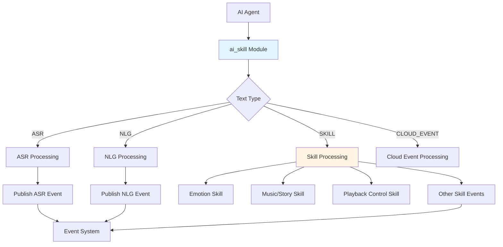
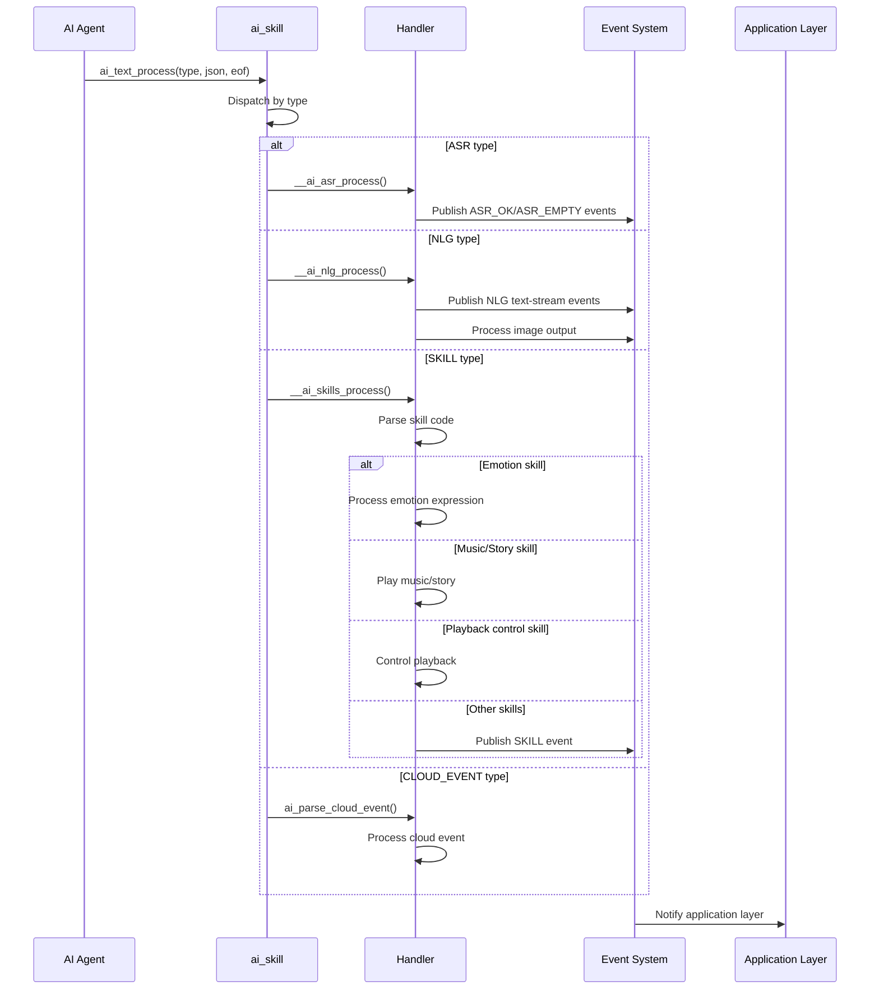
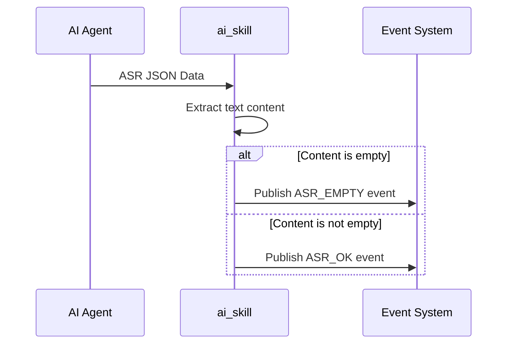
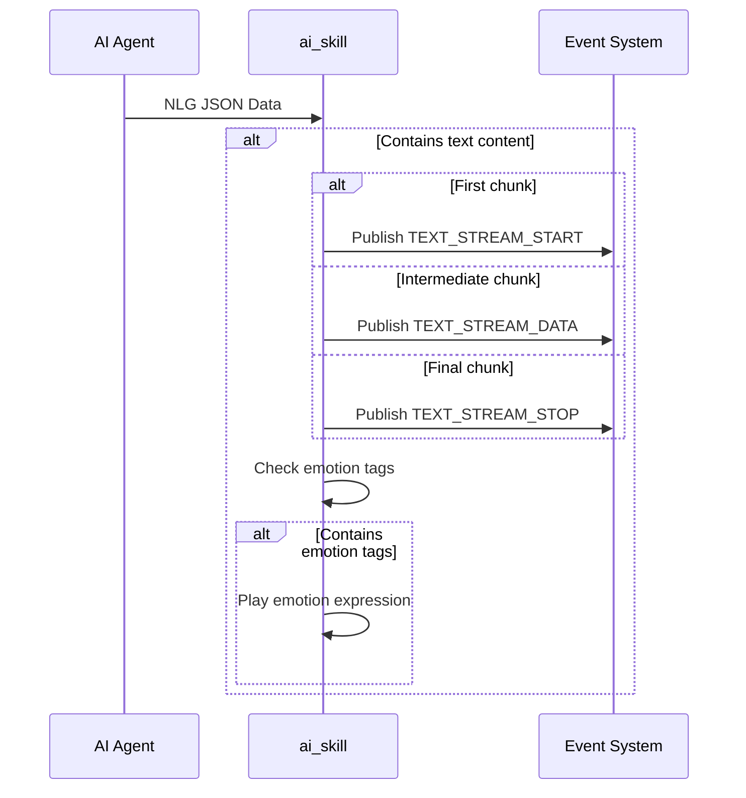
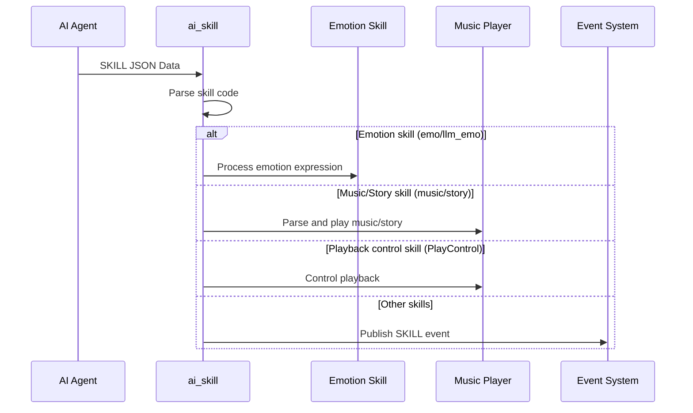

## Glossary

| Term | Description |
| ---- | ----------- |
| ASR  | Automatic Speech Recognition, a technology that converts a user's speech input into text. |
| NLG  | Natural Language Generation, a technology that converts structured data or intent into natural-language text. |
| Skill | A capability command returned by the AI model, including emotion expression, music playback, story playback, playback control, and more. |
| Cloud event | An event proactively pushed by the cloud to control device behavior, such as TTS playback. |

## Overview

`ai_skill` is the text-processing component in the TuyaOpen AI application framework. It handles multiple text payloads from `ai_agent`, including ASR results, NLG-generated text, skill commands, and cloud events. Based on the text type, the module dispatches processing, then triggers corresponding user events or executes related actions.

### Core Capabilities

- **ASR processing**: Processes speech recognition results and publishes ASR events to the application layer.
- **NLG processing**: Processes natural-language text streams and supports streaming text output.
- **Skill processing**: Parses and executes skill instructions, including emotion skills, music/story skills, and playback-control skills.
- **Cloud event processing**: Processes cloud-pushed events such as TTS playback commands.
- **Event notification**: Notifies the application layer of text-processing results through the event system.

## Workflow

### Module Architecture



### Text Processing Flow

After `ai_agent` receives text data, it dispatches the payload to the corresponding handler based on the text type.



### ASR Processing Flow

Processes speech recognition results and publishes corresponding events based on whether recognized content is empty.



### NLG Processing Flow

Processes natural-language text streams and supports both streaming text output and image output.



### Skill Processing Flow

Parses skill codes and performs corresponding operations based on the skill type.



### Dependency Components

- **Audio component** (`ENABLE_COMP_AI_AUDIO`): Optional; required for music/story skills and playback-control skills.

## Skill Module Details

The `ai_skill` module includes the following submodules for different skill and event types:

### Emotion

An emotion-skill processing module that parses and handles emotion-expression instructions returned by the AI model.

- **Function**: Parses emotion-skill JSON payloads, extracts emotion tags and emojis, and publishes emotion events to the application layer.
- **Supported emotion types**: Includes neutral, happy, laughing, sad, angry, fear, love, awkward, surprised, shocked, thinking, wink, cool, relaxed, delicious, kiss, confident, sleepy, silly, confused, and more.

### Music/Story

A music/story skill-processing module responsible for parsing and playing music or story content.

- **Function**: Parses music/story skill JSON payloads, builds playlists, and invokes the audio player for playback.
- **Supported operations**: Play, pause, resume, stop, previous, next, replay, single-track loop, ordered loop, and other playback controls.

### Cloud event processing

A cloud-event processing module responsible for handling event commands proactively pushed by the cloud.

- **Function**: Parses cloud-event JSON data and processes TTS playback instructions (`playTts` and `alert`).
- **Supported event types**: TTS playback (`playTts`) and prompt-tone playback (`alert`).
- **Features**: Supports TTS URL playback, background-music playback, and multiple audio formats (MP3, WAV, SPEEX, OPUS, OGGOPUS).

## Development Flow

### Data Structures

#### Text Types

```c
typedef uint8_t AI_TEXT_TYPE_E;
#define AI_TEXT_ASR 0x00          // ASR text
#define AI_TEXT_NLG 0x01          // NLG text
#define AI_TEXT_SKILL 0x02         // Skill data
#define AI_TEXT_OTHER 0x03         // Other text
#define AI_TEXT_CLOUD_EVENT 0x04   // Cloud event
```

#### Text Notification Structure

```c
typedef struct {
    char *data;           // Text data
    uint32_t datalen;     // Data length
    uint32_t timeindex;   // Time index
} AI_NOTIFY_TEXT_T;
```

### API Description

#### Process Text Data

Processes text data from `ai_agent` by text type.

```c
/**
 * @brief Process AI text data based on type
 * @param type Text type (ASR, NLG, SKILL, CLOUD_EVENT)
 * @param root JSON root object containing text data
 * @param eof End of file flag indicating if this is the last data chunk
 * @return OPERATE_RET Operation result code
 */
OPERATE_RET ai_text_process(AI_TEXT_TYPE_E type, cJSON *root, bool eof);
```

### Development Steps

1. **Ensure dependent components are initialized**: If music/story skills are enabled, ensure the audio player is initialized.
2. **Register text callbacks**: During `ai_agent` initialization, ensure text callbacks are properly registered.
3. **Handle events**: Subscribe to corresponding user events (ASR, NLG, SKILL, etc.) in the application layer to process text-handling results.

### Reference Examples

#### Handle ASR Results

```c
#include "ai_user_event.h"

// Subscribe to ASR events
void handle_asr_event(AI_NOTIFY_EVENT_T *event)
{
    if (event->type == AI_USER_EVT_ASR_OK) {
        AI_NOTIFY_TEXT_T *text = (AI_NOTIFY_TEXT_T *)event->data;
        PR_NOTICE("ASR recognition result: %s", text->data);
    } else if (event->type == AI_USER_EVT_ASR_EMPTY) {
        PR_NOTICE("ASR recognition result is empty");
    }
}
```

#### Handle NLG Text Stream

```c
// Subscribe to NLG text-stream events
void handle_nlg_stream(AI_NOTIFY_EVENT_T *event)
{
    AI_NOTIFY_TEXT_T *text = (AI_NOTIFY_TEXT_T *)event->data;
    
    switch (event->type) {
        case AI_USER_EVT_TEXT_STREAM_START:
            PR_NOTICE("NLG text stream started");
            break;
        case AI_USER_EVT_TEXT_STREAM_DATA:
            PR_NOTICE("NLG text data: %s", text->data);
            break;
        case AI_USER_EVT_TEXT_STREAM_STOP:
            PR_NOTICE("NLG text stream ended");
            break;
        default:
            break;
    }
}
```

#### Handle Skill Events

```c
// Subscribe to skill events
void handle_skill_event(AI_NOTIFY_EVENT_T *event)
{
    if (event->type == AI_USER_EVT_SKILL) {
        cJSON *skill_data = (cJSON *)event->data;
        PR_NOTICE("Received skill data");
        
        // Parse and handle custom skills
        // ...
    }
}
```