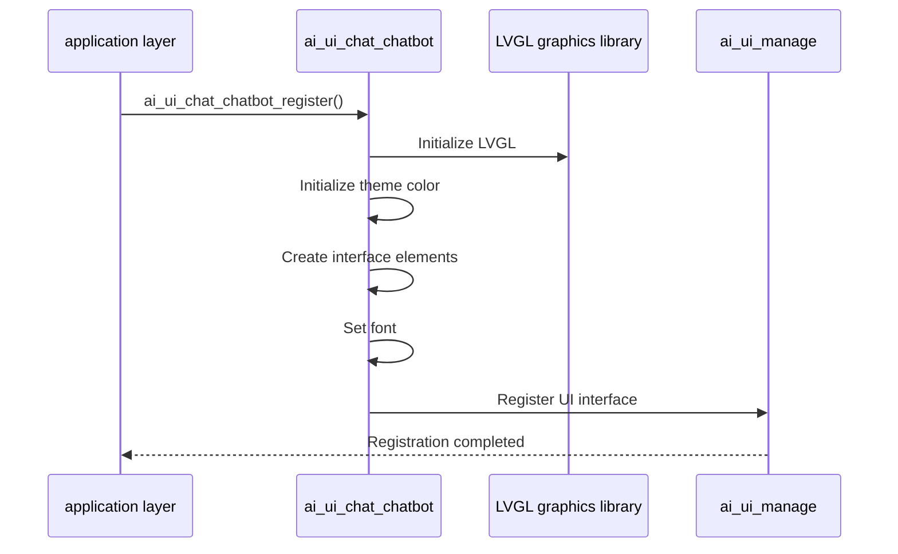
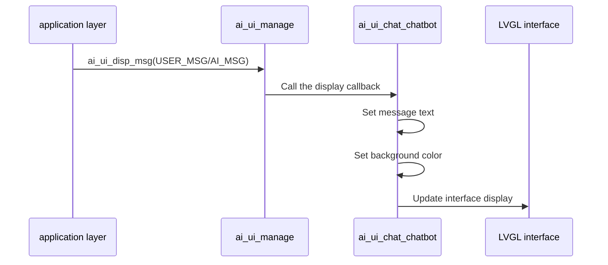
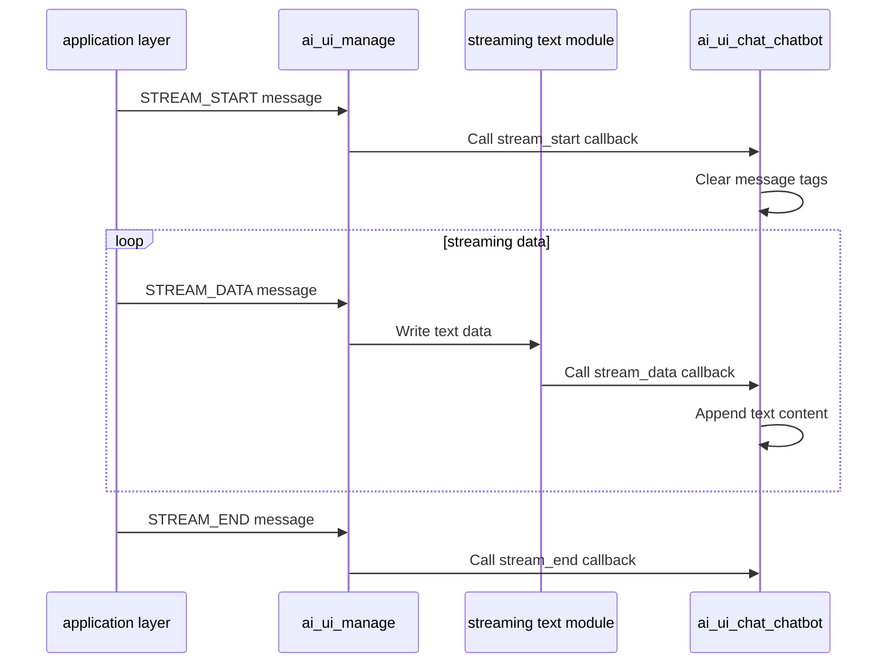

## Glossary

| Term | Description |
| ---- | ------------------------------------------------------------ |
| LVGL | Light and Versatile Graphics Library, a free and open source graphics library for creating embedded graphical user interfaces. |

## Overview

`ai_ui_chat_chatbot` is a chatbot-style UI implementation in the TuyaOpen AI application framework, built on the LVGL graphics library. This module implements all UI interfaces defined by `ai_ui_manage` and provides simple chat UI features, including message display, emotion display, and status display.

- **Chatbot style interface**: Messages are displayed in the center. User messages use a green background, AI messages use white, and system messages use gray.
- **Theme support**: Supports light themes and can be extended to dark themes
- **Emotion display**: Supports displaying emotion icons in the center of the content area

## Workflow

### Initialization process

When the module is initialized, the LVGL graphics library is initialized, interface elements are created, theme colors and fonts are set, and registered to the UI management module.



### Message display process

After user messages or AI messages are sent through the UI management module, the message content and background color are updated in the center of the chat interface.



### Streaming text display process

After the AI ​​message flow is processed by the streaming text module, the text content in the chat interface is updated in real time.



## Configuration instructions

### Configuration file path

```
ai_components/ai_ui/Kconfig
```

### Function enable

```
menuconfig ENABLE_COMP_AI_DISPLAY
    bool "enable ai chat display ui"
    default y

config ENABLE_AI_CHAT_GUI_CHATBOT
    select ENABLE_LIBLVGL
    bool "Use Chatbot ui"
# To enable chatbot style UI, you need to rely on the LVGL graphics library

config ENABLE_CIRCLE_UI_STYLE
    depends on ENABLE_AI_CHAT_GUI_CHATBOT
    bool "Enable circle ui style"
    default n
# Enable circular UI style (leave blank on the left and right sides of the status bar)
```

### Dependent components

- **LVGL graphics library** (`ENABLE_LIBLVGL`): required, used for graphical interface rendering

## Development process

### Interface description

#### Register chatbot style UI

Register the chatbot style UI implementation into the UI management module.

```c
/**
 * @brief Register chatbot-style chat UI implementation
 * @return OPERATE_RET Operation result code
 */
OPERATE_RET ai_ui_chat_chatbot_register(void);
```

### Development steps

1. **Make sure dependent components are initialized**: Make sure the LVGL graphics library and display device are initialized correctly
2. **Registration UI implementation**: called when the application starts`ai_ui_chat_chatbot_register()`Register chatbot style UI
3. **Initialize UI management module**: call`ai_ui_init()`Initialize the UI management module (the registered initialization callback will be automatically called)
4. **Send display message**: Pass`ai_ui_disp_msg()`Send various types of display messages

### Reference example

#### Registration and initialization

```c
#include "ai_ui_chat_chatbot.h"
#include "ai_ui_manage.h"

//Register chatbot style UI
OPERATE_RET init_chatbot_ui(void)
{
    OPERATE_RET rt = OPRT_OK;
    
//Register chatbot style UI implementation
    TUYA_CALL_ERR_RETURN(ai_ui_chat_chatbot_register());
    
// Initialize the UI management module (the registered initialization callback will be automatically called)
    TUYA_CALL_ERR_RETURN(ai_ui_init());
    
    return rt;
}
```

#### Show message

```c
//Display user messages
void display_user_message(const char *msg)
{
    ai_ui_disp_msg(AI_UI_DISP_USER_MSG, (uint8_t *)msg, strlen(msg));
}

//Display AI message
void display_ai_message(const char *msg)
{
    ai_ui_disp_msg(AI_UI_DISP_AI_MSG, (uint8_t *)msg, strlen(msg));
}

//Display system messages
void display_system_message(const char *msg)
{
    ai_ui_disp_msg(AI_UI_DISP_SYSTEM_MSG, (uint8_t *)msg, strlen(msg));
}
```

