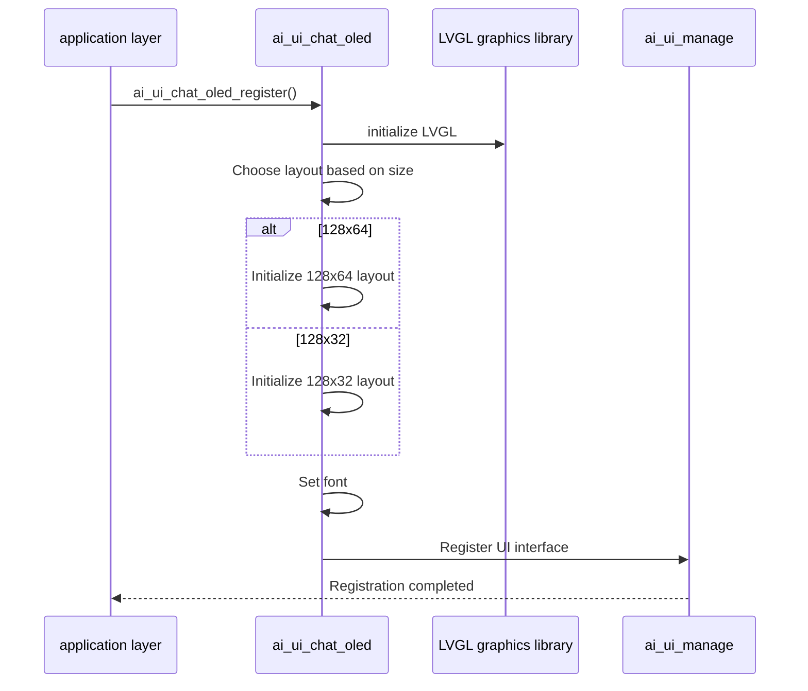
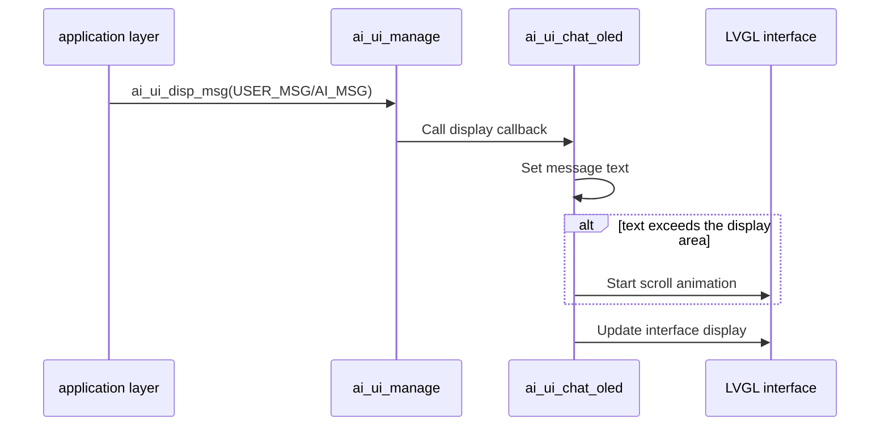
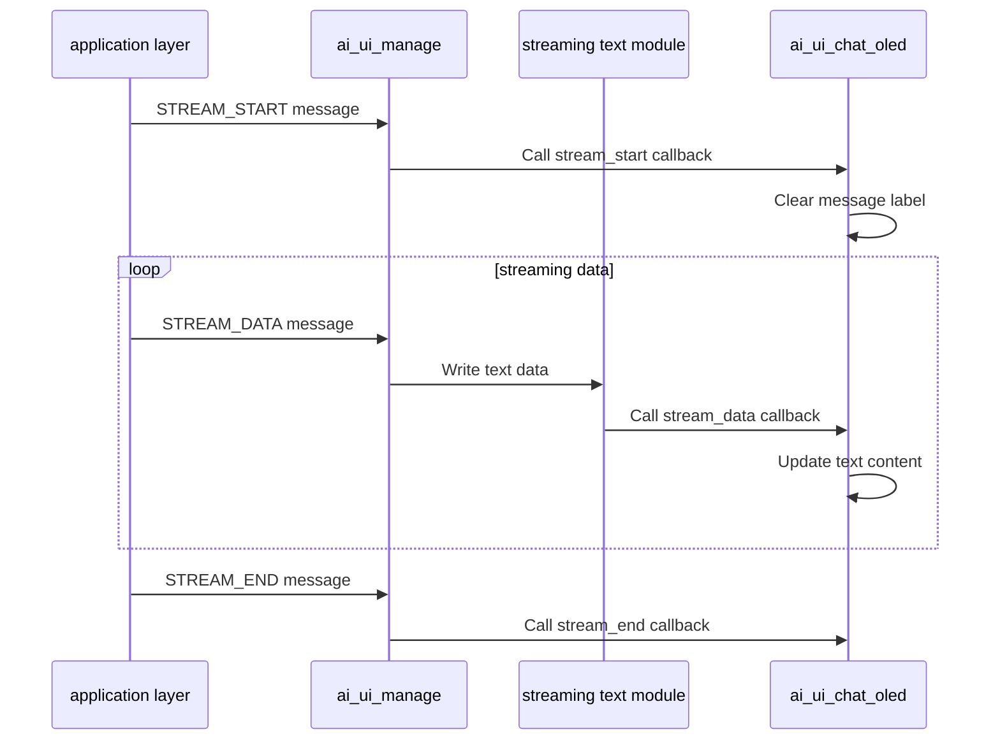

## Glossary

| Term | Description |
| ---- | ------------------------------------------------------------ |
| LVGL | Light and Versatile Graphics Library, a free and open source graphics library for creating embedded graphical user interfaces. |
| OLED | Organic Light-Emitting Diode (Organic Light-Emitting Diode) display, a self-illuminating display technology, has the characteristics of high contrast and low power consumption. |

## Overview

`ai_ui_chat_oled` is an OLED chat UI implementation in the TuyaOpen AI application framework, built on the LVGL graphics library. This module implements all UI interfaces defined by `ai_ui_manage`, is optimized for small OLED screens, and supports 128x64 and 128x32 resolutions.

- **Multi-resolution support**: Supports 128x64 and 128x32 OLED resolutions and automatically selects the layout based on configuration
- **Compact Layout**: Optimized for small screens and rationally utilizing limited display space

## Workflow

### Initialization process

When the module initializes, it selects the corresponding initialization function based on configured OLED size, creates UI elements, and registers them with the UI management module.



### Message display process

After the user message or AI message is sent through the UI management module, the message content is updated in the OLED interface, and the long text is automatically scrolled and displayed.



### Streaming text display process

After the AI ​​message flow is processed by the streaming text module, the text content in the OLED interface is updated in real time.



## Configuration instructions

### Configuration file path

```
ai_components/ai_ui/Kconfig
```

### Function enable

```
menuconfig ENABLE_COMP_AI_DISPLAY
    bool "enable ai chat display ui"
    default y

config ENABLE_AI_CHAT_GUI_OLED
    select ENABLE_LIBLVGL
    bool "Use OLED ui"
# To enable OLED UI, you need to rely on the LVGL graphics library

choice AI_CHAT_GUI_OLED_SIZE
    prompt "choose oled ui size"
    default AI_CHAT_GUI_OLED_SIZE_128_64
    
    config AI_CHAT_GUI_OLED_SIZE_128_64
        bool "OLED size 128x64"
# 128x64 pixel OLED display
    
    config AI_CHAT_GUI_OLED_SIZE_128_32
        bool "OLED size 128x32"
# 128x32 pixel OLED display
endchoice
```

### Dependent components

- **LVGL graphics library** (`ENABLE_LIBLVGL`): required, used for graphical interface rendering

## Development process

### Interface description

#### Register OLED UI

Register the OLED UI implementation with the UI management module.

```c
/**
 * @brief Register OLED chat UI implementation
 * @return OPERATE_RET Operation result code
 */
OPERATE_RET ai_ui_chat_oled_register(void);
```

### Development steps

1. **Make sure dependent components are initialized**: Make sure the LVGL graphics library and OLED display device are initialized correctly
2. **Configure OLED size**: Select the corresponding OLED size (128x64 or 128x32) in Kconfig
3. **Register UI implementation**: At startup, call `ai_ui_chat_oled_register()` to register the OLED UI
4. **Initialize UI management module**: call`ai_ui_init()`Initialize the UI management module (the registered initialization callback will be automatically called)
5. **Send display message**: Passed`ai_ui_disp_msg()`Send various types of display messages

### Reference example

#### Registration and initialization

```c
#include "ai_ui_chat_oled.h"
#include "ai_ui_manage.h"

//Register OLED UI
OPERATE_RET init_oled_ui(void)
{
    OPERATE_RET rt = OPRT_OK;
    
//Register OLED UI implementation
    TUYA_CALL_ERR_RETURN(ai_ui_chat_oled_register());
    
// Initialize the UI management module (the registered initialization callback will be automatically called)
    TUYA_CALL_ERR_RETURN(ai_ui_init());
    
    return rt;
}
```

#### Show message

```c
//Display user messages
void display_user_message(const char *msg)
{
    ai_ui_disp_msg(AI_UI_DISP_USER_MSG, (uint8_t *)msg, strlen(msg));
}

//Display AI message
void display_ai_message(const char *msg)
{
    ai_ui_disp_msg(AI_UI_DISP_AI_MSG, (uint8_t *)msg, strlen(msg));
}

//Display system messages
void display_system_message(const char *msg)
{
    ai_ui_disp_msg(AI_UI_DISP_SYSTEM_MSG, (uint8_t *)msg, strlen(msg));
}
```

