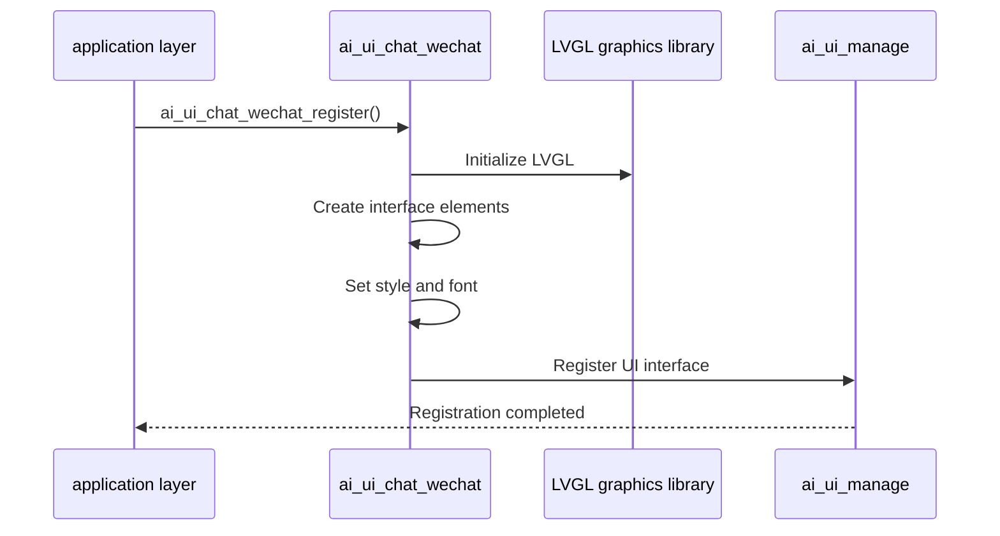
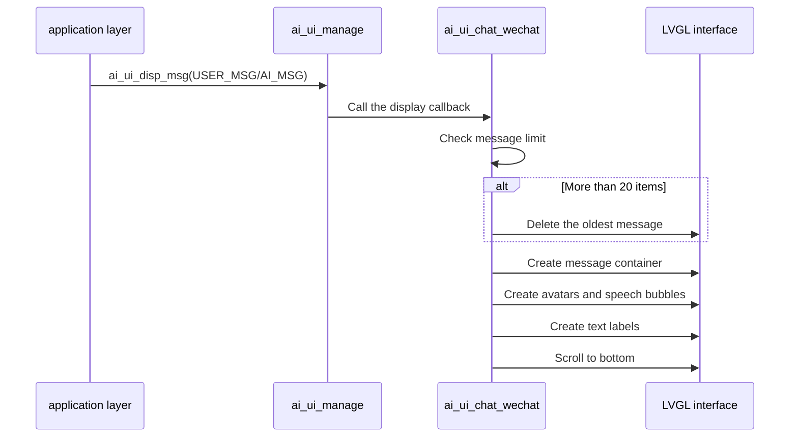
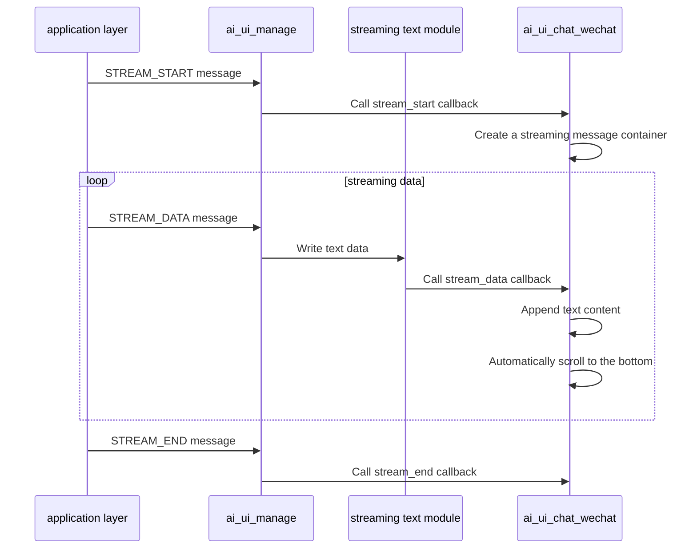

## Glossary

| Term | Description |
| ---- | ------------------------------------------------------------ |
| LVGL | Light and Versatile Graphics Library, a free and open source graphics library for creating embedded graphical user interfaces. |
| Bubble style | Similar to WeChat chat message display style, user messages and AI messages are displayed on the right and left respectively, with rounded background and shadow effect. |

## Overview

`ai_ui_chat_wechat` is a WeChat-style chat UI implementation in the TuyaOpen AI application framework, built on the LVGL graphics library. This module implements all UI interfaces defined by `ai_ui_manage` and provides complete chat UI features, including message display, emotion display, status display, camera view, and picture display.

- **WeChat style interface**: adopts a bubble style similar to WeChat chat, with user messages displayed on the right (green bubble) and AI messages displayed on the left (white bubble)
- **Message management**: Supports up to 20 messages and automatically removes the oldest message when the limit is exceeded
- **Streaming text display**: Supports streaming AI message display and updates text in real time
- **Camera display**: Supports full-screen display of camera images
- **Picture display**: Supports image display, tap-to-enlarge, and automatic return to the chat interface after 3 seconds

## Workflow

### Initialization process

When the module is initialized, the LVGL graphics library is initialized, interface elements are created, styles and fonts are set, and registered to the UI management module.



### Message display process

After user messages or AI messages are sent through the UI management module, corresponding bubbles and text labels are created in the chat interface.



### Streaming text display process

After the AI ​​message flow is processed by the streaming text module, the text content in the chat interface is updated in real time.



## Configuration instructions

### Configuration file path

```
ai_components/ai_ui/Kconfig
```

### Function enable

```
menuconfig ENABLE_COMP_AI_DISPLAY
    bool "enable ai chat display ui"
    default y

config ENABLE_AI_CHAT_GUI_WECHAT
    select ENABLE_LIBLVGL
    bool "Use WeChat-like ui"
# To enable WeChat style UI, you need to rely on the LVGL graphics library
```

### Dependent components

- **LVGL graphics library** (`ENABLE_LIBLVGL`): required, used for graphical interface rendering
- **Video Component**(`ENABLE_COMP_AI_VIDEO`): optional, used for camera screen display
- **Picture Component** (`ENABLE_COMP_AI_PICTURE`): optional, used for picture display function

## Development process

### Interface description

#### Register WeChat style UI

Register the WeChat style UI implementation into the UI management module.

```c
/**
 * @brief Register WeChat-style chat UI implementation
 * @return OPERATE_RET Operation result code
 */
OPERATE_RET ai_ui_chat_wechat_register(void);
```

### Development steps

1. **Make sure dependent components are initialized**: Make sure the LVGL graphics library and display device are initialized correctly
2. **Registration UI implementation**: called when the application starts`ai_ui_chat_wechat_register()`Register WeChat style UI
3. **Initialize UI management module**: call`ai_ui_init()`Initialize the UI management module (the registered initialization callback will be automatically called)
4. **Send display message**: Pass`ai_ui_disp_msg()`Send various types of display messages

### Reference example

#### Registration and initialization

```c
#include "ai_ui_chat_wechat.h"
#include "ai_ui_manage.h"

//Register WeChat style UI
OPERATE_RET init_wechat_ui(void)
{
    OPERATE_RET rt = OPRT_OK;
    
//Register WeChat style UI implementation
    TUYA_CALL_ERR_RETURN(ai_ui_chat_wechat_register());
    
// Initialize the UI management module (the registered initialization callback will be automatically called)
    TUYA_CALL_ERR_RETURN(ai_ui_init());
    
    return rt;
}
```

#### Show message

```c
//Display user messages
void display_user_message(const char *msg)
{
    ai_ui_disp_msg(AI_UI_DISP_USER_MSG, (uint8_t *)msg, strlen(msg));
}

//Display AI message
void display_ai_message(const char *msg)
{
    ai_ui_disp_msg(AI_UI_DISP_AI_MSG, (uint8_t *)msg, strlen(msg));
}

//Display mode status
void display_mode_state(const char *state)
{
    ai_ui_disp_msg(AI_UI_DISP_STATUS, (uint8_t *)state, strlen(state));
}
```


