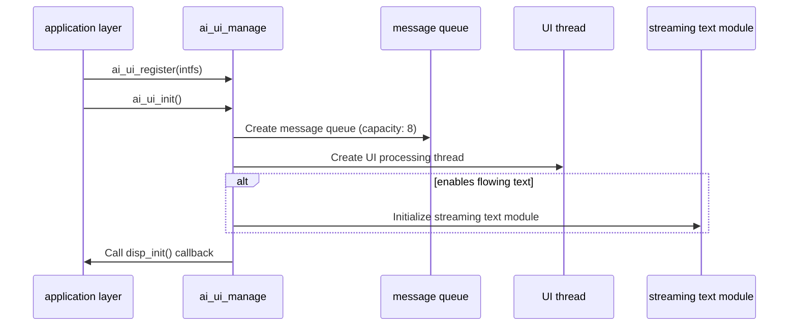
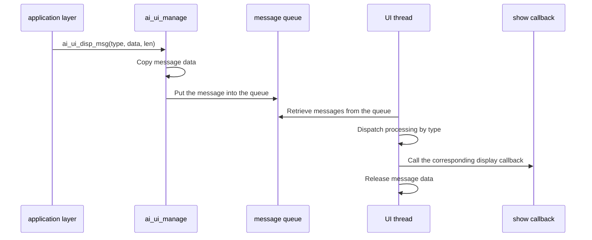
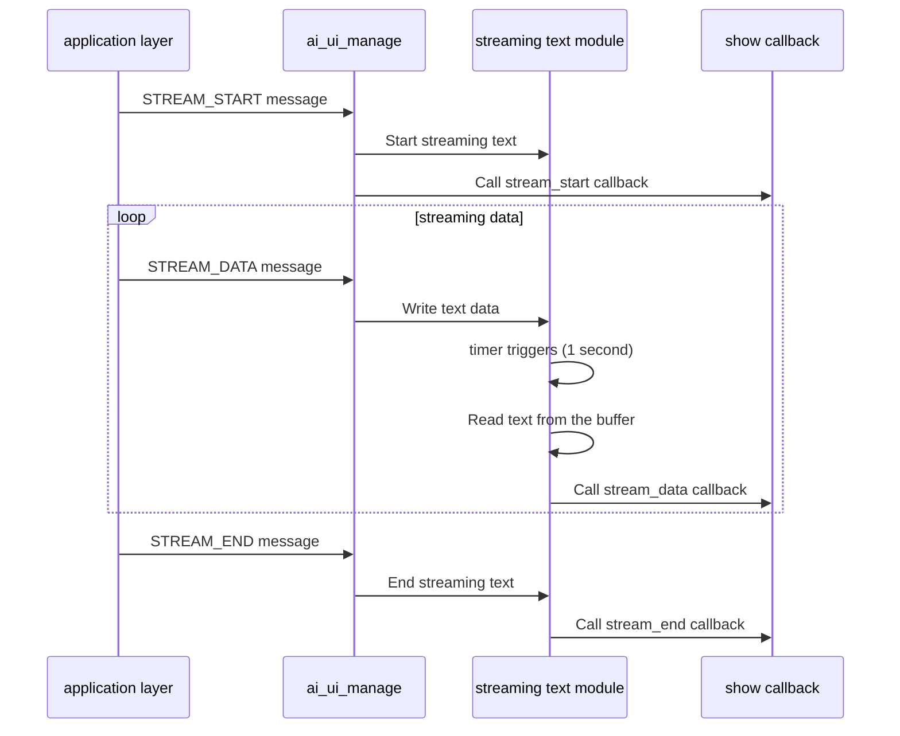

## Glossary

| Term | Description |
| ---- | ------------------------------------------------------------ |
| UI | User Interface (User Interface), all interfaces that users can see and operate are called UI. |
| Streaming text | Text displayed incrementally in real time to present AI-generated content more smoothly. |

## Overview

`ai_ui_manage` is the UI management component in the TuyaOpen AI application framework. It provides unified management and dispatch of UI messages. This module uses a message queue and an independent thread for asynchronous message processing and supports multiple display types, including user messages, AI messages, streaming text, system messages, emotion, status, notifications, network state, and chat mode.

- **Multi-type display support**: Supports user messages, AI messages, streaming text, system messages, emotions, status, notifications, and more.
- **Streaming text display**: Supports streaming text display function, displaying AI-generated text content verbatim (optional function)
- **Camera Display**: Supports the startup, refresh and end of camera images
- **Picture Display**: Supports picture display function (picture component needs to be enabled)
- **Interface registration mechanism**: Allows the application layer to implement display logic by registering callback handlers

## Workflow

### Initialization process

When the module is initialized, the message queue and UI processing threads are created, the streaming text module (if enabled) is initialized, and the registered initialization callback is called.



### Message processing process

After the application layer sends the display message, the message is put into the queue, and the UI thread takes the message from the queue and calls the corresponding display callback.



### Streaming text display process

After streaming text is enabled, AI message streams are processed through the streaming-text module for incremental display.



## Configuration instructions

### Configuration file path

```
ai_components/ai_ui/Kconfig
```

### Function enable

```
menuconfig ENABLE_COMP_AI_DISPLAY
    bool "enable ai chat display ui"
    default y
# Whether to enable AI chat display UI

config ENABLE_AI_UI_TEXT_STREAMING
    bool "enable ui ai msg text streaming display"
    default n
# Whether to enable the streaming text display function, after enabling the AI ​​message will be displayed verbatim
```

### Dependent components

- **Picture Component** (`ENABLE_COMP_AI_PICTURE`): optional, used for picture display function

## Development process

### Data structure

#### Display type

```c
typedef enum {
AI_UI_DISP_USER_MSG, // User message
AI_UI_DISP_AI_MSG, // AI message
AI_UI_DISP_AI_MSG_STREAM_START, // AI message flow starts
AI_UI_DISP_AI_MSG_STREAM_DATA, // AI message stream data
AI_UI_DISP_AI_MSG_STREAM_END, // AI message flow ends
AI_UI_DISP_AI_MSG_STREAM_INTERRUPT, // AI message flow interruption
AI_UI_DISP_SYSTEM_MSG, // system message
AI_UI_DISP_EMOTION, // Emotional expression
AI_UI_DISP_STATUS, // status display
AI_UI_DISP_NOTIFICATION, // notification
AI_UI_DISP_NETWORK, // Network status
AI_UI_DISP_CHAT_MODE, // Chat mode
    AI_UI_DISP_SYS_MAX,
} AI_UI_DISP_TYPE_E;
```

#### Network status

```c
typedef uint8_t AI_UI_WIFI_STATUS_E;
#define AI_UI_WIFI_STATUS_DISCONNECTED 0 // Not connected
#define AI_UI_WIFI_STATUS_GOOD 1 // signal is good
#define AI_UI_WIFI_STATUS_FAIR 2 // The signal is normal
#define AI_UI_WIFI_STATUS_WEAK 3 // The signal is weak
```

#### UI abstract interface

```c
typedef struct {
OPERATE_RET (*disp_init)(void); // Initialization callback
void (*disp_user_msg)(char* string); // User message display
void (*disp_ai_msg)(char* string); // AI message display
void (*disp_ai_msg_stream_start)(void); // AI message flow starts
void (*disp_ai_msg_stream_data)(char *string); // AI message stream data
void (*disp_ai_msg_stream_end)(void); // AI message stream ends
void (*disp_system_msg)(char *string); // System message display
void (*disp_emotion)(char *emotion); // Emotion display
void (*disp_ai_mode_state)(char *string); // Mode status display
void (*disp_notification)(char *string); // Notification display
void (*disp_wifi_state)(AI_UI_WIFI_STATUS_E wifi_status); // WiFi status display
void (*disp_ai_chat_mode)(char *string); // Chat mode display
void (*disp_other_msg)(uint32_t type, uint8_t *data, int len); // Other messages are displayed
    
OPERATE_RET (*disp_camera_start)(uint16_t width, uint16_t height); // Camera display starts
OPERATE_RET (*disp_camera_flush)(uint8_t *data, uint16_t width, uint16_t height); // Camera frame refresh
OPERATE_RET (*disp_camera_end)(void); // Camera display ends
    
#if defined(ENABLE_COMP_AI_PICTURE) && (ENABLE_COMP_AI_PICTURE == 1)
    OPERATE_RET (*disp_picture)(TUYA_FRAME_FMT_E fmt, uint16_t width, uint16_t height,
uint8_t *data, uint32_t len); // Picture display
#endif
} AI_UI_INTFS_T;
```

### Interface description

#### Register UI interface

Register the UI display interface callback function, and the application layer needs to implement the corresponding display logic.

```c
/**
 * @brief Register UI interface callbacks
 * @param intfs Pointer to the UI interface structure containing callback functions
 * @return OPERATE_RET Operation result code
 */
OPERATE_RET ai_ui_register(AI_UI_INTFS_T *intfs);
```

#### Initialize UI module

Initialize the UI management module, create message queue and processing thread.

```c
/**
 * @brief Initialize AI UI module
 * @return OPERATE_RET Operation result code
 */
OPERATE_RET ai_ui_init(void);
```

#### Show message

Send display messages to the UI module, and the messages will be put into the queue for asynchronous processing.

```c
/**
 * @brief Display message on UI
 * @param tp Display type indicating the message category
 * @param data Pointer to the message data
 * @param len Length of the message data
 * @return OPERATE_RET Operation result code
 */
OPERATE_RET ai_ui_disp_msg(AI_UI_DISP_TYPE_E tp, uint8_t *data, int len);
```

#### Camera display

Start, refresh and end camera screen display.

```c
/**
 * @brief Start camera display
 * @param width Camera frame width
 * @param height Camera frame height
 * @return OPERATE_RET Operation result code
 */
OPERATE_RET ai_ui_camera_start(uint16_t width, uint16_t height);

/**
 * @brief Flush camera frame data to display
 * @param data Pointer to the camera frame data
 * @param width Frame width
 * @param height Frame height
 * @return OPERATE_RET Operation result code
 */
OPERATE_RET ai_ui_camera_flush(uint8_t *data, uint16_t width, uint16_t height);

/**
 * @brief End camera display
 * @return OPERATE_RET Operation result code
 */
OPERATE_RET ai_ui_camera_end(void);
```

#### Picture display

Display image data (image component needs to be enabled).

```c
#if defined(ENABLE_COMP_AI_PICTURE) && (ENABLE_COMP_AI_PICTURE == 1)
/**
 * @brief Display picture on UI
 * @param fmt Picture frame format
 * @param width Picture width
 * @param height Picture height
 * @param data Pointer to the picture data
 * @param len Length of the picture data
 * @return OPERATE_RET Operation result code
 */
OPERATE_RET ai_ui_disp_picture(TUYA_FRAME_FMT_E fmt, uint16_t width, uint16_t height,
                                uint8_t *data, uint32_t len);
#endif
```

### Development steps

1. **Register UI interface**: called when the application starts`ai_ui_register()`Register UI display interface callback function
2. **Initialization module**: call`ai_ui_init()`Initialize UI management module
3. **Send display message**: Pass`ai_ui_disp_msg()`Send various types of display messages
4. **Implement display callback**: Implement specific display logic in the registered interface callback function

### Reference example

#### Registration and initialization

```c
#include "ai_ui_manage.h"

//User message display callback
void disp_user_msg_cb(char* string)
{
    PR_NOTICE("Display user message: %s", string);
    // Implement specific display logic
}

//AI message display callback
void disp_ai_msg_cb(char* string)
{
    PR_NOTICE("Display AI message: %s", string);
    // Implement specific display logic
}

// Streaming text data callback
void disp_ai_msg_stream_data_cb(char *string)
{
    PR_NOTICE("Display streaming text: %s", string);
    // Implement specific display logic
}

//Initialization callback
OPERATE_RET disp_init_cb(void)
{
    PR_NOTICE("UI initialization");
    //Initialize display device
    return OPRT_OK;
}

//Register UI interface
OPERATE_RET register_ui_interfaces(void)
{
    AI_UI_INTFS_T intfs = {
        .disp_init = disp_init_cb,
        .disp_user_msg = disp_user_msg_cb,
        .disp_ai_msg = disp_ai_msg_cb,
        .disp_ai_msg_stream_start = NULL,
        .disp_ai_msg_stream_data = disp_ai_msg_stream_data_cb,
        .disp_ai_msg_stream_end = NULL,
// ... other callback functions
    };
    
    TUYA_CALL_ERR_RETURN(ai_ui_register(&intfs));
    TUYA_CALL_ERR_RETURN(ai_ui_init());
    
    return OPRT_OK;
}
```

#### Send display message

```c
//Display user messages
void display_user_message(const char *msg)
{
    ai_ui_disp_msg(AI_UI_DISP_USER_MSG, (uint8_t *)msg, strlen(msg));
}

//Display AI message
void display_ai_message(const char *msg)
{
    ai_ui_disp_msg(AI_UI_DISP_AI_MSG, (uint8_t *)msg, strlen(msg));
}

//Display mode status
void display_mode_state(const char *state)
{
    ai_ui_disp_msg(AI_UI_DISP_STATUS, (uint8_t *)state, strlen(state));
}

//Display network status
void display_wifi_status(AI_UI_WIFI_STATUS_E status)
{
    ai_ui_disp_msg(AI_UI_DISP_NETWORK, (uint8_t *)&status, sizeof(status));
}
```

#### Camera display

```c
// Start camera display
void start_camera_display(void)
{
    ai_ui_camera_start(480, 480);
}

// Refresh camera frames
void flush_camera_frame(uint8_t *frame_data, uint16_t width, uint16_t height)
{
    ai_ui_camera_flush(frame_data, width, height);
}

//End camera display
void end_camera_display(void)
{
    ai_ui_camera_end();
}
```

