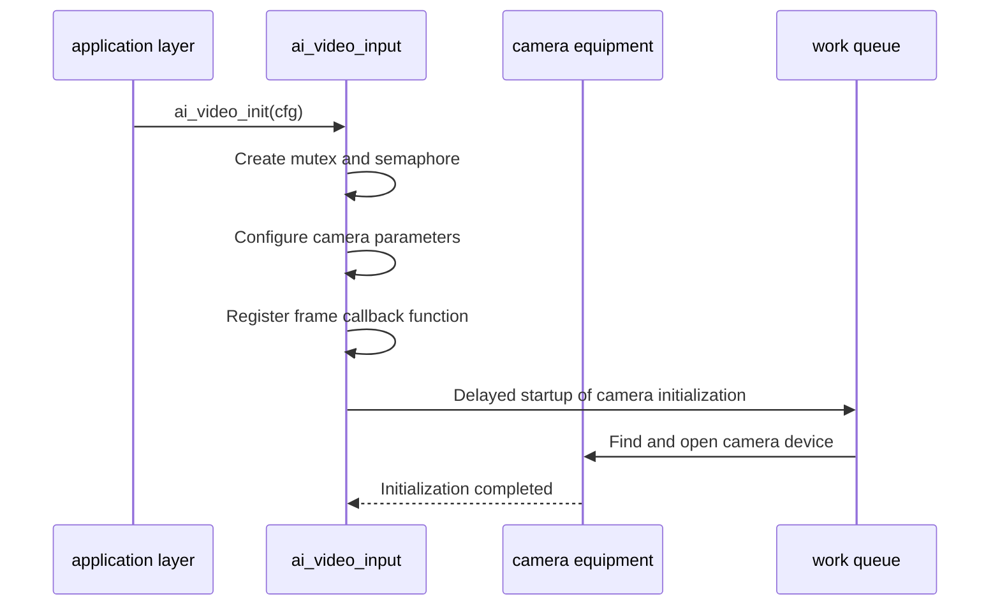
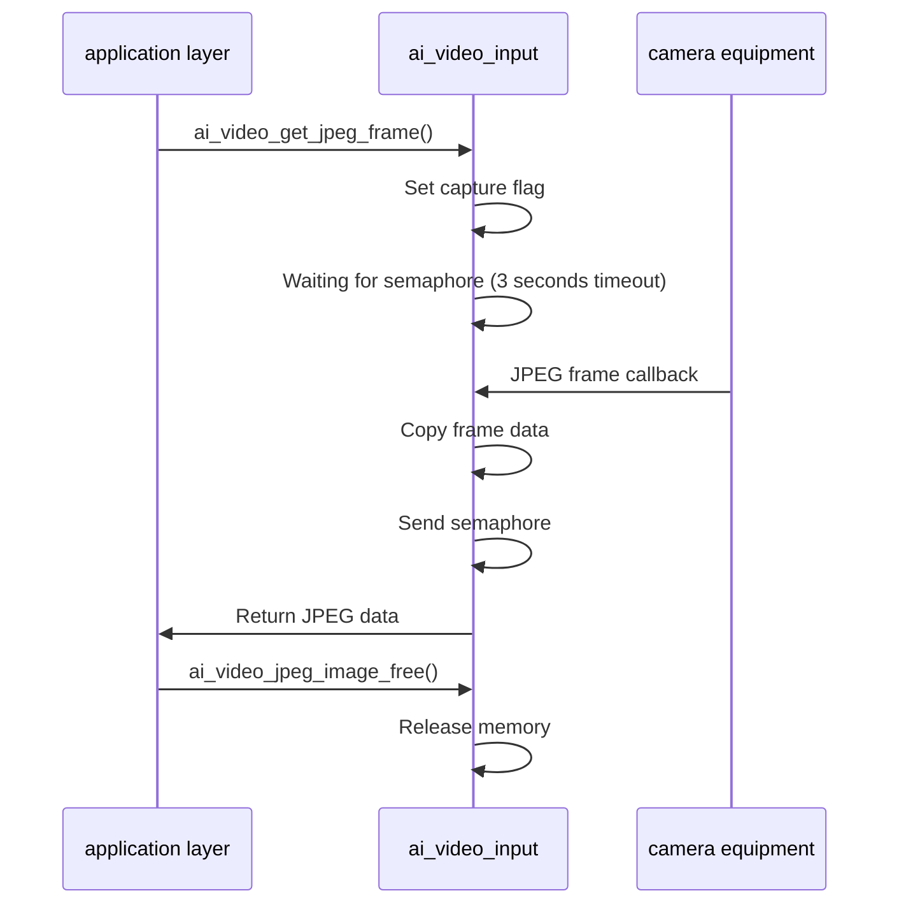
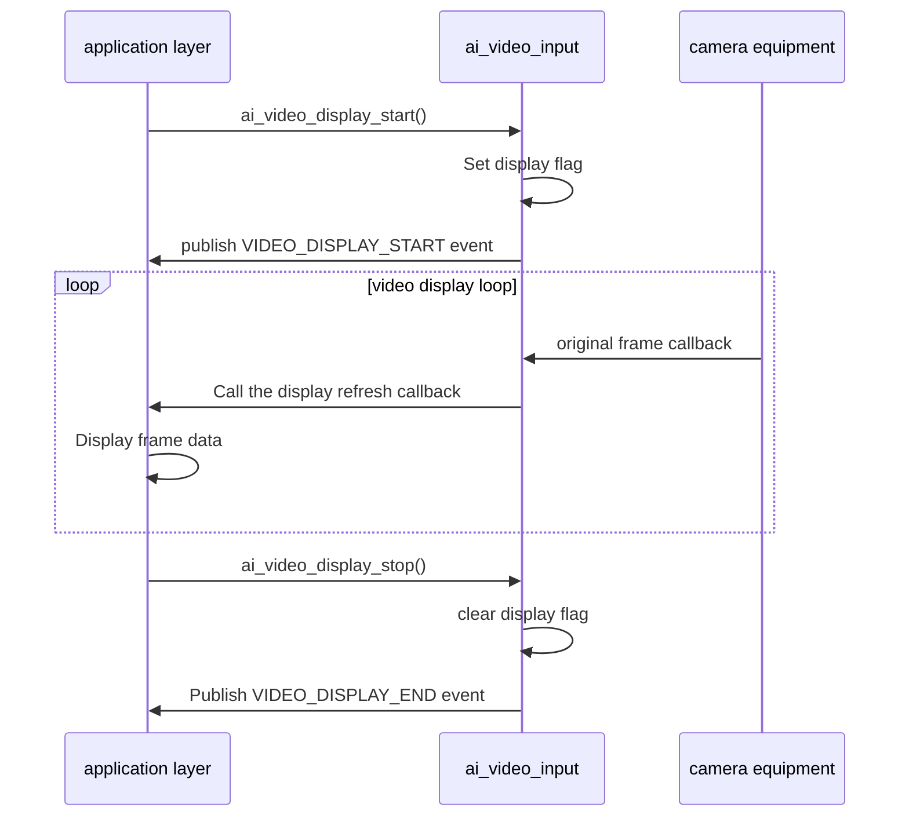

## Glossary

| Term | Description |
| ---- | ------------------------------------------------------------ |
| JPEG encoding | An image compression format that compresses original image data into JPEG format to reduce the amount of data and facilitate transmission and storage. |
| Raw frame | Uncompressed image data output directly from the camera, usually in YUV format. |

## Overview

`ai_video_input` is the video input component in the TuyaOpen AI application framework. It handles camera capture, JPEG encoding, and video stream output. This module provides camera initialization, frame capture, image encoding, and related capabilities for AI visual analysis or real-time display.

- **Camera management**: Initializes and manages camera devices, including resolution, frame rate, and other parameters
- **Raw frame capture**: Obtains raw camera frame data through callbacks for real-time display
- **JPEG frame capture**: Provides a synchronization interface to obtain JPEG encoded image data, commonly known as "taking pictures"
- **Video display control**: Supports starting and stopping video display, and publishes corresponding event notifications

## Workflow

### Initialization process

When the module is initialized, configure the camera parameters, register the frame callback function, and delay starting the camera device.



### JPEG frame capture process

When the application layer requests a JPEG frame, the module sets the capture flag, waits for the camera callback, and then returns encoded image data.



### Video display process

After starting the video display, the original frame of the camera is passed to the application layer through the callback function for display.



## Configuration instructions

### Configuration file path

```
ai_components/ai_video/Kconfig
```

### Function enable

```
menuconfig ENABLE_COMP_AI_VIDEO
    select ENABLE_CAMERA
    bool "enable ai camera"
    default n
```

### Configuration parameters

```
config COMP_AI_VIDEO_WIDTH
    int "ai video input width"
    default 480
#Camera acquisition image width (pixels)

config COMP_AI_VIDEO_HEIGHT
    int "ai video input height"
    default 480
#Camera acquisition image height (pixels)

config COMP_AI_VIDEO_FPS        
    int "ai video input fps"
    default 20
#Camera acquisition frame rate (frames/second)

config ENABLE_COMP_AI_VIDEO_JPEG_QUALITY        
    bool "enable ai video input jpeg quality"
    default y
# Whether to enable JPEG quality automatic adjustment function

config COMP_AI_VIDEO_JPEG_QUALITY_MAX_SIZE
    int "ai video input jpeg quality max size(kb)"
    default 25
# Maximum size of JPEG image (KB), exceeding this size will automatically reduce the quality

config COMP_AI_VIDEO_JPEG_QUALITY_MIN_SIZE
    int "ai video input jpeg quality min size(kb)"
    default 10
# Minimum JPEG image size (KB), below which the quality will automatically increase
```

### Dependent components

- **Camera Component** (`ENABLE_CAMERA`): required, used for camera device management

## Development process

### Data structure

#### Video input configuration

```c
typedef void (*AI_VIDEO_DISP_FLUSH_CB)(TDL_CAMERA_FRAME_T *frame);

typedef struct {
AI_VIDEO_DISP_FLUSH_CB disp_flush_cb; // Display refresh callback function
} AI_VIDEO_CFG_T;
```

#### Video display startup notification

```c
typedef struct {
uint32_t camera_width; // Camera width
uint32_t camera_height; // Camera height
} AI_NOTIFY_VIDEO_START_T;
```

### Interface description

#### Initialization

Initialize the video input module, configure camera parameters and callback functions. If JPEG quality configuration is enabled, the module automatically adjusts the JPEG encoding quality based on the configured maximum/minimum size.

```c
/**
 * @brief Initialize AI video input module
 * @param vi_cfg Video input configuration
 * @return OPERATE_RET Operation result
 */
OPERATE_RET ai_video_init(AI_VIDEO_CFG_T *vi_cfg);
```

#### Deinitialization

Release the video input module resources and close the camera device.

```c
/**
 * @brief Deinitialize AI video input module
 * @return OPERATE_RET Operation result
 */
OPERATE_RET ai_video_deinit(void);
```

#### Get JPEG frame

Get JPEG encoded image frames from the camera.

- If no JPEG frame is obtained within 3 seconds, a timeout error will be returned.

- Need to use the acquired image data after using it`ai_video_jpeg_image_free()`Release to avoid memory leaks.

```c
/**
 * @brief Get JPEG frame from camera
 * @param image_data Pointer to store image data pointer
 * @param image_data_len Pointer to store image data length
 * @return OPERATE_RET Operation result
 */
OPERATE_RET ai_video_get_jpeg_frame(uint8_t **image_data, uint32_t *image_data_len);
```

#### Release JPEG image data

release through`ai_video_get_jpeg_frame()`Get image data memory.

```c
/**
 * @brief Free JPEG image data
 * @param image_data Pointer to image data pointer
 * @return OPERATE_RET Operation result
 */
OPERATE_RET ai_video_jpeg_image_free(uint8_t **image_data);
```

#### Start video display

Start video display, start receiving original frame data and pass it to the application layer through the callback function.

```c
/**
 * @brief Start video display
 * @return OPERATE_RET Operation result
 */
OPERATE_RET ai_video_display_start(void);
```

#### Stop video display

Stop video display and no longer receive raw frame data.

```c
/**
 * @brief Stop video display
 * @return OPERATE_RET Operation result
 */
OPERATE_RET ai_video_display_stop(void);
```

### Development steps

1. **Initialization module**: call`ai_video_init()`Initialize the video input module and configure the display refresh callback function
2. **Start display** (optional): If you need to display the video in real time, call`ai_video_display_start()`Start display
3. **Get JPEG frame**: call`ai_video_get_jpeg_frame()`Get JPEG encoded image data
4. **Release resources**: After using the image data, call `ai_video_jpeg_image_free()` to free memory
5. **Stop display** (optional): call`ai_video_display_stop()`Stop video display
6. **Deinitialization**: Call`ai_video_deinit()`Release module resources

### Reference example

#### Initialization and display

```c
#include "ai_video_input.h"
#include "ai_user_event.h"

//Display refresh callback function
void video_display_flush(TDL_CAMERA_FRAME_T *frame)
{
// Refresh frame data to the display device
    // ...
}

//Initialize the video input module
OPERATE_RET init_video_input(void)
{
    OPERATE_RET rt = OPRT_OK;
    AI_VIDEO_CFG_T cfg = {
        .disp_flush_cb = video_display_flush,
    };
    
    TUYA_CALL_ERR_RETURN(ai_video_init(&cfg));
    
    return rt;
}

// Start video display
void start_video_display(void)
{
    ai_video_display_start();
}

// Stop video display
void stop_video_display(void)
{
    ai_video_display_stop();
}
```

#### Get JPEG frame

```c
// Get JPEG image frame
OPERATE_RET capture_jpeg_image(void)
{
    OPERATE_RET rt = OPRT_OK;
    uint8_t *image_data = NULL;
    uint32_t image_data_len = 0;
    
// Get JPEG frame
    rt = ai_video_get_jpeg_frame(&image_data, &image_data_len);
    if (OPRT_OK != rt) {
        PR_ERR("Get JPEG frame failed: %d", rt);
        return rt;
    }
    
    PR_NOTICE("JPEG frame captured, size: %d bytes", image_data_len);
    
// Use image data (e.g. upload to cloud, save to file, etc.)
    // ...
    
// Release image data
    ai_video_jpeg_image_free(&image_data);
    
    return rt;
}
```

#### Handle video display events

```c
// Subscribe to video display events
void handle_video_event(AI_NOTIFY_EVENT_T *event)
{
    switch (event->type) {
        case AI_USER_EVT_VIDEO_DISPLAY_START: {
            AI_NOTIFY_VIDEO_START_T *notify = (AI_NOTIFY_VIDEO_START_T *)event->data;
            PR_NOTICE("Video display started: %dx%d", 
                      notify->camera_width, 
                      notify->camera_height);
        }
        break;
        
        case AI_USER_EVT_VIDEO_DISPLAY_END:
            PR_NOTICE("Video display stopped");
        break;
        
        default:
        break;
    }
}
```

