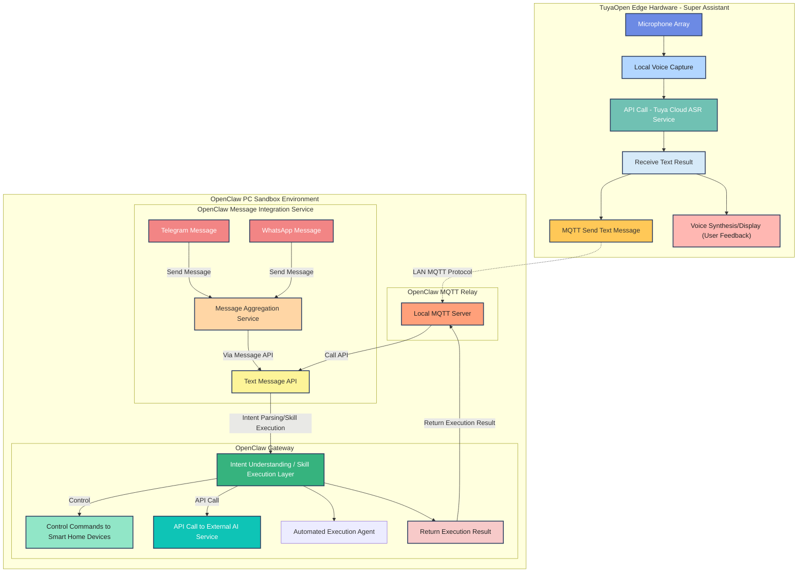

This document describes how to connect TuyaOpen edge hardware to the OpenClaw gateway service so that speech is transcribed by Tuya Cloud ASR and the resulting text is sent to a local OpenClaw instance, enabling a "speak to execute" desktop voice assistant. It is aimed at application developers who have completed the TuyaOpen quick start and want to build a lightweight, demonstrable personal assistant.

<div align="center">
  
</div>

*TuyaOpen hardware (mic + speaker) on the local network, connected to the OpenClaw gateway (PC).*

## Prerequisites

- You have completed [Environment setup and code download](/docs/quick-start/enviroment-setup).
- You are familiar with building, flashing, and network configuration for the `openclaw_demo_app` in the TuyaOpen repository.
- A PC (Linux recommended) running OpenClaw and the MQTT bridge is on the same local network as the TuyaOpen device.

## Requirements

| Type | Details |
|------|---------|
| Hardware | A TuyaOpen development board supported by `openclaw_demo_app` (for example T5AI-Core, T5-AI Board), USB cable, and required peripherals (microphone and speaker) per board documentation. |
| Software | TuyaOpen repository, Python 3, Mosquitto (MQTT broker), and an OpenClaw runtime on the PC. |
| Network | The TuyaOpen device and the PC running OpenClaw must be on the same LAN; the PC must have a known or static IP for MQTT. |
| License key | This demo uses Tuya Cloud ASR. Complete [Equipment authorization](/docs/quick-start/equipment-authorization) and configure PID and related settings required by the hardware app. |

## Architecture overview

The TuyaOpen device connects to Tuya Cloud for ASR and receives transcribed text. It publishes that text over the local network via MQTT to the PC running OpenClaw. A bridge on the PC subscribes to the MQTT topic and forwards messages to OpenClaw for intent understanding and task execution (e.g. email, code, notes). Results can be sent back over MQTT to the device for display or playback.


### Architecture diagram

The diagram below shows the data flow between TuyaOpen edge hardware and the OpenClaw PC sandbox: local voice capture and Tuya Cloud ASR, MQTT relay, OpenClaw gateway intent parsing and execution, and result feedback.




## Steps

### 1. Install OpenClaw by following the official docs

Install OpenClaw on your PC first, then verify it can run local agent commands.

1. Open the official guide and complete onboarding:
   - [OpenClaw official documentation](https://openclaw.ai/)
2. Verify `openclaw` is available from your shell:
   ```bash
   which openclaw && openclaw --version
   ```
3. Run a simple command test:
   ```bash
   openclaw agent --agent main --message "Hello from TuyaOpen"
   ```

### 2. Start the MQTT proxy to bridge hardware and OpenClaw gateway

Use the latest proxy repository to run Mosquitto and the bridge process.

1. Clone and enter the proxy repository:
   ```bash
   git clone https://github.com/adwuard/openclaw_tuya_mqtt_proxy.git ~/mqtt_openclaw_bridge
   cd ~/mqtt_openclaw_bridge
   ```
2. Install Python dependencies:
   ```bash
   pip3 install --user -r requirements.txt
   ```
3. Install and start Mosquitto:
   ```bash
   sudo bash install.sh install-mosquitto
   ```
4. Optional: allow LAN clients to connect when needed:
   ```bash
   sudo bash install.sh mosquitto-listen-all
   ```
5. Start the bridge script:
   ```bash
   python3 openclaw_mqtt_bridge.py
   ```
6. Optional quick routing test (separate terminals):
   ```bash
   mosquitto_sub -h localhost -t openclaw/server/response -v
   ```
   ```bash
   mosquitto_pub -h localhost -t openclaw/device/user_speech_text -m "Hello from MQTT"
   ```

### 3. Build and run the TuyaOpen hardware code

1. Clone TuyaOpen and set up the build environment:
   ```bash
   git clone https://github.com/tuya/TuyaOpen.git
   cd TuyaOpen
   . ./export.sh
   ```
2. Update the MQTT broker IP in `apps/tuya.ai/openclaw_demo_app/src/openclaw_remote_mqtt.c` to your PC LAN IP:
   ```c
   /**
    * Remote MQTT broker host.
    *
    * NOTE: Please update the IP address below to match your actual MQTT broker.
   at https://github.com/tuya/TuyaOpen/tree/master/apps/tuya.ai/openclaw_demo_app/src/openclaw_remote_mqtt.c
   apps/tuya.ai/openclaw_demo_app/src/openclaw_remote_mqtt.c
    */
   #define OPENCLAW_REMOTE_MQTT_BROKER_HOST "192.168.100.132"

   /** Remote MQTT broker port. */
   #define OPENCLAW_REMOTE_MQTT_BROKER_PORT 1883
   ```
3. Complete device authorization and app configuration by following the existing TuyaOpen guide:
   - [Equipment authorization](/docs/quick-start/equipment-authorization)
4. Build `openclaw_demo_app`:
   ```bash
   cd apps/tuya.ai/openclaw_demo_app
   tos.py build
   ```
5. Flash firmware:
   - Follow [Firmware burning](/docs/quick-start/firmware-burning)
6. Configure network with Smart Life:
   - Follow [Device network configuration](/docs/quick-start/device-network-configuration)
7. Start chatting with the device and observe bridge logs:
   - Speak to the device after network setup.
   - You should see proxied ASR messages in `openclaw_mqtt_bridge.py` output and response messages returned through MQTT.

## MQTT configuration

| Option | Description | Example |
|--------|-------------|---------|
| MQTT_BROKER | MQTT broker host used by `openclaw_mqtt_bridge.py` and the device client | `127.0.0.1` (local broker) / `192.168.100.132` (LAN broker) |
| MQTT_PORT | MQTT broker port | `1883` |
| MQTT_TOPIC_IN_COMMAND | Topic carrying device ASR text to OpenClaw | `openclaw/device/user_speech_text` |
| MQTT_TOPIC_OUT_RESULT | Topic carrying OpenClaw results back to the device | `openclaw/server/response` |

Use `127.0.0.1` for a local broker, or the broker machine's LAN IP/domain for a remote broker.

## Notes

- **Same LAN**: The TuyaOpen device and the PC running OpenClaw and Mosquitto must be on the same local network, and the device must be able to reach the PC’s MQTT port.
- **IP**: If the PC’s IP changes, update `MQTT_BROKER` on both the device and the bridge.
- **Broker reachability**: If LAN clients cannot connect, verify Mosquitto is listening on the expected interface/port and open `1883/tcp` in the firewall.
- **Ecosystem**: Additional TuyaOpen + OpenClaw integration options are in development; check the repository and docs for updates.

## Expected result

After completing the steps, voice input on the TuyaOpen device is transcribed by Tuya Cloud ASR; the device sends the text over MQTT to the PC; OpenClaw runs the corresponding tasks (e.g. email, create folder, code). You get a lightweight "voice-controlled desktop" assistant.

## References

- [Environment setup and code download](/docs/quick-start/enviroment-setup)
- [Firmware burning](/docs/quick-start/firmware-burning)
- [Device network configuration](/docs/quick-start/device-network-configuration)
- [Equipment authorization](/docs/quick-start/equipment-authorization)
- [OpenClaw official documentation](https://openclaw.ai/)
- [MQTT OpenClaw Bridge](https://github.com/adwuard/openclaw_tuya_mqtt_proxy)
- [openclaw_remote_mqtt.c (TuyaOpen)](https://github.com/tuya/TuyaOpen/tree/master/apps/tuya.ai/openclaw_demo_app/src/openclaw_remote_mqtt.c)
