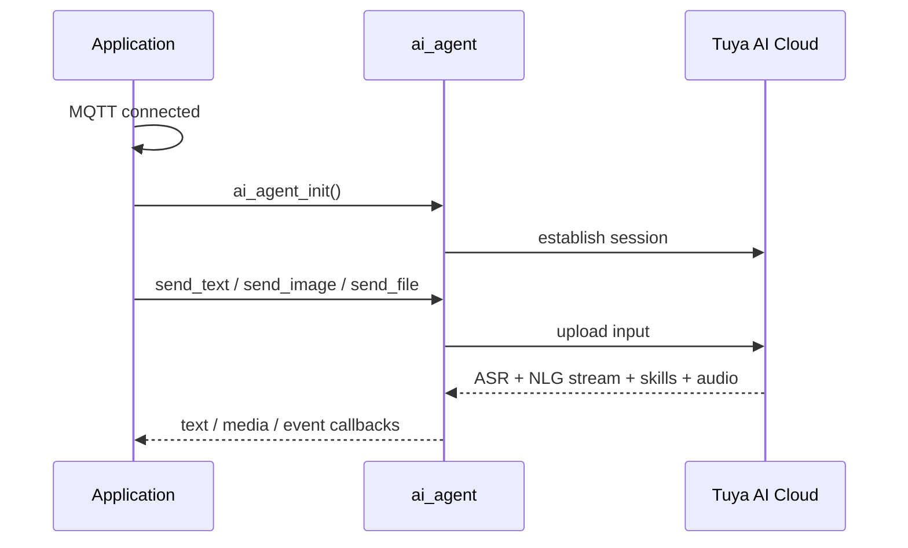

`ai_agent` is the bridge between your device and the Tuya AI cloud. It uploads voice, text, image, and file input, receives the AI's streamed reply, and reports progress to your application through events — so the rest of your firmware never talks to the cloud directly.

It sits between the **chat modes** (which decide *when* to listen) and the **cloud** (which decides *what* to say).

## Terms

| Term | Meaning |
|-------|---------|
| Agent | An AI entity that perceives, reasons, decides, and acts on its own. |
| ASR | Automatic Speech Recognition — converts the user's speech into text. |
| NLG | Natural Language Generation — converts intent or structured data into natural-language text. |
| Skill | A self-contained, pluggable AI capability that does one thing (play music, show an emotion, run a cloud event). |

## What it does

### Input: multimodal

The agent accepts four kinds of input and uploads them to the cloud:

- **Audio** — `PCM` (uncompressed, for local processing), `OPUS` (compact and low-latency, for network transport), or `SPEEX` (speech-tuned).
- **Text** — send a command or query as a string.
- **Image** — upload a frame for visual Q&A or image understanding.
- **File** — upload a document for analysis.

### Output: callbacks

The cloud's reply comes back through callbacks:

- **Text** — ASR results, the NLG text stream, and skill payloads.
- **Media** — audio, video, image, and file streams.
- **Media properties** — metadata such as the audio codec in use.

### Session events

The agent tracks the full conversation lifecycle and reports each stage to your app through the user-event callback (`AI_USER_EVENT_NOTIFY`):

- **Start** — the cloud begins replying. Start the TTS player and prepare to receive audio.
- **End** — the cloud finished sending. Stop the player and complete playback.
- **Break** — the cloud interrupted the turn (user barge-in, cloud timeout). Stop playback and clear buffers immediately.
- **Exit** — the conversation closed. Release all related resources.
- **Server VAD** — cloud-side voice-activity status, forwarded to your app.

### Cloud prompt tones

`ai_agent_cloud_alert(type)` asks the cloud for a short spoken prompt. It maps the alert type to a token (`cmd:0`–`cmd:5`) and sends that token as text; the cloud returns the matching audio.

:::note
The tokens only work if you configure them on the AI agent platform. In the agent's prompt, define what the AI should return for `cmd:0` through `cmd:5`. Without that configuration, no tone plays.
:::

Only the six alert types below are mapped today. Any other `AI_ALERT_TYPE_E` value returns `OPRT_NOT_SUPPORTED`:

| Alert type | Token | Meaning |
|------------|-------|---------|
| `AT_NETWORK_CONNECTED` | `cmd:0` | Network connected |
| `AT_WAKEUP` | `cmd:1` | Wake-up response |
| `AT_LONG_KEY_TALK` | `cmd:2` | Press and hold to talk |
| `AT_KEY_TALK` | `cmd:3` | Press key to talk |
| `AT_WAKEUP_TALK` | `cmd:4` | Talk after wake |
| `AT_RANDOM_TALK` | `cmd:5` | Random chat |

### Role switching

`ai_agent_role_switch(role)` changes the active agent role at runtime. Different roles can carry different conversation styles, knowledge bases, and skill sets — useful for multi-scenario products.

## API reference

Header: `ai_agent.h`. Every function returns `OPERATE_RET` (`OPRT_OK` on success).

```c
OPERATE_RET ai_agent_init(void);
OPERATE_RET ai_agent_deinit(void);
OPERATE_RET ai_agent_send_text(char *content);
OPERATE_RET ai_agent_send_file(uint8_t *data, uint32_t len);
OPERATE_RET ai_agent_send_image(uint8_t *data, uint32_t len);
OPERATE_RET ai_agent_cloud_alert(AI_ALERT_TYPE_E type);
OPERATE_RET ai_agent_role_switch(char *role);
```

| Function | Parameters | Purpose |
|----------|------------|---------|
| `ai_agent_init` | — | Initialize the agent. Also starts the monitor module when `ENABLE_AI_MONITOR` is set (for `tyutool` debugging). |
| `ai_agent_deinit` | — | Release the agent's resources. |
| `ai_agent_send_text` | `content` — text to send | Send a text query. |
| `ai_agent_send_file` | `data`, `len` — buffer and length | Upload a file. |
| `ai_agent_send_image` | `data`, `len` — buffer and length | Upload an image. |
| `ai_agent_cloud_alert` | `type` — an `AI_ALERT_TYPE_E` | Request a cloud prompt tone (see the table above). |
| `ai_agent_role_switch` | `role` — role name | Switch the active agent role. |

:::warning
Call `ai_agent_init()` **only after the MQTT connection succeeds.** Subscribe to `EVENT_MQTT_CONNECTED` and initialize the agent from that handler.
:::

## How a turn flows



## Worked example

Initialize audio, then initialize the agent from the MQTT-connected event:

```c
// Initialize the AI agent once MQTT is connected.
static bool sg_ai_agent_inited = false;

int __ai_mqtt_connected_evt(void *data)
{
    if (!sg_ai_agent_inited) {
        TUYA_CALL_ERR_LOG(ai_agent_init());
        sg_ai_agent_inited = true;
    }
    return OPRT_OK;
}

OPERATE_RET example_init(void)
{
    OPERATE_RET rt = OPRT_OK;

#if defined(ENABLE_COMP_AI_AUDIO) && (ENABLE_COMP_AI_AUDIO == 1)
    AI_AUDIO_INPUT_CFG_T input_cfg = {
        .vad_mode      = AI_AUDIO_VAD_MANUAL,
        .vad_off_ms    = 1000,
        .vad_active_ms = 200,
        .slice_ms      = 80,
        .output_cb     = __ai_audio_output,
    };
    TUYA_CALL_ERR_RETURN(ai_audio_input_init(&input_cfg));
    TUYA_CALL_ERR_RETURN(ai_audio_player_init());
#endif

    // Initialize the agent only after MQTT connects.
    TUYA_CALL_ERR_RETURN(tal_event_subscribe(EVENT_MQTT_CONNECTED, "ai_agent_init",
                                             __ai_mqtt_connected_evt, SUBSCRIBE_TYPE_EMERGENCY));
    return OPRT_OK;
}

void send_text_to_ai(void)   { ai_agent_send_text("How is the weather today?"); }
void request_alert(void)     { ai_agent_cloud_alert(AT_WAKEUP); }
void switch_role(void)       { ai_agent_role_switch("storyteller"); }
```

## See also

- [Component Framework](ai-components.md) — how `ai_agent` fits the wider AI framework
- [Application development guide](../application-development-guide) — wire the agent into a full app
- [AI Agent development platform](../../tuya-cloud/ai-agent/ai-agent-dev-platform) — configure roles, prompts, and the `cmd:` tones
