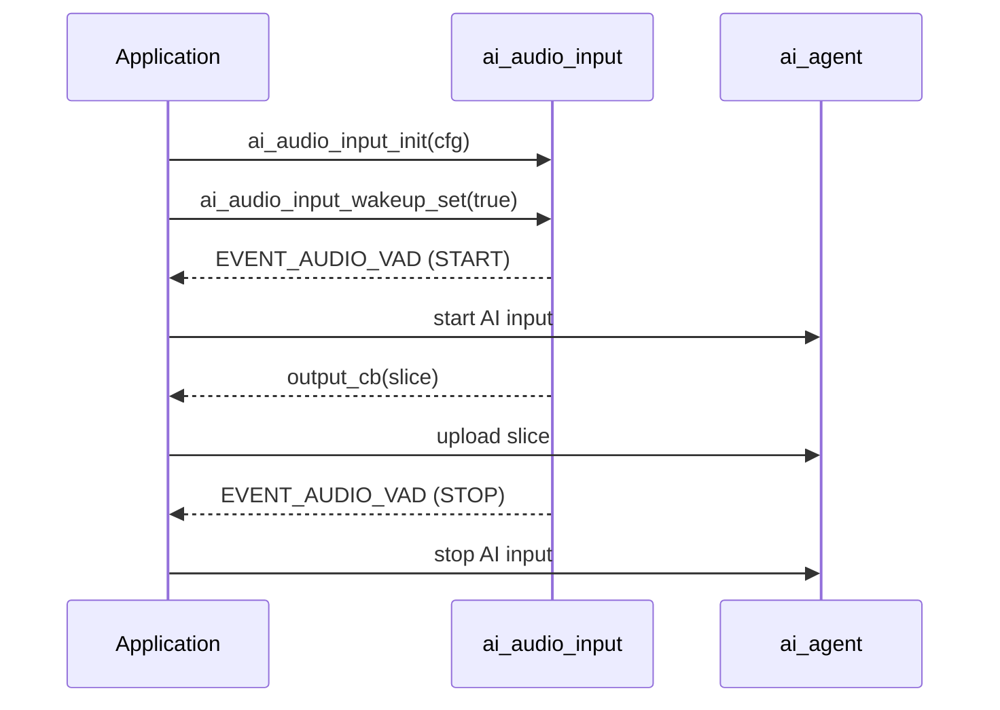

`ai_audio_input` captures microphone audio, decides when speech is present, and hands the resulting audio slices to your application through a callback. It is the front end of the AI audio pipeline: it produces the audio that `ai_agent` uploads to the cloud.

It does not talk to the cloud itself. Its only job is to turn a raw microphone stream into framed slices, gated by **Voice Activity Detection (VAD)**.

## Terms

| Term | Meaning |
|------|---------|
| VAD | Voice Activity Detection — deciding whether a chunk of audio contains speech. |
| VAD state | `AI_AUDIO_VAD_START` when speech begins, `AI_AUDIO_VAD_STOP` when it ends. |
| Slice | A fixed-duration chunk of the audio stream, sized by `slice_ms`, delivered to your callback. |
| Wake-up | Whether the module is currently "listening". VAD work and slice output happen only while woken up. |

## VAD modes

The module runs in one of two modes, chosen by `vad_mode` and switchable at runtime.

| Mode | Enum | What drives it | Use it for |
|------|------|----------------|------------|
| Manual | `AI_AUDIO_VAD_MANUAL` | Your key/button events. You set the wake-up state directly; no voice detector runs. | Press-to-talk and hold-to-talk, where the user controls start and stop. |
| Auto | `AI_AUDIO_VAD_AUTO` | A built-in human-voice detector. The module raises `AI_AUDIO_VAD_START` / `AI_AUDIO_VAD_STOP` on its own. | Hands-free capture that begins when someone speaks. |

In **manual** mode, you decide when to listen — typically by calling `ai_audio_input_wakeup_set(true)` on key-down and `ai_audio_input_wakeup_set(false)` on key-up. In **auto** mode, the detector tracks speech for you, using `vad_active_ms` and `vad_off_ms` to debounce the start and end.

:::note
Wake-word listening (saying a wake word to start a turn) is not handled here. It is driven by the [Wakeup chat mode](ai-mode-wakeup), which calls into this module to switch VAD mode and toggle the wake-up state.
:::

## VAD state and events

When the module is woken up, a VAD state change publishes the `EVENT_AUDIO_VAD` event. The event payload is an `AI_AUDIO_VAD_STATE_E` value:

```c
typedef enum {
    AI_AUDIO_VAD_START = 1,    // speech started
    AI_AUDIO_VAD_STOP,         // speech ended
} AI_AUDIO_VAD_STATE_E;
```

Subscribe to `EVENT_AUDIO_VAD` to start and stop your upstream AI input in step with detected speech.

:::warning
VAD work and event publishing happen **only while the module is woken up**. If you never set the wake-up state, no slices and no events are produced.
:::

## Configuration

You configure the module once at init with `AI_AUDIO_INPUT_CFG_T`:

```c
typedef struct {
    /* VAD cache = vad_active_ms + vad_off_ms */
    AI_AUDIO_VAD_MODE_E     vad_mode;
    uint16_t                vad_off_ms;        /* Voice activity compensation time, unit: ms */
    uint16_t                vad_active_ms;     /* Voice activity detection threshold, unit: ms */
    uint16_t                slice_ms;          /* Reference macro, AUDIO_RECORDER_SLICE_TIME */
    AI_AUDIO_OUTPUT         output_cb;         /* Microphone data processing callback */
} AI_AUDIO_INPUT_CFG_T;
```

| Field | Type | Purpose |
|-------|------|---------|
| `vad_mode` | `AI_AUDIO_VAD_MODE_E` | Manual or auto detection (see above). |
| `vad_off_ms` | `uint16_t` | Voice activity compensation time, in milliseconds. Used to debounce the end of speech in auto mode. |
| `vad_active_ms` | `uint16_t` | Voice activity detection threshold, in milliseconds. How long voice must persist before VAD starts. |
| `slice_ms` | `uint16_t` | Slice duration in milliseconds. Reference macro `AUDIO_RECORDER_SLICE_TIME`. |
| `output_cb` | `AI_AUDIO_OUTPUT` | Called with each audio slice. |

The output callback delivers one slice at a time:

```c
typedef int (*AI_AUDIO_OUTPUT)(uint8_t *data, uint16_t datalen);
```

`data` points to the slice buffer and `datalen` is its length in bytes. This is where you forward audio to the cloud (for example, via `ai_agent`).

## API reference

Header: `ai_audio_input.h`. Every function returns `OPERATE_RET` (`OPRT_OK` on success).

```c
OPERATE_RET ai_audio_input_init(AI_AUDIO_INPUT_CFG_T *cfg);
OPERATE_RET ai_audio_input_start(void);
OPERATE_RET ai_audio_input_stop(void);
OPERATE_RET ai_audio_input_deinit(void);
OPERATE_RET ai_audio_input_reset(void);
OPERATE_RET ai_audio_input_wakeup_mode_set(AI_AUDIO_VAD_MODE_E mode);
OPERATE_RET ai_audio_input_wakeup_set(bool is_wakeup);
```

| Function | Parameters | Purpose |
|----------|------------|---------|
| `ai_audio_input_init` | `cfg` — input configuration | Initialize the module with VAD mode, thresholds, slice size, and the output callback. |
| `ai_audio_input_start` | — | Start audio capture and VAD processing. |
| `ai_audio_input_stop` | — | Stop audio capture and VAD processing. |
| `ai_audio_input_deinit` | — | Release the module's resources. |
| `ai_audio_input_reset` | — | Reset the audio ring buffer and VAD state. Call between turns to clear stale audio. |
| `ai_audio_input_wakeup_mode_set` | `mode` — an `AI_AUDIO_VAD_MODE_E` | Switch VAD mode at runtime (manual or auto). |
| `ai_audio_input_wakeup_set` | `is_wakeup` — wake-up flag | Set whether the module is listening. In manual mode this directly drives the VAD state. |

## How a turn flows



## Worked example

Configure the module, forward slices to the cloud in the output callback, and start/stop a turn from VAD events. This snippet uses manual (button) mode.

```c
#include "ai_audio_input.h"

#define AI_AUDIO_SLICE_TIME       80
#define AI_AUDIO_VAD_ACTIVE_TIME  200
#define AI_AUDIO_VAD_OFF_TIME     1000

// Called with each audio slice. Forward it to the cloud here.
static int __ai_audio_output(uint8_t *data, uint16_t datalen)
{
    // e.g. upload `data`/`datalen` through ai_agent
    return OPRT_OK;
}

// React to VAD state changes published on EVENT_AUDIO_VAD.
static int __ai_vad_change_evt(void *data)
{
    AI_AUDIO_VAD_STATE_E vad_flag = (AI_AUDIO_VAD_STATE_E)data;

    if (AI_AUDIO_VAD_START == vad_flag) {
        // speech started — begin the AI input turn
    } else {
        // speech ended — finish the AI input turn
    }
    return OPRT_OK;
}

OPERATE_RET example_init(void)
{
    AI_AUDIO_INPUT_CFG_T input_cfg = {
        .vad_mode      = AI_AUDIO_VAD_MANUAL,
        .vad_off_ms    = AI_AUDIO_VAD_OFF_TIME,
        .vad_active_ms = AI_AUDIO_VAD_ACTIVE_TIME,
        .slice_ms      = AI_AUDIO_SLICE_TIME,
        .output_cb     = __ai_audio_output,
    };
    TUYA_CALL_ERR_RETURN(ai_audio_input_init(&input_cfg));
    TUYA_CALL_ERR_RETURN(ai_audio_input_start());

    TUYA_CALL_ERR_RETURN(tal_event_subscribe(EVENT_AUDIO_VAD, "vad_change",
                                             __ai_vad_change_evt, SUBSCRIBE_TYPE_NORMAL));
    return OPRT_OK;
}

// Button handlers (manual mode): press to listen, release to stop.
void on_button_press(void)   { ai_audio_input_wakeup_set(true);  }
void on_button_release(void) { ai_audio_input_wakeup_set(false); }
```

To go hands-free instead, set `.vad_mode = AI_AUDIO_VAD_AUTO` (or call `ai_audio_input_wakeup_mode_set(AI_AUDIO_VAD_AUTO)` at runtime) and let the detector raise the VAD events for you.

## See also

- [AI Agent](ai-agent) — uploads the slices this module produces
- [Audio Player](ai-audio-player) — plays the cloud's spoken reply back
- [Voice Chat Modes](ai-mode-manage) — decide when the device listens
- [Wakeup mode](ai-mode-wakeup) — wake-word listening built on this module
