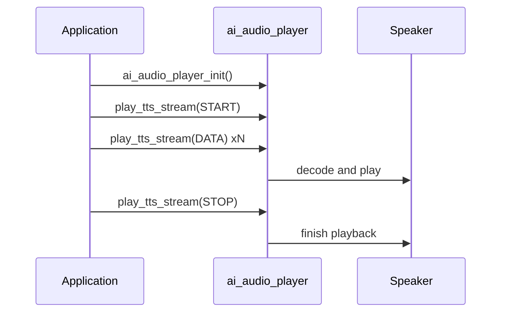

`ai_audio_player` plays the spoken and audio side of the conversation on the device — streamed TTS, music, and local alert tones — out the speaker. It is the back end of the AI audio pipeline: where `ai_audio_input` captures what the user says, this module renders what the device says back.

It does not talk to the cloud itself. Your application (or `ai_agent`'s callbacks) feeds it audio — a TTS stream, a decoded buffer, a music playlist, or an alert request — and the player decodes and plays it.

## Terms

| Term | Meaning |
|------|---------|
| TTS | Text-to-Speech — the cloud's spoken reply, delivered to the player as a stream or a URL. |
| Foreground / background | Two independent players: foreground plays TTS, background plays music. They can run at the same time. |
| Alert tone | A short, local prompt sound (power-on, low battery, "please say again") played from the device, not the cloud. |
| Codec | The audio format of the data you hand the player, an `AI_AUDIO_CODEC_E` value. |

## What it plays

The player handles three kinds of audio, each through its own entry point:

- **TTS** — the cloud's spoken reply. Feed it as a stream (`ai_audio_play_tts_stream`), from a URL (`ai_audio_play_tts_url`), or as a single decoded buffer (`ai_audio_play_data`). TTS plays on the **foreground** player.
- **Music** — a playlist of tracks (`ai_audio_play_music`). Music plays on the **background** player, so it can keep running while a short TTS reply plays over it.
- **Alert tones** — short local prompts (`ai_audio_player_alert`) such as power-on or low-battery.

### Foreground vs. background

The player runs two independent channels, selected by `AI_AUDIO_PLAYER_TYPE_E`. This same enum is what `ai_audio_player_stop` targets:

```c
typedef enum {
    AI_AUDIO_PLAYER_FG  = 0,   // foreground player, used to play TTS
    AI_AUDIO_PLAYER_BG  = 1,   // background player, used to play music
    AI_AUDIO_PLAYER_ALL = 2,   // all players
} AI_AUDIO_PLAYER_TYPE_E;
```

| Type | Channel | Stops |
|------|---------|-------|
| `AI_AUDIO_PLAYER_FG` | Foreground | The TTS playback only |
| `AI_AUDIO_PLAYER_BG` | Background | The music playback only |
| `AI_AUDIO_PLAYER_ALL` | Both | Everything currently playing |

### Local alert tones

`ai_audio_player_alert(type)` plays a short prompt tone stored on the device. These are **local** — they do not call the cloud, unlike the `cmd:` prompt tones in [`ai_agent`](ai-agent), which ask the cloud to synthesize a reply. Use these for fast feedback that must work before or without a network connection.

```c
typedef enum {
    AI_AUDIO_ALERT_POWER_ON,             // power on notification
    AI_AUDIO_ALERT_NOT_ACTIVE,           // not activated, configure network first
    AI_AUDIO_ALERT_NETWORK_CFG,          // entering network configuration
    AI_AUDIO_ALERT_NETWORK_CONNECTED,    // network connected
    AI_AUDIO_ALERT_NETWORK_FAIL,         // network connection failed, retry
    AI_AUDIO_ALERT_NETWORK_DISCONNECT,   // network disconnected
    AI_AUDIO_ALERT_BATTERY_LOW,          // low battery
    AI_AUDIO_ALERT_PLEASE_AGAIN,         // please say again
    AI_AUDIO_ALERT_LONG_KEY_TALK,        // long key press to talk
    AI_AUDIO_ALERT_KEY_TALK,             // key press to talk
    AI_AUDIO_ALERT_WAKEUP_TALK,          // talk after wake
    AI_AUDIO_ALERT_RANDOM_TALK,          // random chat
    AI_AUDIO_ALERT_WAKEUP,               // "Hello, I'm here"
    AI_AUDIO_ALERT_MAX,
} AI_AUDIO_ALERT_TYPE_E;
```

:::tip
By default these tones come from a built-in source. If your firmware defines `AI_PLAYER_ALERT_SOURCE_CUSTOM`, register your own provider with `ai_audio_player_reg_alert_cb` to supply the audio for each `AI_AUDIO_ALERT_TYPE_E` yourself.
:::

### Streaming TTS state

When you feed TTS as a stream, each call carries a state from `AI_AUDIO_PLAYER_TTS_STATE_E` that tells the player where you are in the reply:

```c
typedef enum {
    AI_AUDIO_PLAYER_TTS_START,   // first chunk — open the stream
    AI_AUDIO_PLAYER_TTS_DATA,    // a chunk of audio data
    AI_AUDIO_PLAYER_TTS_STOP,    // last chunk — close the stream
    AI_AUDIO_PLAYER_TTS_ABORT,   // abort — discard the stream
} AI_AUDIO_PLAYER_TTS_STATE_E;
```

Send `AI_AUDIO_PLAYER_TTS_START` once, then `AI_AUDIO_PLAYER_TTS_DATA` for each chunk as it arrives from the cloud, then `AI_AUDIO_PLAYER_TTS_STOP` to finish — or `AI_AUDIO_PLAYER_TTS_ABORT` to drop a turn that was interrupted.

## Key structures

`ai_audio_play_music` takes an `AI_AUDIO_MUSIC_T` — a playlist plus a control action:

```c
typedef struct {
    char            action[32];   // play / next / prev / resume
    bool            has_tts;      // wait for TTS to finish before playing media
    int             src_cnt;      // number of tracks in src_array
    AI_MUSIC_SRC_T *src_array;    // the track list
} AI_AUDIO_MUSIC_T;
```

Each `AI_MUSIC_SRC_T` describes one track (`url`, `format`, `duration`, plus metadata such as `artist`, `song_name`, and `img_url`). Set `has_tts` to `true` when a spoken reply should play first and the music should follow.

`ai_audio_play_tts_url` takes an `AI_AUDIO_PLAY_TTS_T`, which pairs the spoken reply with optional background music:

```c
typedef struct {
    AI_AUDIO_TTS_T tts;        // the TTS audio source (url, method, format, type)
    AI_AUDIO_TTS_T bg_music;   // optional background music to play under it
} AI_AUDIO_PLAY_TTS_T;
```

Each `AI_AUDIO_TTS_T` carries the source `url`, the HTTP `http_method`, the `format` (`AI_AUDIO_CODEC_E`), and the `tts_type`.

## API reference

Header: `ai_audio_player.h`. Every function returns `OPERATE_RET` (`OPRT_OK` on success) except `ai_audio_player_is_playing`, which returns `uint8_t`.

```c
OPERATE_RET ai_audio_player_init(void);
OPERATE_RET ai_audio_player_deinit(void);
OPERATE_RET ai_audio_player_start(char *id);
OPERATE_RET ai_audio_play_tts_url(AI_AUDIO_PLAY_TTS_T *playtts, bool is_loop);
OPERATE_RET ai_audio_play_data(AI_AUDIO_CODEC_E format, uint8_t *data, uint32_t len);
OPERATE_RET ai_audio_play_tts_stream(AI_AUDIO_PLAYER_TTS_STATE_E state, AI_AUDIO_CODEC_E codec, char *data, int len);
OPERATE_RET ai_audio_play_music(AI_AUDIO_MUSIC_T *music);
OPERATE_RET ai_audio_player_stop(AI_AUDIO_PLAYER_TYPE_E type);
OPERATE_RET ai_audio_player_set_resume(bool is_music_continuous);
OPERATE_RET ai_audio_player_set_replay(bool is_music_replay);
uint8_t     ai_audio_player_is_playing(void);
OPERATE_RET ai_audio_player_alert(AI_AUDIO_ALERT_TYPE_E type);
OPERATE_RET ai_audio_player_set_vol(int vol);
OPERATE_RET ai_audio_player_get_vol(int *vol);
OPERATE_RET ai_audio_player_reg_alert_cb(AI_PLAYER_ALERT_CUSTOM_CB cb);  // AI_PLAYER_ALERT_SOURCE_CUSTOM only
```

| Function | Parameters | Purpose |
|----------|------------|---------|
| `ai_audio_player_init` | — | Initialize the player module. |
| `ai_audio_player_deinit` | — | Release the player's resources. |
| `ai_audio_player_start` | `id` — playback session identifier (may be `NULL`) | Begin a playback session. |
| `ai_audio_play_tts_url` | `playtts`, `is_loop` | Play a TTS reply (and optional background music) from a URL. `is_loop` is currently unused. |
| `ai_audio_play_data` | `format`, `data`, `len` | Play one decoded audio buffer from memory. |
| `ai_audio_play_tts_stream` | `state`, `codec`, `data`, `len` | Feed a TTS stream chunk by chunk, driven by the stream state. |
| `ai_audio_play_music` | `music` — playlist and action | Play, advance, or resume a music playlist on the background player. |
| `ai_audio_player_stop` | `type` — which channel | Stop the foreground, background, or all playback. |
| `ai_audio_player_set_resume` | `is_music_continuous` | Set whether music resumes (continuous play) after an interruption such as a TTS reply. |
| `ai_audio_player_set_replay` | `is_music_replay` | Set whether the current track replays when it ends. |
| `ai_audio_player_is_playing` | — | Return `TRUE` if anything is currently playing, `FALSE` otherwise. |
| `ai_audio_player_alert` | `type` — an `AI_AUDIO_ALERT_TYPE_E` | Play a local alert tone. |
| `ai_audio_player_set_vol` | `vol` — 0–100 | Set the player volume. |
| `ai_audio_player_get_vol` | `vol` (out) | Read the current player volume. |
| `ai_audio_player_reg_alert_cb` | `cb` — alert provider | Register a custom alert-tone source. Available only when `AI_PLAYER_ALERT_SOURCE_CUSTOM` is set. |

:::warning
Call `ai_audio_player_init()` before any other player function. The TTS-stream, music, and alert calls assume the module is initialized.
:::

## How a TTS reply plays



## Worked example

Initialize the player, then stream a TTS reply as chunks arrive from the cloud. Stop the foreground channel if the user barges in.

```c
#include "ai_audio_player.h"

OPERATE_RET player_start(void)
{
    OPERATE_RET rt = OPRT_OK;

    TUYA_CALL_ERR_RETURN(ai_audio_player_init());
    TUYA_CALL_ERR_RETURN(ai_audio_player_set_vol(70));
    return OPRT_OK;
}

// Drive the foreground TTS stream from ai_agent's media callbacks.
void on_tts_begin(void)
{
    ai_audio_play_tts_stream(AI_AUDIO_PLAYER_TTS_START, AI_AUDIO_CODEC_MP3, NULL, 0);
}

void on_tts_chunk(char *data, int len)
{
    ai_audio_play_tts_stream(AI_AUDIO_PLAYER_TTS_DATA, AI_AUDIO_CODEC_MP3, data, len);
}

void on_tts_end(void)
{
    ai_audio_play_tts_stream(AI_AUDIO_PLAYER_TTS_STOP, AI_AUDIO_CODEC_MP3, NULL, 0);
}

// User interrupted — stop the TTS channel and discard the stream.
void on_barge_in(void)
{
    ai_audio_play_tts_stream(AI_AUDIO_PLAYER_TTS_ABORT, AI_AUDIO_CODEC_MP3, NULL, 0);
    ai_audio_player_stop(AI_AUDIO_PLAYER_FG);
}

// Local feedback that does not need the cloud.
void on_power_on(void) { ai_audio_player_alert(AI_AUDIO_ALERT_POWER_ON); }
```

## See also

- [AI Agent](ai-agent) — delivers the TTS stream this module plays
- [AI Audio Input](ai-audio-input) — captures the user's voice for the other half of the turn
- [AI Skill](ai-skill) — skills such as music playback drive this player
- [Component Framework](ai-components.md) — how the player fits the wider AI framework
- [Multimodal Data Flow](../multimodal-data-flow) — how media travels between device and cloud
