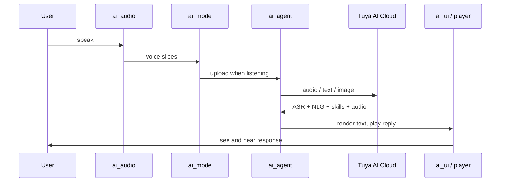

`ai_components` is the on-device AI framework behind every TuyaOpen AI application. It is a modular library that turns a board with a microphone, speaker, and screen into a voice assistant: it captures audio, runs the chat modes, talks to the [AI Agent](ai-agent), renders the UI, and plays the reply. You enable the modules your product needs and call one init function.

For how voice, vision, text, and sensor data move through these modules, see [Multimodal data flow](../multimodal-data-flow).

## Modules

The framework has a core that every app uses, plus optional modules you initialize only when needed.

| Module | Role | Always on? |
|--------|------|------------|
| [`ai_main`](ai-main) | Framework entry — initializes components, registers modes, dispatches events | Core |
| [`ai_agent`](ai-agent) | Bridge to the Tuya AI cloud (input, response, alerts, roles) | Core |
| [`ai_mode`](ai-mode-manage) | Chat-mode management — hold, one-shot, wakeup, free, custom | Core |
| [`ai_audio`](ai-audio-input) | Audio capture (VAD) and playback (TTS, music, prompts) | Core |
| [`ai_ui`](ai-ui-manage) | On-screen chat UI — WeChat-style, chatbot, or OLED | Core |
| [`ai_skills`](ai-skill) | Handles skill data from the AI — emotion, music/story, playback, cloud events | Core |
| `ai_video` | Camera capture, JPEG encoding, live preview | Optional |
| `ai_mcp` | Exposes device tools to the AI over MCP | Optional |
| `ai_picture` | Image conversion and display output | Optional |

## How data flows



## Integrate into a project

The framework lives next to your app. Point your build and config at it, then enable modules.

1. In your project's `CMakeLists.txt`, add the framework directory (adjust the relative path to your layout):

   ```cmake
   add_subdirectory(${APP_PATH}/../ai_components)
   ```

2. In your project's `Kconfig`, source the framework's menu:

   ```kconfig
   rsource "../ai_components/Kconfig"
   ```

3. Open the config menu and enable the modules you need:

   ```bash
   tos.py config menu
   ```

## Initialize the framework

Call `ai_chat_init()` once at startup with a configuration. After MQTT connects, the framework initializes the AI agent automatically.

```c
#include "ai_chat_main.h"

AI_CHAT_MODE_CFG_T cfg = {
    .default_mode = AI_CHAT_MODE_HOLD,   // AI_CHAT_MODE_HOLD | ONE_SHOT | WAKEUP | FREE
    .default_vol  = 70,                  // 0-100
    .evt_cb       = user_event_callback,
};
ai_chat_init(&cfg);
```

Adjust playback volume at runtime with `ai_chat_set_volume(int)` and read it back with `ai_chat_get_volume()`.

### Initialize optional modules

Initialize video, MCP, or picture only when your product uses them — each is guarded by its `Kconfig` switch:

```c
#if defined(ENABLE_COMP_AI_VIDEO) && (ENABLE_COMP_AI_VIDEO == 1)
    AI_VIDEO_CFG_T video_cfg = { .disp_flush_cb = video_display_flush_callback };
    ai_video_init(&video_cfg);
#endif

#if defined(ENABLE_COMP_AI_MCP) && (ENABLE_COMP_AI_MCP == 1)
    ai_mcp_init();
#endif

#if defined(ENABLE_COMP_AI_PICTURE) && (ENABLE_COMP_AI_PICTURE == 1)
    AI_PICTURE_OUTPUT_CFG_T picture_cfg = {
        .notify_cb = picture_notify_callback,
        .output_cb = picture_output_callback,
    };
    ai_picture_output_init(&picture_cfg);
#endif
```

## Handle events

The framework reports everything that happens — ASR results, the NLG text stream, skills, playback control, mode changes — through the event callback you passed to `ai_chat_init()`. The callback receives an `AI_NOTIFY_EVENT_T` whose `type` is an `AI_USER_EVT_*` value:

```c
void user_event_callback(AI_NOTIFY_EVENT_T *event)
{
    switch (event->type) {
        case AI_USER_EVT_ASR_OK:           /* speech recognized */            break;
        case AI_USER_EVT_TEXT_STREAM_START: /* NLG reply begins streaming */  break;
        case AI_USER_EVT_TTS_START:        /* start the player */             break;
        // ... see ai_user_event.h for the full event list
        default: break;
    }
}
```

## Configure

- **Language** — choose Chinese or English for built-in prompts and assets (`ENABLE_AI_LANGUAGE_CHINESE` / `ENABLE_AI_LANGUAGE_ENGLISH`).
- **Per-module options** — each module owns a `Kconfig` (`ai_mode/Kconfig`, `ai_audio/Kconfig`, `ai_ui/Kconfig`, `ai_video/Kconfig`, `ai_mcp/Kconfig`, `ai_picture/Kconfig`). Disabled modules are not compiled in.

## Customize

Each core module exposes a registration interface so you can extend it without forking the framework:

- **Custom UI** — implement `AI_UI_INTFS_T` and register it with `ai_ui_manage`.
- **Custom mode** — implement `AI_MODE_HANDLE_T` and register it with `ai_manage_mode` (custom mode IDs start at `AI_CHAT_MODE_CUSTOM_START`).
- **Custom skill** — add handling logic in `ai_skills`.
- **Custom MCP tool** — implement the tool interface and register it with the MCP server.

## See also

- [Multimodal data flow](../multimodal-data-flow) — how each modality reaches the cloud
- [AI Agent](ai-agent) — the cloud bridge
- [Voice Chat Modes](ai-mode-manage) — when the device listens
- [Develop applications](../application-development-guide) — build a full app on this framework
