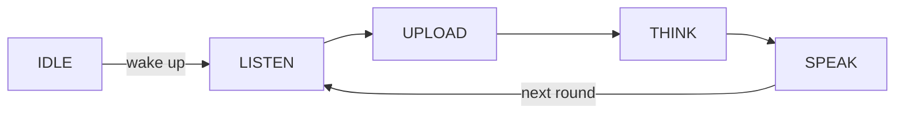

**Free conversation** is the chat mode where, after a wake-up, the device keeps listening for multi-round, hands-free dialogue. You wake it once and then talk back and forth without a button and without repeating the wake word for each turn.

It is one of the four [voice chat modes](ai-mode-manage); register it with `ai_mode_free_register()`.

## When to use it

Use free mode for natural, conversational interaction where the user takes several turns in a row:

- **Multi-round chat** — after waking, the device keeps listening for follow-up turns, so a conversation flows without re-triggering each time.
- **Fully hands-free** — no button presses during the conversation; the user just keeps speaking.
- **Conversational products** — best for assistants and companions designed for back-and-forth dialogue rather than single commands.

The trade-off is that the device listens continuously during the conversation, so it suits quieter, single-user settings better than noisy or shared rooms. For one turn at a time, use [wake-word](ai-mode-wakeup) mode; for full manual control, use [hold-to-talk](ai-mode-hold).

## How it behaves

A turn follows the shared mode lifecycle. After wake-up the device enters `LISTEN`; each turn advances through `UPLOAD`, `THINK`, and `SPEAK`, and then returns to `LISTEN` for the next round rather than going idle — keeping the conversation open.



:::note
Free mode keeps listening between turns, so the device captures audio continuously during a conversation. It needs the audio component (`ENABLE_COMP_AI_AUDIO`) for voice-activity detection.
:::

## Enable it

Register the mode at startup, then make it the active mode with `ai_mode_init`:

```c
ai_mode_free_register();
ai_mode_init(AI_CHAT_MODE_FREE);   // AI_CHAT_MODE_HOLD | ONE_SHOT | WAKEUP | FREE
```

See [Voice Chat Modes](ai-mode-manage) for the full startup sequence — registering several modes, running the task loop, and switching between them at runtime.

## See also

- [Voice Chat Modes](ai-mode-manage) — register, switch, and route events across all modes
- [Hold-to-Talk Mode](ai-mode-hold) — press and hold to record
- [One-Shot Mode](ai-mode-oneshot) — click once for a single turn
- [Wake-Word Mode](ai-mode-wakeup) — start a turn by voice
- [AI Agent](ai-agent) — the cloud bridge that modes drive
