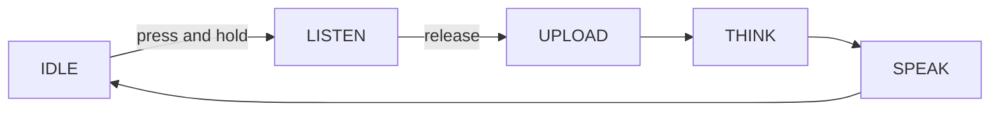

**Hold-to-talk** is the chat mode where you press and hold the button to record, then release to stop and upload. The capture window lasts exactly as long as you hold the button — nothing starts or stops on its own.

It is one of the four [voice chat modes](ai-mode-manage); register it with `ai_mode_hold_register()`.

## When to use it

Use hold-to-talk when you want deliberate, explicit turns and full control over what the device hears:

- **Noisy rooms** — the microphone only captures while the button is down, so background speech and noise outside that window never reach the cloud.
- **Deliberate turns** — the user decides exactly when a turn begins and ends, with no wake word and no voice-activity guesswork.
- **No false triggers** — nothing is uploaded until a button is pressed, so the device never reacts to ambient sound.

The trade-off is that it is hands-on: every turn needs a physical press. For hands-free interaction, use [wake-word](ai-mode-wakeup) or [free](ai-mode-free) mode instead.

## How it behaves

A turn follows the shared mode lifecycle. Pressing the button moves the device from `IDLE` into `LISTEN`; releasing the button ends capture and advances it through `UPLOAD`, `THINK`, and `SPEAK` before it returns to `IDLE`.



:::note
Capture is bounded by how long you hold the button. The mode needs the button component (`ENABLE_BUTTON`) to receive press and release events.
:::

## Enable it

Register the mode at startup, then make it the active mode with `ai_mode_init`:

```c
ai_mode_hold_register();
ai_mode_init(AI_CHAT_MODE_HOLD);   // AI_CHAT_MODE_HOLD | ONE_SHOT | WAKEUP | FREE
```

See [Voice Chat Modes](ai-mode-manage) for the full startup sequence — registering several modes, running the task loop, and switching between them at runtime.

## See also

- [Voice Chat Modes](ai-mode-manage) — register, switch, and route events across all modes
- [One-Shot Mode](ai-mode-oneshot) — click once for a single turn
- [Wake-Word Mode](ai-mode-wakeup) — start a turn by voice
- [Free Conversation Mode](ai-mode-free) — always-listening hands-free chat
- [AI Agent](ai-agent) — the cloud bridge that modes drive
