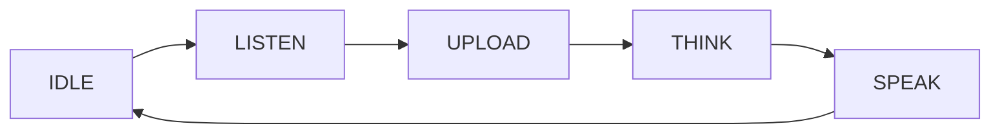

A **voice chat mode** decides *when* the device listens, uploads, and replies — press-and-hold to talk, click once, wake by keyword, or chat hands-free. `ai_manage_mode` is the component that registers these modes, switches between them, and routes events (user, VAD, key) to whichever mode is active.

It sits between the device's inputs (button, microphone, wake word) and [`ai_agent`](ai-agent), which does the actual cloud talking. A mode never uploads audio itself; it decides the *moment* to start and stop, then drives `ai_agent`.

## Terms

| Term | Meaning |
|------|---------|
| Chat mode | The interaction style that decides when the device listens and uploads — `hold`, `oneshot`, `wakeup`, or `free`. |
| VAD | Voice Activity Detection — detects whether the user is currently speaking. |
| Mode handle | An `AI_MODE_HANDLE_T` — the set of callbacks one mode implements (init, task, event handling, and so on). |

## What a chat mode is

Every mode answers one question: **when should the device start and stop capturing the user's voice?** The four built-in modes answer it differently.

| Mode | Enum | Trigger | Stops capturing on |
|------|------|---------|--------------------|
| Hold | `AI_CHAT_MODE_HOLD` | Press and hold the button | Button release |
| One-shot | `AI_CHAT_MODE_ONE_SHOT` | Click the button once | VAD detects end of speech |
| Wake word | `AI_CHAT_MODE_WAKEUP` | Speak the wake word | VAD detects end of speech |
| Free | `AI_CHAT_MODE_FREE` | Always listening | Never — continuous |

The enum is `AI_CHAT_MODE_E`. Custom modes start at `AI_CHAT_MODE_CUSTOM_START` (`0x100`) so their values never collide with the built-in ones.

```c
typedef enum {
    AI_CHAT_MODE_HOLD,
    AI_CHAT_MODE_ONE_SHOT,
    AI_CHAT_MODE_WAKEUP,
    AI_CHAT_MODE_FREE,

    AI_CHAT_MODE_CUSTOM_START = 0x100,
} AI_CHAT_MODE_E;
```

## The mode lifecycle

Whatever the trigger, every mode runs the same state machine, exposed as `AI_MODE_STATE_E`. The active mode advances through these states as a turn progresses; query the current one with `ai_mode_get_state`.

| State | Meaning |
|-------|---------|
| `AI_MODE_STATE_INIT` | The mode is being initialized. |
| `AI_MODE_STATE_IDLE` | Initialized and waiting for a trigger. |
| `AI_MODE_STATE_LISTEN` | Capturing the user's voice. |
| `AI_MODE_STATE_UPLOAD` | Sending the captured audio to the cloud. |
| `AI_MODE_STATE_THINK` | The cloud is processing (ASR + reasoning). |
| `AI_MODE_STATE_SPEAK` | Playing back the cloud's reply. |
| `AI_MODE_STATE_INVALID` | No mode is active, or the mode is uninitialized. |



:::note
`ai_mode_get_state` returns `AI_MODE_STATE_INVALID` when no mode has been initialized. Initialize a mode with `ai_mode_init` before relying on the state.
:::

## How a mode is implemented

A mode is a set of callbacks gathered in an `AI_MODE_HANDLE_T`, registered against an `AI_CHAT_MODE_E` value with `ai_mode_register`. Only `name`, `init`, `deinit`, `task`, `handle_event`, `get_state`, and `client_run` are required; `vad_change` and `handle_key` exist only when the audio and button components are enabled.

```c
typedef struct {
    const char *name;

    OPERATE_RET     (*init)         (void);
    OPERATE_RET     (*deinit)       (void);
    OPERATE_RET     (*task)         (void *args);
    OPERATE_RET     (*handle_event) (AI_NOTIFY_EVENT_T *event);
    AI_MODE_STATE_E (*get_state)    (void);
    OPERATE_RET     (*client_run)   (void *data);

#if defined(ENABLE_COMP_AI_AUDIO) && (ENABLE_COMP_AI_AUDIO == 1)
    OPERATE_RET     (*vad_change)   (AI_AUDIO_VAD_STATE_E vad_state);
#endif

#if defined(ENABLE_BUTTON) && (ENABLE_BUTTON == 1)
    OPERATE_RET     (*handle_key)   (TDL_BUTTON_TOUCH_EVENT_E event, void *arg);
#endif
} AI_MODE_HANDLE_T;
```

The built-in modes already provide their handles; you register them with one call each (`ai_mode_hold_register`, `ai_mode_oneshot_register`, and the rest). You only define your own `AI_MODE_HANDLE_T` when you build a custom mode.

## API reference

Header: `ai_manage_mode.h`. Functions return `OPERATE_RET` (`OPRT_OK` on success) unless noted otherwise.

| Function | Parameters | Purpose |
|----------|------------|---------|
| `ai_mode_register` | `mode`, `handle` | Register a mode handle against a chat-mode value. Registration order sets the `ai_mode_switch_next` cycle order. |
| `ai_mode_init` | `mode` | Initialize a registered mode and make it the active mode. |
| `ai_mode_deinit` | — | Deinitialize the active mode. |
| `ai_mode_task_running` | `args` | Run the active mode's `task` callback — call this in your loop to advance its state machine. |
| `ai_mode_handle_event` | `event` | Forward an `AI_NOTIFY_EVENT_T` to the active mode. |
| `ai_mode_get_state` | — | Return the active mode's `AI_MODE_STATE_E` (`AI_MODE_STATE_INVALID` if none). |
| `ai_mode_client_run` | `data` | Run the active mode's `client_run` callback. |
| `ai_mode_vad_change` | `vad_state` | Forward a VAD state change to the active mode. Requires `ENABLE_COMP_AI_AUDIO`. |
| `ai_mode_handle_key` | `event`, `arg` | Forward a button event to the active mode. Requires `ENABLE_BUTTON`. |
| `ai_mode_get_curr_mode` | `mode` (out) | Get the active chat mode. |
| `ai_mode_switch` | `mode` | Switch to another mode — deinitializes the current one and initializes the target. |
| `ai_mode_switch_next` | — | Switch to the next registered mode and return its `AI_CHAT_MODE_E` value. |
| `ai_get_mode_state_str` | `state` | Return a human-readable name for a state. |
| `ai_get_mode_name_str` | `mode` | Return a human-readable name for a mode. |
| `ai_mode_is_in_register_list` | `mode` | Return `TRUE` if the mode is registered. |
| `ai_get_first_mode` | `out_mode` (out) | Get the first registered mode. |

:::tip
`ai_mode_switch_next` cycles modes in the order you registered them. Wire it to a long-press or a settings toggle to let the user rotate through chat modes at runtime.
:::

## Wire it into an app

Register the modes you need at startup, initialize a default one, then run the task loop and forward events.

```c
#include "ai_manage_mode.h"
#include "ai_mode_hold.h"
#include "ai_mode_oneshot.h"

OPERATE_RET ai_modes_start(void)
{
    OPERATE_RET rt = OPRT_OK;

    // 1. Register the modes you want. Registration order = switch-next order.
    TUYA_CALL_ERR_RETURN(ai_mode_hold_register());
    TUYA_CALL_ERR_RETURN(ai_mode_oneshot_register());

    // 2. Initialize a default mode.
    TUYA_CALL_ERR_RETURN(ai_mode_init(AI_CHAT_MODE_HOLD));
    return rt;
}

// 3. Advance the active mode's state machine in your loop.
void ai_mode_loop(void *args)
{
    while (1) {
        ai_mode_task_running(args);
        tal_system_sleep(10);
    }
}

// Rotate to the next registered mode (e.g. from a long-press).
void ai_mode_cycle(void)
{
    AI_CHAT_MODE_E next = ai_mode_switch_next();
    PR_NOTICE("Switched to mode: %s", ai_get_mode_name_str(next));
}
```

## Add a custom mode

Implement the required callbacks, fill an `AI_MODE_HANDLE_T`, and register it with a value at or above `AI_CHAT_MODE_CUSTOM_START`.

```c
static AI_MODE_STATE_E sg_state = AI_MODE_STATE_IDLE;

static OPERATE_RET my_mode_init(void)   { sg_state = AI_MODE_STATE_IDLE; return OPRT_OK; }
static OPERATE_RET my_mode_deinit(void) { return OPRT_OK; }
static AI_MODE_STATE_E my_mode_get_state(void) { return sg_state; }

static OPERATE_RET my_mode_task(void *args)
{
    switch (sg_state) {
        case AI_MODE_STATE_IDLE:   /* wait for a trigger */ break;
        case AI_MODE_STATE_LISTEN: /* capture voice */      break;
        default: break;
    }
    return OPRT_OK;
}

static OPERATE_RET my_mode_handle_event(AI_NOTIFY_EVENT_T *event) { return OPRT_OK; }

OPERATE_RET my_mode_register(void)
{
    AI_MODE_HANDLE_T handle = {
        .name         = "my_mode",
        .init         = my_mode_init,
        .deinit       = my_mode_deinit,
        .task         = my_mode_task,
        .handle_event = my_mode_handle_event,
        .get_state    = my_mode_get_state,
    };
    return ai_mode_register(AI_CHAT_MODE_CUSTOM_START, &handle);
}
```

## See also

- [Hold-to-Talk Mode](ai-mode-hold) — press and hold to record
- [One-Shot Mode](ai-mode-oneshot) — click once for a single turn
- [Wake-Word Mode](ai-mode-wakeup) — start a turn by voice
- [Free Conversation Mode](ai-mode-free) — always-listening hands-free chat
- [AI Agent](ai-agent) — the cloud bridge that modes drive
- [Component Framework](ai-components.md) — how modes fit the wider AI framework
- [Multimodal Data Flow](../multimodal-data-flow) — how voice and other inputs travel to the cloud
