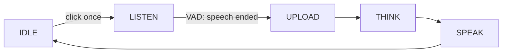

**One-shot** is the chat mode where you click the button once to start a single turn. The device begins listening immediately, and Voice Activity Detection (VAD) ends the turn when you stop speaking — you do not hold the button.

It is one of the four [voice chat modes](ai-mode-manage); register it with `ai_mode_oneshot_register()`.

## When to use it

Use one-shot for a quick, one-click question or command where you do not want to hold the button down:

- **Single, self-contained turns** — one click, one question, one reply. Good for "what's the weather" style interactions.
- **Hands-light** — you only touch the button to start; VAD handles the stop, so you can speak naturally and let go.
- **Quieter rooms** — because VAD decides when speech ends, it works best where background noise will not be mistaken for the end (or start) of your sentence.

The trade-off versus [hold-to-talk](ai-mode-hold) is that you give up exact control of the end of capture: VAD chooses when the turn stops. In noisy rooms, prefer hold-to-talk. For multi-round hands-free chat, use [free](ai-mode-free) mode.

## How it behaves

A turn follows the shared mode lifecycle. A single click moves the device from `IDLE` into `LISTEN`; when VAD detects that you have stopped speaking, the turn advances through `UPLOAD`, `THINK`, and `SPEAK`, then returns to `IDLE`.



:::note
The turn ends on VAD, not on a second click. The mode needs the button component (`ENABLE_BUTTON`) to receive the click and the audio component (`ENABLE_COMP_AI_AUDIO`) for VAD.
:::

## Enable it

Register the mode at startup, then make it the active mode with `ai_mode_init`:

```c
ai_mode_oneshot_register();
ai_mode_init(AI_CHAT_MODE_ONE_SHOT);   // AI_CHAT_MODE_HOLD | ONE_SHOT | WAKEUP | FREE
```

See [Voice Chat Modes](ai-mode-manage) for the full startup sequence — registering several modes, running the task loop, and switching between them at runtime.

## See also

- [Voice Chat Modes](ai-mode-manage) — register, switch, and route events across all modes
- [Hold-to-Talk Mode](ai-mode-hold) — press and hold to record
- [Wake-Word Mode](ai-mode-wakeup) — start a turn by voice
- [Free Conversation Mode](ai-mode-free) — always-listening hands-free chat
- [AI Agent](ai-agent) — the cloud bridge that modes drive
