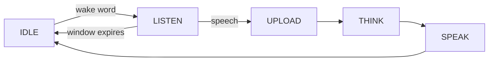

**Wake-word** is the chat mode where a spoken wake word starts a single-round turn — no button. After the wake word, the device listens for a window (about 30 seconds), takes one turn, and then returns to idle.

It is one of the four [voice chat modes](ai-mode-manage); register it with `ai_mode_wakeup_register()`.

## When to use it

Use wake-word mode when you want hands-free interaction but still one deliberate turn at a time:

- **Hands-free start** — say the wake word instead of reaching for a button. Good for devices placed across a room.
- **One round per wake** — each wake word grants a single turn, so the device is not continuously listening or replying after it answers.
- **Bounded listening window** — if no speech follows the wake word, the device returns to idle on its own after the window expires.

The trade-off versus [free](ai-mode-free) mode is that every turn needs a fresh wake word — there is no multi-round follow-up. For continuous back-and-forth, use free mode; for fully manual turns, use [hold-to-talk](ai-mode-hold).

## How it behaves

A turn follows the shared mode lifecycle. The wake word moves the device from `IDLE` into `LISTEN`. If you speak, the turn advances through `UPLOAD`, `THINK`, and `SPEAK`, then returns to `IDLE`. If the listen window expires with no speech, the device returns to `IDLE` directly.

The listen window is `AI_CHAT_WAKEUP_TIME_MS`, defined as `30 * 1000` (30 seconds) in `ai_mode_wakeup.c`.



:::note
After the wake word the device listens for about 30 seconds, then returns to idle if you say nothing. Each new turn needs the wake word again.
:::

## Enable it

Register the mode at startup, then make it the active mode with `ai_mode_init`:

```c
ai_mode_wakeup_register();
ai_mode_init(AI_CHAT_MODE_WAKEUP);   // AI_CHAT_MODE_HOLD | ONE_SHOT | WAKEUP | FREE
```

See [Voice Chat Modes](ai-mode-manage) for the full startup sequence — registering several modes, running the task loop, and switching between them at runtime.

## See also

- [Voice Chat Modes](ai-mode-manage) — register, switch, and route events across all modes
- [Hold-to-Talk Mode](ai-mode-hold) — press and hold to record
- [One-Shot Mode](ai-mode-oneshot) — click once for a single turn
- [Free Conversation Mode](ai-mode-free) — always-listening hands-free chat
- [AI Agent](ai-agent) — the cloud bridge that modes drive
