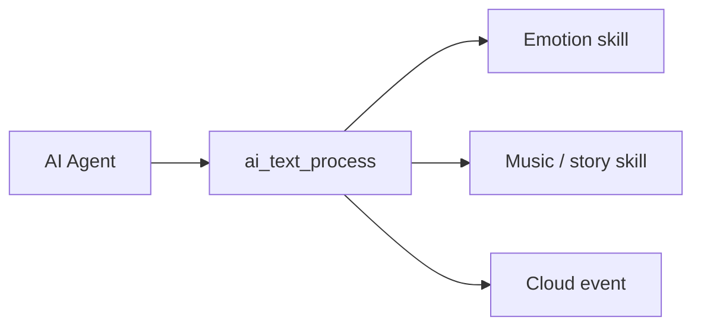

`ai_skills` interprets the structured skill data the AI returns and turns it into device behavior — showing an emotion, playing music or a story, handling playback control, and reacting to cloud events. The [AI Agent](ai-agent) delivers the skill data; this module decides what the device does with it.

## How skills arrive

A skill is structured JSON the cloud sends alongside the conversation. The [AI Agent](ai-agent) hands every text payload to `ai_text_process`, which dispatches it by type:

```c
OPERATE_RET ai_text_process(AI_TEXT_TYPE_E type, cJSON *root, bool eof);
```

| Parameter | Meaning |
|-----------|---------|
| `type` | The payload type: `AI_TEXT_ASR`, `AI_TEXT_NLG`, `AI_TEXT_SKILL`, or `AI_TEXT_CLOUD_EVENT`. |
| `root` | The JSON payload. |
| `eof` | `true` when this is the last chunk of the payload. |

Returns `OPERATE_RET` (`OPRT_OK` on success). When `type` is `AI_TEXT_SKILL`, the module parses the skill JSON and routes it to the matching skill family below; `AI_TEXT_CLOUD_EVENT` goes to the cloud-event handler.



## Skill families

The module ships three skill families. Each has its own header and entry function.

| Family | Header | Key functions | Does |
|--------|--------|---------------|------|
| Emotion | `skill_emotion.h` | `ai_skill_emo_process`, `ai_agent_play_emo`, `ai_emoji_unicode_to_utf8` | Show an emotion on the display. |
| Music / story | `skill_music_story.h` | `ai_skill_parse_music`, `ai_skill_parse_playcontrol`, `ai_skill_playcontrol_music` | Play music or a story and handle playback control. |
| Cloud event | `skill_cloudevent.h` | `ai_parse_cloud_event` | React to a cloud-pushed event. |

### Emotion

The emotion skill maps an emotion name (`HAPPY`, `SAD`, `THINKING`, `SLEEP`, and more — defined as `EMOJI_*` macros in `skill_emotion.h`) to an expression on the display. An emotion is described by an `AI_AGENT_EMO_T`:

```c
typedef struct {
    const char  *emoji;   // emoji code point, e.g. "U+1F636"
    const char  *name;    // emotion name, e.g. "NEUTRAL"
} AI_AGENT_EMO_T;
```

| Function | Parameters | Purpose |
|----------|------------|---------|
| `ai_skill_emo_process` | `json` — emotion skill JSON | Parse an emotion skill payload and play it. |
| `ai_agent_play_emo` | `emo` — pointer to the emotion | Show one emotion on the display. |
| `ai_emoji_unicode_to_utf8` | `unicode_str` — `"U+XXXX"`; `utf8_buf` — output (≥ 5 bytes); `buf_size` — buffer size | Convert a Unicode code point to UTF-8 bytes. Returns the byte count, or `-1` on error. |

`ai_skill_emo_process` and `ai_agent_play_emo` return `OPERATE_RET`.

### Music and story

The music/story skill parses what to play and how to control playback, working over the player's `AI_AUDIO_MUSIC_T`. These functions are built only when `ENABLE_COMP_AI_AUDIO` is set; the [Audio Player](ai-audio-player) does the actual playback.

| Function | Parameters | Purpose |
|----------|------------|---------|
| `ai_skill_parse_music` | `json`; `music` — receives the parsed structure | Parse a music/story payload into an `AI_AUDIO_MUSIC_T`. |
| `ai_skill_parse_music_free` | `music` | Free a parsed music structure. |
| `ai_skill_parse_music_dump` | `music` | Print a music structure for debugging. |
| `ai_skill_parse_playcontrol` | `json`; `music` — receives the parsed structure | Parse a playback-control payload (play, pause, next, and so on). |
| `ai_skill_playcontrol_music` | `music` | Execute the parsed playback-control command. |

`ai_skill_parse_music` and `ai_skill_parse_playcontrol` return `OPERATE_RET`; the others return `void`.

:::warning
Pair every `ai_skill_parse_music` or `ai_skill_parse_playcontrol` call with `ai_skill_parse_music_free` once you finish with the structure, or the device leaks the parsed payload.
:::

### Cloud event

The cloud-event skill handles events the cloud pushes outside the normal reply stream, such as a TTS playback command.

| Function | Parameters | Purpose |
|----------|------------|---------|
| `ai_parse_cloud_event` | `json` — cloud-event JSON | Parse and process a cloud event. Returns `OPERATE_RET`. |

## See also

- [AI Agent](ai-agent) — delivers the skill data this module interprets
- [AI Audio Player](ai-audio-player) — plays the music and stories skills request
- [Component Framework](ai-components.md) — how `ai_skills` fits the wider AI framework
- [Multimodal Data Flow](../multimodal-data-flow) — how data travels between device and cloud
