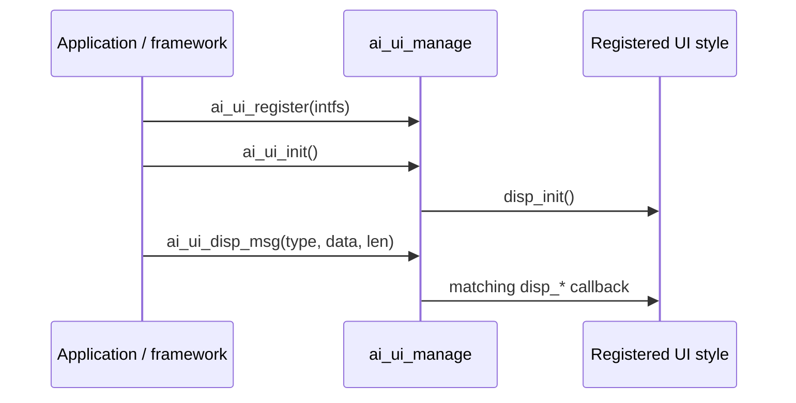

`ai_ui_manage` is the on-screen chat UI dispatch layer of the TuyaOpen AI framework. The framework hands it chat messages — user text, AI replies, emotions, status, notifications, network state, camera frames, pictures — and it routes each one to whichever UI style is registered. The rest of your firmware never draws to the screen directly; it sends a typed message and the registered style renders it.

It sits between the framework (which produces messages) and a concrete UI style (which paints them). The three built-in styles — [WeChat-style](ai-ui-chat-wechat), [Chatbot](ai-ui-chat-chatbot), and [OLED](ai-ui-chat-oled) — each register their own implementation. A custom UI implements the same interface.

## How it works

You register one `AI_UI_INTFS_T` — a set of display callbacks — then call `ai_ui_init()`. From then on, every `ai_ui_disp_msg()` call is queued and dispatched on a UI thread to the matching callback, so the caller never blocks on rendering.



## The UI interface

A UI style implements `AI_UI_INTFS_T`, the contract `ai_ui_manage` calls into. Leave any callback `NULL` if your style does not handle that message. Each callback fires when the framework dispatches the matching message.

| Callback | Fires when |
|----------|------------|
| `disp_init` | The UI module initializes. Set up the display device and screen layout. Returns `OPERATE_RET`. |
| `disp_user_msg` | A user message is shown (the recognized speech or typed text). |
| `disp_ai_msg` | A complete AI reply is shown in one piece. |
| `disp_ai_msg_stream_start` | An AI reply begins streaming. Create the message container. |
| `disp_ai_msg_stream_data` | A chunk of streamed AI text arrives. Append it. |
| `disp_ai_msg_stream_end` | The streamed AI reply is complete. |
| `disp_system_msg` | A system message is shown. |
| `disp_emotion` | The AI expresses an emotion. The string names the emotion. |
| `disp_ai_mode_state` | The AI mode state changes (for example, listening or thinking). |
| `disp_notification` | A notification is shown. |
| `disp_wifi_state` | The network state changes. Receives an `AI_UI_WIFI_STATUS_E`. |
| `disp_ai_chat_mode` | The active chat mode changes. |
| `disp_other_msg` | A message of a custom `type` arrives, with a raw `data`/`len` payload. |
| `disp_camera_start` | A camera preview starts. Receives the frame `width` and `height`. Returns `OPERATE_RET`. |
| `disp_camera_flush` | A camera frame is ready to draw. Returns `OPERATE_RET`. |
| `disp_camera_end` | The camera preview ends. Returns `OPERATE_RET`. |
| `disp_picture` | A picture is shown. Guarded by `ENABLE_COMP_AI_PICTURE`. Returns `OPERATE_RET`. |

## Message types

`ai_ui_disp_msg()` takes an `AI_UI_DISP_TYPE_E` that selects which callback runs:

```c
typedef enum {
    AI_UI_DISP_USER_MSG,                 // user message
    AI_UI_DISP_AI_MSG,                   // complete AI message
    AI_UI_DISP_AI_MSG_STREAM_START,      // AI message stream starts
    AI_UI_DISP_AI_MSG_STREAM_DATA,       // AI message stream chunk
    AI_UI_DISP_AI_MSG_STREAM_END,        // AI message stream ends
    AI_UI_DISP_AI_MSG_STREAM_INTERRUPT,  // AI message stream interrupted
    AI_UI_DISP_SYSTEM_MSG,               // system message
    AI_UI_DISP_EMOTION,                  // emotion
    AI_UI_DISP_STATUS,                   // AI mode state
    AI_UI_DISP_NOTIFICATION,             // notification
    AI_UI_DISP_NETWORK,                  // network state
    AI_UI_DISP_CHAT_MODE,                // chat mode
    AI_UI_DISP_SYS_MAX,
} AI_UI_DISP_TYPE_E;
```

The network state is reported with `AI_UI_WIFI_STATUS_E`:

```c
typedef uint8_t AI_UI_WIFI_STATUS_E;
#define AI_UI_WIFI_STATUS_DISCONNECTED 0  // not connected
#define AI_UI_WIFI_STATUS_GOOD         1  // strong signal
#define AI_UI_WIFI_STATUS_FAIR         2  // normal signal
#define AI_UI_WIFI_STATUS_WEAK         3  // weak signal
```

## API reference

Header: `ai_ui_manage.h`. Every function returns `OPERATE_RET` (`OPRT_OK` on success).

```c
OPERATE_RET ai_ui_register(AI_UI_INTFS_T *intfs);
OPERATE_RET ai_ui_init(void);
OPERATE_RET ai_ui_disp_msg(AI_UI_DISP_TYPE_E tp, uint8_t *data, int len);
OPERATE_RET ai_ui_camera_start(uint16_t width, uint16_t height);
OPERATE_RET ai_ui_camera_flush(uint8_t *data, uint16_t width, uint16_t height);
OPERATE_RET ai_ui_camera_end(void);
OPERATE_RET ai_ui_disp_picture(TUYA_FRAME_FMT_E fmt, uint16_t width, uint16_t height,
                               uint8_t *data, uint32_t len);  // ENABLE_COMP_AI_PICTURE
```

| Function | Parameters | Purpose |
|----------|------------|---------|
| `ai_ui_register` | `intfs` — the style's `AI_UI_INTFS_T` | Register a UI style's display callbacks. |
| `ai_ui_init` | — | Initialize the UI module; invokes the registered `disp_init`. |
| `ai_ui_disp_msg` | `tp`, `data`, `len` — message type, payload, length | Queue a typed message for the registered style to render. |
| `ai_ui_camera_start` | `width`, `height` — frame size | Start a camera preview. |
| `ai_ui_camera_flush` | `data`, `width`, `height` — frame buffer and size | Draw one camera frame. |
| `ai_ui_camera_end` | — | End the camera preview. |
| `ai_ui_disp_picture` | `fmt`, `width`, `height`, `data`, `len` | Show a picture. Available when `ENABLE_COMP_AI_PICTURE` is set. |

:::note
Register a style **before** calling `ai_ui_init()` — initialization runs the style's `disp_init` callback. Each built-in style provides a register function (for example, `ai_ui_chat_wechat_register()`) that calls `ai_ui_register` for you.
:::

## Register a UI style

Pick one built-in style's register function, then initialize the module:

```c
#include "ai_ui_manage.h"
#include "ai_ui_chat_wechat.h"

OPERATE_RET ui_start(void)
{
    OPERATE_RET rt = OPRT_OK;

    // Register a UI style (WeChat, Chatbot, or OLED).
    TUYA_CALL_ERR_RETURN(ai_ui_chat_wechat_register());

    // Initialize the UI module — runs the style's disp_init callback.
    TUYA_CALL_ERR_RETURN(ai_ui_init());

    return rt;
}
```

To build a custom UI, fill in your own `AI_UI_INTFS_T` and register it directly:

```c
static OPERATE_RET my_disp_init(void) { /* set up the screen */ return OPRT_OK; }
static void my_disp_user_msg(char *string) { /* draw the user message */ }
static void my_disp_ai_msg(char *string)   { /* draw the AI reply */ }

OPERATE_RET my_ui_register(void)
{
    static AI_UI_INTFS_T intfs = {
        .disp_init     = my_disp_init,
        .disp_user_msg = my_disp_user_msg,
        .disp_ai_msg   = my_disp_ai_msg,
        // leave unhandled callbacks NULL
    };
    return ai_ui_register(&intfs);
}
```

## See also

- [WeChat-style UI](ai-ui-chat-wechat) — bubble chat for color LCDs
- [Chatbot UI](ai-ui-chat-chatbot) — centered single-message display
- [OLED UI](ai-ui-chat-oled) — for small monochrome screens
- [AI Agent](ai-agent) — the cloud bridge that produces the messages
- [Component Framework](ai-components.md) — how `ai_ui` fits the wider AI framework
