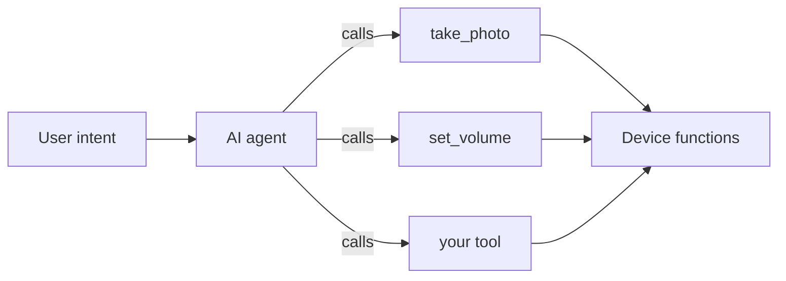
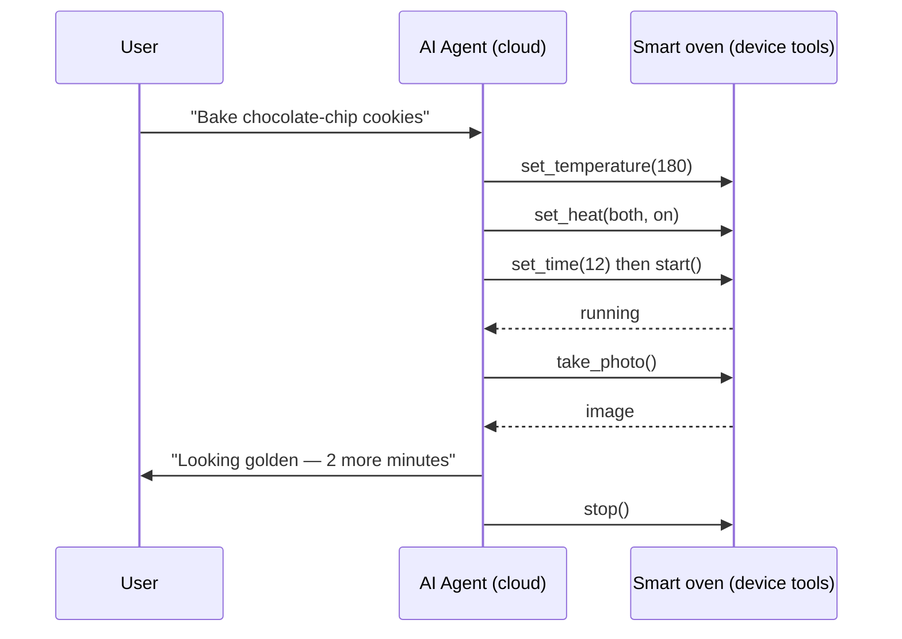

A **device MCP tool** wraps one of your device's functions — read a sensor, change a setting, move a motor, take a photo — so the on-device AI agent can call it. Tools are how an agentic device turns its capabilities into something the AI can actually use. This page is the design thinking behind good tools; for the API, see [MCP Server](../ai-components/ai-mcp-server).

## Why tools instead of commands

In an app-first device you write the flow: button → handler → action. In an agentic device you instead publish a **menu of capabilities** and let the agent decide which to use, in what order, based on the conversation. Each capability you publish is a tool.

The agent reads each tool's **name and description** to decide when to call it. That means your tool definitions are not just plumbing — they are instructions the AI relies on. Write them for the model to read.

## What makes a good tool

### Name by intent, not implementation

The name and description should describe *what the user gets*, not how the firmware does it. `set_room_temperature` is better than `pwm_write_channel_3`. The agent matches user intent to that description, so vague or internal names lead to the wrong tool being called — or none.

### One tool, one job

A tool that does several things is hard for the agent to choose correctly. Split "manage the light" into `set_brightness`, `set_color`, and `turn_off`. Small, single-purpose tools compose; multi-purpose tools confuse.

### Describe parameters precisely

Each parameter (an MCP *property*) needs a type and, where it applies, a range. `volume` is an integer `0–100`; `mode` is one of a fixed set. Precise bounds let the agent supply valid arguments and let your callback trust its inputs. TuyaOpen properties support typed defaults and ranges — see `ai_mcp_property_set_range` and the `set_default_*` helpers in [MCP Server](../ai-components/ai-mcp-server).

### Return structured, meaningful results

A tool should report what happened so the agent can speak about it: the new temperature, the photo it captured, "off." Return typed values (bool, int, string, JSON, or an image), not just success/failure. The agent turns your return value into its reply.

### Make tools safe by default

The agent will call tools in combinations you didn't anticipate. Protect the device:

- **Validate inside the callback** even though properties are typed — never trust a value blindly.
- **Make actions idempotent** where you can, so a repeated call is harmless.
- **Gate the dangerous ones.** Destructive or irreversible actions (factory reset, unlock) deserve a confirmation step, not a bare tool.
- **Apply least privilege.** Only publish tools the product actually needs the AI to reach.

## Worked example: a smart oven

A smart oven is a clear case of "expose capabilities, not flows." The oven has a handful of physical functions; wrap each as a tool and the agent can cook from a spoken recipe — something you could never script as a fixed menu.

### Wrap the oven's functions as tools

| Tool | Properties | Returns | Maps to |
|------|------------|---------|---------|
| `set_temperature` | `celsius` (int, 0–250) | new setpoint | heater control |
| `set_time` | `minutes` (int, 0–180) | timer value | countdown timer |
| `set_heat` | `element` (`top` / `bottom` / `both`), `on` (bool) | element state | top/bottom elements |
| `start` | — | running state | begin the cycle |
| `stop` | — | stopped state | end the cycle |
| `take_photo` | — | JPEG image | interior camera |

Each is intent-named, single-purpose, has typed and bounded properties, and returns a meaningful result — exactly the rules above. The bounds matter: capping `celsius` at 250 means the agent physically cannot ask for an unsafe temperature.

### Let the agent plan the recipe

Because the oven publishes capabilities rather than a fixed "bake" button, the agent turns an open request into a plan and calls the tools in order — including using the camera to *check doneness* and decide whether to keep going.

The recipe knowledge ("cookies bake at 180°C for ~12 minutes," "golden edges mean done") lives in the cloud agent's reasoning and skills. The device only has to expose honest, safe tools. Swap the recipe and nothing on the device changes — that is the agentic-first payoff.

:::tip
This is exactly the interaction shown on the [Device & cloud collaboration](/device-cloud) page — try the interactive recipe demo there to see which steps run on the device versus in the cloud.
:::

## Learn from the built-in tools

TuyaOpen ships a small set of device tools as reference implementations — query device info, take a photo, set volume, switch chat mode. They follow exactly these rules: intent-named, single-purpose, typed properties with ranges, structured returns, and each one gated by the component it touches. Study them in [Built-in MCP Tools](../ai-components/ai-mcp-tools) before writing your own.

## Device tools vs cloud MCP

Two layers of MCP exist, and they solve different problems:

| | Device MCP tools | Cloud MCP |
|---|------------------|-----------|
| Runs on | The device | The Tuya cloud agent |
| Reaches | Local sensors, actuators, peripherals | External services, APIs, databases |
| Defined with | [`ai_mcp` server API](../ai-components/ai-mcp-server) | [Cloud MCP management](../../tuya-cloud/ai-agent/mcp-management) |

A complete product often uses both: device tools for "what this box can sense and do," cloud MCP for "what the world can do for it."

## See also

- [MCP Server](../ai-components/ai-mcp-server) — the device-side tool API
- [Built-in MCP Tools](../ai-components/ai-mcp-tools) — reference implementations
- [Agentic-first hardware](agentic-first-hardware) — why capabilities beat flows
- [Manage cloud MCP](../../tuya-cloud/ai-agent/mcp-management) — the cloud-side counterpart
