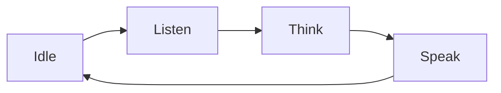

Voice-first design means the **conversation is the main way the user controls the device** — voice carries the interaction, and screens, LEDs, and tones support it rather than lead it. This page covers the principles that make a voice interaction feel natural, and how each one maps to a TuyaOpen capability.

## Why voice-first

Voice is the lowest-friction interface for hardware: it needs no screen, no app, and no learning. It works hands-free and across the room. But voice is also unforgiving — there is no menu to scan, so the device must feel responsive, make its state obvious, and recover gracefully when it mishears. Good voice design is mostly about managing those expectations.

## Principles

### 1. Make every state obvious

The user can't see a cursor or a spinner, so the device must signal where it is in the turn: idle, listening, thinking, or speaking. These map directly to the chat-mode states (`LISTEN`, `UPLOAD`, `THINK`, `SPEAK`) — surface each one with a tone, an LED color, an on-screen indicator, or an animation.

:::tip
Signal "listening" the instant capture starts. The most common voice complaint is talking to a device that wasn't ready.
:::

### 2. Respond instantly, even before the answer

Reasoning takes time; acknowledgement should not. Play a short prompt tone the moment you capture a wake word or button press so the user knows they were heard. TuyaOpen provides cloud prompt tones (`cmd:0`–`cmd:5`) and local alert tones for exactly this — see [AI Agent](../ai-components/ai-agent) and the [Audio Player](../ai-components/ai-audio-player).

### 3. Let the user interrupt

People change their mind mid-sentence. A voice device must support **barge-in**: when the user speaks while the device is talking, stop playback immediately and listen. The agent's session **break** event drives this — handle it by stopping the player and clearing buffers at once.

### 4. Choose the right capture mode

How the device decides *when* to listen shapes the whole feel. Match the [chat mode](../ai-components/ai-mode-manage) to the product and its environment:

| Product context | Mode | Why |
|------------------|------|-----|
| Noisy room, deliberate turns | [Hold-to-talk](../ai-components/ai-mode-hold) | The user controls exactly when it listens |
| Simple single questions | [One-shot](../ai-components/ai-mode-oneshot) | One press, one answer |
| Hands-free, wake word | [Wakeup](../ai-components/ai-mode-wakeup) | Natural, no buttons |
| Continuous conversation | [Free](../ai-components/ai-mode-free) | Multi-turn, always listening after wake |

### 5. Recover from "I didn't catch that"

Misrecognition is normal, not an error state. When ASR returns nothing usable, ask once, simply ("Sorry, say that again?"), and return to listening — never dead-end. Keep prompts short; long apologies are worse than the original miss.

### 6. Keep replies short and spoken-shaped

Text written for the eye reads badly aloud. Favor one idea per sentence, front-load the answer, and let the user ask for more. Configure this in the agent's role and prompt on the [AI Agent platform](../../tuya-cloud/ai-agent/ai-agent-dev-platform).

### 7. Add a screen for what voice does poorly

Voice is bad at lists, numbers, and showing progress. When the device has a display, use the [UI components](../ai-components/ai-ui-manage) to show the transcript, an emotion, a now-playing card, or a photo — reinforcing the conversation, not replacing it.

## Anti-patterns to avoid

- **Silent thinking.** Never go quiet between hearing and answering — the user assumes failure.
- **Voice-only with no fallback.** A network drop should degrade to a clear spoken or visual message, not silence.
- **Reading walls of text aloud.** Summarize; offer detail on request.
- **Ignoring interruptions.** A device that talks over the user feels broken.

## See also

- [Agentic-first hardware](agentic-first-hardware) — the bigger interaction shift
- [Voice Chat Modes](../ai-components/ai-mode-manage) — when the device listens
- [AI Agent](../ai-components/ai-agent) — sessions, prompt tones, and roles
- [Component Framework](../ai-components/ai-components) — the modules behind the voice loop
