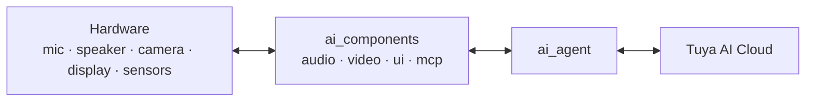

A TuyaOpen AI device is **multimodal**: it takes in speech, text, camera images, and device/sensor data, and responds with speech, on-screen text, and actions. This page categorizes those four modalities and shows how each one travels between the **hardware** (mic, speaker, camera, display, sensors), the **on-device software** (`ai_components`), and the **Tuya AI cloud**.

## The three-layer path

Every modality follows the same path, and `ai_agent` is the single bridge to the cloud. Each modality module owns one class of peripheral and hands its data to — or receives it from — the agent.

You enable only the modalities your product needs in `Kconfig` (`ENABLE_COMP_AI_*`); disabled modules are not compiled in.

## 1. Audio — voice in, voice out

The core modality for a voice assistant.

- **In:** microphone → `ai_audio_input` → Voice Activity Detection (VAD) — manual (a button press) or automatic (voice detection) — slices the speech, which `ai_agent` uploads to cloud ASR. Wake-word listening is driven by the [Wakeup chat mode](ai-components/ai-mode-wakeup).
- **Out:** cloud TTS and music → `ai_audio_player` → decode and resample → speaker.
- **Hardware:** microphone, speaker, and a button for press-to-talk.
- **Components:** [Audio input](ai-components/ai-audio-input), [Audio player](ai-components/ai-audio-player).

## 2. Vision — images in, preview out

- **In:** camera → `ai_video_input` captures a JPEG frame (`ai_video_get_jpeg_frame`) → `ai_agent_send_image` uploads it to cloud vision for visual Q&A or image understanding.
- **Out / preview:** live camera frames render locally through the video display callback; cloud-pushed images stream in through `ai_picture`.
- **Hardware:** camera, display.
- **Components:** [Video input](ai-components/ai-video-input).

## 3. Text — typed or recognized in, rendered out

- **In:** `ai_agent_send_text` sends a string directly; spoken input also comes back as ASR text.
- **Out:** the NLG reply streams back token by token, and `ai_ui` renders it in your chosen style (WeChat-style bubbles, chatbot, or OLED).
- **Hardware:** display (and serial, for the serial chatbot demo).
- **Components:** [AI Agent](ai-components/ai-agent), [UI management](ai-components/ai-ui-manage).

## 4. Sensory / device data — state in, actions out

This is how the cloud AI perceives and controls the physical device.

- The AI reads device state and triggers actions through **MCP tools** exposed by `ai_mcp`: query device information, switch chat mode, take a photo, adjust volume — plus any custom tool you register for your own sensors and actuators.
- Arbitrary byte payloads can also be uploaded with `ai_agent_send_file`.
- **Hardware:** sensors, actuators, GPIO — reached through your MCP tool implementations.
- **Components:** [MCP server](ai-components/ai-mcp-server), [MCP tools](ai-components/ai-mcp-tools).

## Where each modality is handled

| Modality | In (hardware → cloud) | Out (cloud → hardware) | Components |
|----------|------------------------|------------------------|------------|
| **Audio** | mic → VAD → agent | TTS / music → player → speaker | `ai_audio_input`, `ai_audio_player` |
| **Vision** | camera → JPEG → agent | preview / pushed image → display | `ai_video_input`, `ai_picture` |
| **Text** | `send_text` / ASR | NLG stream → UI → display | `ai_agent`, `ai_ui` |
| **Sensory / device** | MCP tool reads, `send_file` | MCP tool actions | `ai_mcp` |

:::note
All four modalities share one cloud session through `ai_agent`. The chat modes decide *when* the device listens and uploads; the agent decides *how* data reaches the cloud; the cloud decides *what* comes back.
:::

## See also

- [Component Framework](ai-components/ai-components.md) — the modules behind each modality
- [AI Agent](ai-components/ai-agent) — the single bridge to the cloud
- [Voice Chat Modes](ai-components/ai-mode-manage) — when the device listens
- [Expose MCP on the device](ai-components/ai-mcp-server) — sensory input and device control
