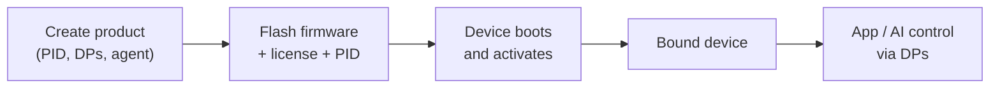

Binding is what connects a physical device to its identity in the Tuya cloud, so the Tuya app and the AI agent can recognize, control, and update it. This page explains the four pieces involved and the order you put them together — read it before you create a product or flash a board.

:::note
Binding uses Tuya Cloud, so it needs a license key (授权码) and a product set up on the platform. See [Equipment authorization](../../quick-start/equipment-authorization).
:::

## The four pieces

| Piece | Lives on | What it is |
|-------|----------|------------|
| **Product (PID)** | Tuya cloud | The cloud definition of your device model — its functions (DPs) and, for AI products, its agent. Identified by a Product ID (`PID`). |
| **License (UUID + AuthKey)** | Flashed into the device | A per-device credential that proves the hardware is genuine. |
| **Activation** | Device ↔ cloud | On first connect, the device presents its license and `PID`, registers with the cloud, and downloads its identity (`DeviceID`, keys, schema). |
| **DP control** | App / AI ↔ device | After activation, the app and agent send commands as data points (DPs); the device reports state back as DPs. |

A device is *bound* once activation succeeds: the cloud now has a unique device tied to your product, and control can flow both ways.

## The binding flow

## What you actually do

Binding is three concrete steps, each with its own guide:

1. **Create your product on the cloud** — define the `PID`, its functions (DPs), the AI agent, and a custom firmware entry. → [Create your product & agent](creating-new-product)
2. **Authorize the device** — write the license (`UUID` + `AuthKey`) and `PID` into the firmware, by code or with the flashing tool. → [Equipment authorization](../../quick-start/equipment-authorization)
3. **Build and flash** — `tos.py build && tos.py flash`. On first boot the device pairs (Bluetooth or Wi-Fi AP) and activates against your product.

After that, the device appears in the Tuya app and the agent can drive it through DPs.

## Where the firmware talks to the cloud

On the device side, the [Tuya IoT client](../iot-client/tuya-iot-client-reference) (`tuya_iot.h`) owns activation, the MQTT connection, and DP reporting. Your application registers an event handler and reacts to incoming DPs — see the handler walk-through in [Create your product & agent](creating-new-product#handle-control-on-the-device) and the minimal [switch_demo](../iot-client/demo-tuya-iot-light) example.

## See also

- [Create your product & agent](creating-new-product) — the cloud-side setup
- [Tuya IoT client API](../iot-client/tuya-iot-client-reference) — the device-side cloud client
- [switch_demo](../iot-client/demo-tuya-iot-light) — a minimal bound device
- [Equipment authorization](../../quick-start/equipment-authorization) — getting and writing a license
