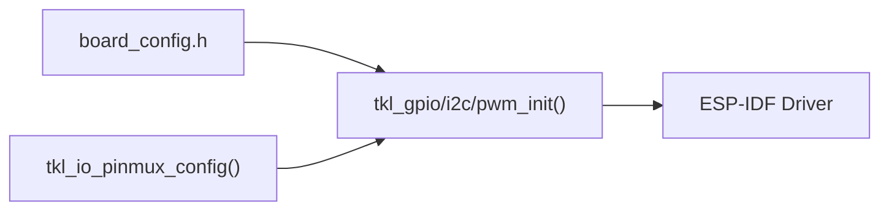

# ESP32 Pin Mapping

TuyaOpen uses a **direct 1:1 mapping** between `TUYA_GPIO_NUM_E` enum values and physical ESP32 GPIO numbers. `TUYA_GPIO_NUM_18` operates on physical `GPIO_NUM_18`.

This mapping is defined in the `pinmap[]` array in [`tkl_pin.c`](https://github.com/tuya/TuyaOpen-esp32/blob/master/tuya_open_sdk/tuyaos_adapter/src/drivers/tkl_pin.c), with chip-specific `#ifdef` blocks that determine the available GPIO range per chip variant.

## Per-Platform Pin Mapping Docs

Each ESP32 chip has a dedicated pinmux doc covering its GPIO range, UART defaults, board configs, and unimplemented TKL/TAL gaps:

- [ESP32 (Classic)](pinmux/esp32-classic) -- Dual-core Xtensa LX6, GPIO 0-39
- [ESP32-S3](pinmux/esp32-s3) -- Dual-core Xtensa LX7, GPIO 0-48, AI/audio capable
- [ESP32-C3](pinmux/esp32-c3) -- Single RISC-V core, GPIO 0-21, cost-optimized
- [ESP32-C6](pinmux/esp32-c6) -- Single RISC-V core, GPIO 0-30, Wi-Fi 6

## Common Pin Mapping Mechanics

These apply across all ESP32 chips.

### I2C Pin Override

I2C pins default to `{GPIO0/GPIO1}` for I2C0 and `{GPIO2/GPIO3}` for I2C1 in [`tkl_i2c.c`](https://github.com/tuya/TuyaOpen-esp32/blob/master/tuya_open_sdk/tuyaos_adapter/src/drivers/tkl_i2c.c). Override before init:

```c
tkl_io_pinmux_config(TUYA_GPIO_NUM_42, TUYA_IIC0_SCL);
tkl_io_pinmux_config(TUYA_GPIO_NUM_41, TUYA_IIC0_SDA);
tkl_i2c_init(TUYA_I2C_NUM_0, &cfg);
```

### PWM Pin Override

PWM defaults to 6 LEDC channels on GPIO 18/19/22/23/25/26 in [`tkl_pwm.c`](https://github.com/tuya/TuyaOpen-esp32/blob/master/tuya_open_sdk/tuyaos_adapter/src/drivers/tkl_pwm.c). Override:

```c
tkl_io_pinmux_config(TUYA_GPIO_NUM_5, TUYA_PWM0);
```

### Code Flow



## ADC Mapping

ADC on ESP32 uses a **port + channel bitmask** model in [`tkl_adc.c`](https://github.com/tuya/TuyaOpen-esp32/blob/master/tuya_open_sdk/tuyaos_adapter/src/drivers/tkl_adc.c):

| TuyaOpen Port | ESP-IDF Unit | Notes |
|--------------|-------------|-------|
| `TUYA_ADC_NUM_0` | `ADC_UNIT_1` | Always available |
| `TUYA_ADC_NUM_1` | `ADC_UNIT_2` | Unavailable during Wi-Fi on classic ESP32 |

**Channel selection:** `cfg->ch_list.data` is a bitmask where bit N enables `ADC_CHANNEL_N`.

**Fixed settings:** Attenuation is `ADC_ATTEN_DB_12` (~0-3.3 V range). `tkl_adc_ref_voltage_get()` returns 3300 mV. Calibration uses curve-fitting (S2/S3/C3/C6) or line-fitting (classic ESP32).

**Not supported:** `tkl_adc_temperature_get()` returns `OPRT_NOT_SUPPORTED`. Use the ESP-IDF temperature sensor driver instead.

## TKL/TAL Implementation Gaps (All ESP32 Chips)

These TKL/TAL interfaces are **not implemented** or are **no-ops** in the ESP32 adapter:

| Interface | Status | Workaround |
|-----------|--------|-----------|
| `tkl_spi` | **Not implemented** (no `tkl_spi.c` in adapter) | Use ESP-IDF `spi_bus_*` directly or board BSP in `boards/ESP32/common/lcd/` |
| `tkl_pinmux` SPI routing | **No-op** (cases are empty `break`) | SPI pins set in `board_config.h`, consumed by BSP |
| `tkl_io_pin_to_func()` | **Stub** (returns `OPRT_NOT_SUPPORTED`) | Not used in practice; pin functions are implicit |
| `tkl_dac` | **Not implemented** (no `tkl_dac.c`) | Use ESP-IDF `dac_output_*` directly |
| `tkl_bt` on ESP32-S2 | **Excluded** at compile time | ESP32-S2 has no Bluetooth hardware |
| `tkl_i2s` without `ENABLE_AUDIO` | **Not compiled** | Enable `ENABLE_AUDIO` in Kconfig, or use ESP-IDF I2S directly |
| `tkl_display` | **No TKL abstraction** | Display uses board-level BSP + ESP-IDF LVGL |
| QSPI (`tkl_qspi`) | **Not implemented** | Use ESP-IDF SPI for QSPI displays (SH8601, etc.) |
| `tkl_cpu_sleep_callback_register` | **Returns `OPRT_NOT_SUPPORTED`** | Light sleep is not abstracted; use ESP-IDF `esp_pm_*` directly |
| `tkl_timer_get_current_value` | **Returns `OPRT_NOT_SUPPORTED`** | Timer read-back not implemented |
| `tkl_system_get_cpu_info` | **Returns `OPRT_NOT_SUPPORTED`** | Use ESP-IDF `esp_chip_info()` directly |
| `tkl_flash_lock` / `tkl_flash_unlock` | **Returns `OPRT_NOT_SUPPORTED`** | Flash protection not implemented on ESP32 |
| `tkl_i2c` slave / ioctl | **Returns `OPRT_NOT_SUPPORTED`** | I2C master only; no slave mode in TKL |
| `tkl_thread_set_self_name` | **No-op** (returns `OPRT_OK`) | FreeRTOS task name is set at creation only |

## Source Code References

| File | Purpose | Link |
|------|---------|------|
| `tkl_pin.c` | GPIO pinmap array, init/read/write/IRQ | [tkl_pin.c](https://github.com/tuya/TuyaOpen-esp32/blob/master/tuya_open_sdk/tuyaos_adapter/src/drivers/tkl_pin.c) |
| `tkl_pinmux.c` | I2C/PWM pin routing (SPI no-op) | [tkl_pinmux.c](https://github.com/tuya/TuyaOpen-esp32/blob/master/tuya_open_sdk/tuyaos_adapter/src/drivers/tkl_pinmux.c) |
| `tkl_uart.c` | UART0/1 pin config, USB JTAG mode | [tkl_uart.c](https://github.com/tuya/TuyaOpen-esp32/blob/master/tuya_open_sdk/tuyaos_adapter/src/drivers/tkl_uart.c) |
| `tkl_i2c.c` | I2C bus, default pins, pinmux override | [tkl_i2c.c](https://github.com/tuya/TuyaOpen-esp32/blob/master/tuya_open_sdk/tuyaos_adapter/src/drivers/tkl_i2c.c) |
| `tkl_pwm.c` | LEDC PWM channel-pin map | [tkl_pwm.c](https://github.com/tuya/TuyaOpen-esp32/blob/master/tuya_open_sdk/tuyaos_adapter/src/drivers/tkl_pwm.c) |
| `tkl_gpio.h` | Portable GPIO API | [tkl_gpio.h](https://github.com/tuya/TuyaOpen/blob/master/tools/porting/adapter/gpio/tkl_gpio.h) |
| `board_config.h` | Per-board pin constants | [boards/ESP32/](https://github.com/tuya/TuyaOpen/tree/master/boards/ESP32) |

## References

- [ESP32 on TuyaOpen -- Overview](overview-esp32)
- [ESP32 Supported Features](esp32-supported-features)
- [Adding a New ESP32 Board](esp32-new-board)
