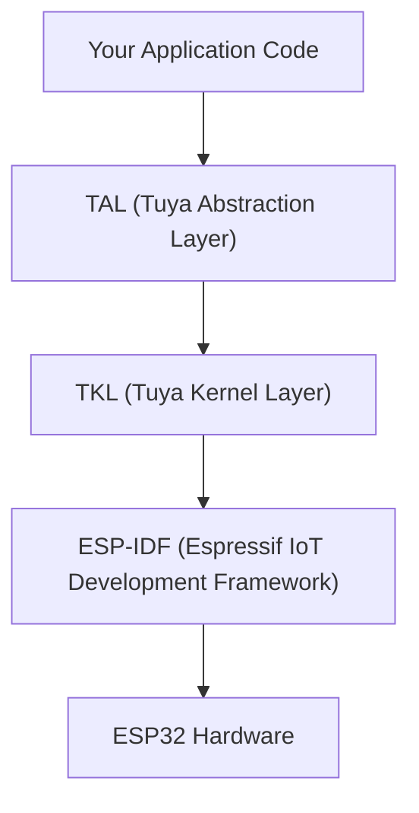

# ESP32 on TuyaOpen

TuyaOpen provides full support for the Espressif ESP32 chip family, enabling you to build IoT and AI applications on ESP32 hardware using the same TuyaOpen SDK and APIs used on Tuya T-series, Linux, and other supported platforms.

## Why Use TuyaOpen on ESP32

If you are an existing ESP32 developer, TuyaOpen gives you:

- **Tuya Cloud integration** -- Device activation, remote control, OTA, and data points (DP) out of the box, without writing your own cloud stack.
- **Cross-platform portability** -- Write application code once using TuyaOpen's TAL/TKL abstraction. The same app logic runs on T5AI, T2, T3, Raspberry Pi, and ESP32 without rewrites.
- **AI capabilities** -- Access Tuya's AI Agent, voice interaction (ASR/TTS/KWS), and LLM services through the unified AI SDK.
- **Production-ready path** -- From prototype to mass production: device authorization, license key management, OTA firmware updates, and Tuya Smart app pairing are built in.
- **Peripheral library** -- Reusable display, audio codec, button, LED, and sensor drivers with board-level configuration.

## Relationship with ESP-IDF

TuyaOpen on ESP32 **builds on top of ESP-IDF**, not as a replacement for it. The architecture:

- **ESP-IDF** remains the underlying SDK. FreeRTOS, lwIP, NVS, Wi-Fi driver, Bluetooth controller -- all come from IDF.
- **TKL adapters** (`tkl_wifi.c`, `tkl_gpio.c`, etc.) translate TuyaOpen's portable API calls into ESP-IDF function calls.
- **Your app code** calls TAL/TKL APIs, which are identical across all TuyaOpen platforms.

You can still use `tos.py idf` to access ESP-IDF commands directly (e.g., `menuconfig`, `monitor`) when you need low-level control.

## Supported Chips and Boards

### Chip Variants

| Chip | Wi-Fi | Bluetooth | Audio/AI | Notes |
|------|-------|-----------|----------|-------|
| ESP32 | Yes | Yes | Limited | Classic Bluetooth + BLE |
| ESP32-C3 | Yes | BLE 5.0 | No | RISC-V core, cost-optimized |
| ESP32-C6 | Yes | BLE 5.0 | No | Wi-Fi 6, Thread/Zigbee |
| ESP32-S3 | Yes | BLE 5.0 | Yes | Dual-core, PSRAM, AI/audio capable |
| ESP32-S2 | Yes | No | No | Bluetooth **not supported** in TuyaOpen |

:::warning ESP32-S2 Limitation
ESP32-S2 does not have Bluetooth hardware. The TuyaOpen BLE adapter (`tkl_bt.c`) is excluded for this variant. If your application requires BLE provisioning or Bluetooth connectivity, use ESP32, ESP32-S3, or ESP32-C3/C6 instead.
:::

### Pre-configured Boards

TuyaOpen ships board support packages (BSP) for these ESP32 boards:

| Board | Chip | Display | Audio | Config File |
|-------|------|---------|-------|-------------|
| ESP32 (generic) | ESP32 | Yes | No | `ESP32.config` |
| ESP32-S3 (generic) | ESP32-S3 | No | No | `ESP32-S3.config` |
| ESP32-C3 (generic) | ESP32-C3 | No | No | `ESP32-C3.config` |
| ESP32-C6 (generic) | ESP32-C6 | No | No | `ESP32-C6.config` |
| DNESP32S3 | ESP32-S3 | Yes | Yes | `DNESP32S3.config` |
| DNESP32S3-BOX | ESP32-S3 | Yes | Yes | `DNESP32S3_BOX.config` |
| DNESP32S3-BOX2 | ESP32-S3 | Yes | Yes | `DNESP32S3_BOX2_WIFI.config` |
| ESP32S3 Bread Compact | ESP32-S3 | No | Yes | `ESP32S3_BREAD_COMPACT_WIFI.config` |
| Waveshare S3 AMOLED 1.8" | ESP32-S3 | Yes (touch) | Yes | `WAVESHARE_ESP32S3_Touch_AMOLED_1.8.config` |
| XingZhi ESP32S3 Cube OLED | ESP32-S3 | Yes (OLED) | Yes | `XINGZHI_ESP32S3_Cube_0_96OLED_WIFI.config` |
| Waveshare ESP32-C6 DevKit | ESP32-C6 | No (LED) | No | `WAVESHARE_ESP32C6_DEV_KIT_N16.config` |

## When to Use ESP-IDF Libraries vs TuyaOpen Libraries

| Need | Use | Why |
|------|-----|-----|
| Wi-Fi, BLE, GPIO, UART, SPI, I2C, PWM, ADC, timer | TuyaOpen TKL/TAL APIs | Cross-platform, consistent API |
| Tuya Cloud, device management, OTA, DP | TuyaOpen cloud service | Required for Tuya ecosystem |
| AI (ASR, TTS, LLM, MCP) | TuyaOpen AI SDK | Integrated with Tuya AI Agent |
| LVGL graphics | ESP32's LVGL (via IDF component) | ESP32 uses its own LVGL port |
| Display drivers (LCD init, SPI bus) | `boards/ESP32/common/display/` | Board-level BSP, calls ESP-IDF LCD APIs |
| Audio codecs (ES8311, ES8388) | `boards/ESP32/common/audio/` | Board-level BSP, calls ESP-IDF I2S/codec APIs |
| Vendor-specific IDF APIs (NVS, ESP-NOW, ULP) | ESP-IDF directly via `tos.py idf` | Not abstracted by TuyaOpen |
| Third-party IDF components | ESP-IDF component manager | Add to `idf_component.yml` in your project |

:::tip Rule of Thumb
Use TuyaOpen APIs for anything you want portable across platforms. Use ESP-IDF directly only for ESP32-specific features that TuyaOpen does not abstract (e.g., ULP coprocessor, ESP-NOW, ESP-MESH).
:::

## ESP32 TKL Feature Support

The TKL adapter layer for ESP32 implements these interfaces:

| TKL Module | Status | Source |
|-----------|--------|--------|
| `tkl_wifi` | Supported | `tuyaos_adapter/src/drivers/tkl_wifi.c` |
| `tkl_bt` (BLE) | Supported (except ESP32-S2) | `tuyaos_adapter/src/drivers/tkl_bt.c` |
| `tkl_pin` (GPIO) | Supported | `tuyaos_adapter/src/drivers/tkl_pin.c` |
| `tkl_uart` | Supported | `tuyaos_adapter/src/drivers/tkl_uart.c` |
| `tkl_pwm` | Supported | `tuyaos_adapter/src/drivers/tkl_pwm.c` |
| `tkl_adc` | Supported | `tuyaos_adapter/src/drivers/tkl_adc.c` |
| `tkl_i2c` | Supported | `tuyaos_adapter/src/drivers/tkl_i2c.c` |
| `tkl_i2s` | Supported (audio enabled) | `tuyaos_adapter/src/drivers/tkl_i2s.c` |
| `tkl_spi` | Supported | `tuyaos_adapter/src/drivers/tkl_spi.c` |
| `tkl_flash` | Supported | `tuyaos_adapter/src/drivers/tkl_flash.c` |
| `tkl_timer` | Supported | `tuyaos_adapter/src/drivers/tkl_timer.c` |
| `tkl_watchdog` | Supported | `tuyaos_adapter/src/drivers/tkl_watchdog.c` |
| `tkl_rtc` | Supported | `tuyaos_adapter/src/drivers/tkl_rtc.c` |
| `tkl_ota` | Supported | `tuyaos_adapter/src/drivers/tkl_ota.c` |
| `tkl_network` | Supported | `tuyaos_adapter/src/drivers/tkl_network.c` |
| `tkl_pinmux` | Supported | `tuyaos_adapter/src/drivers/tkl_pinmux.c` |

## Next Steps

- [Quick Start with ESP32](esp32-quick-start) -- Build and flash your first TuyaOpen project on ESP32
- [Migrating from ESP-IDF to TuyaOpen](esp32-migration-guide) -- Port existing ESP-IDF projects
- [Adding a New ESP32 Board](esp32-new-board) -- Create BSP for custom hardware
- [ESP32 Pin Mapping](esp32-pin-mapping) -- GPIO, UART, I2C, SPI, PWM pin assignments per board
- [ESP32 Supported Features](esp32-supported-features) -- Detailed feature matrix by chip variant

## References

- [Espressif ESP32 Datasheet](https://www.espressif.com.cn/sites/default/files/documentation/esp32_datasheet_en.pdf)
- [TuyaOpen-esp32 GitHub Repository](https://github.com/tuya/TuyaOpen-esp32)
- [TuyaOpen Getting Started](/docs/quick-start)
- [Supported Hardware List](/docs/hardware-specific)
