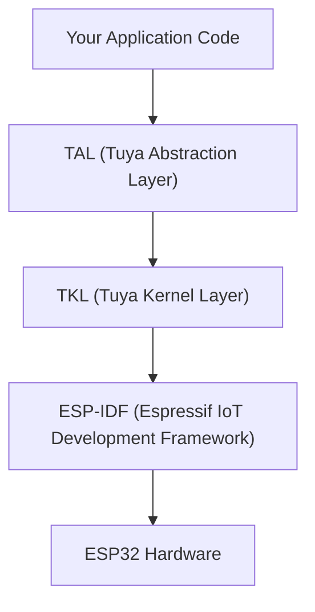

TuyaOpen runs the Espressif ESP32 chip family on top of ESP-IDF, so you build IoT and AI applications on ESP32 hardware with the same TuyaOpen SDK and APIs you use on Tuya T-series, Linux, and other supported platforms.

## Why use TuyaOpen on ESP32

If you already develop on ESP32, TuyaOpen gives you:

- **Tuya Cloud integration**: Device activation, remote control, OTA, and data points (DP) out of the box, without writing your own cloud stack.
- **Cross-platform portability**: Write application code once against TuyaOpen's TAL/TKL abstraction. The same app logic runs on T5AI, T2, T3, Raspberry Pi, and ESP32 without rewrites.
- **AI capabilities**: Access Tuya's AI Agent, voice interaction (ASR/TTS/KWS), and LLM services through the unified AI SDK.
- **Production-ready path**: Device authorization, license key management, OTA firmware updates, and Tuya Smart app pairing are built in, from prototype to mass production.
- **Peripheral library**: Reusable display, audio codec, button, LED, and sensor drivers with board-level configuration.

## Relationship with ESP-IDF

TuyaOpen on ESP32 builds on top of ESP-IDF, not as a replacement for it. The layers stack like this:

- **ESP-IDF** remains the underlying SDK. FreeRTOS, lwIP, NVS, the Wi-Fi driver, and the Bluetooth controller all come from IDF.
- **TKL adapters** (`tkl_wifi.c`, `tkl_gpio.c`, and others) translate TuyaOpen's portable API calls into ESP-IDF function calls.
- **Your app code** calls TAL/TKL APIs, which are identical across all TuyaOpen platforms.

You can still use `tos.py idf` to access ESP-IDF commands directly (e.g., `menuconfig`, `monitor`) when you need low-level control.

## When to use ESP-IDF libraries vs TuyaOpen libraries

| Need | Use | Why |
|------|-----|-----|
| Wi-Fi, BLE, GPIO, UART, SPI, I2C, PWM, ADC, timer | TuyaOpen TKL/TAL APIs | Cross-platform, consistent API |
| Tuya Cloud, device management, OTA, DP | TuyaOpen cloud service | Required for Tuya ecosystem |
| AI (ASR, TTS, LLM, MCP) | TuyaOpen AI SDK | Integrated with Tuya AI Agent |
| LVGL graphics | ESP32's LVGL (via IDF component) | ESP32 uses its own LVGL port |
| Display drivers (LCD init, SPI bus) | `boards/ESP32/common/display/` | Board-level BSP, calls ESP-IDF LCD APIs |
| Audio codecs (ES8311, ES8388) | `boards/ESP32/common/audio/` | Board-level BSP, calls ESP-IDF I2S/codec APIs |
| Vendor-specific IDF APIs (NVS, ESP-NOW, ULP) | ESP-IDF directly via `tos.py idf` | Not abstracted by TuyaOpen |
| Third-party IDF components | ESP-IDF component manager | Add to `idf_component.yml` in your project |

:::tip[Rule of Thumb]
Use TuyaOpen APIs for anything you want portable across platforms. Use ESP-IDF directly only for ESP32-specific features that TuyaOpen does not abstract (e.g., ULP coprocessor, ESP-NOW, ESP-MESH).
:::

## ESP32 Wi-Fi implementation notes

The TKL Wi-Fi adapter (`tkl_wifi.c`) has ESP32-specific behaviors you should know:

- **Power save**: Station mode automatically enables `WIFI_PS_MIN_MODEM` after connecting. This reduces power but may increase latency for real-time applications.
- **Fast connect**: `tkl_wifi_station_fast_connect()` uses a stored channel and BSSID to skip scanning. Credentials are cached in NVS under the namespace `tuya.storage`.
- **AP stop is incomplete**: `tkl_wifi_stop_ap()` returns `OPRT_OK`, but the teardown logic is commented out in the current adapter. Switching from AP to STA mode may require a restart.
- **Stub APIs**: `tkl_wifi_ioctl()` returns `OPRT_NOT_SUPPORTED`. `tkl_wifi_get_bssid()` returns success but does not fill the BSSID buffer. These are not critical for typical use but matter for advanced scenarios.
- **Country code**: The adapter maps region codes (CN, US, JP, EU) to Wi-Fi channel ranges. EU maps internally to country code `"AL"`.

## Next steps

- [Quick Start with ESP32](esp32-quick-start): Build and flash your first TuyaOpen project on ESP32.
- [ESP32 Supported Features](esp32-supported-features): Feature matrix by chip variant.
- [ESP32 Pin Mapping](esp32-pin-mapping): GPIO, UART, I2C, SPI, and PWM pin assignments per board.
- [Adding a New ESP32 Board](esp32-new-board): Create a BSP for custom hardware.
- [ESP32 OTA Updates](esp32-ota): Over-the-air firmware updates.

## See also

- [Espressif ESP32 Datasheet](https://www.espressif.com.cn/sites/default/files/documentation/esp32_datasheet_en.pdf)
- [TuyaOpen-esp32 GitHub Repository](https://github.com/tuya/TuyaOpen-esp32)
- [TuyaOpen Getting Started](/docs/quick-start)
- [Supported Hardware List](/docs/hardware)
