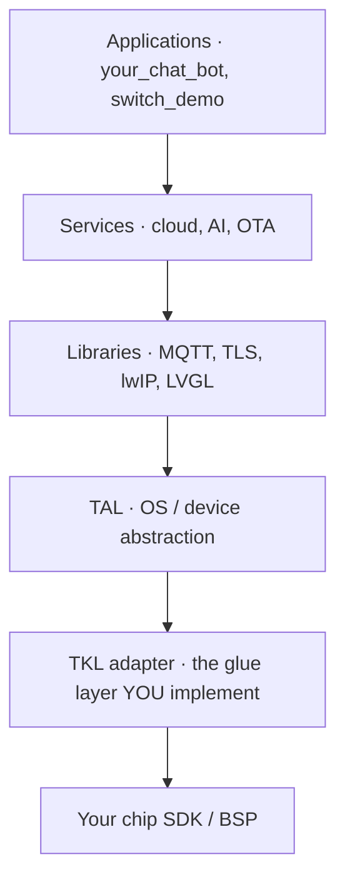

This guide is for **silicon, module, and board vendors** who want their hardware to run TuyaOpen. Porting means implementing a thin adapter — the "glue layer" — that maps your chip SDK onto TuyaOpen's hardware abstraction, so every TuyaOpen application, cloud service, and AI feature runs on your platform unchanged. This page explains what to build, which reference ports to copy from, and what the work unlocks for you.

## Who this is for

The three vendor roles do different amounts of work. Find yours before you start.

| You are a… | Your goal | What you do | Start with |
|------------|-----------|-------------|------------|
| **Chip vendor** (silicon / SDK owner) | Make your SoC or MCU a first-class TuyaOpen target | Implement the full TKL adapter over your chip SDK (system, peripherals, connectivity, storage) | This guide → [Create platform](new-platform) → [Adapt to new platforms](porting-platform) |
| **Module vendor** | Ship a module built on a chip | Reuse the chip's platform port; add module pin/flash/RF config | [Adapt to new platforms](porting-platform), then a board config |
| **Board / DevKit vendor** | Ship a board around an already-supported chip | Add a board definition only — no platform porting | [Adapt to a new board](new-board) |

If your chip is already supported (Tuya T-series, ESP32, BK7231X, GigaDevice, Linux…), you are a module or board vendor: skip platform porting and define a board.

## The big picture: where the glue layer sits

TuyaOpen is layered. Applications, services, and libraries are **platform-independent** and ship as-is. Your port lives in the bottom adapter — the **Tuya Kernel Layer (TKL)** — which calls your chip SDK and BSP.

Everything above the TKL line is reused. Your job is the one layer where TuyaOpen meets your silicon: implement the TKL interfaces by calling your SDK. Because the TKL interface is identical to TuyaOS, a port also runs the commercial TuyaOS SDK without rework.

## Start from a reference port

Do not start from scratch. Tuya maintains complete, working glue-layer ports for several platforms. Copy the one closest to your chip and replace the SDK calls with yours.

| Platform | Reference glue-layer repo | Use it as a model for |
|----------|---------------------------|------------------------|
| Tuya T5 (Wi-Fi + BT AI SoC) | [TuyaOpen-T5AI](https://github.com/tuya/TuyaOpen-T5AI) | A full AI-capable Wi-Fi + Bluetooth SoC port |
| GigaDevice | [TuyaOpen-GigaDevice](https://github.com/tuya/TuyaOpen-GigaDevice) | A GigaDevice MCU / Wi-Fi port |
| Espressif ESP32 | [TuyaOpen-esp32](https://github.com/tuya/TuyaOpen-esp32) | Using the **vendor's lwIP** (adapt `tkl_network.c`) |
| Tuya T2 | [TuyaOpen-T2](https://github.com/tuya/TuyaOpen-T2) | Using **TuyaOpen's lwIP** (adapt `tkl_lwip.c`) |
| Ubuntu / Linux | [TuyaOpen-ubuntu](https://github.com/tuya/TuyaOpen-ubuntu) | Learning the flow and bring-up on a PC first |

:::tip
Bring up the [Ubuntu reference](https://github.com/tuya/TuyaOpen-ubuntu) first, even if it is not your target. It lets you run `switch_demo` end to end — pairing, activation, cloud control — so you understand the behavior your port must reproduce before you touch hardware.
:::

## What you implement: the adapter surface

`tos.py new platform` generates the adapter templates under `platform/<your_chip>/tuyaos/` from `tools/porting/adapter`. You fill in the `.c` files by calling your chip SDK. The surface spans four areas — from raw hardware interfaces up to network protocol interfaces.

| Area | TKL interfaces to implement | Reference |
|------|------------------------------|-----------|
| **System & OS** | system, thread, mutex, semaphore, timer, log output | [System APIs](../../tkl-api/tkl_system) |
| **Hardware interfaces** | GPIO, UART, I2C, SPI, PWM, ADC, DAC, I2S, pinmux, watchdog, RTC | [Hardware interface APIs](../../tkl-api/tkl_gpio) |
| **Connectivity** | Wi-Fi, Bluetooth, network sockets (`tkl_network`) or lwIP (`tkl_lwip`), wired Ethernet | [tkl_wifi](../../tkl-api/tkl_wifi), [tkl_bluetooth](../../tkl-api/tkl_bluetooth) |
| **Storage & OTA** | Flash, OTA; file system via LittleFS (TuyaOpen) or the vendor FS | [tkl_flash](../../tkl-api/tkl_flash), [tkl_ota](../../tkl-api/tkl_ota) |

You implement only the interfaces your product needs — `menuconfig` lets you enable just Wi-Fi, just BLE, or both, and only the matching templates are generated.

:::note
Two connectivity choices matter most. For the network stack, either keep your SDK's lwIP and adapt `tkl_network.c` (like [TuyaOpen-esp32](https://github.com/tuya/TuyaOpen-esp32/blob/master/tuya_open_sdk/tuyaos_adapter/src/drivers/tkl_network.c)) **or** use TuyaOpen's lwIP and adapt `tkl_lwip.c` (like [TuyaOpen-T2](https://github.com/tuya/TuyaOpen-T2/blob/master/tuyaos/tuyaos_adapter/src/tkl_lwip.c)) — adapt only one. For TLS, use your SDK's Mbed TLS or TuyaOpen's. The full RTOS porting reference is [Port TuyaOS to RTOS Platforms](https://developer.tuya.com/en/docs/iot-device-dev/TuyaOS-translation_rtos?id=Kcrwraf21847l).
:::

## Porting workflow

1. **Learn the behavior** — run `switch_demo` on the Ubuntu reference; read [Get Started](../../quick-start/index.md) and the [tos.py guide](../../tos-tools/tos-guide).
2. **Generate the platform** — `tos.py new platform` scaffolds `platform/<your_chip>/` and `boards/<your_chip>/`. See [Create platform](new-platform).
3. **Wire the build** — write the scripts that fetch your toolchain and run your compile/link, producing QIO/UA/UG firmware. See [Adapt to new platforms](porting-platform).
4. **Implement the TKL adapter** — fill the generated `.c` files from your SDK, starting from the reference repo closest to your chip.
5. **Reserve flash for TuyaOpen** — enable `ENABLE_FLASH` and set aside an unused flash region (outside the firmware area, matching erase granularity) for device authorization and the file system.
6. **Validate with a demo** — build `apps/tuya_cloud/switch_demo`, pair, activate, and control the device to confirm the port.

## Recommended bring-up order

Bring up and verify the platform one layer at a time — each stage depends on the one before it, so you always test on a working base. Each stage has its own guide with the goal, the exact files to implement, and how to verify:

| Stage | Goal | Key files |
|-------|------|-----------|
| [1. System and logs](bring-up/system-and-logs) | Boot, OS primitives, logs over UART | `tkl_system.c`, `tkl_output.c`, `tkl_uart.c` |
| [2. Flash and storage](bring-up/flash-and-storage) | Authorization data persists | `tkl_flash.c` |
| [3. Wi-Fi and network](bring-up/wifi-and-network) | Join an AP, reach the internet (TLS) | `tkl_wifi.c`, `tkl_network.c` / `tkl_lwip.c` |
| [4. Cloud connection](bring-up/cloud-connection) | Pair, activate, run `switch_demo` | `tkl_rtc.c`, RNG, `tkl_bluetooth.c` *(opt)* |
| [5. Peripherals and AI](bring-up/peripherals-and-ai) | Audio/display/BLE, then `your_chat_bot` | `tkl_i2s.c`, `tkl_gpio.c`, … |

## Why bring your chip to TuyaOpen

Porting once connects your silicon to an entire AI + IoT ecosystem. Concretely, after the port:

- **Every TuyaOpen app runs on your chip unchanged** — `switch_demo`, `your_chat_bot`, and the broader app library work the day your adapter passes, with no per-app effort.
- **Instant access to the Tuya cloud and AI platform** — your customers get device pairing, OTA, the agent platform, voice, and the Tuya app without building cloud infrastructure.
- **Faster time-to-market for your customers** — module and board makers building on your chip inherit a finished software stack and ship products, not bring-up projects. That makes your silicon easier to design in.
- **Write once, deploy everywhere** — the same application code their team writes runs across your chip and every other TuyaOpen target, so your platform competes on hardware merit, not lock-in.
- **TuyaOS compatibility for free** — because the TKL interface matches TuyaOS, the same port also runs Tuya's commercial SDK, opening the mass-production Tuya ecosystem.
- **Visibility in the ecosystem** — supported platforms appear in the docs, the board lists, and the IDE, putting your chip in front of every TuyaOpen developer.

In short: one adapter turns a bare chip SDK into a complete, cloud-connected, AI-ready product platform — and makes your silicon the easy choice for everyone building on top of it.

## See also

- [Create platform](new-platform) — scaffold the platform with `tos.py new platform`
- [Adapt to new platforms](porting-platform) — the detailed build + TKL steps
- [Adapt to a new board](new-board) — for board/DevKit vendors on a supported chip
- [Hardware interface APIs](../../tkl-api/tkl_gpio) · [tkl_wifi](../../tkl-api/tkl_wifi) · [tkl_bluetooth](../../tkl-api/tkl_bluetooth) — the interfaces you implement
