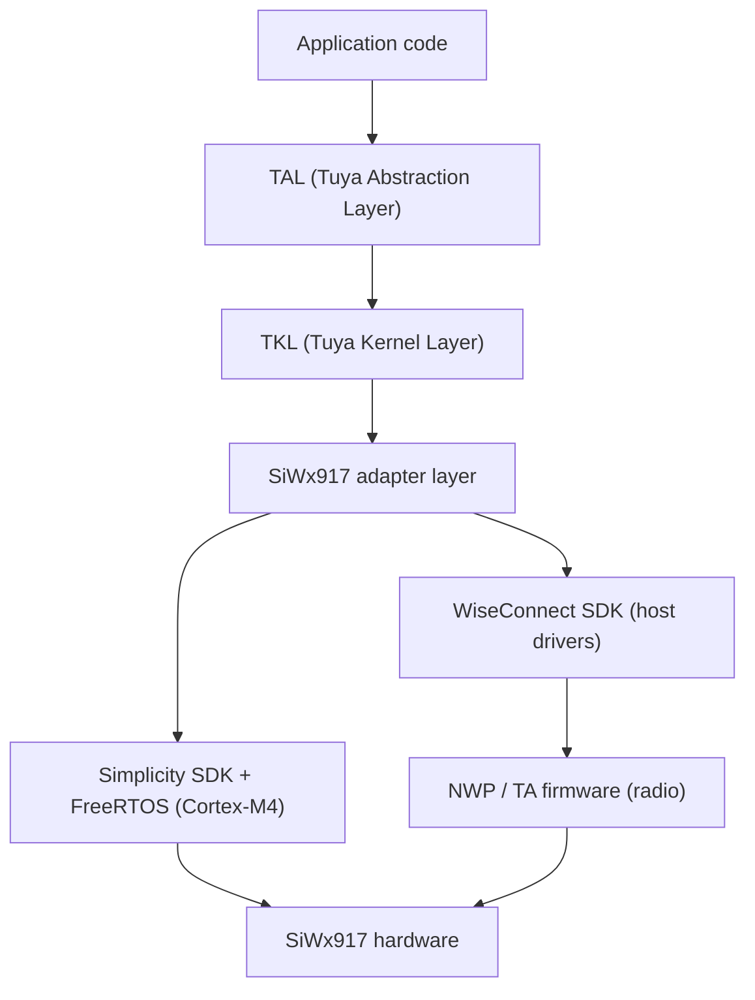

TuyaOpen runs SiWx917 on top of Silicon Labs' official WiseConnect SDK, Simplicity SDK, and FreeRTOS. You use the same TuyaOpen SDK and APIs as on the Tuya T series, ESP32, Linux, and other supported platforms to build IoT and AI applications on SiWx917 hardware.

## Why use TuyaOpen on SiWx917

If you already develop on SiWx917, TuyaOpen gives you:

- **Tuya Cloud integration**: out-of-the-box device activation, remote control, OTA, and data points (DP) — no cloud protocol stack to write yourself.
- **Cross-platform portability**: write application code once against the TAL/TKL abstractions, and the same logic runs on T5AI, T2, T3, ESP32, Raspberry Pi, and SiWx917 without rewrites.
- **AI capabilities**: access the Tuya AI Agent, voice interaction (ASR/TTS/KWS), and LLM services through the unified AI SDK. The AI dev kit is designed for exactly this — a chat button, an analog microphone and speaker, and a display all on board.
- **Path to product**: device authorization, license management, OTA firmware updates, and Tuya Smart app provisioning are built in, from prototype to production.
- **Peripheral libraries**: display, audio, button, and LED drivers out of the box, managed through board-level configs.

## The chip: two processors

SiWx917 (SiWG917) is a Wi-Fi 6 + Bluetooth LE SoC with two processors inside, which makes its flashing and debugging unusual:

| Processor | Runs | Firmware |
|-----------|------|----------|
| Cortex-M4 | Application firmware, FreeRTOS, lwIP, all TuyaOpen code | Produced by your application build (`tos.py build`); flashed on every update |
| NWP (network wireless processor) | Wi-Fi and BLE stacks, radio | TA firmware (`RS9117_WC_SI.rps`); written once per device — dev kits normally ship with it |

The M4 application cannot start without the TA firmware. `tos.py flash` reads the device's TA version and only offers to write it when it is missing; see [Quick Start](siwx917-quick-start#5-flash-the-firmware).

## Relationship to the Silicon Labs SDKs

TuyaOpen on SiWx917 builds on top of the vendor SDKs rather than replacing them:

- **Simplicity SDK** provides CMSIS, peripheral drivers (GPIO, GSPI, ADC, PWM, RTC, UART), and the FreeRTOS port. The TKL adapter (`tkl_gpio.c`, `tkl_spi.c`, …) translates TuyaOpen's cross-platform API into calls on these drivers.
- **WiseConnect SDK** provides the host drivers that talk to the NWP, plus the TA firmware image itself. Wi-Fi and BLE both go through it.
- **Silicon Labs SLC and Simplicity Commander** are the build and flashing tools, downloaded automatically by the platform bootstrap into `platform/SIWX917/tools/` — nothing is written into system directories.

## The platform layer and the first build

Each TuyaOpen platform occupies its own directory under `platform/`, fetched as an independent git repository listed in `platform/platform_config.yaml`. The SiWx917 layer (`platform/SIWX917/`) builds differently from the T5AI platform, and is worth understanding before the first compile.

### Layout of `platform/SIWX917/`

| Path | Contents |
|------|----------|
| `tuyaos_adapter/` | The TKL adapter (`tkl_*.c`) — translates TuyaOpen's cross-platform API into Simplicity SDK peripheral-driver and WiseConnect host-driver calls |
| `mcu/` | Chip-level code and vendor patches (WiseConnect patches, the MP3 internal-RAM scratch pool) |
| `sdks/` | Vendor SDKs, cloned by the first build: `simplicity_sdk/`, `WiseConnect/` |
| `slc/`, `tuyaopen-si91x.slsdk`, `script/generate`, `build_setup.py` | The Silicon Labs SLC project description and the step that generates CMake/sources from it before compiling (`build_kconfig2slcp.py` writes the Kconfig into the `.slcp`) |
| `tools/` | Silicon Labs SLC CLI and Simplicity Commander, installed by the first build |
| `script/bootstrap` | Installs the ARM toolchain, a Java runtime (the SiLabs tools are Java programs), and the SiLabs tools |
| `platform_libsdepend` | The vendor SDK manifest: which repositories, which versions, which patches |
| `platform_prepare.py` | Runs on the first build; pulls what the table below lists |
| `platform_flash_bridge.py` | The entry point behind `tos.py flash` — via Commander + J-Link, or the ISP UART |
| `toolchain_file.cmake` | Locates the ARM GNU toolchain under the shared `platform/tools/` |
| `GETTING_STARTED.md` | Platform documentation, including the ROM bootloader recovery flow |

### What the first build pulls in

The first `tos.py build` runs `platform_prepare.py`; everything lands inside `platform/SIWX917/` — nothing is installed system-wide.

| Pulled | Lands in | Size (Linux x64) |
|--------|----------|------------------|
| GNU Arm Embedded toolchain | `platform/tools/` | ~700 MB |
| Java runtime (Temurin 21, required by the SiLabs tools) | `platform/SIWX917/tools/jre/` | — |
| SLC CLI | `tools/slc/` | ~500 MB |
| Simplicity Commander | `tools/commander/` | ~90 MB |
| Simplicity SDK v2025.6.1 (with submodules) | `sdks/simplicity_sdk/` | ~2.8 GB |
| WiSeConnect v4.0.0-ifc2fc + platform patch | `sdks/WiseConnect/` | ~560 MB |

Budget 4–5 GB of disk.

## Supported boards

| Board | Module | Highlights |
|-------|--------|------------|
| `SIWX917_AI_DEV_KIT` | SiWG917M111MGTBA | Tuya AI dev kit: ST7789 320×240 SPI display, analog microphone + speaker, chat button SW1, SW2/SW3 buttons, RGB LEDs |
| `BRD2605A` | SiWG917M | Silicon Labs dev kit; the on-board debugger exposes a J-Link VCOM, so logs and flashing work over one USB cable with no wiring |

### SIWX917_AI_DEV_KIT (SEKORM AI dev kit)

  

| Resource | Link |
|----------|------|
| Schematic V1.1 (PDF) | [SK_SiWx917_AI_MB_Schematic_V1.1.pdf](https://tuyaopen.ai/docs/hardware/siwx917/SK_SiWx917_AI_MB_Schematic_V1.1.pdf) |
| Purchase (SEKORM) | [https://www.sekorm.com/product/603942256.html](https://www.sekorm.com/product/603942256.html) |

### BRD2605A (Silicon Labs dev kit)

  

An on-board SEGGER J-Link debugger with a virtual COM port (VCOM) covers flashing and logs over a single USB Type-C cable; the board also carries temperature/humidity, ambient-light, and 6-axis sensors plus a Qwiic connector.

| Resource | Link |
|----------|------|
| Schematic (PDF) | [BRD2605A-A02-schematic.pdf](https://www.silabs.com/documents/public/schematic-files/BRD2605A-A02-schematic.pdf) |
| User guide UG581 (PDF) | [UG581-BRD2605A-user-guide.pdf](https://www.silabs.com/documents/public/user-guides/ug581-brd2605a-user-guide.pdf) |
| Product page | [https://www.silabs.com/development-tools/wireless/wi-fi/siwx917-dk2605a-wifi-6-bluetooth-le-soc-dev-kit](https://www.silabs.com/development-tools/wireless/wi-fi/siwx917-dk2605a-wifi-6-bluetooth-le-soc-dev-kit) |
| Purchase (Digi-Key) | [https://www.digikey.com/en/products/detail/silicon-labs/SIWX917-DK2605A/24710290](https://www.digikey.com/en/products/detail/silicon-labs/SIWX917-DK2605A/24710290) |

## Next steps

- [SiWx917 Quick Start](siwx917-quick-start): Build, flash, and provision your first TuyaOpen project on the SIWX917_AI_DEV_KIT.
- [Bring Up New Hardware](../porting/bring-your-chip-to-tuyaopen): The general TuyaOpen porting guides.

## Related documentation

- [Silicon Labs documentation](https://docs.silabs.com/)
- [WiSeConnect SDK repository (GitHub)](https://github.com/SiliconLabs/wiseconnect)
- [SiWx917-DK2605A product page](https://www.silabs.com/development-tools/wireless/wi-fi/siwx917-dk2605a-wifi-6-bluetooth-le-soc-dev-kit)
