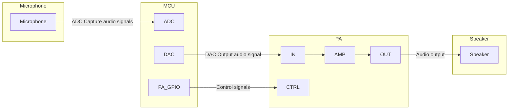
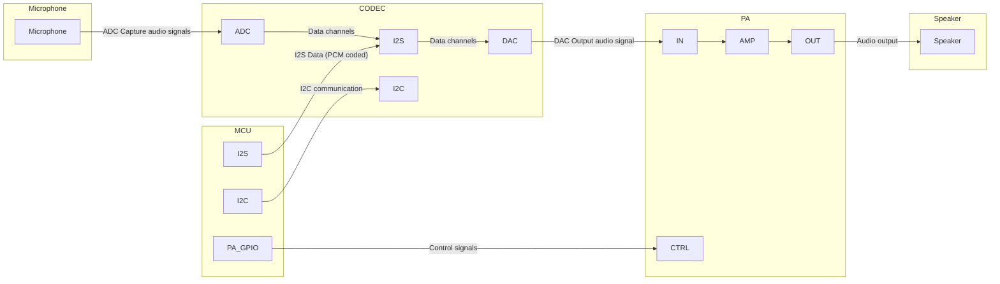
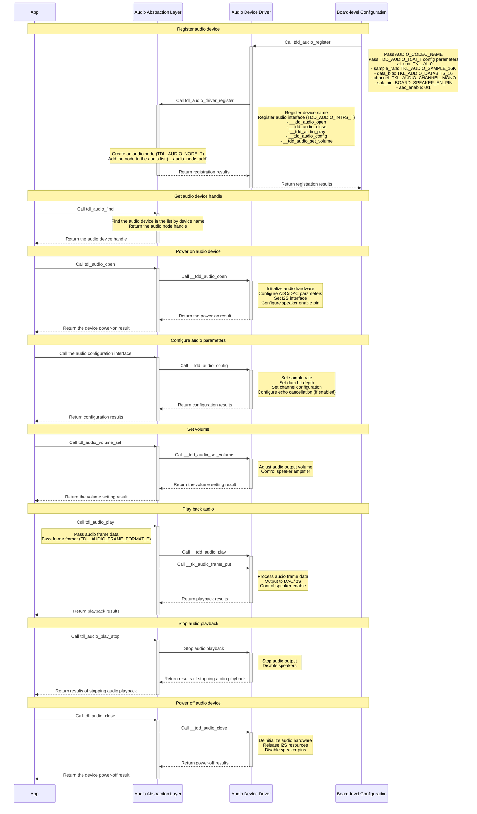

# Audio Driver

## Overview

The [audio driver](https://github.com/tuya/TuyaOpen/tree/master/src/peripherals/audio_codecs) is a core component within TuyaOpen responsible for handling audio input and output. It provides a unified interface to manage different types of audio devices, such as microphones and speakers. Through this driver, applications can easily perform audio capture, playback, and configuration without needing to manage the specific implementation details of the underlying hardware.

## Fundamental concepts

| Term | Definition |
| :---------------------- | :---------------- |
| Microphone (MIC) | A microphone is a transducer that converts sound signals into electrical signals. |
| Speaker (SPK) | A speaker is a device that converts electrical signals into sound signals. |
| Codec | A codec typically consists of two main parts:<ul><li>**Encoder**: Converts raw data (like uncompressed audio or video) into another format for easier storage or transmission.</li><li>**Decoder**: Restores encoded data to its original format for playback or viewing.</li></ul> |
| Power amplifier (PA) | An electronic component that amplifies a weak input signal to drive higher-power loads, such as speakers or antennas. |
| Pulse code modulation (PCM) | An encoding method that converts analog audio signals into digital signals. Raw PCM data (often called PCM raw stream or raw data) is uncompressed and requires decoding for playback. |
| Pulse density modulation (PDM) | A digital audio encoding method characterized by having only one bit of data, using the density of pulses to represent the intensity of the analog signal. |
| Inter-integrated circuit (I2C) | Primarily used for transmitting control signals, configuration parameters, and small amounts of data between chips. Two wires are used for communication, including SDA (serial data) and SCL (serial clock). |
| Inter-IC sound (I2S) | Specifically designed for digital audio data transmission. Uses at least three lines:<ul><li>Serial clock (SCK)</li><li>Word select (WS)</li><li>Serial data (SD)</li></ul> |
| Analog-to-digital converter (ADC) | Converts analog signals (such as sound, light, and temperature) into digital signals for processing, storage, or transmission by computers or other digital systems. <br/>The `analog-to-digital` conversion process typically involves sampling, quantization, and encoding (such as PCM). |
| Digital-to-analog converter (DAC) | Converts digital signals (such as, from computers and MP3 players) into analog signals to drive analog devices like speakers or displays. <br/>The `digital-to-analog` conversion process generates corresponding analog voltage or current outputs based on the digital input values. |

## Audio connection architecture

The audio connection architecture varies depending on the main controller chip. For example, the `T5AI` includes built-in ADC and DAC interfaces and can implement an audio system without a codec chip. In contrast, the `ESP32-S3` does not support DAC and requires an external codec chip to build an audio system.

### Hardware architecture for audio devices with a built-in codec



### Hardware architecture for audio devices with an external codec



## Functional modules

TuyaOpen aims to deliver a standardized, platform-agnostic audio solution. Its core design philosophy centers on layered decoupling, effectively separating the audio requirements of the application layer from the specific hardware implementations at the underlying level.

* **For application developers**: Regardless of whether the underlying hardware utilizes the T5AI chip or another chip's audio codec, the application layer only needs to invoke a single set of unified, standardized APIs (the `tdl_audio_xxx` function series), such as `tdl_audio_open` and `tdl_audio_play`. This significantly reduces development complexity and enhances code portability.
* **For driver developers**: When adding support for a new audio chip, developers simply need to adhere to the standard interface defined in `tdl_audio_driver.h` to write a new TDD-layer driver (similar to `tdd_audio.c`), and then register it with the TDL management layer. This process requires no modifications to any application-layer code.

### Abstract management module (Tuya Driver Layer - TDL)

This is the highest level of abstraction, providing unified audio service interfaces to the application layer.

* `tdl_audio_manage.c/h`: Implements the core logic for audio driver management. It maintains a linked list for registering and managing audio device drivers of different types (or for different platforms). Applications use functions like `tdl_audio_find` and `tdl_audio_open` to access audio functionality without being concerned with the underlying implementation details.
* `tdl_audio_driver.h`: Defines the standardized interface (`TDD_AUDIO_INTFS_T`) that all audio device drivers must adhere to. This includes function pointers for operations like `open`, `play`, `config`, and `close`. This ensures that `tdl_audio_manage` can uniformly interact with any underlying driver that conforms to this standard.


### Instantiation & registration module (Tuya Device Driver - TDD)

This is the driver's intermediate layer, containing the concrete implementations for specific hardware platforms.

`tdd_audio.c/h`: Implements the audio driver for different platforms. It acts as a bridge, fulfilling the `TDD_AUDIO_INTFS_T` standard interface defined by the upper TDL layer, while calling the TKL layer or the hardware abstraction interfaces provided by the chip vendor to control the actual hardware. The `tdd_audio_register` function registers this driver's implementation (function pointers) with the TDL layer.

## Features

**Audio input (microphone capture)**

* Start and stop: Audio capture can be started and stopped using `tdl_audio_open` and `tdl_audio_close`.
* Asynchronous data callback: The driver employs a callback mechanism (`TDL_AUDIO_MIC_CB`) to push captured audio data to the application layer in real-time, frame by frame. The application layer passively receives data instead of proactively polling, leading to higher efficiency.
* Status notification: The callback function delivers not only audio data but also the current status (`TDL_AUDIO_STATUS_E`), such as notifying the application of "Voice Activity Detected (`VAD_START`)" or "Voice Activity Ended (`VAD_END`)".

**Audio output (speaker playback)**

* Play audio stream: The application layer can send audio data blocks (for example, in PCM format) to the driver via the `tdl_audio_play` function, which then routes them to the hardware for playback.
* Playback control: Playback can be stopped immediately by calling `tdl_audio_play_stop` at any time to clear the playback buffer.

**Volume control**

* Set volume: The playback volume of the speaker can be adjusted dynamically (ranging from 0 to 100) at runtime using the `tdl_audio_volume_set` function.

**Acoustic echo cancellation (AEC)**

* Configurable AEC: During audio device initialization, you can choose to enable or disable the AEC function (requires hardware support) through a configuration option (`aec_enable`).
* Enhanced call experience: AEC is a key technology for achieving full-duplex voice calls (simultaneous speaking and listening without producing echo). The driver's built-in AEC support enables it to meet the demands of advanced applications like voice chats and video calls.

**Extensible driver management**
* Dynamic registration and discovery: The system can register multiple different audio drivers simultaneously (such as an onboard codec and an external USB sound card).
* Lookup by name: The application layer can look up and obtain the handle to a specific audio device (`tdl_audio_find`) using a string name (such as `audio_codec`). Therefore, you can easily find the desired devices.

## Supported peripherals

| Codec | Audio recording | Playback |
| :----: | :---: | :---: |
| ES8311 | ✅ | ✅ |
| ES8388 | ✅ | ✅ |
| ES8389 | ✅ | ✅ |
| … |       |       |

## Workflow

Using the T5AI as an example, this section describes how the audio driver framework works.



## Development guide

### Kconfig configuration

To include the driver in the build, verify that the relevant `Kconfig` options are enabled before building. In your target project directory, run `tos.py config menu` on the terminal and check the following configuration options:

| Macro | Type | Description |
| :---------------------- | :----- | ---------------------------------- |
| enable audio codecs | Boolean | The driver code is included in the compilation only when this macro is enabled. |
| audio support AEC | Boolean | Enables the AEC feature (requires hardware support). |
| the name of audio codec | String | Configures the device name for the codec. |
| the num of audio codecs | Integer | Configures the number of board-level codecs. |


:::tip
These configuration items must be supported in both `src/peripherals/audio_codecs/Kconfig` and `boards/<target_platform>/<target_board>/Kconfig` (Check the `Kconfig` file for your specific target board). If you cannot find the relevant configuration items, please review the contents of these two files.
:::

### Runtime environment

To run this driver, you need to first enable the **master enable macro** (`ENABLE_AUDIO_CODECS`). There are three scenarios where this macro becomes active: **Enabled by default for the target board**, **enabled as a dependency by another feature that requires the audio driver**, and **manually enabled**.

:::warning

All subsequent commands must be executed from your target application directory. Do not run them from the TuyaOpen root directory or any other location, as this will cause errors.

:::

#### Scenario 1: Enabled by default for the target board

:::info

This applies when your selected development board comes with a pre-registered audio device. In this case, the board's source files already contain the necessary registration code.

Example: The TUYA_T5AI_EVB board supports both a microphone and a speaker. During its adaptation, the audio device was pre-registered, and the `boards/T5AI/TUYA_T5AI_EVB/Kconfig` file includes the line `select ENABLE_AUDIO_CODECS`. For specific sample code and configuration, refer to `boards/T5AI/TUYA_T5AI_EVB`.

:::

The driver will be enabled automatically whenever this target board is selected.

Run the command to enter the `Kconfig` menu interface.

```shell
tos.py config menu
```

:::warning

After executing `select ENABLE_XXX` in `boards/T5AI/TUYA_T5AI_EVB/Kconfig`, you cannot manually select/deselect it by executing `tos.py config menu`.

:::

#### Scenario 2: Enabled as a dependency by another feature that requires the audio driver

If you enable a feature that depends on the audio driver, the audio driver's enable macro will be activated automatically.

#### Scenario 3: Manually enable the macro

1. Run the command to enter the `Kconfig` menu interface.

   ```shell
   tos.py config menu
   ```

2. Manually locate and enable the macro.


### How to use

#### Adapt an audio driver

:::tip

You can skip this step if a suitable driver for your audio hardware already exists in [tdd_audio](https://github.com/tuya/TuyaOpen/tree/master/boards/ESP32/common/audio). If not, you can adapt an audio driver yourself by following this process:

:::

1. Create `tdd_audio_xxx.c/h` files within `src/peripherals/audio_codecs/tdd_audio`.
2. **Allocate memory** for the device and implement the abstract audio driver interfaces (function pointers such as `open`, `close`, `play`, and `config`) according to your specific hardware.
3. Call the interface to **register a generic audio device node** (`tdl_audio_driver_register()`).
4. Refer to the already adapted drivers for example implementation code.


```c
OPERATE_RET tdd_audio_register(char *name, TDD_AUDIO_T5AI_T cfg)
{
    OPERATE_RET rt = OPRT_OK;

    TDD_AUDIO_DATA_HANDLE_T *_hdl = NULL;
    TDD_AUDIO_INTFS_T intfs = {0};

    /* Allocate memory to the device */
    _hdl = (TDD_AUDIO_DATA_HANDLE_T *)tal_malloc(sizeof(TDD_AUDIO_DATA_HANDLE_T));
    memset(_hdl, 0, sizeof(TDD_AUDIO_DATA_HANDLE_T));
    g_tdd_audio_hdl = _hdl;
    _hdl->play_volume = 80;
    memcpy(&_hdl->cfg, &cfg, sizeof(TDD_AUDIO_T5AI_T));

    /* Register function pointers */
    intfs.open = __tdd_audio_open;
    intfs.play = __tdd_audio_play;
    intfs.config = __tdd_audio_config;
    intfs.close = __tdd_audio_close;

    tdl_audio_driver_register(name, &intfs, (TDD_AUDIO_HANDLE_T)_hdl);
    return rt;
}
```


:::warning

When adapting a driver for ESP32, you need to create new files under the `boards/ESP32/common/audio` directory. Pre-adapted drivers for ESP32-compatible codec chips are also located in this path.

:::

#### Register an audio device

:::tip

If your selected target board already has an audio device pre-registered, you only need to select that target board in the `Kconfig`, and call the `board_register_hardware()` interface in your application. This interface already includes the registration for the corresponding audio device.

:::

1. Implement the registration interface based on the audio codec model and connection pins. It is recommended to place this implementation within the `board_register_hardware()` interface, located at `boards/<target_platform>/<target_board>/xxx.c`.
2. Configure the device's basic information and call the registration interface within `board_register_hardware()`.


```c
OPERATE_RET __board_register_audio(void)
{
    /* Write your struct configuration information here */
    /* begin */

    /* end */
    TUYA_CALL_ERR_RETURN(tdd_audio_register(AUDIO_CODEC_NAME, cfg));
    return rt;
}

OPERATE_RET board_register_hardware(void)
{
	TUYA_CALL_ERR_LOG(__board_register_audio());
	return rt;
}
```


#### Control the device

Utilize the TDL interfaces provided in `src/peripherals/audio_codecs/tdl_audio/include/tdl_audio_manage.h` to control the audio device.

- Locate the device handle by its device name.
- Power on and initialize the audio device.
- Power off the audio device and release associated resources.
- Dynamically adjust the audio output volume.
- Play audio data.
- Stop playing audio data.

For a concrete implementation example, refer to `examples/multimedia/audio`.

## API description

### Configure structure

Construct the hardware configuration information structure for the TDD layer. The following example uses the T5AI platform.


```c
/**
 * @brief Audio device configuration structure for T5AI board.
 *
 * This structure contains all hardware configuration parameters for the audio device,
 * including sample rate, data bits, channels, speaker control pins, and AEC settings.
 */
typedef struct {
    uint8_t aec_enable;
    TKL_AI_CHN_E ai_chn;
    TKL_AUDIO_SAMPLE_E sample_rate;
    TKL_AUDIO_DATABITS_E data_bits;
    TKL_AUDIO_CHANNEL_E channel;

    // spk
    TKL_AUDIO_SAMPLE_E spk_sample_rate;
    int spk_pin;
    int spk_pin_polarity;
} TDD_AUDIO_T5AI_T;
```


### Register structure

To register a structure for your audio driver, you need to implement the corresponding function pointers based on your audio driver.

```c
/**
 * @brief Audio driver interface structure.
 *
 * This structure contains function pointers for all audio operations, providing
 * a unified interface for the audio abstract layer to call driver functions.
 */
typedef struct {
    OPERATE_RET (*open)(TDD_AUDIO_HANDLE_T handle, TDL_AUDIO_MIC_CB mic_cb);
    OPERATE_RET (*play)(TDD_AUDIO_HANDLE_T handle, uint8_t *data, uint32_t len);
    OPERATE_RET (*config)(TDD_AUDIO_HANDLE_T handle, TDD_AUDIO_CMD_E cmd, void *args);
    OPERATE_RET (*close)(TDD_AUDIO_HANDLE_T handle);
} TDD_AUDIO_INTFS_T;
```

### Register an audio device

Registering the audio device driver with the system is the entry point for the audio driver framework. By passing in the device name and configuration parameters, you add the audio device to the management list for use by the application.

```c
/**
 * @brief Registers an audio device driver with the audio management system.
 *
 * This function registers an audio device driver including device name, hardware
 * configuration parameters, and driver interface functions. After successful
 * registration, applications can find and use the audio device by name.
 *
 * @param name Audio device name used for identification and lookup
 * @param cfg Audio device configuration parameters including sample rate, data bits,
 * channels, speaker pin configuration, etc.
 *
 * @return Returns OPRT_OK on successful registration, or an appropriate error code on failure.
 */
OPERATE_RET tdd_audio_register(const char *name, TDD_AUDIO_T5AI_T cfg);
```

### Register an audio driver

Register the underlying audio driver interface to the abstraction layer management system, create device nodes, and maintain the device list.


```c
/**
 * @brief Registers audio device driver interfaces to the abstract layer management system.
 *
 * This function registers audio device driver interface functions to the audio abstract
 * layer management system, creates device nodes and adds them to the device management list
 * for upper layer application calls.
 *
 * @param name Audio device name
 * @param intfs Audio driver interface structure containing various operation function pointers
 *
 * @return Returns OPRT_OK on successful registration, or an appropriate error code on failure.
 */
OPERATE_RET tdl_audio_driver_register(const char *name, TDD_AUDIO_INTFS_T *intfs);

```


### Locate and manage a device

Based on the device name, locate the specified device handle in the list of registered audio devices. This is the key interface for gaining control of the device.


```c
/**
 * @brief Finds an audio device by device name.
 *
 * This function searches for the corresponding audio device node in the registered
 * audio device list based on the device name, and returns a device handle for
 * subsequent operations.
 *
 * @param name Name of the audio device to find
 *
 * @return Returns audio device handle, or NULL if not found.
 */
TDL_AUDIO_HANDLE_T tdl_audio_find(const char *name);

```


### Power on a device

Power on and initialize the audio device, including hardware initialization, pin configuration, and other necessary operations, to make the device fully functional.


```c
/**
 * @brief Opens and initializes an audio device.
 *
 * This function opens the specified audio device and initializes audio hardware
 * including ADC/DAC, I2S interface, speaker enable pins, etc. After successful
 * opening, the device enters a usable state.
 *
 * @param audio_hdl Audio device handle
 *
 * @return Returns OPRT_OK on successful opening, or an appropriate error code on failure.
 */
OPERATE_RET tdl_audio_open(TDL_AUDIO_HANDLE_T audio_hdl);

```


### Power off a device

Power off the audio device and release related resources, including cleaning up by deinitializing hardware and disabling pins.


```c
/**
 * @brief Closes and deinitializes an audio device.
 *
 * This function closes the specified audio device and deinitializes audio hardware
 * including releasing I2S resources, disabling speaker pins, closing ADC/DAC, etc.
 * After closing, the device becomes unavailable and needs to be reopened for use.
 *
 * @param audio_hdl Audio device handle
 *
 * @return Returns OPRT_OK on successful closing, or an appropriate error code on failure.
 */
OPERATE_RET tdl_audio_close(TDL_AUDIO_HANDLE_T audio_hdl);

```


### Adjust the volume

Dynamically adjust the audio output volume and control the speaker amplifier gain.


```c
/**
 * @brief Sets audio output volume.
 *
 * This function adjusts the output volume of the audio device, controls the gain
 * of the speaker amplifier, and implements dynamic volume adjustment functionality.
 *
 * @param audio_hdl Audio device handle
 * @param volume Volume value, typically ranging from 0-100
 *
 * @return Returns OPRT_OK on successful setting, or an appropriate error code on failure.
 */
OPERATE_RET tdl_audio_volume_set(TDL_AUDIO_HANDLE_T audio_hdl, uint8_t volume);

```


### Control audio playback

Play audio data and output audio frames to the speaker through the hardware interface.


```c
/**
 * @brief Plays audio data.
 *
 * This function sends audio frame data to the audio device for playback. Data is
 * output to the speaker through DAC or I2S interface. Supports different audio
 * frame formats.
 *
 * @param audio_hdl Audio device handle
 * @param frame_data Audio frame data pointer
 * @param frame_size Audio frame data size
 * @param format Audio frame format
 *
 * @return Returns OPRT_OK on successful playback, or an appropriate error code on failure.
 */
OPERATE_RET tdl_audio_play(TDL_AUDIO_HANDLE_T audio_hdl, void *frame_data, uint32_t frame_size,
                           TDL_AUDIO_FRAME_FORMAT_E format);

```


### Stop audio playback

Stop the current audio playback, turn off the audio output, and mute the device.

```c
/**
 * @brief Stops audio playback.
 *
 * This function stops the currently ongoing audio playback, closes audio output,
 * disables speaker amplifier, and puts the device into a mute state.
 *
 * @param audio_hdl Audio device handle
 *
 * @return Returns OPRT_OK on successful stopping, or an appropriate error code on failure.
 */
OPERATE_RET tdl_audio_play_stop(TDL_AUDIO_HANDLE_T audio_hdl);

```
