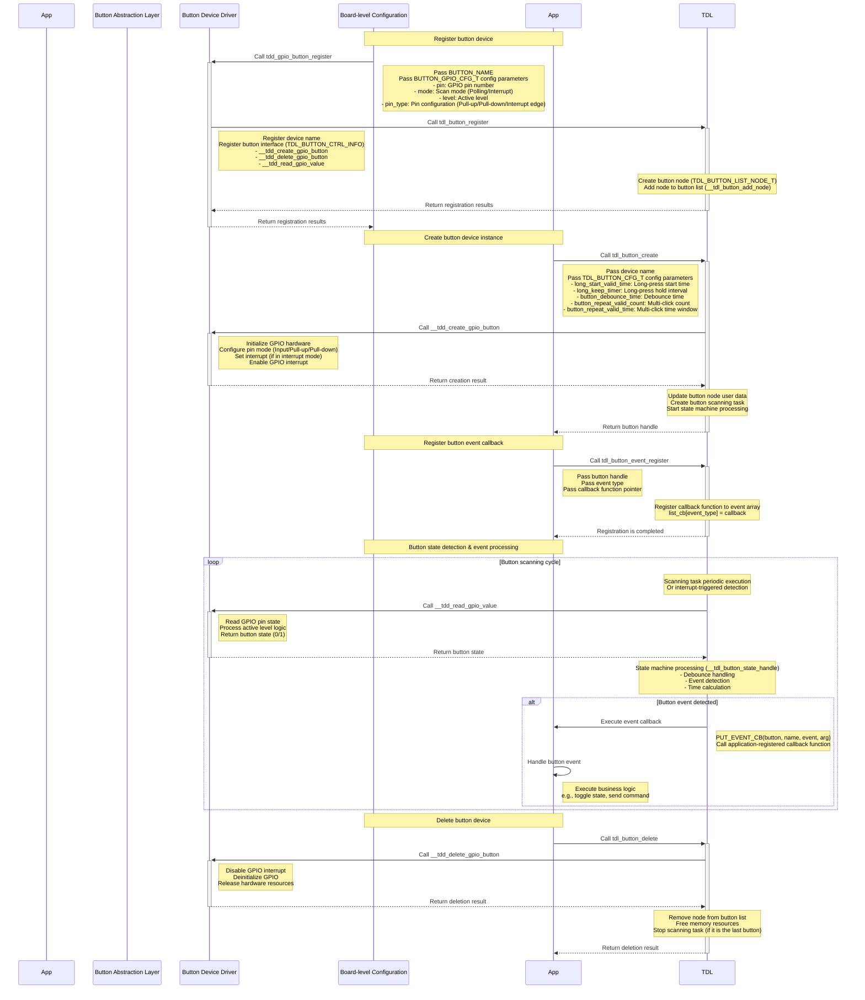
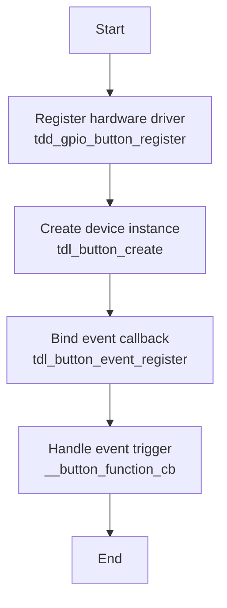

# Button Driver

## Overview

The [button driver](https://github.com/tuya/TuyaOpen/tree/master/src/peripherals/button) is a core component within TuyaOpen responsible for handling user input. It provides unified interfaces to manage different types of button devices and supports various button event detection and handling mechanisms. Through this driver, applications can easily implement button input detection, event handling, and state management without worrying about the specific implementation details of the underlying hardware.

## Fundamental concepts

| Term | Definition |
| --------- | :----------------------------------------------------------- |
| GPIO | General-Purpose Input/Output pins, used to connect external devices such as buttons. |
| Debounce | Buttons generate mechanical bouncing when pressed or released, which must be eliminated through software or hardware methods. |
| Pull-up/Pull-down | The level configuration of a GPIO pin, used to determine the default state when the button is not pressed. |
| Interrupt | An asynchronous notification mechanism triggered by a hardware event, which can achieve low-power button detection. |
| Polling | A detection method that periodically checks the button status, suitable for simple application scenarios. |
| Active level | The level state of the GPIO pin when the button is pressed, which can be configured to be active high or active low. |
| Edge trigger | The interrupt trigger mode, which can be configured as a rising edge, falling edge, or dual-edge triggering. |
| State machine | A logical control mechanism used to manage button event detection and handling. |

## Button connection framework

The button connection method varies depending on the hardware design. Common connection methods include pull-up button and pull-down button.

### Pull-up button connection framework


### Pull-down button connection framework


## Functional modules

TuyaOpen aims to deliver a standardized, platform-agnostic button solution. Its core design philosophy centers on layered decoupling, effectively separating the button requirements of the application layer from the specific hardware implementations at the underlying level.

* **For application developers**: Regardless of the underlying GPIO chip used, the application layer only needs to invoke a unified set of standardized APIs (the `tdl_button_xxx` function series), such as `tdl_button_create` and `tdl_button_event_register`. This significantly reduces development complexity and enhances code portability.
* **For driver developers**: When adding support for a new hardware platform, developers simply need to adhere to the standard interfaces defined in `tdl_button_driver.h` to write a new TDD-layer driver (similar to `tdd_button_gpio.c`), and then register it with the TDL management layer. This process requires no modifications to any application-layer code.

### Abstract management module (Tuya Driver Layer - TDL)

This is the highest level of abstraction, providing unified button service interfaces to the application layer.

* `tdl_button_manage.c/h`: Implements the core logic for button driver management. It maintains a linked list for registering and managing button device drivers of different types (or for different platforms). Applications can use button functionality by calling functions such as `tdl_button_create` and `tdl_button_event_register`, without needing to know the underlying implementation details.
* `tdl_button_driver.h`: Defines the **standardized interfaces** (`TDL_BUTTON_CTRL_INFO`) that all button device drivers must comply with, including function pointers for `button_create`, `button_delete`, and `read_value`. This ensures that `tdl_button_manage` can uniformly interact with any underlying driver that conforms to this standard.

### Instantiation & registration module (Tuya Device Driver - TDD)

This is the driver's intermediate layer, containing the concrete implementations for specific hardware platforms.

`tdd_button_gpio.c/h`: Driver implementation for GPIO buttons. It acts as a bridge, fulfilling the `TDL_BUTTON_CTRL_INFO` standard interface defined by the upper TDL layer, while calling the TKL layer GPIOs to control the actual hardware. The `tdd_gpio_button_register` function registers this driver's implementation (function pointers) with the TDL layer.

## Features

**Button event detection**

* Multiple event types: Supports press, release, click, double-click, multi-click, long-press start, long-press hold, and various other button events.
* Asynchronous event callbacks: The driver employs a callback mechanism (`TDL_BUTTON_EVENT_CB`) to push detected button events to the application layer in real-time. The application layer does not need to proactively poll the button status but passively receives event notifications, resulting in higher efficiency.
* State machine processing: An internal state machine is used to manage various state transitions of the buttons, ensuring the accuracy and reliability of event detection.

**Button scanning modes**

* Timed scanning mode: Periodically checks the button status via a timer, suitable for application scenarios where power consumption is not a critical concern.
* Interrupt scanning mode: Utilizes the GPIO interrupt mechanism to detect changes in button status, enabling low-power button detection, ideal for battery-powered devices.

**Debounce handling**

* Software debounce: Effectively eliminates false triggers caused by mechanical button bounce through configurable debounce time parameters.
* Flexible configuration: The debounce time can be customized according to the characteristics of different buttons.

**Long press functionality**

* Configurable long press detection: Supports configuration of the long press start time and the long press hold trigger interval.
* Separate long press events: Distinguishes between long press start events and hold events to meet different application requirements.

**Multi-click detection**

* Double-click/multi-click support: Supports double-click and multi-click event detection, with configurable valid click counts and time windows.
* Flexible timing configuration: Allows configuration of the valid time interval for multi-click events.

**Extensible driver management**
* Dynamic registration and discovery: The system can register multiple different button drivers simultaneously.
* Name-based lookup: The application layer can look up and obtain the handle of a specific button device using a string name, enabling flexible device selection.

## Supported peripherals

| Button type | Polling scan | Interrupt scan |
| :----------: | :------: | :------: |
| GPIO button | ✅ | ✅ |
| Matrix keyboard | ✅ | ✅ |
| Capacitive touch button | ❌ | ❌ |
| ADC button | ❌ | ❌ |

## Workflow

Taking GPIO buttons as an example, the following illustrates the operational workflow of the button driver framework.



## Development guide

### Kconfig configuration

To include the driver in the build, verify that the relevant Kconfig options are enabled before building. In your target project directory, run `tos.py config menu` on the terminal and check the following configuration options:

| Macro | Type | Description |
| :------------------- | :----- | ---------------------------------- |
| Enable button | Boolean | The driver code is included in the compilation only when this macro is enabled. |
| The num of button | Integer | Configures the number of buttons. |
| The name of button 1 | String | Configures the device name for the first button. |
| The name of button 2 | String | Configures the device name for the second button. |
| The name of button 3 | String | Configures the device name for the third button. |
| The name of button 4 | String | Configures the device name for the fourth button. |


:::tip
These configuration items must be supported in both `src/peripherals/button/Kconfig` and `boards/<target_platform>/<target_board>/Kconfig` (Check the Kconfig file for your specific target board). If you cannot find the relevant configuration items, please review the contents of these two files.
:::

### Runtime environment

To run this driver, you need to first enable the **master enable macro** (`ENABLE_BUTTON`). There are three scenarios where this macro becomes active: **Enabled by default for the target board**, **enabled as a dependency by another feature that requires the button driver**, and **manually enabled**.

:::warning
All subsequent commands must be executed from your target application directory. Do not run them from the TuyaOpen root directory or any other location, as this will cause errors.
:::

#### Scenario 1: Enabled by default for the target board

:::info
This applies when your selected development board comes with a pre-registered button device. In this case, the board's source files already contain the necessary registration code. Example: The `TUYA_T5AI_BOARD` board supports user buttons. During its adaptation, the button device was pre-registered, and the `boards/T5AI/TUYA_T5AI_BOARD/Kconfig` file includes the line `select ENABLE_BUTTON`.
The driver will be enabled automatically whenever this target board is selected.
:::

Run the command to enter the Kconfig menu interface.

```shell
tos.py config menu
```

:::warning
After executing `select ENABLE_XXX` in `boards/<platform>/<target_board>/Kconfig`, you cannot manually select/deselect it by executing `tos.py config menu`.
:::

#### Scenario 2: Enabled as a dependency by another feature that requires the button driver

If you enable a feature that depends on the button driver, the button driver's enable macro will be activated automatically.

#### Scenario 3: Manually enable the macro

1. Run the command to enter the Kconfig menu interface.

   ```shell
   tos.py config menu
   ```

2. Manually locate and enable the macro.


### How to use

#### Adapt button drivers

:::tip
You can skip this step if a suitable driver is found in the existing button driver collection. If not, you can adapt a button driver yourself by following this process:
:::

1. Create `tdd_button_xxx.c/h` files within `src/peripherals/button/tdd_button`.
2. **Allocate memory** for the device and adapt the button driver's abstract interfaces (function pointers such as `button_create`, `button_delete`, and `read_value`) to your device.
3. Call the interface for **registering a generic button device node** (`tdl_button_register`).
4. Refer to the already adapted GPIO button drivers for example implementation code.

For a concrete example, refer to `examples/peripherals/button`.

#### Register button devices

:::tip
If your selected target board already has a button device pre-registered, you only need to select that target board in the Kconfig, and call the `board_register_hardware()` interface in your application. This interface already includes the registration for the corresponding button device.
:::

1. Implement a registration interface based on the button model and connection pins. It is recommended to place this implementation within the `board_register_hardware()` interface, located at `boards/<target_platform>/<target_board>/xxx.c`.
2. Configure the device's basic information and call the registration interface within `board_register_hardware()`.

    ```c
    OPERATE_RET __board_register_button(void)
    {
        /* Write your struct configuration information here */
        /* begin */

        /* end */
        TUYA_CALL_ERR_RETURN(tdd_gpio_button_register(BUTTON_NAME, &button_cfg));
        return OPRT_OK;
    }

    OPERATE_RET board_register_hardware(void)
    {
        TUYA_CALL_ERR_LOG(__board_register_button());
        return OPRT_OK;
    }
    ```

#### Control the device

Utilize the TDL interfaces provided in `src/peripherals/button/tdl_button/include/tdl_button_manage.h` to control the button device.

- Create a button device instance and configure its parameters.
- Register button event callback functions.
- Handle button events.
- Delete the button device instance.

## Development process

Only a few simple APIs are required to complete button peripheral development.



The example code is located under the `examples/peripherals/button` path. You can modify your implementation based on the provided examples.


## API description

### Button device configuration structure

Taking the GPIO button as an example, construct the hardware configuration information structure of the TDD layer.

```c
/**
 * @brief GPIO button configuration structure.
 *
 * This structure contains all hardware configuration parameters for GPIO button,
 * including pin number, operation mode, active level, and pin type settings.
 */
typedef struct {
    TUYA_GPIO_NUM_E pin;           // GPIO pin number
    TUYA_GPIO_LEVEL_E level;       // Active level (HIGH/LOW)
    TDD_GPIO_TYPE_U pin_type;      // Pin configuration (pull-up/pull-down for scan mode, edge type for IRQ mode)
    TDL_BUTTON_MODE_E mode;        // Button operation mode (timer scan or interrupt)
} BUTTON_GPIO_CFG_T;

typedef union {
    TUYA_GPIO_MODE_E gpio_pull;    // GPIO pull mode for BUTTON_TIMER_SCAN_MODE
    TUYA_GPIO_IRQ_E irq_edge;      // IRQ edge type for BUTTON_IRQ_MODE
} TDD_GPIO_TYPE_U;
```

### Button software configuration structure

Configure the software parameters for the buttons, including debounce time and long press time.

```c
/**
 * @brief Button software configuration structure.
 *
 * This structure contains software configuration parameters for button behavior,
 * including debounce time, long press timing, and multi-click settings.
 */
typedef struct {
    uint16_t long_start_valid_time;    // Long press start valid time (ms)
    uint16_t long_keep_timer;          // Long press hold trigger interval (ms)
    uint16_t button_debounce_time;     // Button debounce time (ms)
    uint8_t button_repeat_valid_count; // Multi-click count threshold
    uint16_t button_repeat_valid_time; // Multi-click valid time window (ms)
} TDL_BUTTON_CFG_T;
```

### Button event enumeration

Define all event types supported by the button.

```c
/**
 * @brief Button event types enumeration.
 *
 * This enumeration defines all supported button event types that can be
 * detected and reported to the application layer.
 */
typedef enum {
    TDL_BUTTON_PRESS_DOWN = 0,     // Press down trigger
    TDL_BUTTON_PRESS_UP,           // Release trigger
    TDL_BUTTON_PRESS_SINGLE_CLICK, // Single click trigger
    TDL_BUTTON_PRESS_DOUBLE_CLICK, // Double click trigger
    TDL_BUTTON_PRESS_REPEAT,       // Multiple click trigger
    TDL_BUTTON_LONG_PRESS_START,   // Long press start trigger
    TDL_BUTTON_LONG_PRESS_HOLD,    // Long press hold trigger
    TDL_BUTTON_RECOVER_PRESS_UP,   // Recovery press up trigger
    TDL_BUTTON_PRESS_MAX,          // Maximum event count
    TDL_BUTTON_PRESS_NONE,         // No event
} TDL_BUTTON_TOUCH_EVENT_E;
```

### Button driver registration structure

To register a structure for your button driver, you need to implement the corresponding function pointers based on your button driver.

```c
/**
 * @brief Button driver interface structure.
 *
 * This structure contains function pointers for all button operations, providing
 * a unified interface for the button abstract layer to call driver functions.
 */
typedef struct {
    OPERATE_RET (*button_create)(TDL_BUTTON_OPRT_INFO *dev);
    OPERATE_RET (*button_delete)(TDL_BUTTON_OPRT_INFO *dev);
    OPERATE_RET (*read_value)(TDL_BUTTON_OPRT_INFO *dev, uint8_t *value);
} TDL_BUTTON_CTRL_INFO;
```

### Register a button device

Registering the button device driver with the system is the entry point for the button driver framework. By passing in the device name and configuration parameters, you add the button device to the management list for use by the application.

```c
/**
 * @brief Registers a GPIO button device driver with the button management system.
 *
 * This function registers a GPIO button device driver including device name and
 * hardware configuration parameters. After successful registration, applications
 * can create button instances and use the button device by name.
 *
 * @param name Button device name used for identification and lookup
 * @param gpio_cfg GPIO button configuration parameters including pin number,
 *                 operation mode, active level, and pin type settings
 *
 * @return Returns OPRT_OK on successful registration, or an appropriate error code on failure.
 */
OPERATE_RET tdd_gpio_button_register(char *name, BUTTON_GPIO_CFG_T *gpio_cfg);
```

### Register a button driver

Register the underlying button driver interface to the abstraction layer management system, create device nodes, and maintain the device list.

```c
/**
 * @brief Registers button device driver interfaces to the abstract layer management system.
 *
 * This function registers button device driver interface functions to the button abstract
 * layer management system, creates device nodes and adds them to the device management list
 * for upper layer application calls.
 *
 * @param name Button device name
 * @param button_ctrl_info Button driver interface structure containing various operation function pointers
 * @param button_cfg_info Button device configuration information
 *
 * @return Returns OPRT_OK on successful registration, or an appropriate error code on failure.
 */
OPERATE_RET tdl_button_register(char *name, TDL_BUTTON_CTRL_INFO *button_ctrl_info,
                                TDL_BUTTON_DEVICE_INFO_T *button_cfg_info);
```

### Create a device

Create a button device instance and configure the software parameters to make the device available.

```c
/**
 * @brief Creates a button device instance with specified configuration.
 *
 * This function creates a button device instance based on the registered button driver,
 * configures software parameters such as debounce time and long press timing, and
 * initializes the button hardware. After successful creation, the device enters a usable state.
 *
 * @param name Button device name (must match registered name)
 * @param button_cfg Button software configuration parameters
 * @param handle Pointer to store the returned button device handle
 *
 * @return Returns OPRT_OK on successful creation, or an appropriate error code on failure.
 */
OPERATE_RET tdl_button_create(char *name, TDL_BUTTON_CFG_T *button_cfg, TDL_BUTTON_HANDLE *handle);
```

### Delete a device

Delete the button device instance and release related resources, including cleaning up by deinitializing hardware and disabling pins.

```c
/**
 * @brief Deletes a button device instance and releases related resources.
 *
 * This function deletes the specified button device instance, deinitializes button hardware
 * including disabling GPIO interrupts, releasing GPIO resources, and removing the device
 * from the management list. After deletion, the device becomes unavailable.
 *
 * @param handle Button device handle
 *
 * @return Returns OPRT_OK on successful deletion, or an appropriate error code on failure.
 */
OPERATE_RET tdl_button_delete(TDL_BUTTON_HANDLE handle);
```

### Register event callback

Register a button event callback function, which will be called when the specified event is detected.

```c
/**
 * @brief Registers an event callback function for a specific button event.
 *
 * This function registers a callback function for a specific button event type. When the
 * specified event is detected, the registered callback function will be called with event
 * information and parameters.
 *
 * @param handle Button device handle
 * @param event Button event type to register callback for
 * @param cb Callback function pointer to be called when event occurs
 *
 * @return None
 */
void tdl_button_event_register(TDL_BUTTON_HANDLE handle, TDL_BUTTON_TOUCH_EVENT_E event, TDL_BUTTON_EVENT_CB cb);
```

### Read button status

Read the current state of the button.

```c
/**
 * @brief Reads the current status of a button device.
 *
 * This function reads the current physical status of the specified button device,
 * returning whether the button is currently pressed or released.
 *
 * @param handle Button device handle
 * @param status Pointer to store the button status (0: released, 1: pressed)
 *
 * @return Returns OPRT_OK on successful reading, or an appropriate error code on failure.
 */
OPERATE_RET tdl_button_read_status(TDL_BUTTON_HANDLE handle, uint8_t *status);
```

### Set button level

Dynamically set the effective level of the button, which is suitable for scenarios such as DIP switches.

```c
/**
 * @brief Sets the active level of a button device.
 *
 * This function dynamically sets the active level of the specified button device.
 * This is useful for toggle switches where the effective level needs to be changed
 * during runtime.
 *
 * @param handle Button device handle
 * @param level Active level to set (TUYA_GPIO_LEVEL_HIGH or TUYA_GPIO_LEVEL_LOW)
 *
 * @return Returns OPRT_OK on successful setting, or an appropriate error code on failure.
 */
OPERATE_RET tdl_button_set_level(TDL_BUTTON_HANDLE handle, TUYA_GPIO_LEVEL_E level);
```

### Configure scan time

Configure the scan interval of the button.

```c
/**
 * @brief Sets the button scan time interval.
 *
 * This function sets the time interval for button scanning. The default scan time
 * is 10ms. Shorter intervals provide better responsiveness but consume more CPU resources.
 *
 * @param time_ms Button scan time interval in milliseconds
 *
 * @return Returns OPRT_OK on successful setting, or an appropriate error code on failure.
 */
OPERATE_RET tdl_button_set_scan_time(uint8_t time_ms);
```

### Control deep sleep

Control the button on/off, which is suitable for low power scenarios.

```c
/**
 * @brief Controls button functionality for deep sleep scenarios.
 *
 * This function enables or disables button functionality, which is useful for
 * power management in battery-powered devices. When disabled, button scanning
 * and event detection are suspended to save power.
 *
 * @param enable Enable flag (0: disable, 1: enable)
 *
 * @return Returns OPRT_OK on successful control, or an appropriate error code on failure.
 */
OPERATE_RET tdl_button_deep_sleep_ctrl(uint8_t enable);
```

## Considerations

### Hardware configuration

- **Pin selection**: Ensure the selected GPIO pins support the required features (input, pull-up/pull-down, and interrupts).
- **Level**: Properly configure the button's active level to match the hardware circuit design.
- **Pull-up/pull-down**: Properly configure internal pull-up or pull-down resistors according to the button connection method.
- **Interrupt edge**: In interrupt mode, properly configure the interrupt trigger edge based on the active level.

### Software configuration

- **Debounce time**: The recommended range is 20 to 50 ms. Too short a time might cause false triggers, and too long a time might affect responsiveness.
- **Long-press time**: Set long-press start time and hold interval properly based on user experience requirements.
- **Multi-click time window**: Double-click/multi-click time window should align with user operation habits, typically 300 to 800 ms.
- **Scan interval**: The Default 10 ms is suitable for most scenarios. You can adjust the interval as needed.

### Power optimization

- **Interrupt mode priority**: Use interrupt mode rather than polling scan for low power scenarios.
- **Deep sleep control**: When not needed, disable the button functionality to save power.
- **Scan frequency optimization**: Appropriately increasing the scan interval can reduce power consumption but might affect responsiveness.

### Thread safety

- **Callback function limitations**: Avoid performing time-consuming operations in callback functions, as they might affect the detection of other buttons.
- **Resource competition**: When multiple buttons share a scanning task, be mindful of resource competition issues.
- **Interrupt context**: Callback functions in interrupt mode run in an interrupt context. Ensure interrupt safety.

### Debugging recommendations

- **Log output**: Enable button-related debug logs to aid in issue diagnosis.
- **Status monitoring**: Use the `tdl_button_read_status` interface to monitor real-time button status.
- **Event statistics**: Add event counting in callback functions to verify whether button functionality is working properly.

### FAQs

- **Button unresponsive**: Check GPIO configuration, active level settings, and driver registration.
- **Frequent false triggers**: Appropriately increase debounce time, and check for interference in the hardware circuit.
- **Long-press not triggering**: Verify long-press time configuration, and ensure stable hardware connections.
- **Double-click recognition failure**: Adjust the double-click time window, and ensure that user operations occur within the valid time window.
