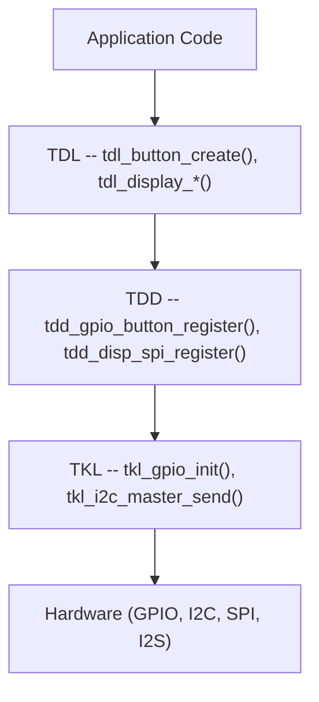

# TDD/TDL Driver Architecture

TuyaOpen uses a two-layer peripheral driver framework: **TDL** (Tuya Driver Layer) manages device lifecycle and provides the application API, while **TDD** (Tuya Device Driver) implements chip-specific hardware access. This separation lets you add new hardware without changing application code.

## Layer Overview



| Layer | Prefix | Role | Who writes it |
|-------|--------|------|---------------|
| **TDL** | `tdl_*` | Device management, registration, application API | TuyaOpen SDK (you rarely modify this) |
| **TDD** | `tdd_*` | Hardware-specific driver implementing the TDL interface | You, when adding a new sensor/display/codec |
| **TKL** | `tkl_*` | Platform abstraction (GPIO, I2C, SPI, UART) | Platform adapter (per chip) |

## The Registration Pattern

Every peripheral category follows the same pattern:

### 1. TDL defines an interface struct

```c
typedef struct {
    OPERATE_RET (*create)(TDL_OPRT_INFO *dev);
    OPERATE_RET (*delete)(TDL_OPRT_INFO *dev);
    OPERATE_RET (*read_value)(TDL_OPRT_INFO *dev, uint8_t *value);
} TDL_BUTTON_CTRL_INFO;
```

### 2. TDD implements the interface and registers

```c
OPERATE_RET tdd_gpio_button_register(char *name, BUTTON_GPIO_CFG_T *cfg)
{
    TDL_BUTTON_CTRL_INFO ctrl = {
        .create     = __tdd_create_gpio_button,
        .delete     = __tdd_delete_gpio_button,
        .read_value = __tdd_read_gpio_value,
    };
    return tdl_button_register(name, &ctrl, &device_info);
}
```

### 3. Board init calls TDD registration

```c
void board_register_hardware(void)
{
    BUTTON_GPIO_CFG_T btn_cfg = {
        .pin = BOARD_BUTTON_PIN,
        .level = BOARD_BUTTON_ACTIVE_LV,
        .mode = BUTTON_IRQ_MODE,
    };
    tdd_gpio_button_register("power_btn", &btn_cfg);
}
```

### 4. Application uses TDL only

```c
board_register_hardware();

TDL_BUTTON_HANDLE handle;
TDL_BUTTON_CFG_T cfg = { .long_start_valid_time = 3000 };
tdl_button_create("power_btn", &cfg, &handle);
tdl_button_event_register(handle, TDL_BUTTON_PRESS_DOWN, my_callback);
```

## Peripheral Categories

| Category | TDL Header | TDD Examples | Source Path |
|----------|-----------|--------------|-------------|
| Button | `tdl_button_driver.h` | `tdd_button_gpio` | `src/peripherals/button/` |
| LED | `tdl_led_driver.h` | `tdd_led_gpio` | `src/peripherals/led/` |
| LED Pixel | `tdl_pixel_driver.h` | `tdd_ws2812`, `tdd_sm16703p` | `src/peripherals/leds_pixel/` |
| Display | `tdl_display_driver.h` | `tdd_disp_spi`, `tdd_disp_rgb` | `src/peripherals/display/` |
| Audio | `tdl_audio_driver.h` | `tdd_audio` (T5AI), `tdd_audio_alsa` | `src/peripherals/audio_codecs/` |
| Camera | `tdl_camera_driver.h` | `tdd_camera_dvp_ov2640` | `src/peripherals/camera/` |
| Touch | `tdl_tp_driver.h` | `tdd_tp_i2c_ft6336`, `tdd_tp_i2c_gt911` | `src/peripherals/tp/` |
| IR | `tdl_ir_driver.h` | `tdd_ir_driver` | `src/peripherals/ir/` |
| Joystick | `tdl_joystick_driver.h` | `tdd_joystick` | `src/peripherals/joystick/` |
| Transport | `tdl_transport_driver.h` | `tdd_transport_uart` | `src/peripherals/transport/` |

## Peripherals Without TDL/TDD

Some peripherals use direct TKL calls without the registration framework:

| Peripheral | Pattern | Example |
|-----------|---------|---------|
| IMU (BMI270) | Vendor library + `tkl_i2c_*` | `examples/peripherals/imu/bmi270/` |
| Encoder | Standalone `drv_encoder` | `src/peripherals/encoder/` |
| SHT3x/SHT4x | Direct I2C reads | `examples/peripherals/i2c/sht3x_4x_sensor/` |
| PMIC (AXP2101) | Vendor driver | `src/peripherals/pmic/axp2101/` |

For simple sensors (temperature, humidity, pressure), you typically use TKL I2C directly rather than creating a TDL/TDD layer. See [Writing a New Sensor Driver](tutorials/writing-sensor-driver).

## Kconfig Integration

Each peripheral is gated by a Kconfig toggle in `boards/{platform}/TKL_Kconfig`:

```kconfig
config ENABLE_BUTTON
    bool
    default n

config ENABLE_LED
    bool
    default n
```

Board-specific Kconfig files select which peripherals to enable:

```kconfig
config BOARD_CONFIG
    select ENABLE_BUTTON
    select ENABLE_LED
    select ENABLE_AUDIO
```

The build system compiles only the enabled TDD drivers.

## References

- [Writing a New Sensor Driver](tutorials/writing-sensor-driver)
- [Migrating a Sensor Library to TuyaOpen](tutorials/migrating-sensor-driver)
- [Display Driver Integration](tutorials/display-driver-guide)
- [Audio Codec Driver Guide](tutorials/audio-codec-guide)
- [Button Driver](button)
- [Display Driver](display)
- [Audio Driver](audio)
