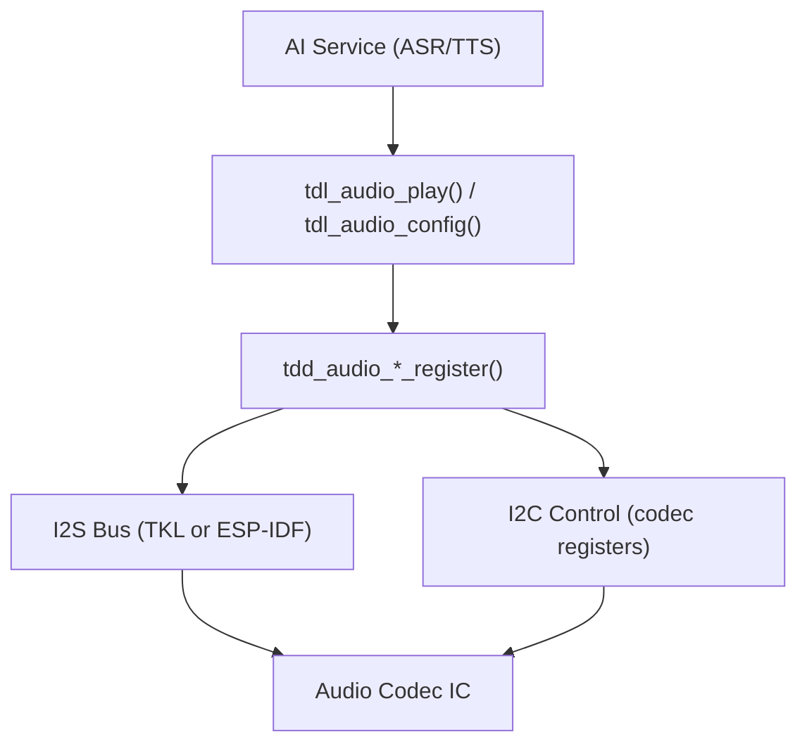

# Audio Codec Driver Guide

Integrate an audio codec into TuyaOpen for voice interaction, audio playback, and AI applications.

## Prerequisites

- Read [TDD/TDL Driver Architecture](../driver-architecture)
- Board with I2S and I2C interfaces
- Audio codec datasheet (e.g., ES8311, ES8388, ES8389)

## Audio Architecture



## TDL Audio Interface

The application interacts through `tdl_audio_*`:

```c
tdl_audio_find("audio_device", &handle);
tdl_audio_open(handle, &audio_cfg);
tdl_audio_play(handle, pcm_data, len);
tdl_audio_close(handle);
```

## Platform Differences

| Aspect | T5AI | ESP32-S3 |
|--------|------|----------|
| TDD location | `src/peripherals/audio_codecs/tdd_audio/` | `boards/ESP32/common/audio/` |
| I2S driver | TKL `tkl_i2s_*` | ESP-IDF `i2s_channel_*` |
| I2C control | TKL `tkl_i2c_*` | ESP-IDF `i2c_master_*` |
| Codec library | Internal | `esp_codec_dev` (ESP-IDF component) |
| Supported codecs | Platform audio IC | ES8311, ES8388, ES8389, no-codec (DAC) |

## ESP32 Audio Codec Registration Flow

Using ES8311 as example (from `boards/ESP32/common/audio/tdd_audio_8311_codec.c`):

### 1. Configure the codec

```c
TDD_AUDIO_8311_CODEC_T codec_cfg = {
    .i2c_cfg = {
        .i2c_scl_io = I2C_SCL_IO,
        .i2c_sda_io = I2C_SDA_IO,
        .i2c_port = 0,
        .i2c_addr = 0x18,
    },
    .i2s_cfg = {
        .i2s_mclk_io = I2S_MCK_IO,
        .i2s_bclk_io = I2S_BCK_IO,
        .i2s_ws_io = I2S_WS_IO,
        .i2s_dout_io = I2S_DO_IO,
        .i2s_din_io = I2S_DI_IO,
    },
    .sample_rate = 16000,
    .pa_gpio = GPIO_OUTPUT_PA,
};
```

### 2. Register in board init

```c
void board_register_hardware(void)
{
    tdd_audio_8311_codec_register("audio", codec_cfg);
}
```

### 3. TDD internally

- Creates I2C master bus via ESP-IDF
- Creates I2S duplex channel via ESP-IDF
- Initializes ES8311 via `esp_codec_dev`
- Fills `TDD_AUDIO_INTFS_T` (open, play, config, close)
- Calls `tdl_audio_driver_register("audio", handle, &intfs, &info)`

## Available ESP32 Audio Codecs

| Codec | File | I2C Addr | Notes |
|-------|------|----------|-------|
| ES8311 | `tdd_audio_8311_codec.c` | 0x18 | Common on S3 boards |
| ES8388 | `tdd_audio_es8388_codec.c` | 0x20 | Alternate codec |
| ES8389 | `tdd_audio_es8389_codec.c` | Varies | DNESP32S3-BOX2 |
| No codec | `tdd_audio_no_codec.c` | N/A | Direct DAC output |
| ATK no codec | `tdd_audio_atk_no_codec.c` | N/A | Alternate no-codec |

## Writing a New Codec TDD

To add support for a new codec (e.g., WM8960):

1. Create `tdd_audio_wm8960.c` and `tdd_audio_wm8960.h`
2. Implement the four interface functions: `open`, `play`, `config`, `close`
3. In `open`: init I2C, init I2S, configure codec registers
4. In `play`: write PCM data to I2S channel
5. In `config`: handle sample rate changes, volume, mute
6. In `close`: stop I2S, power down codec
7. Call `tdl_audio_driver_register()` at the end of your register function

## References

- [TDD/TDL Driver Architecture](../driver-architecture)
- [Audio Driver Reference](../audio)
- [ESP32 Supported Features](../../hardware-specific/espressif/esp32-supported-features)
