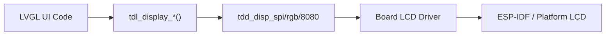

# Display Driver Integration Guide

Integrate a new display panel into TuyaOpen using the TDL display framework and LVGL.

## Prerequisites

- Read [TDD/TDL Driver Architecture](../driver-architecture)
- Completed [Environment Setup](../../quick-start/enviroment-setup)
- Display panel datasheet with init sequence

## Display Architecture



TuyaOpen's display system has two paths depending on platform:

| Platform | LVGL Source | Display Port | BSP Location |
|----------|-----------|-------------|-------------|
| T5AI | TuyaOpen's `src/liblvgl/` | `tdl_display` + `tdd_display` | `boards/T5AI/` |
| ESP32 | ESP-IDF LVGL component | ESP-IDF `esp_lcd_*` | `boards/ESP32/common/display/` |

## Supported Panel Interfaces

| Interface | TDD Driver | Example Panels |
|-----------|-----------|---------------|
| SPI | `tdd_disp_spi_device_register` | ST7789, ILI9341, GC9A01 |
| RGB (parallel) | `tdd_disp_rgb_device_register` | Large TFT panels |
| 8080 (parallel) | Board-level (`lcd_st7789_80.c`) | ST7789 on DNESP32S3-BOX |
| QSPI | Board-level (`lcd_sh8601.c`) | SH8601 AMOLED |
| I2C | Board-level (`oled_ssd1306.c`) | SSD1306 OLED |

## Adding a New SPI Display (T5AI Example)

### 1. Register the panel TDD

```c
#include "tdd_disp_spi_device.h"

TDD_DISP_SPI_DEVICE_T panel_cfg = {
    .spi_cfg = {
        .port = TUYA_SPI_NUM_0,
        .mode = TUYA_SPI_MODE0,
        .speed = 40000000,
        .dc_pin = DC_PIN,
        .cs_pin = CS_PIN,
    },
    .dev_info = {
        .width = 240,
        .height = 320,
        .color_depth = 16,
    },
    .init_cmds = st7789_init_sequence,
    .init_cmds_len = sizeof(st7789_init_sequence),
};
tdd_disp_spi_device_register("main_display", &panel_cfg);
```

### 2. Create the display in your app

```c
TDL_DISP_HANDLE disp;
tdl_display_create("main_display", &disp);
tdl_display_open(disp);
```

### 3. Connect to LVGL

The TDL display integrates with LVGL through the flush callback registered during `tdl_display_create`.

## Adding a Display on ESP32

On ESP32, displays use ESP-IDF's LCD driver directly (not the TuyaOpen `tdd_disp_*` layer). Each board implements its LCD init in `boards/ESP32/{board}/` using:

- `lcd_st7789_spi.c` (SPI panels)
- `lcd_st7789_80.c` (parallel 8080)
- `lcd_sh8601.c` (QSPI AMOLED)
- `oled_ssd1306.c` (I2C OLED)

The board's `board_register_hardware()` initializes the display and wires it to ESP-IDF's LVGL port in `boards/ESP32/common/display/lv_port_disp.c`.

## Kconfig Requirements

```kconfig
config ENABLE_ESP_DISPLAY
    bool
    default y

config DISPLAY_NAME
    string "display"
```

## References

- [TDD/TDL Driver Architecture](../driver-architecture)
- [Display Driver Reference](../display)
- [Peripheral Support List](../support_peripheral_list)
