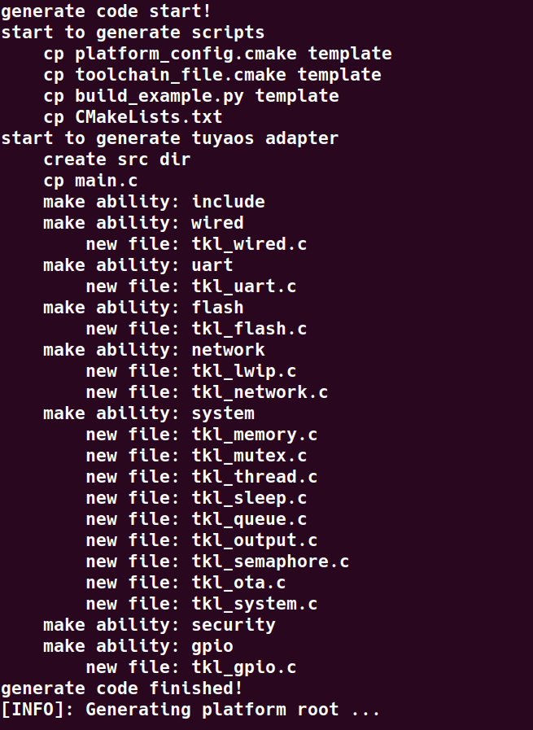
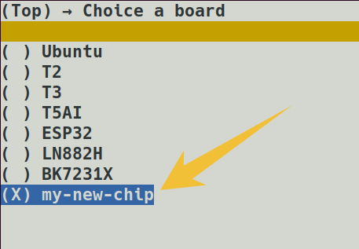

# Create `platform`

## Overview

Use the command `tos.py new platform` to create a new hardware platform porting template.

This command is intended for developers who want to port TuyaOS to a new hardware chip or development board that is not officially supported yet. It will automatically generate a complete directory structure and basic code files for adapting to the new hardware.

Summary: The new platform command greatly simplifies the workload of porting TuyaOS to new hardware. Developers do not need to manually create all the required files and directories. Just run this command and then focus on implementing the hardware-specific driver code in the generated template files (`.c` and `.h`).

## Operation Principle

1. Enter the command `tos.py new platform`: You will be prompted to enter the name of the new platform (e.g., `my_new_chip`).

    

1. Generate Kconfig configuration:

    * Create a top-level `Kconfig` file to integrate the new platform into the project's configuration system.

    * A `menuconfig` interactive interface will pop up, allowing you to select which basic features (such as WIFI, BLE, GPIO, I2C, etc.) this new platform needs to support. Your selections will be saved in a `default.config` file.

    

1. Create the platform directory: A folder named after your input (e.g., `platform/my_new_chip`) will be created under the `platform/` directory.

    

1. Copy adapter layer templates: According to your previous selections, the corresponding hardware abstraction layer (TKL - Tuya Kernel Layer) interface templates will be copied from the `tools/porting/adapter` directory to `platform/my_new_chip/tuyaos/`.

    * For example, if you checked the WIFI feature, the WIFI-related template files such as tkl_init_wifi.c and tkl_init_wifi.h will be copied over.

    

1. Create board-level configuration: A folder with the same name (e.g., `boards/my_new_chip`) will also be created under the `boards/` directory, and a corresponding `Kconfig` file will be generated to add this new platform as an option in the build system.

    

1. Build verification: Use the command `tos.py new project` to create a new project, select the `my_new_chip` platform, and use the command `tos.py build` to build and verify.

    

    

## Next Steps

1. In the `platform/my_new_chip/tuyaos/tuyaos_adapter/src` directory, fill in the actual hardware driver code as prompted.

1. Modify the `platform/my_new_chip/toolchain_file.cmake` file to configure the actual path of the build tools.

1. Modify the `platform/my_new_chip/build_example.py` file to complete the build and link steps.

## FAQ
