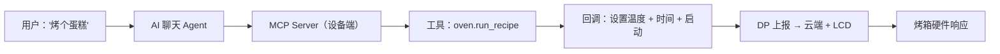

想象一下，你对烤箱说 *"预热到 200 度，烤 25 分钟"* — 它就照做了。不用打开 App，不用找按钮，不用翻菜单。只需自然语言，AI Agent 理解你的意图，在真实硬件上执行。

本指南将用 TuyaOpen 构建的 **智能烤箱** 项目，**详细** 展示这套机制是如何工作的。读完后，你将掌握如何为任意设备创建自己的硬件 MCP 技能。

---

<section id="what-youll-build" className="section">

## 你将构建什么

一台 AI 驱动的智能烤箱，聊天 Agent 可以：

| 指令 | Agent 的行为 |
|---|---|
| *"打开烤箱"* | 调用 `oven.start` → 设置电源 DP |
| *"预热到 200°C"* | 调用 `oven.set_temperature(200)` → 写入温度 DP |
| *"烤 25 分钟"* | 调用 `oven.set_timer(1500)` → 设置倒计时 DP |
| *"现在什么状态？"* | 调用 `oven.get_state()` → 读取所有 DP，返回 JSON |
| *"执行披萨菜谱"* | 调用 `oven.run_recipe("pizza")` → 设置温度 + 时间 + 启动 |
| *"拍张照片看看蛋糕好了没"* | 调用 `device.camera_shot()` → 拍摄一张 JPEG，AI 可以"看到" |

核心粘合剂？**MCP Function Call** — 将硬件操作变成 AI Agent 可以发现并调用的工具的协议。

</section>

---

<section id="how-it-works" className="section">

## 架构：它是如何工作的



**核心洞察：** 每一个硬件能力（设置温度、读取状态、拍照）都被注册为一个 **MCP 工具** — 一个带类型参数和回调的命名函数。AI Agent 看到这些工具，根据用户意图决定调用哪个，回调函数驱动真实硬件。

</section>

---

<section id="step-1-cloud-product" className="section">

## 步骤 1：创建云端产品

在写任何固件代码之前，你需要先在涂鸦云端平台创建一个**产品**。产品定义了设备的数据模型（DP 点）、AI Agent 和云端能力。后续所有步骤——固件、MCP 工具、App——都依赖这个产品。

### 1a. 创建产品

1. 登录[涂鸦开发者平台](https://platform.tuya.com/pmg/list) → **AI 产品 > 开发** → **创建**
2. 选择 **自定义**，从零创建一个自定义产品（而非选择预设品类）
3. 完成创建向导，获得 **PID**（产品 ID）

:::tip
最快的方式：在 TuyaOpen IDE 中使用 **`/tuya-iot-platform`** vibe coding 技能。用自然语言描述你的设备，Agent 会自动帮你创建产品、定义 DP、配置 AI Agent。
:::

### 1b. 定义 DP 点

**DP（Data Point，数据点）** 是硬件的数字孪生。每个 DP 对应一个可控或可读的功能。在 **功能定义** 标签页，点击 **添加** 创建以下自定义 DP（ID 101–199）：

| DP ID | 代码 | 类型 | 范围 | 说明 |
|---|---|---|---|---|
| 101 | `switch` | Bool | — | 开关机 |
| 102 | `temp_set` | Value | 50–250 | 目标温度（°C） |
| 103 | `temp_current` | Value | 0–300 | 当前温度（°C） |
| 104 | `timer` | Value | 0–3600 | 倒计时（秒） |

:::note
标准 DP（ID < 100）由涂鸦预定义。自定义 DP（ID 101–199）由你自由定义。烤箱 Demo 中四个都是自定义 DP。
:::

### 1c. 添加 AI Agent 与 MCP 能力

在 **功能定义** → **产品 AI 能力** → **添加 Agent**：

1. **模型配置** → **技能配置** → 选择 **插件** → 添加 **设备控制 · 仅绑定**（启用 MCP 工具调用）
2. **提示词开发** → 编写系统提示词，描述烤箱能力，让 AI 知道何时调用哪个工具

这会在云端创建 Agent，它将在设备固件注册 MCP 工具后自动发现并调用。

### 1d. 生成固件 DP 头文件

云端 DP 定义完成后，生成固件使用的 C 头文件：

```bash
tuyaopen dp generate --target embedded
```

生成 `tuya_dp_profile.h` — 云端与设备的契约：

```c
// tuya_dp_profile.h — 由 `tuyaopen dp generate` 自动生成
#define DPID_SWITCH       101
#define DPID_TEMP_SET     102
#define DPID_TEMP_CURRENT 103
#define DPID_TIMER        104

#define DPID_TEMP_SET_MIN 50
#define DPID_TEMP_SET_MAX 250
#define DPID_TIMER_MIN    0
#define DPID_TIMER_MAX    3600
```

:::tip
完整的产品创建流程详见[创建你的产品与 Agent](/docs/cloud/tuya-cloud/creating-new-product)。烤箱 Demo 中，你也可以在 TuyaOpen IDE 中使用 `/tuya-iot-platform` 技能让 AI Agent 自动生成产品和 DP。
:::

</section>

---

<section id="step-2-mock-hardware" className="section">

## 步骤 2：实现 Mock 硬件层

在接入 MCP 工具之前，你需要先实现模拟（或驱动）真实硬件的函数。这能让你的工具回调保持简洁：

```c
// app_oven.h
typedef struct {
    bool switch_on;
    int  temp_set;
    int  temp_current;
    int  timer_remaining;
} oven_state_t;

OPERATE_RET app_oven_set_switch(bool on);
OPERATE_RET app_oven_set_temp(int temp_c);
OPERATE_RET app_oven_set_timer(int seconds);
OPERATE_RET app_oven_add_timer(int seconds);
oven_state_t app_oven_get_state(void);
```

```c
// app_oven.c — 每个 setter 向云端上报 DP + 更新 LCD
static oven_state_t g_oven_state = {
    .switch_on = false,
    .temp_set = 180,
    .temp_current = 25,
    .timer_remaining = 0
};

OPERATE_RET app_oven_set_temp(int temp_c) {
    if (temp_c < DPID_TEMP_SET_MIN || temp_c > DPID_TEMP_SET_MAX)
        return OPRT_INVALID_PARM;
    g_oven_state.temp_set = temp_c;
    __oven_report_dp();  // 同步到云端 + LCD
    return OPRT_OK;
}
```

</section>

---

<section id="step-3-register-tools" className="section">

## 步骤 3：注册 MCP 工具（核心步骤）

这一步让 AI Agent 真正"触达"你的硬件。每个工具注册时需要：
- **名称** — AI 看到的标识（使用点分命名：`oven.set_temperature`）
- **描述** — 给 LLM 看的说明文字，解释何时/如何调用
- **参数** — 带类型的输入属性，含取值范围
- **回调** — AI 调用时执行的函数

### 注册模式

```c
#include "ai_mcp_server.h"
#include "tal_event_info.h"

// MQTT 连接后触发（延迟注册）
static OPERATE_RET __oven_mcp_on_mqtt_connected(void *data) {
    (void)data;

    // 工具 1：启动烤箱
    TUYA_CALL_ERR_GOTO(AI_MCP_TOOL_ADD(
        "oven.start",
        "打开烤箱。当用户想开始烹饪、预热或启动烘焙时使用。\n"
        "参数：无\n返回：bool",
        __oven_start_cb, NULL
    ));

    // 工具 2：设置温度
    TUYA_CALL_ERR_GOTO(AI_MCP_TOOL_ADD(
        "oven.set_temperature",
        "设置烤箱目标温度，单位摄氏度（50-250）。\n"
        "参数：temperature (int)\n返回：int（实际设置的温度）",
        __oven_set_temp_cb, NULL,
        MCP_PROP_INT_RANGE("temperature", "目标温度 °C（50-250）",
                           DPID_TEMP_SET_MIN, DPID_TEMP_SET_MAX),
        MCP_PROP_END
    ));

    // 工具 3：获取完整状态
    TUYA_CALL_ERR_GOTO(AI_MCP_TOOL_ADD(
        "oven.get_state",
        "获取烤箱当前状态：开关、目标温度、当前温度、剩余计时。\n"
        "参数：无\n返回：JSON 对象",
        __oven_get_state_cb, NULL
    ));

    // ... 更多工具
    return OPRT_OK;
}

OPERATE_RET app_oven_mcp_init(void) {
    return tal_event_subscribe(
        EVENT_MQTT_CONNECTED, "oven_mcp_tools",
        __oven_mcp_on_mqtt_connected, SUBSCRIBE_TYPE_ONETIME);
}
```

### 回调模式

每个回调从 `properties` 中读取 AI 传入的参数，调用硬件函数，然后返回结果：

```c
static OPERATE_RET __oven_set_temp_cb(const MCP_PROPERTY_LIST_T *properties,
                                       MCP_RETURN_VALUE_T *ret_val,
                                       void *user_data) {
    // 1. 读取 AI 传入的参数
    int temp = properties->properties[0]->value.int_val;

    // 2. 调用硬件函数
    OPERATE_RET rt = app_oven_set_temp(temp);

    // 3. 将结果返回给 AI
    ai_mcp_return_value_set_int(ret_val,
        (rt == OPRT_OK) ? temp : -1);
    return OPRT_OK;
}
```

返回 JSON（如 `get_state`）：

```c
static OPERATE_RET __oven_get_state_cb(const MCP_PROPERTY_LIST_T *properties,
                                        MCP_RETURN_VALUE_T *ret_val,
                                        void *user_data) {
    oven_state_t s = app_oven_get_state();
    cJSON *json = cJSON_CreateObject();
    cJSON_AddBoolToObject(json, "switch_on", s.switch_on);
    cJSON_AddNumberToObject(json, "temp_set", s.temp_set);
    cJSON_AddNumberToObject(json, "temp_current", s.temp_current);
    cJSON_AddNumberToObject(json, "timer_remaining", s.timer_remaining);
    ai_mcp_return_value_set_json(ret_val, json);
    return OPRT_OK;
}
```

</section>

---

<section id="step-4-wire-boot" className="section">

## 步骤 4：接入启动流程

在 `app_chat_bot.c` 中，在 `ai_mcp_init()` **之后** 调用你的 MCP 初始化：

```c
#if defined(ENABLE_COMP_AI_MCP) && (ENABLE_COMP_AI_MCP == 1)
    TUYA_CALL_ERR_RETURN(ai_mcp_init());
    TUYA_CALL_ERR_RETURN(app_oven_mcp_init());  // ← 你的工具
#endif
```

MQTT 连接后工具会自动注册。就这么简单。

</section>

---

<section id="step-5-build-test" className="section">

## 步骤 5：构建与测试

```bash
cd source/embedded
tos.py build
```

验证工具出现在 Agent 的工具列表中，然后尝试以下交互：

| 你说 | Agent 调用 | 结果 |
|---|---|---|
| "预热 200 度，烤 25 分钟" | `oven.set_temperature(200)` → `oven.set_timer(1500)` → `oven.start()` | 烤箱升温，倒计时开始 |
| "烤一只鸡" | `oven.run_recipe("roast")` | 200°C，40 分钟，自动启动 |
| "还开着吗？多热？" | `oven.get_state()` | 返回 `{switch_on: true, temp_set: 200, ...}` |
| "拍张照片看看蛋糕好了没" | `device.camera_shot()` | AI 收到 JPEG 并视觉判断 |

</section>

---

<section id="complete-tool-set" className="section">

## 完整工具集

以下是智能烤箱的完整 MCP 工具列表：

| 工具 | 参数 | 返回 | 用途 |
|---|---|---|---|
| `oven.start` | — | bool | 开机 |
| `oven.stop` | — | bool | 关机 |
| `oven.set_temperature` | `temperature`（int, 50–250） | int | 设置目标温度 |
| `oven.set_timer` | `seconds`（int, 0–3600） | int | 设置倒计时 |
| `oven.add_time` | `seconds`（int） | int | 追加计时 |
| `oven.get_state` | — | JSON | 读取所有 DP |
| `oven.list_recipes` | — | JSON 数组 | 列出预设菜谱 |
| `oven.run_recipe` | `recipe`（string） | JSON | 执行菜谱并启动 |
| `device.camera_shot` | — | image/jpeg | 拍照 |

### 内置菜谱

| 菜谱 | 温度 | 时间 | 适合 |
|---|---|---|---|
| `bake` | 180°C | 30 分钟 | 蛋糕、面包、砂锅 |
| `roast` | 200°C | 40 分钟 | 肉类和蔬菜 |
| `broil` | 230°C | 10 分钟 | 快速上色 |
| `pizza` | 220°C | 15 分钟 | 高温烤披萨 |
| `grill` | 250°C | 8 分钟 | 强力烧烤 |
| `reheat` | 120°C | 5 分钟 | 加热剩菜 |
| `warm` | 80°C | 30 分钟 | 保温 |

</section>

---

<section id="ai-coding-prompts" className="section">

## AI 编程提示词技巧

使用 AI 编程助手（Cursor、Claude Code、Copilot）构建硬件 MCP 技能时，以下提示词模式可以加速开发：

### 技巧 0：从描述生成完整云端产品

```
/tuya-iot-platform
创建一个智能烤箱 AI 产品，功能包括：
- 开关控制（bool）
- 温度设置 50-250°C（value）
- 当前温度 0-300°C（value，只读）
- 倒计时 0-3600 秒（value）

添加 AI Agent 并配置设备控制 MCP 插件。
生成 DP 定义和嵌入式 DP 头文件。
```

**为什么有效：** `/tuya-iot-platform` 技能会从自然语言描述创建云端产品、定义 DP、配置 AI Agent，并生成固件 DP 头文件——从想法到代码一步到位。

### 技巧 1：描述设备，而非代码

```
我有一台智能烤箱，功能如下：
- 开关控制
- 温度控制（50-250°C）
- 定时器（0-3600 秒）
- 当前温度传感器
- 摄像头用于视觉检查

为每个功能创建 MCP 工具注册。
使用 otto_robot 示例中的 AI_MCP_TOOL_ADD 宏模式。
```

**为什么有效：** AI 会将你的设备描述直接映射为工具名称、描述和参数。

### 技巧 2：明确指定 DP 映射

```
我的烤箱 DP 定义：
- DP 101: switch（bool, rw）
- DP 102: temp_set（value, 50-250, rw）
- DP 103: temp_current（value, 0-300, ro）
- DP 104: timer（value, 0-3600, rw）

生成 tuya_dp_profile.h 头文件和读写这些 DP 的 MCP 工具回调。
```

**为什么有效：** 明确的 DP 定义消除了参数类型和范围的歧义。

### 技巧 3：要求 LLM 友好的描述

```
为每个 MCP 工具编写帮助 LLM 理解的描述：
1. 何时使用（什么用户意图触发）
2. 接受什么参数（带单位和范围）
3. 返回什么（类型和含义）

示例："设置烤箱目标温度，单位摄氏度（50-250）。
当用户说'预热'、'设温度'或'X 度烘焙'时使用。"
```

**为什么有效：** 好的工具描述是 AI 选对工具的 #1 因素。

### 技巧 4：要求错误处理

```
为每个 MCP 工具回调添加输入校验：
- 温度限制在 DP 范围内（50-250）
- 无效参数返回 -1
- run_recipe 遇到未知菜谱时返回 {ok: false, available: [...]}
```

**为什么有效：** AI 收到结构化错误响应后可以自我纠正。

### 技巧 5：一次性生成完整栈

```
/tuyaopen-dev-loop
创建一个完整的智能烤箱项目：
1. 云端产品，包含 DP（switch, temp_set, temp_current, timer）
2. 嵌入式固件，含 mock 硬件（app_oven.c）
3. 所有烤箱功能的 MCP 工具（app_oven_mcp.c）
4. LVGL UI，在 T5-AI 开发板屏幕上显示烤箱状态
5. 在 app_chat_bot.c 中串联所有模块
```

**为什么有效：** `/tuyaopen-dev-loop` 技能编排了从云端到设备的完整工作流。

</section>

---

<section id="key-takeaways" className="section">

## 核心要点

1. **从云端产品开始** — 先创建产品、定义 DP、添加 AI Agent，再碰固件。产品是基础。
2. **DP 是契约** — 在云端定义，生成头文件，其余自然水到渠成。
3. **工具描述至关重要** — 为 LLM 而写：何时使用、什么参数、返回什么。
4. **延迟到 MQTT 连接时注册** — 使用 `tal_event_subscribe(EVENT_MQTT_CONNECTED, ..., SUBSCRIBE_TYPE_ONETIME)`，工具在云端链路就绪后自动注册。
5. **硬件与 MCP 分离** — `app_oven.c` 负责硬件，`app_oven_mcp.c` 负责工具注册。职责清晰。
6. **返回结构化数据** — JSON 响应带 `ok: false` + 可选项，让 AI 能自我纠正。

</section>

---

<section id="next-steps" className="section">

## 下一步

- [创建你的产品与 Agent](/docs/cloud/tuya-cloud/creating-new-product) — 云端产品、DP 和 AI Agent 完整指南
- [自定义设备 MCP（硬件技能指南）](/docs/duckyclaw/custom-device-mcp) — MCP 工具开发 API 参考
- [硬件外设技能](/docs/duckyclaw/hardware-skill) — 内置 GPIO、ADC、I2C、UART、PWM 工具
- [MCP Server API](/docs/cloud/device-ai/ai-components/ai-mcp-server) — MCP 服务端完整文档
- [设计设备 MCP 工具](/docs/cloud/device-ai/concepts/designing-device-mcp-tools) — 工具设计最佳实践

</section>
