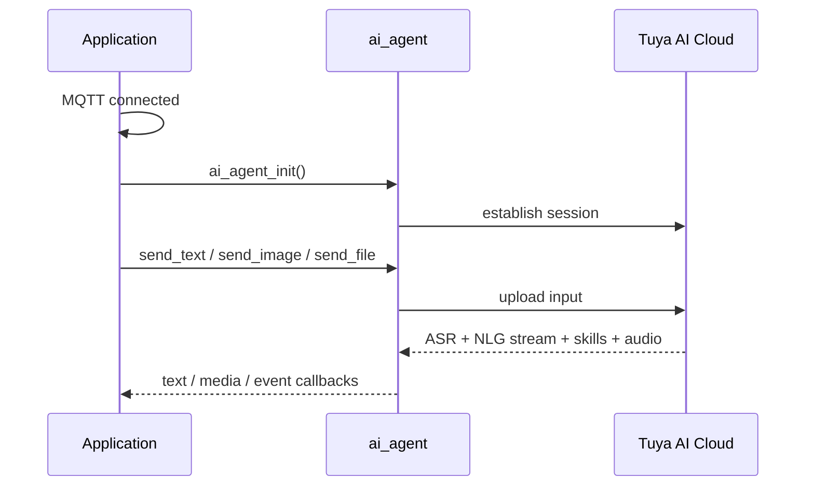

`ai_agent`는 장치와 Tuya AI 구름 사이 교량입니다. 그것은 음성, 텍스트, 이미지 및 파일 입력을 업로드, AI의 스트림 된 대답을 수신, 이벤트를 통해 응용 프로그램에 진행을보고 - 그래서 펌웨어의 나머지는 직접 클라우드에 이야기하지.

그것은 ** 채팅 모드 사이에 앉아 ** (*when* 듣기) 및 ** 클라우드 ** (*what* 말을 결정).

## 약관
|(주)|이름 *|
|-------|---------|
|Agent를|AI 엔티티티티는 인식, 이유, 결정, 자신의 행동.|
|ASR를|Automatic Speech Recognition - 사용자의 음성을 텍스트로 변환합니다.|
|사이트맵|Natural Language Generation - intent 또는 Structured 데이터를 자연 언어 텍스트로 변환합니다.|
|Skill를|각자에 의하여, pluggable AI 기능 1개의 것 (놀이 음악은, 감정을 보여주고, 구름 사건을 달립니다).|

## 무엇 그것
### 입력: 다중 상태
대리인은 입력의 4개의 종류를 받아들이고 구름에 그(것)들을 업로드합니다:

- **Audio** - `PCM` (현지 처리를위한 압축되지 않음), `OPUS` (컴팩트 및 low-latency, 네트워크 운송용), 또는 `SPEEX` (스페치 조정).
- **Text** - 문자열로 명령 또는 쿼리를 보냅니다.
-**Image** - 시각적 Q&A 또는 이미지 이해를 위한 프레임 업로드
- **File** - 분석을위한 문서를 업로드합니다.

### 산출: 콜백
구름의 대답은 콜백을 통해 돌아옵니다:

- **Text** - ASR 결과, NLG 텍스트 스트림 및 기술 페이로드.
- **Media** - 오디오, 비디오, 이미지 및 파일 스트림.
- **Media 속성 ** - 오디오 코덱과 같은 메타데이터를 사용합니다.

## 세션 이벤트
에이전트는 전체 대화 수명주기를 추적하고 사용자 배출 콜백 (`AI_USER_EVENT_NOTIFY`)을 통해 앱에 각 단계를보고합니다.

- **Start** — 클라우드는 답장을 시작합니다. TTS 플레이어를 시작하고 오디오를 받기 위해 준비하십시오.
- **End** — 클라우드는 전송을 완료했습니다. 플레이어를 중지하고 재생을 완료합니다.
-**Break** — 클라우드는 턴을 중단했습니다. (사용자는 barge-in, 클라우드 타임아웃). 재생 및 클리어 버퍼를 즉시 중지합니다.
-**Exit** — 대화가 닫힙니다. 모든 관련 리소스를 출시합니다.
- **서버 VAD** — 클라우드 측면 음성 감지 상태, 앱에 전달.

## 클라우드 프롬프트 톤
`ai_agent_cloud_alert(type)`는 짧은 말썽을 위한 구름을 요구합니다. 그것은 토큰 (`cmd:0`–`cmd:5`)에 경고 유형을 맵하고 그 토큰을 텍스트로 보냅니다. 클라우드는 일치하는 오디오를 반환합니다.

:::기사
AI 에이전트 플랫폼에서 구성하면 토큰 만 작동합니다. 에이전트의 프롬프트에서 AI가 `cmd:5`를 통해 `cmd:0`를 반환해야 하는 것을 정의합니다. 그 구성 없이, 음색 놀이.
:::

아래 6 개의 경고 유형은 오늘 맵핑됩니다. 다른 `AI_ALERT_TYPE_E` 값은 `OPRT_NOT_SUPPORTED`를 반환합니다:

|Alert 유형|계정 만들기|이름 *|
|------------|-------|---------|
|`AT_NETWORK_CONNECTED`를|`cmd:0`를|네트워크 연결|
|`AT_WAKEUP`를|`cmd:1`를|Wake-up 응답|
|`AT_LONG_KEY_TALK`를|`cmd:2`를|자주 묻는 질문|
|`AT_KEY_TALK`를|`cmd:3`를|본문 바로가기|
|`AT_WAKEUP_TALK`를|`cmd:4`를|웨이크 후 대화|
|`AT_RANDOM_TALK`를|`cmd:5`를|무작위 채팅|

## 역할 전환
`ai_agent_role_switch(role)`는 런타임에서 활성 에이전트 역할을 변경합니다. 다른 역할은 다양한 대화 스타일, 지식베이스 및 기술 세트를 수행 할 수 있습니다 - 멀티-scenario 제품에 유용합니다.

## API 참조
헤더: `ai_agent.h`. 모든 기능은 `OPERATE_RET` (`OPRT_OK`를 성공에 반환합니다)를 반환합니다.

```c
OPERATE_RET ai_agent_init(void);
OPERATE_RET ai_agent_deinit(void);
OPERATE_RET ai_agent_send_text(char *content);
OPERATE_RET ai_agent_send_file(uint8_t *data, uint32_t len);
OPERATE_RET ai_agent_send_image(uint8_t *data, uint32_t len);
OPERATE_RET ai_agent_cloud_alert(AI_ALERT_TYPE_E type);
OPERATE_RET ai_agent_role_switch(char *role);
```

|제품정보|이름 *|제품정보|
|----------|------------|---------|
|`ai_agent_init`를| — |에이전트를 초기화합니다. 또한 `ENABLE_AI_MONITOR`가 설정될 때 모니터 모듈을 시작합니다 (KEPTERM1X 디버깅용).|
|`ai_agent_deinit`를| — |에이전트의 리소스를 릴리즈합니다.|
|`ai_agent_send_text`를|`content` - 보낼 텍스트|텍스트 쿼리를 보냅니다.|
|`ai_agent_send_file`를|`data`, `len` - 버퍼 및 길이|파일 업로드|
|`ai_agent_send_image`를|`data`, `len` - 버퍼 및 길이|이미지 업로드|
|`ai_agent_cloud_alert`를|`type` - `AI_ALERT_TYPE_E`|클라우드 프롬프트 톤 요청 (위 표 참조).|
|`ai_agent_role_switch`를|`role` - 역할 이름|활성 에이전트 역할을 전환합니다.|

:::대여
`ai_agent_init()` ** MQTT 연결이 성공한 후만 호출합니다.** `EVENT_MQTT_CONNECTED`에 가입하고 그 핸들러에서 에이전트를 초기화.
:::

## 회전 흐름


## 작업 예
오디오를 초기화 한 다음 MQTT 연결 이벤트에서 에이전트를 초기화 :

```c
// Initialize the AI agent once MQTT is connected.
static bool sg_ai_agent_inited = false;

int __ai_mqtt_connected_evt(void *data)
{
    if (!sg_ai_agent_inited) {
        TUYA_CALL_ERR_LOG(ai_agent_init());
        sg_ai_agent_inited = true;
    }
    return OPRT_OK;
}

OPERATE_RET example_init(void)
{
    OPERATE_RET rt = OPRT_OK;

#if defined(ENABLE_COMP_AI_AUDIO) && (ENABLE_COMP_AI_AUDIO == 1)
    AI_AUDIO_INPUT_CFG_T input_cfg = {
        .vad_mode      = AI_AUDIO_VAD_MANUAL,
        .vad_off_ms    = 1000,
        .vad_active_ms = 200,
        .slice_ms      = 80,
        .output_cb     = __ai_audio_output,
    };
    TUYA_CALL_ERR_RETURN(ai_audio_input_init(&input_cfg));
    TUYA_CALL_ERR_RETURN(ai_audio_player_init());
#endif

    // Initialize the agent only after MQTT connects.
    TUYA_CALL_ERR_RETURN(tal_event_subscribe(EVENT_MQTT_CONNECTED, "ai_agent_init",
                                             __ai_mqtt_connected_evt, SUBSCRIBE_TYPE_EMERGENCY));
    return OPRT_OK;
}

void send_text_to_ai(void)   { ai_agent_send_text("How is the weather today?"); }
void request_alert(void)     { ai_agent_cloud_alert(AT_WAKEUP); }
void switch_role(void)       { ai_agent_role_switch("storyteller"); }
```

## 참조
- [Component Framework] (ai-components.md) - `ai_agent`가 더 넓은 AI 프레임 워크에 적합
- [Application development guide](../application-development-guide) - 전체 앱으로 에이전트를 타십시오.
- [AI Agent 개발 플랫폼](../../tuya-cloud/ai-agent/ai-agent-dev-platform) - 역할, 프롬프트 및 `cmd:` 톤 구성
