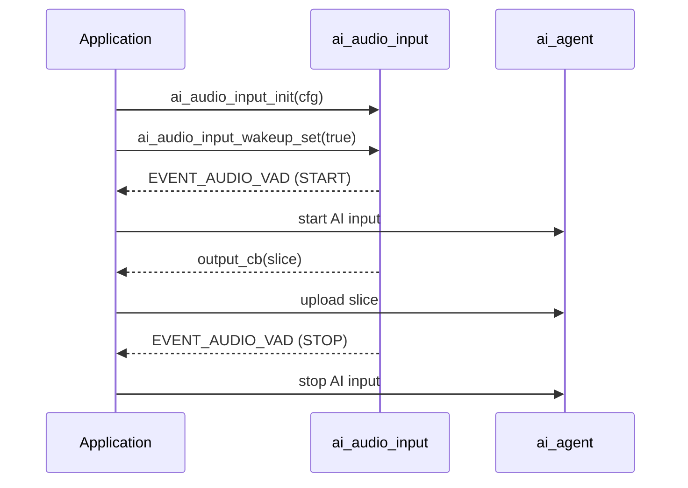

`ai_audio_input`는 마이크 오디오를 캡처하고, 음성이 존재할 때 결정하고, 콜백을 통해 응용 프로그램에 결과를 표시하는 오디오 슬라이스를 손에 넣습니다. 그것은 AI 오디오 파이프라인의 정면 끝입니다: 그것은 구름에 `ai_agent` 업로드 오디오를 일으킵니다.

그것은 구름 자체에 대해 이야기하지 않습니다. 그 유일한 작업은 **Voice Activity Detection (VAD)**에 의해 고정 된 슬라이스로 원시 마이크 스트림을 턴하는 것입니다.

## 약관
|(주)|이름 *|
|------|---------|
|VAD를|Voice Activity Detection - 오디오의 펑크가 연설을 포함 여부를 결정합니다.|
|VAD 상태|연설이 시작될 때 `AI_AUDIO_VAD_START`, `AI_AUDIO_VAD_STOP`가 끝날 때.|
|지원하다|오디오 스트림의 고정 방향 펑크, `slice_ms`에 의해 크기, 콜백에 전달.|
|모닝콜|모듈이 현재 "listening"인지 여부. VAD 작업과 슬라이스 출력은 woken 동안만 발생합니다.|

## VAD 모드
모듈은 `vad_mode`에 의해 선택된 두 가지 모드 중 하나에서 실행되며 런타임에 전환할 수 있습니다.

|주요 특징|뚱 베어|어떤 드라이브|이용하기|
|------|------|----------------|------------|
|제품정보|`AI_AUDIO_VAD_MANUAL`를|키/버튼 이벤트. 직접 웨이크 업 상태를 설정; 음성 탐지기 실행.|Press-to-talk and hold-to-talk, 사용자 제어 시작 및 중지.|
|제품정보|`AI_AUDIO_VAD_AUTO`를|내장된 인보이스 검출기. 모듈은 자체에 `AI_AUDIO_VAD_START` / `AI_AUDIO_VAD_STOP`를 제기합니다.|누군가가 말할 때 시작하는 손없는 캡처.|

**manual** 모드에서, 먼저 `ai_audio_input_wakeup_set(true)`를 키다운에 호출하여, `ai_audio_input_wakeup_set(false)`를 키업에 호출하여 결정합니다. ** 자동** 모드에서, 검지기는 `vad_active_ms` 및 `vad_off_ms`를 사용하여 시작과 끝을 분해합니다.

:::기사
Wake-word listening (턴을 시작하기 위해 깨진 단어를 쓰는)는 여기에 처리되지 않습니다. [Wakeup chat mode](ai-mode-wakeup)에 의해 구동되며, 이 모듈에 VAD 모드를 전환하고 웨이크 업 상태로 전환합니다.
:::

## VAD 국가 및 이벤트
모듈이 woken되면 VAD 상태 변경은 `EVENT_AUDIO_VAD` 이벤트를 게시합니다. 이벤트 페이로드는 `AI_AUDIO_VAD_STATE_E` 값입니다.

```c
typedef enum {
    AI_AUDIO_VAD_START = 1,    // speech started
    AI_AUDIO_VAD_STOP,         // speech ended
} AI_AUDIO_VAD_STATE_E;
```

`EVENT_AUDIO_VAD`에 가입하고 검출된 연설을 가진 단계에 있는 상류 AI 입력을 멈추십시오.

:::대여
VAD 작업 및 이벤트 게시는 ** 단위가 woken up** 동안만 발생합니다. 깨어난 상태를 설정하지 않으면 슬라이스 및 이벤트가 생성되지 않습니다.
:::

## 구성
당신은 `AI_AUDIO_INPUT_CFG_T`에 init에 한 번 단위를 구성:

```c
typedef struct {
    /* VAD cache = vad_active_ms + vad_off_ms */
    AI_AUDIO_VAD_MODE_E     vad_mode;
    uint16_t                vad_off_ms;        /* Voice activity compensation time, unit: ms */
    uint16_t                vad_active_ms;     /* Voice activity detection threshold, unit: ms */
    uint16_t                slice_ms;          /* Reference macro, AUDIO_RECORDER_SLICE_TIME */
    AI_AUDIO_OUTPUT         output_cb;         /* Microphone data processing callback */
} AI_AUDIO_INPUT_CFG_T;
```

|제품정보|제품정보|제품정보|
|-------|------|---------|
|`vad_mode`를|`AI_AUDIO_VAD_MODE_E`를|수동 또는 자동 감지 (위 참조).|
|`vad_off_ms`를|`uint16_t`를|음성 활동 보상 시간, 밀리 초. 자동 모드에서 연설의 끝을 debounce.|
|`vad_active_ms`를|`uint16_t`를|음성 활동 탐지 임계값, milliseconds. VAD가 시작되기 전에 긴 목소리가 지속되어야 합니다.|
|`slice_ms`를|`uint16_t`를|밀리 초의 슬라이스 기간. 참고 매크로 `AUDIO_RECORDER_SLICE_TIME`.|
|`output_cb`를|`AI_AUDIO_OUTPUT`를|각 오디오 슬라이스로 호출.|

출력 콜백은 한 번에 한 조각을 제공합니다.

```c
typedef int (*AI_AUDIO_OUTPUT)(uint8_t *data, uint16_t datalen);
```

`data`는 슬라이스 버퍼에 포인트와 `datalen`는 바이트의 길이입니다. 이것은 당신이 구름에 오디오를 전달하는 곳 (예를 들면, `ai_agent`를 통해).

## API 참조
헤더: `ai_audio_input.h`. 모든 기능은 `OPERATE_RET` (`OPRT_OK`를 성공에 반환합니다)를 반환합니다.

```c
OPERATE_RET ai_audio_input_init(AI_AUDIO_INPUT_CFG_T *cfg);
OPERATE_RET ai_audio_input_start(void);
OPERATE_RET ai_audio_input_stop(void);
OPERATE_RET ai_audio_input_deinit(void);
OPERATE_RET ai_audio_input_reset(void);
OPERATE_RET ai_audio_input_wakeup_mode_set(AI_AUDIO_VAD_MODE_E mode);
OPERATE_RET ai_audio_input_wakeup_set(bool is_wakeup);
```

|제품정보|이름 *|제품정보|
|----------|------------|---------|
|`ai_audio_input_init`를|`cfg` - 입력 구성|VAD 모드, 임계값, 슬라이스 크기 및 출력 콜백 모듈을 초기화합니다.|
|`ai_audio_input_start`를| — |오디오 캡처 및 VAD 처리를 시작합니다.|
|`ai_audio_input_stop`를| — |오디오 캡처 및 VAD 처리 중지.|
|`ai_audio_input_deinit`를| — |모듈의 리소스를 릴리즈합니다.|
|`ai_audio_input_reset`를| — |오디오 링 버퍼와 VAD 상태를 재설정합니다. clear stale 오디오를 호출합니다.|
|`ai_audio_input_wakeup_mode_set`를|`mode` - `AI_AUDIO_VAD_MODE_E`|런타임에 VAD 모드를 전환합니다.|
|`ai_audio_input_wakeup_set`를|`is_wakeup` - 웨이업 플래그|모듈이 듣는지 설정한다. 수동 모드에서는 VAD 상태를 직접 구동합니다.|

## 회전 흐름


## 작업 예
모듈을 구성하고, 출력 콜백의 클라우드로 슬라이스를 전달하고, VAD 이벤트에서 턴을 시작합니다. 이 스니펫은 수동 (button) 모드를 사용합니다.

```c
#include "ai_audio_input.h"

#define AI_AUDIO_SLICE_TIME       80
#define AI_AUDIO_VAD_ACTIVE_TIME  200
#define AI_AUDIO_VAD_OFF_TIME     1000

// Called with each audio slice. Forward it to the cloud here.
static int __ai_audio_output(uint8_t *data, uint16_t datalen)
{
    // e.g. upload `data`/`datalen` through ai_agent
    return OPRT_OK;
}

// React to VAD state changes published on EVENT_AUDIO_VAD.
static int __ai_vad_change_evt(void *data)
{
    AI_AUDIO_VAD_STATE_E vad_flag = (AI_AUDIO_VAD_STATE_E)data;

    if (AI_AUDIO_VAD_START == vad_flag) {
        // speech started — begin the AI input turn
    } else {
        // speech ended — finish the AI input turn
    }
    return OPRT_OK;
}

OPERATE_RET example_init(void)
{
    AI_AUDIO_INPUT_CFG_T input_cfg = {
        .vad_mode      = AI_AUDIO_VAD_MANUAL,
        .vad_off_ms    = AI_AUDIO_VAD_OFF_TIME,
        .vad_active_ms = AI_AUDIO_VAD_ACTIVE_TIME,
        .slice_ms      = AI_AUDIO_SLICE_TIME,
        .output_cb     = __ai_audio_output,
    };
    TUYA_CALL_ERR_RETURN(ai_audio_input_init(&input_cfg));
    TUYA_CALL_ERR_RETURN(ai_audio_input_start());

    TUYA_CALL_ERR_RETURN(tal_event_subscribe(EVENT_AUDIO_VAD, "vad_change",
                                             __ai_vad_change_evt, SUBSCRIBE_TYPE_NORMAL));
    return OPRT_OK;
}

// Button handlers (manual mode): press to listen, release to stop.
void on_button_press(void)   { ai_audio_input_wakeup_set(true);  }
void on_button_release(void) { ai_audio_input_wakeup_set(false); }
```

대신 손없는 이동하려면 `.vad_mode = AI_AUDIO_VAD_AUTO` (또는 런타임에 `ai_audio_input_wakeup_mode_set(AI_AUDIO_VAD_AUTO)` 호출)을 설정하고 탐지기가 당신을 위해 VAD 이벤트를 제기 할 수 있습니다.

## 참조
- [AI Agent](ai-agent) - 이 모듈의 슬라이스를 업로드
- [Audio Player](ai-audio-player) - 구름의 말한 대답을 뒤집습니다
- [Voice Chat Modes](ai-mode-manage) - 디바이스가 듣는 경우 결정
- [Wakeup mode](ai-mode-wakeup) - 이 모듈에 내장된 웨이브 듣기
