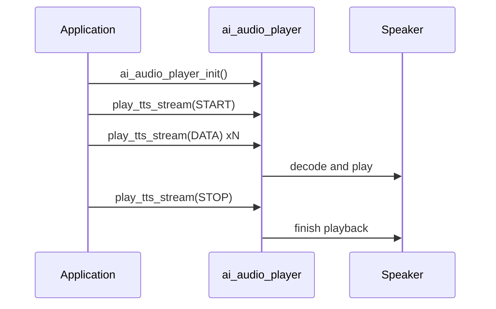

`ai_audio_player`는 장치에서 대화의 음성 및 오디오 측면을 재생합니다. - TTS, 음악 및 로컬 알림 톤 - 스피커 밖으로. AI 오디오 파이프라인의 뒷 끝입니다: `ai_audio_input`는 사용자가 말하는 무슨을 붙잡는, 이 단위는 장치가 뒤에 말하는 것을 렌더링합니다.

그것은 구름 자체에 대해 이야기하지 않습니다. 응용 프로그램 (또는 `ai_agent`의 콜백)은 오디오를 공급 - TTS 스트림, 디코딩 버퍼, 음악 재생 목록, 또는 경고 요청 - 플레이어 디코딩 및 재생.

## 약관
|(주)|이름 *|
|------|---------|
|TTS를|Text-to-Speech — 클라우드의 음성 응답, 스트림 또는 URL로 플레이어에 전달.|
|지상 / 배경|2명의 독립적인 선수: 전경은 TTS의 배경 음악을 합니다. 그들은 동시에 실행할 수 있습니다.|
|비밀번호|짧은, 로컬 프롬프트 사운드 (power-on, low battery, "please say again")는 장치에서 재생, 클라우드가 아닙니다.|
|비밀번호|데이터의 오디오 형식은 플레이어, `AI_AUDIO_CODEC_E` 값을 손으로 만듭니다.|

## 어떤 재생
플레이어는 오디오의 세 가지 종류를 취급하며, 각 항목 포인트를 통해 :

- **TTS** — 구름의 말한 대답. URL (`ai_audio_play_tts_url`)에서 스트림 (`ai_audio_play_tts_stream`)로 피드 또는 단일 디코딩 버퍼 (`ai_audio_play_data`)로. TTS는 **foreground** 플레이어에서 재생합니다.
- **Music** - 트랙의 재생 목록 (`ai_audio_play_music`). Music plays on the **background** 플레이어, 그래서 그것은 그것을 통해 짧은 TTS 대답이 실행하는 동안 실행할 수 있습니다.
- **Alert tones** - Power-on 또는 low-battery와 같은 짧은 로컬 프롬프트 (`ai_audio_player_alert`).

## Foreground 대 배경
플레이어는 `AI_AUDIO_PLAYER_TYPE_E`에서 선택한 두 개의 독립적 인 채널을 실행합니다. 이 동일한 enum는 `ai_audio_player_stop` 표적은인 무엇:

```c
typedef enum {
    AI_AUDIO_PLAYER_FG  = 0,   // foreground player, used to play TTS
    AI_AUDIO_PLAYER_BG  = 1,   // background player, used to play music
    AI_AUDIO_PLAYER_ALL = 2,   // all players
} AI_AUDIO_PLAYER_TYPE_E;
```

|제품정보|채널:|관련 기사|
|------|---------|-------|
|`AI_AUDIO_PLAYER_FG`를|제품정보|TTS 재생 전용|
|`AI_AUDIO_PLAYER_BG`를|이름 *|음악 재생 만|
|`AI_AUDIO_PLAYER_ALL`를|둘 다|지금 재생|

### 현지 경고 톤
`ai_audio_player_alert(type)`는 장치에 저장된 짧은 신속한 톤을 합니다. 이것들은 **local** – `cmd:` 프롬프트가 [`ai_agent`](ai-agent)에서 클라우드를 호출하지 않는다. 네트워크 연결 없이 일해야 하는 빠른 피드백을 위해 이것을 사용하십시오.

```c
typedef enum {
    AI_AUDIO_ALERT_POWER_ON,             // power on notification
    AI_AUDIO_ALERT_NOT_ACTIVE,           // not activated, configure network first
    AI_AUDIO_ALERT_NETWORK_CFG,          // entering network configuration
    AI_AUDIO_ALERT_NETWORK_CONNECTED,    // network connected
    AI_AUDIO_ALERT_NETWORK_FAIL,         // network connection failed, retry
    AI_AUDIO_ALERT_NETWORK_DISCONNECT,   // network disconnected
    AI_AUDIO_ALERT_BATTERY_LOW,          // low battery
    AI_AUDIO_ALERT_PLEASE_AGAIN,         // please say again
    AI_AUDIO_ALERT_LONG_KEY_TALK,        // long key press to talk
    AI_AUDIO_ALERT_KEY_TALK,             // key press to talk
    AI_AUDIO_ALERT_WAKEUP_TALK,          // talk after wake
    AI_AUDIO_ALERT_RANDOM_TALK,          // random chat
    AI_AUDIO_ALERT_WAKEUP,               // "Hello, I'm here"
    AI_AUDIO_ALERT_MAX,
} AI_AUDIO_ALERT_TYPE_E;
```

:::가격
기본적으로 이러한 톤은 내장 소스에서 온다. 펌웨어가 `AI_PLAYER_ALERT_SOURCE_CUSTOM`를 정의하면 `ai_audio_player_reg_alert_cb`를 사용하여 자체 공급 업체를 등록하여 각 `AI_AUDIO_ALERT_TYPE_E`를 직접 공급합니다.
:::

## 스트리밍 TTS 국가
TTS를 스트림으로 공급할 때, 각 통화는 `AI_AUDIO_PLAYER_TTS_STATE_E`에서 상태에 전달되는 플레이어를 말합니다.

```c
typedef enum {
    AI_AUDIO_PLAYER_TTS_START,   // first chunk — open the stream
    AI_AUDIO_PLAYER_TTS_DATA,    // a chunk of audio data
    AI_AUDIO_PLAYER_TTS_STOP,    // last chunk — close the stream
    AI_AUDIO_PLAYER_TTS_ABORT,   // abort — discard the stream
} AI_AUDIO_PLAYER_TTS_STATE_E;
```

한 번 `AI_AUDIO_PLAYER_TTS_START`를 보내면, 각 펑크에 대한 `AI_AUDIO_PLAYER_TTS_DATA`가 클라우드에서 도착한 후 `AI_AUDIO_PLAYER_TTS_STOP`를 완료하거나 `AI_AUDIO_PLAYER_TTS_ABORT`를 떨어뜨릴 수 있습니다.

## 키 구조
`ai_audio_play_music`는 `AI_AUDIO_MUSIC_T`를 취합니다.

```c
typedef struct {
    char            action[32];   // play / next / prev / resume
    bool            has_tts;      // wait for TTS to finish before playing media
    int             src_cnt;      // number of tracks in src_array
    AI_MUSIC_SRC_T *src_array;    // the track list
} AI_AUDIO_MUSIC_T;
```

각 `AI_MUSIC_SRC_T`는 `artist`, `song_name` 및 `img_url`와 같은 1개의 궤도 (`url`, `format`, `duration`, 플러스 메타데이터를 설명합니다. `has_tts`를 `true`로 설정하면 먼저 음악을 재생해야 합니다.

`ai_audio_play_tts_url`는 `AI_AUDIO_PLAY_TTS_T`를 가지고 있으며, 선택적 배경 음악으로 말한 응답을 쌍합니다.

```c
typedef struct {
    AI_AUDIO_TTS_T tts;        // the TTS audio source (url, method, format, type)
    AI_AUDIO_TTS_T bg_music;   // optional background music to play under it
} AI_AUDIO_PLAY_TTS_T;
```

각 `AI_AUDIO_TTS_T`는 소스 `url`, HTTP `http_method`, `format` (`AI_AUDIO_CODEC_E`) 및 `tts_type`를 운반합니다.

## API 참조
헤더: `ai_audio_player.h`. 각 함수는 `OPERATE_RET`(`OPRT_OK`)를 `ai_audio_player_is_playing`를 제외한 `OPRT_OK`를 반환합니다.

```c
OPERATE_RET ai_audio_player_init(void);
OPERATE_RET ai_audio_player_deinit(void);
OPERATE_RET ai_audio_player_start(char *id);
OPERATE_RET ai_audio_play_tts_url(AI_AUDIO_PLAY_TTS_T *playtts, bool is_loop);
OPERATE_RET ai_audio_play_data(AI_AUDIO_CODEC_E format, uint8_t *data, uint32_t len);
OPERATE_RET ai_audio_play_tts_stream(AI_AUDIO_PLAYER_TTS_STATE_E state, AI_AUDIO_CODEC_E codec, char *data, int len);
OPERATE_RET ai_audio_play_music(AI_AUDIO_MUSIC_T *music);
OPERATE_RET ai_audio_player_stop(AI_AUDIO_PLAYER_TYPE_E type);
OPERATE_RET ai_audio_player_set_resume(bool is_music_continuous);
OPERATE_RET ai_audio_player_set_replay(bool is_music_replay);
uint8_t     ai_audio_player_is_playing(void);
OPERATE_RET ai_audio_player_alert(AI_AUDIO_ALERT_TYPE_E type);
OPERATE_RET ai_audio_player_set_vol(int vol);
OPERATE_RET ai_audio_player_get_vol(int *vol);
OPERATE_RET ai_audio_player_reg_alert_cb(AI_PLAYER_ALERT_CUSTOM_CB cb);  // AI_PLAYER_ALERT_SOURCE_CUSTOM only
```

|제품정보|이름 *|제품정보|
|----------|------------|---------|
|`ai_audio_player_init`를| — |Player 모듈을 초기화합니다.|
|`ai_audio_player_deinit`를| — |플레이어의 리소스를 릴리즈합니다.|
|`ai_audio_player_start`를|`id` - 재생 세션 식별자 (KIPTERM1X가 될 수 있음)|재생 세션을 시작합니다.|
|`ai_audio_play_tts_url`를|`playtts`의 `is_loop`|TTS 응답 (및 선택 배경 음악) URL에서. `is_loop`는 현재 사용되지 않습니다.|
|`ai_audio_play_data`를|`format`, `data`, `len`|메모리에서 하나의 디코딩 오디오 버퍼를 재생합니다.|
|`ai_audio_play_tts_stream`를|`state`, `codec`, `data`, `len`|TTS 스트림 펑크를 펑크, 스트림 상태에 의해 구동.|
|`ai_audio_play_music`를|`music` - 재생 목록 및 활동|재생, 사전, 또는 배경 플레이어에 음악 재생 목록을 다시.|
|`ai_audio_player_stop`를|`type` - 채널|전경, 배경 또는 모든 재생을 중지합니다.|
|`ai_audio_player_set_resume`를|`is_music_continuous`를|TTS 응답과 같은 중단 후에 음악 이력서 (지속적인 놀이)를 놓으십시오.|
|`ai_audio_player_set_replay`를|`is_music_replay`를|현재 트랙 재생이 종료 될 때 설정.|
|`ai_audio_player_is_playing`를| — |`TRUE`를 반환하면 현재 재생되는 경우, `FALSE`는 그렇지 않으면.|
|`ai_audio_player_alert`를|`type` - `AI_AUDIO_ALERT_TYPE_E`|로컬 알림을 재생합니다.|
|`ai_audio_player_set_vol`를|`vol` — 0–100|플레이어 볼륨을 설정합니다.|
|`ai_audio_player_get_vol`를|`vol` (아웃)|현재 플레이어 볼륨을 읽으십시오.|
|`ai_audio_player_reg_alert_cb`를|`cb` - 경고 공급자|사용자 지정 alert-tone 소스를 등록합니다. `AI_PLAYER_ALERT_SOURCE_CUSTOM`가 설정될 때만 사용할 수 있습니다.|

:::대여
다른 어떤 선수 기능의 앞에 `ai_audio_player_init()`를 부르십시오. TTS-stream, 음악, 경고 호출은 모듈을 초기화한다.
:::

## TTS 응답 재생하는 방법


## 작업 예
플레이어를 초기화 한 다음 TTS 응답을 펑크가 구름에서 도착합니다. user barges가 있는 경우 전경 채널을 중지합니다.

```c
#include "ai_audio_player.h"

OPERATE_RET player_start(void)
{
    OPERATE_RET rt = OPRT_OK;

    TUYA_CALL_ERR_RETURN(ai_audio_player_init());
    TUYA_CALL_ERR_RETURN(ai_audio_player_set_vol(70));
    return OPRT_OK;
}

// Drive the foreground TTS stream from ai_agent's media callbacks.
void on_tts_begin(void)
{
    ai_audio_play_tts_stream(AI_AUDIO_PLAYER_TTS_START, AI_AUDIO_CODEC_MP3, NULL, 0);
}

void on_tts_chunk(char *data, int len)
{
    ai_audio_play_tts_stream(AI_AUDIO_PLAYER_TTS_DATA, AI_AUDIO_CODEC_MP3, data, len);
}

void on_tts_end(void)
{
    ai_audio_play_tts_stream(AI_AUDIO_PLAYER_TTS_STOP, AI_AUDIO_CODEC_MP3, NULL, 0);
}

// User interrupted — stop the TTS channel and discard the stream.
void on_barge_in(void)
{
    ai_audio_play_tts_stream(AI_AUDIO_PLAYER_TTS_ABORT, AI_AUDIO_CODEC_MP3, NULL, 0);
    ai_audio_player_stop(AI_AUDIO_PLAYER_FG);
}

// Local feedback that does not need the cloud.
void on_power_on(void) { ai_audio_player_alert(AI_AUDIO_ALERT_POWER_ON); }
```

## 참조
- [AI Agent](ai-agent) - 이 모듈의 TTS 스트림을 제공합니다
- [AI 오디오 입력](ai-audio-input) - 턴의 다른 반에 대한 사용자의 목소리를 캡처
- [AI Skill](ai-skill) - 음악 재생과 같은 기술이 플레이어를 구동
- [Component Framework](ai-components.md) - 플레이어가 더 넓은 AI 프레임 워크에 맞는 방법
- [Multimodal Data Flow](../multimodal-data-flow) - 장치와 클라우드 간의 미디어 여행
