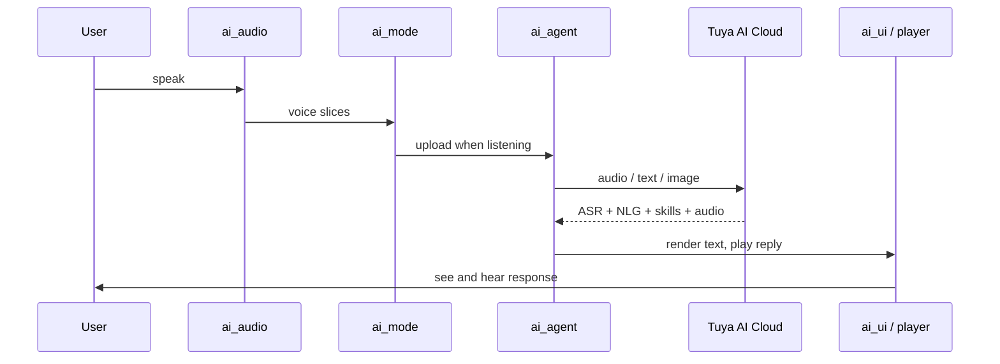

`ai_components`는 각 TuyaOpen AI 신청의 뒤에 on-device AI 기구입니다. 마이크, 스피커, 스크린을 음성 조수로 옮기는 모듈형 라이브러리입니다. 오디오를 캡처하고, 채팅 모드를 실행하고, [AI Agent](ai-agent)에 대화하고, 응답을 재생합니다. 모듈을 사용하여 제품 요구와 호출 한 init 기능.

음성, 시각, 텍스트 및 센서 데이터가 이러한 모듈을 통해 이동하는 방법에 대해 [Multimodal data flow](../multimodal-data-flow)를 참조하십시오.

## 모듈
프레임 워크는 모든 응용 프로그램 사용, 플러스 선택 모듈을 가지고 필요한 경우 초기화.

|모듈|제품정보|항상?|
|--------|------|------------|
|[`ai_main`] (ai-main)|Framework Entry - 구성 요소를 초기화, 등록 모드, 파견 이벤트|주요 특징|
|[`ai_agent`] (ai-agent)|Tuya AI 클라우드 (입력, 응답, 경고, 역할)에 교량|주요 특징|
|[`ai_mode`] (ai-mode-manage)|채팅 모드 관리 - 파악, 원샷, 웨이크업, 무료, 사용자 정의|주요 특징|
|[`ai_audio`] (ai-audio-input)|오디오 캡처 (VAD) 및 재생 (TTS, 음악, 프롬프트)|주요 특징|
|[`ai_ui`] (ai-ui-manage)|화면 채팅 UI — WeChat-style, chatbot, 또는 OLED|주요 특징|
|[`ai_skills`] (ai-skill)|AI - 감정, 음악/스토리, 재생, 클라우드 이벤트에서 기술 데이터 처리|주요 특징|
|`ai_video`를|카메라 캡처, JPEG 인코딩, 라이브 미리보기|옵션 정보|
|`ai_mcp`를|MCP에서 AI에 장치 도구를 노출|옵션 정보|
|`ai_picture`를|이미지 변환 및 표시 출력|옵션 정보|

## 데이터 흐름


## 프로젝트 통합
앱 옆에 있는 프레임 워크. 빌드 및 구성을 설정하면 모듈을 활성화합니다.

1. 프로젝트의 `CMakeLists.txt`에서 프레임 워크 디렉토리를 추가하십시오 (당신의 레이아웃에 상대 경로 조정):

   ```cmake
   add_subdirectory(${APP_PATH}/../ai_components)
   ```

2. 프로젝트의 `Kconfig`에서 프레임 워크 메뉴를 소스:

   ```kconfig
   rsource "../ai_components/Kconfig"
   ```

3. 설정 메뉴를 열고 필요한 모듈을 활성화:

   ```bash
   tos.py config menu
   ```

## 프레임 워크를 초기화
구성으로 시작하면 `ai_chat_init()`를 호출합니다. MQTT 연결 후, 프레임 워크는 AI 에이전트를 자동으로 초기화합니다.

```c
#include "ai_chat_main.h"

AI_CHAT_MODE_CFG_T cfg = {
    .default_mode = AI_CHAT_MODE_HOLD,   // AI_CHAT_MODE_HOLD | ONE_SHOT | WAKEUP | FREE
    .default_vol  = 70,                  // 0-100
    .evt_cb       = user_event_callback,
};
ai_chat_init(&cfg);
```

`ai_chat_set_volume(int)`를 사용하여 실행 시간에 재생 볼륨을 조정하고 `ai_chat_get_volume()`로 다시 읽으십시오.

### 선택 모듈을 초기화
비디오를 초기화, MCP, 또는 사진은 제품을 사용했을 때만 - 각은 `Kconfig` 스위치에 의해 보호됩니다.

```c
#if defined(ENABLE_COMP_AI_VIDEO) && (ENABLE_COMP_AI_VIDEO == 1)
    AI_VIDEO_CFG_T video_cfg = { .disp_flush_cb = video_display_flush_callback };
    ai_video_init(&video_cfg);
#endif

#if defined(ENABLE_COMP_AI_MCP) && (ENABLE_COMP_AI_MCP == 1)
    ai_mcp_init();
#endif

#if defined(ENABLE_COMP_AI_PICTURE) && (ENABLE_COMP_AI_PICTURE == 1)
    AI_PICTURE_OUTPUT_CFG_T picture_cfg = {
        .notify_cb = picture_notify_callback,
        .output_cb = picture_output_callback,
    };
    ai_picture_output_init(&picture_cfg);
#endif
```

## 핸들 이벤트
프레임 워크는 일이 일어나는 모든 것을 보여줍니다. ASR 결과, NLG 텍스트 스트림, 기술, 재생 제어, 모드 변경 - 이벤트 콜백을 통해 `ai_chat_init()`로 전달됩니다. 콜백은 `type`가 `AI_USER_EVT_*` 값 인 `AI_NOTIFY_EVENT_T`를받습니다.

```c
void user_event_callback(AI_NOTIFY_EVENT_T *event)
{
    switch (event->type) {
        case AI_USER_EVT_ASR_OK:           /* speech recognized */            break;
        case AI_USER_EVT_TEXT_STREAM_START: /* NLG reply begins streaming */  break;
        case AI_USER_EVT_TTS_START:        /* start the player */             break;
        // ... see ai_user_event.h for the full event list
        default: break;
    }
}
```

## 구성
- **Language** - 내장된 프롬프트 및 자산 (`ENABLE_AI_LANGUAGE_CHINESE` / `ENABLE_AI_LANGUAGE_ENGLISH`)에 대한 중국어 또는 영어를 선택하십시오.
- ** 단위 옵션 ** - 각 모듈은 `Kconfig` (`ai_mode/Kconfig`, `ai_audio/Kconfig`, `ai_ui/Kconfig`, `ai_video/Kconfig`, `ai_mcp/Kconfig`, `ai_picture/Kconfig`)를 소유합니다. Disabled 모듈은 컴파일되지 않습니다.

## 사용자 정의
각 코어 모듈은 등록 인터페이스를 노출하므로 프레임 워크를 위조하지 않고 확장 할 수 있습니다.

-**Custom UI** - `AI_UI_INTFS_T`를 구현하고 `ai_ui_manage`로 등록하십시오.
- ** 사용자 정의 모드 ** - `AI_MODE_HANDLE_T`를 구현하고 `ai_manage_mode` (사용자 정의 모드 ID는 `AI_CHAT_MODE_CUSTOM_START`에서 시작합니다).
- ** 사용자 정의 기술** - `ai_skills`에서 로직 처리 추가.
- ** 사용자 정의 MCP 도구** - 도구 인터페이스를 구현하고 MCP 서버로 등록하십시오.

## 참조
- [Multimodal data flow](../multimodal-data-flow) - 각 modality가 클라우드에 도달하는 방법
- [AI Agent](ai-agent) - 클라우드 브리지
- [Voice Chat Modes](ai-mode-manage) - 디바이스가 듣는 경우
- [개발 응용](../application-development-guide) - 이 프레임 워크에서 전체 앱 구축
